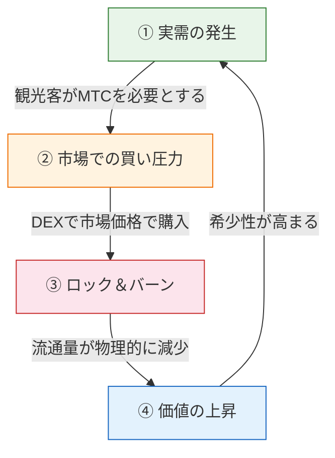
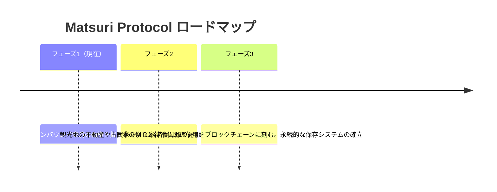

# 🎯 ビジョン：「インバウンド・ファースト」戦略

> **「補助金依存」から「自立」へ。**
> 補助金頼みの地方創生は終わりだ。外貨を直接、文化へ流し込む。

ほとんどの地域活性化プロジェクトは失敗します。
なぜなら、縮小する国内経済の中で「税金の回し合い」をしているだけだからです。

**Matsuri Protocolは、全く逆のアプローチを取ります。**

---

## 1. 戦略：「文化の輸出マシン」

私たちは、日本の観光資源を「消費財」ではなく、**「輸出可能な金融資産」**として再定義します。

| 課題 | 実態 | インパクト |
| :--- | :--- | :--- |
| 💸 **収益の流出** | 海外OTA（Booking.com, Expedia等）への手数料 | 収益の **15%〜20%が国外へ流出**。国家的損失 |
| 🚧 **見えない壁** | 言語と決済の障壁 | 富裕層が求める「ディープ・ジャパン」体験にアクセス不可 |

:::tip MTCの役割
MTCは、この「流出」を止め、「壁」を壊すための **唯一の鍵（マスターキー）** となります。
:::

---

## 2. 経済フライホイール（成長の循環）

Matsuri Protocolの最大の特徴は、**「観光客の熱狂」が「MTC価格の上昇」に数学的に直結する** 設計です。
これは感情論ではなく、**需要と供給のメカニズム** です。

### なぜMTCの価格は上がるのか？

MTCの価格上昇は、以下の **4ステップの自動サイクル** によって引き起こされます。

| ステップ | 名称 | 仕組み |
| :---: | :--- | :--- |
| **①** | **実需の発生** | 観光客がガイド予約やチケットNFTの購入にMTCを必要とする |
| **②** | **市場での買い圧力** | DEX（分散型取引所）でMTCが市場価格で購入される。投機ではなく「消費に基づく強力な買い」 |
| **③** | **ロック＆バーン** | 決済に使われたMTCの一部がスマートコントラクトにより即座にロック（凍結）またはバーン（焼却）。流通量が物理的に減少 |
| **④** | **価値の上昇** | 「買い需要」は増え続け、「売り供給」は減り続ける。需給バランスにより1枚あたりの希少価値が数学的に高騰 |

:::info 核心
**「観光客が日本を楽しむほど、MTCホルダーの資産が増える。」**
このシンプルな真実が、プロジェクトの心臓部です。
:::

---

## 3. 最終到達点：「文化OS」

私たちの最終目標は、単なる決済アプリではありません。
**文化そのものをOS（基盤）化すること** です。

> 私たちは、**「1000年続く文化」** を **「最新のブロックチェーン」** で守ります。
> これが、Matsuri Protocolの描く未来図です。

---

**[▶ 次へ: 具体的にどう稼ぐのか？（エコノミー）](/docs/economy)**