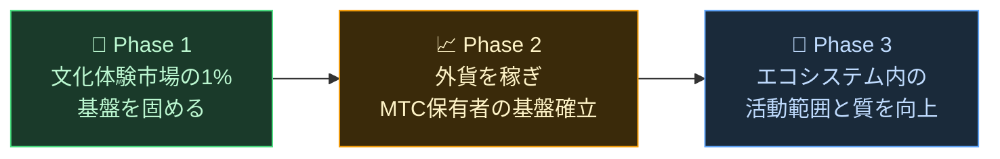

# 🌏 課題と解決——不都合な真実、そして希望

> **志は美しい。しかし、現実がそれを阻んでいます。**

---

## しかし、この志を阻む不都合な真実があります

:::info 10兆円の市場エネルギーが、文化の担い手に届いていない
日本のインバウンド市場は年間**10兆円**規模へ成長しています。
しかし、その恩恵の多くは現場に届いていません。
:::

### MTCが目指す市場

10兆円すべてを取りに行くわけではありません。

私たちがまず狙うのは、その中の**文化体験・ガイド・地域ツアー市場**です。この領域の**1%（約1,000億円規模）**を最初の目標とし、小さく始めて強くする。

| フェーズ | 戦略 | 目標 |
| :--- | :--- | :--- |
| **小さく始める** | 文化体験・ガイドツアーに集中。実績を積み、口コミで拡大 | 収益基盤の確立 |
| **強くする** | 外貨（インバウンド収益）を獲得し、MTC保有者への収益分配の仕組みを実証 | MTC経済圏の信頼構築 |
| **質を高める** | 一定規模に達した後は拡大よりも、エコシステム内の体験の質・活動範囲・コミュニティの深さを向上 | 持続可能な文化経済圏 |

> **量を追うのではなく、関わる人の質と体験の深さで成長する。** それがMTCの拡大戦略です。

Web2プラットフォームは、世界中の人々に旅の素晴らしさを届けてくれました。その功績には感謝しています。
しかし、中央管理型の構造には避けられない副作用がありました。

アルゴリズムが「何を見せるか」を決め、事業者は表示順位を巡って競わされる。レビュー評価ひとつで売上が激変し、手数料率はプラットフォームの一存で変わる——現場は常に「選ばれるか、消えるか」の不安の中に置かれます。

この構造が生むのは、事業者同士の分断と、見えないルールへの恐怖です。
隣の店は競争相手になり、協力より囲い込みが合理的になる。旅行者にも「星の数」や「ランキング」で画一化された選択肢しか届かず、本当に価値ある体験が埋もれていきます。

:::danger 現場が抱える3つの課題
💸 **収益の流出** — 収益の大部分が海外OTAや仲介業者への手数料として国外へ流出

😤 **地域の疲弊** — オーバーツーリズムの負担だけが残り、肝心の収益は地域に還元されない

🚧 **体験の壁** — アルゴリズムが選んだ画一的なツアーばかりが表示され、「本当の日本」に出会えない
:::

> **日本人は苦労し、旅行者は本当の姿を知らず、富はプラットフォームへ消える。**

---

## では、どうすれば変えられるのか？

しかし今、この構造を根本から変えられる技術が揃いました。

:::tip スマートコントラクト——書き換えられない共通ルール
手数料も条件もコードに刻まれ、誰かの一存では変えられない。全員に平等なルールが自動で実行されます。
:::

:::tip ブロックチェーン——すべてが見える透明性
取引はすべて公開台帳に記録され、誰でも検証できる。データが企業の中で閉じる時代は終わります。
:::

:::tip Solana——0.4秒決済、手数料0.04円
何重もの仲介手数料も、数日待つ決済も不要。人と人が直接つながれます。
:::

:::tip AI——管理コストそのものを消す
爆発的な生産性向上が、巨大プラットフォームを維持するためのコスト構造を過去のものにします。
:::

もう中間管理者に頼らなくても、人は直接つながれる時代です。

私たちはこの技術で、インバウンド経済を独占から解放し、収益を日本と各国の現場へ戻す。
そして日本だけでなく、**世界の文化を守り、つながる仕組み**を築きます。

---

**[◀ 前へ: ビジョン・志](/docs/vision)**｜**[▶ 次へ: MTCが描く未来](/docs/future)**
