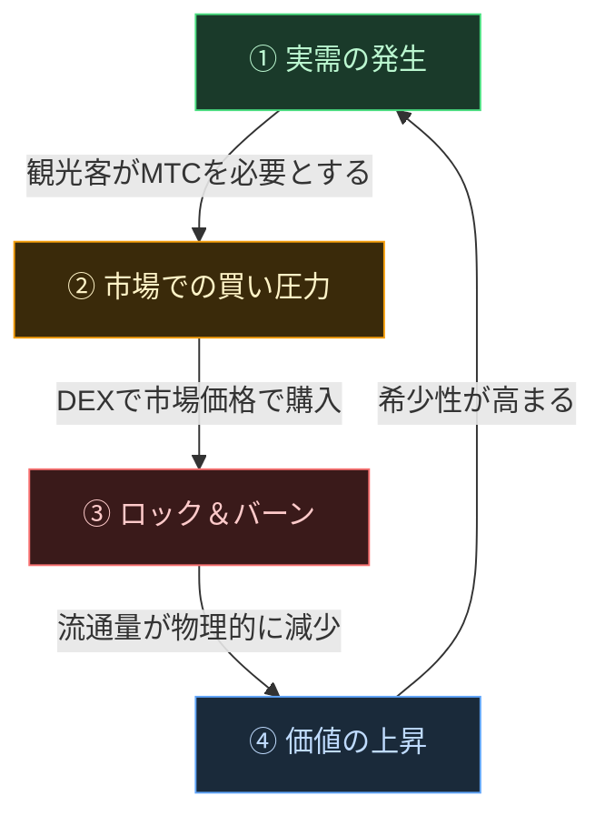

# 🔄 経済フライホイール——成長の循環と文化OS

> **観光客が日本を楽しむほど、エコシステムの需要が高まる。**
> この需給メカニズムが、プロジェクトの心臓部です。

---

## MTCの需給メカニズム

Matsuri Protocolの設計上、**実需の増加が買い圧力を生み、供給の減少と組み合わさることで価値向上の条件が整う**仕組みになっています。
これは感情論ではなく、**需要と供給のメカニズム**です。

以下の**4ステップの循環**がこの仕組みを支えています。

| ステップ | 名称 | 仕組み |
| :---: | :--- | :--- |
| **①** | **実需の発生** | 観光客がガイド予約やチケットNFTの購入にMTCを必要とする |
| **②** | **市場での買い圧力** | DEX（分散型取引所）でMTCが市場価格で購入される。投機ではなく消費に基づく強力な買い |
| **③** | **ロック＆バーン** | 決済に使われたMTCの一部がスマートコントラクトにより即座にロックまたはバーン。流通量が物理的に減少 |
| **④** | **希少性の増加** | 買い需要が増え、売り供給が減る。需給バランスの変化により1枚あたりの希少性が高まる構造 |

---

---

:::note この数式が支えるビジョン
フライホイールの先にある「文化OS」の全体像は、次のページ [MTCが描く未来](/docs/future) で詳しく語ります。
:::

---

**[◀ 前へ: 課題と解決](/docs/challenges)**｜**[▶ 次へ: MTCが描く未来](/docs/future)**
