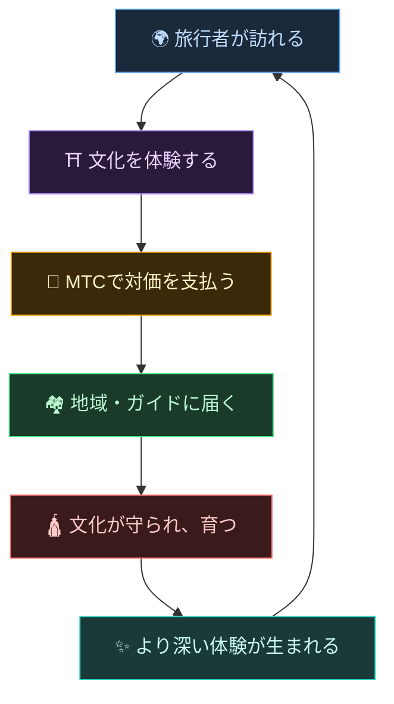
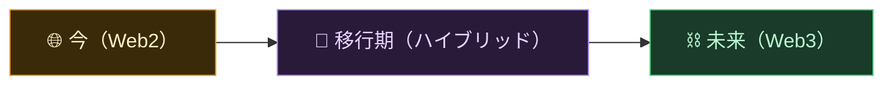
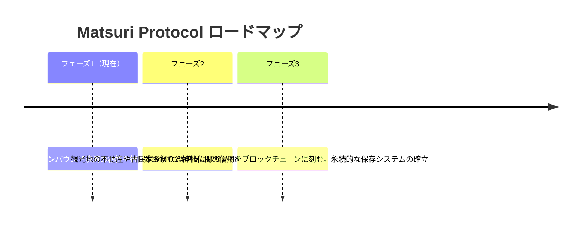

# 🌀 MTCが描く未来——すべての「関わり」が巡る経済

> **体験する人、届ける人、守る人。すべての想いが経済として巡り、文化を次の世代へ届ける。**

---

## 私たちが実現したい循環

MTCは投機のためのトークンではありません。

旅行者が日本文化に触れ、感動する。
ガイドがその感動を届け、報われる。
地域が潤い、文化を守り続けられる。
そしてその文化が、また新しい旅行者を惹きつける。

この循環こそが、MTCが存在する理由です。

---

## 三者が報われる経済

従来の観光では、旅行者はお金を払い、プラットフォームが利益を取り、現場には残らない。
MTCの経済圏では、関わるすべての人が報われます。

| 関わる人 | 何が起きるか | どう報われるか |
| :--- | :--- | :--- |
| **🌍 体験する人** | 日本文化に触れ、MTCで支払う | 円より安く、本物の体験にアクセスできる。帰国後もMTCを通じて繋がり続ける |
| **⛩️ 届ける人** | ガイドとしてイベントを開催し、J-Timesでコンテンツを発信する | 中間搾取なしの直接報酬。活動するほどMTCで報われる |
| **🏘️ 守る人** | 地域コミュニティとして文化を維持・継承する | 収益が直接届く。オーバーツーリズムではなく、持続可能な形で潤う |

---

## 経済圏が広がるほど、文化が強くなる

MTCの経済圏は体験予約から始まり、やがて生活のあらゆる面へ広がっていきます。

- **体験** — 本物の文化体験、参拝マイニング
- **衣食住** — ゲストハウス、ショップ、食、ファッション
- **共創プロジェクト** — クラウドファンディングで文化を守る投資
- **異文化の国際理解** — 国境を越えた交流と相互理解の場

経済圏が広がるほど、MTCを通じた循環が太くなり、文化を支える力が強くなる。
これは単なるビジネスモデルではなく、**文化の生命維持装置**です。

---

## Web2からWeb3へ——無理なく、段階的に

私たちはいきなり「すべてをブロックチェーンに」とは言いません。

今はまだWeb3に馴染みのない人がほとんどです。だからこそ、**まずは使い慣れた形から始めて、徐々にWeb3の恩恵を実感してもらう**設計にしています。

| フェーズ | ユーザー体験 | 裏側の仕組み |
| :--- | :--- | :--- |
| **今** | 普通のWebアプリとして体験予約・決済。クレジットカードでOK | Django + Stripe。ウォレット不要で始められる |
| **移行期** | アプリでMTCを獲得・利用。ウォレット連携はワンタップ | オフチェーンのスコアが順次オンチェーンへ移行 |
| **未来** | すべての取引・権利がブロックチェーン上で透明に記録。あなたの貢献が永久に証明される | スマートコントラクトによる完全自動・改ざん不可能な経済 |

:::tip Web3は難しくない
ウォレットの設定もシードフレーズの管理も、最初は不要です。使っているうちに自然とWeb3の世界に触れていく——**気づいたら、もうWeb3の住人になっている。** そんな体験を設計しています。
:::

---

## 力ではなく、共感で動く経済

そしてこの経済圏は、スマートコントラクトによって動きます。
誰かの権力や都合で一方的にルールを変えられない——**力による現状変更ができない経済の仕組み**です。

その上で、古の叡智に学びながら新しい価値を創り続ける。温故知新、そして創新へ。

> **円がなくても、ドルがなくても、文化を軸に暮らしが成り立つ世界。**
>
> 通貨の価値を誰かに委ねるのではなく、自分の「関わり」で価値を生み出し、使う。
> それが、MTCが届けたい自由です。

---

## 🏁 最終到達点：「文化OS」

私たちの最終目標は、単なる決済アプリではありません。
**文化そのものをOS（基盤）化すること**です。

> 私たちは、古の叡智を最新のブロックチェーンで守ります。
> これが、Matsuri Protocolの描く未来図です。

---

:::note 物語編はここまでです
ここまで読んでくださった方は、MTCがなぜ存在するのかを理解してくださったはずです。
次は**【実践編】**——実際にMTCで何ができるのかを見ていきましょう。
:::

**[◀ 前へ: 経済フライホイール](/docs/flywheel)**｜**[▶ 次へ: エコシステム](/docs/ecosystem)**
