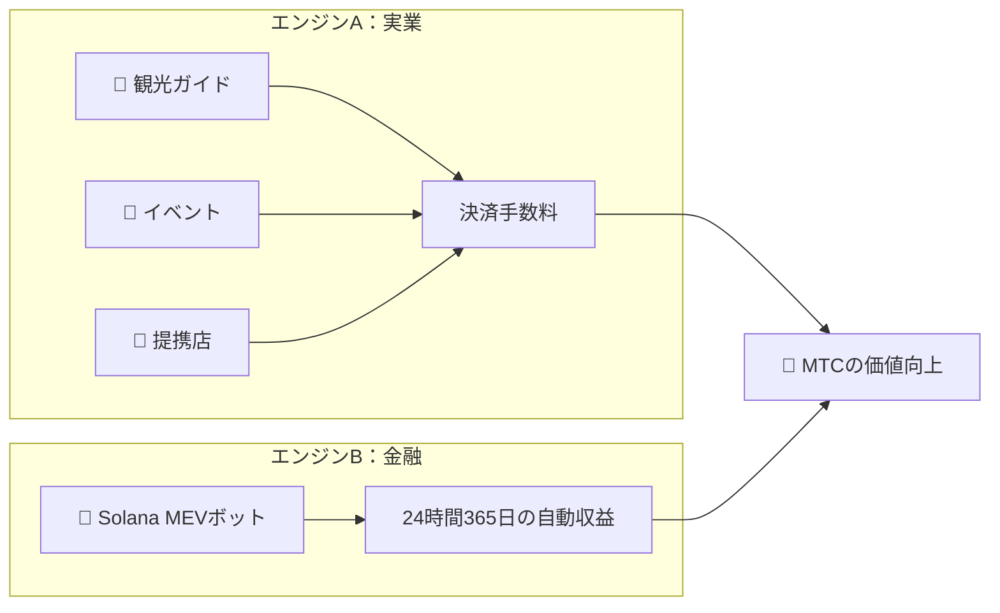

# 💰 経済システム

> Matsuri Coin（MTC）の経済圏はシンプルかつ堅牢です。
> **「実業」と「金融アルゴリズム」の両輪で収益を生み出し、その利益をプログラム通りにホルダーへ還元します。**


---

## 1. 2つの収益エンジン



| エンジン | 収益源 | 特徴 |
| :--- | :--- | :--- |
| **🏯 エンジンA（実業）** | 観光ガイド・イベント・提携店からの決済手数料 | インバウンド観光客が増えるほど外貨が流入し、エコシステムが拡大 |
| **🤖 エンジンB（金融）** | Solana MEVボットによる自動売買 | CEO直轄の高速取引プログラムがブロックチェーン上の市場の歪みから24時間365日利益を生み出す |

---

## 2. 買い戻しプロトコル（価値向上の仕組み）

私たちは、「儲かったら運営の懐に入れる」ことはしません。
スマートコントラクトのルールに基づき、利益を **MTCの価値向上** に直接充てます。

| 収益源 | 還元率 | アクション |
| :--- | :---: | :--- |
| **Matsuri本部の売上**（ガイド・イベント） | **20%** | 市場からの **買い戻し** と流動性プール追加 |
| **GCF会員権**（会員権手数料） | **25%** | 市場からの **買い戻し** |

:::info 核心ロジック
**「事業が成長する ＝ 市場でMTCが常に買われる」**
この数式が、あなたの資産価値を下支えします。
:::

---

## 3. 価格決定ロジック

私たちの価格上昇メカニズムは、希望的観測ではなく **AMM（自動マーケットメイカー）の数式** に基づいています。

```
価格 = 流動性(SOL) ÷ 供給量(MTC)
```

| ステップ | 何が起きるか | 結果 |
| :---: | :--- | :--- |
| **①** | 事業収益（SOL）がプールに注入される | **分子が増える** |
| **②** | その資金でMTCが市場から買い戻され焼却される | **分母が減る** |
| **③** | 分子↑ × 分母↓ | **価格は数学的に上昇し続ける** |

---

## 4. GCF（グローバル・コミュニティ・フレンズ）

GCFは、Matsuriエコシステムの拡大を担う **完全招待制** のパートナー組織（DAO）です。
単なる会員ではなく **「事業の共同体」** として収益を分け合います。


### 会員ティア

| ティア | 役割 | 特権 |
| :---: | :--- | :--- |
| **👑 プラチナ** | オーナー / VIP | 最高ランクの権益。初期 **50名限定**。事業全体の意思決定権と配当が厚い設計 |
| **🥇 ゴールド** | アンバサダー | 実働部隊。「活動」を通して **青天井に稼ぐ** 権利。マイニングと紹介報酬の還元率が最大化 |

### 特典①：実働マイニング（採掘権）

2027年6月1日にロックアップが解除される **5億5000万枚（総供給の約61%）** のMTCは、市場に売却されるのではなく **「貢献者への報酬プール」** として確保されます。

:::tip 完全成果報酬
あなたの活動量（売上、集客数、ガイド回数）に応じて、プールから自動的にMTCが支払われます。
:::

**半減期スケジュール（2年周期）:**

| 期間 | 放出割合 | 放出枚数 |
| :--- | :---: | :--- |
| **第1期** 2027 – 2029 | **50%** | 約2.75億枚 |
| **第2期** 2029 – 2031 | **25%** | 約1.37億枚 |
| **第3期** 2031 – 2033 | **12.5%** | 約6,800万枚 |

:::caution 先行者利益
ビットコイン（4年周期）よりも速い **2年ごとの半減期** を採用。
2027年からの **「最初の2年間」** にフルコミットしたメンバーが、圧倒的な先行者利益を確保します。
:::

### 特典②：高額紹介報酬

高単価商品（会員権、VIPツアー、提携不動産など）を紹介することで、一般アフィリエイトとは桁違いの **高額報酬（USDC + MTC）** を獲得できます。
スマートコントラクト経由で **即座に還元** されます。

---

## 5. トークン仕様

投資家の安全を保証するため、Solana上の「ミント権限」と「フリーズ権限」を永久に **放棄** しました。
追加発行は永久に不可能、資金の凍結も不可能。**完全なトラストレス設計** です。

| 項目 | 詳細 |
| :--- | :--- |
| **トークン名** | Matsuri Coin |
| **ティッカー** | MTC |
| **チェーン** | Solana |
| **総供給量** | **9億枚**（900,000,000 MTC）固定 |
| **ミント権限** | 🚫 放棄済み |
| **フリーズ権限** | 🚫 放棄済み |
| **ロック管理** | Streamflow Finance（検証済み） |

:::warning 招待制 ─ 残枠わずか
GCFは限られた枠（プラチナ50名 / ゴールド枠調整中）が埋まり次第、募集を終了します。
この権利を持つことは、Matsuri経済圏における **「特権階級」** になることを意味します。
:::

---

**[▶ 次へ: エコシステムとマイニング](/docs/ecosystem)** ｜ **[Discordに参加する](#)**