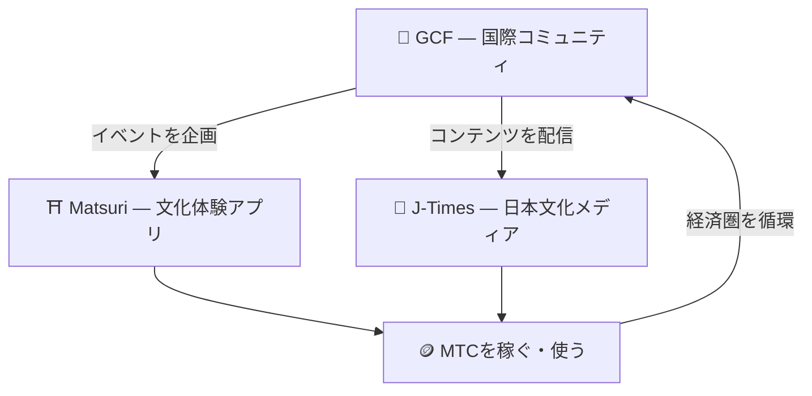

# 🏗️ MTCエコシステム——体験・メディア・コミュニティが循環する経済圏

> **志を実現するための、3つの「場」。**
> 体験する場、知る場、つながる場——それぞれが独立しながら、MTCを通じて一つの経済圏として循環します。

MTCは単なるトークンではありません。3つのプロダクトと国際コミュニティが連携し、文化を守るための経済を実現します。

:::tip 🤝 GCF — エコシステムを動かす国際コミュニティ
日本文化を愛する人々が国境を越えてつながる場。GCFがガイドを募集し、そのGCFガイドがMatsuri上で体験運営を担います。さらにJ-Timesで魅力的なコンテンツを発信——コミュニティの活動がエコシステム全体を動かすエンジンです。
:::

:::tip ⛩️ Matsuri — 文化体験アプリ
文化体験の予約からスタートし、**ゲストハウス**、**ショップ**、**クラウドファンディング**へと段階的に拡張。体験から衣・食・住・共創投資へと経済圏が広がります。

**参拝マイニング（聖地巡礼）** — 神社仏閣や文化的ランドマークを実際に訪れることでMTCを獲得。有名スポットから地方の隠れた名所へと自然に人の流れを分散させ、オーバーツーリズムの解消と地方創生を同時に実現します。
:::

:::tip 📰 J-Times — 日本文化メディア
日本文化の魅力を世界へ届けるメディアプラットフォーム。記事を読む・シェアするなどのエンゲージメントを通じてMTCを獲得できます。
:::

---

## 🤝 ソーシャルマイニング（繋がって稼ぐ）

**GCF管理ダッシュボード連動 ── Web版稼働中（iOSアプリは2026年4月リリース予定）**

GCFメンバーには、専用の**GCF管理Web**へのアクセス権が付与されます。

| 機能 | できること |
| :--- | :--- |
| **🎪 イベント作成** | 独自のイベントやツアーを企画・掲載 |
| **📢 コンテンツ配信** | J-Timesの記事やコンテンツを配信・拡散 |
| **📊 紹介追跡** | 紹介したユーザーの行動と収益をリアルタイムで追跡 |

:::info 自動報酬
紹介した友人が決済を行うたび、システムが**自動的に**あなたのウォレットへ報酬（売上分配）を振り込みます。
:::

---

## 🎓 クリエイターエコノミー（創って稼ぐ）

コンテンツを消費するだけでなく、Matsuriプラットフォームでは**誰でも**コンテンツを制作し収益化できます。

| プラットフォーム | クリエイターができること | 収益モデル |
| :--- | :--- | :--- |
| **📚 コースマーケットプレイス** | 日本文化・言語・工芸に関する動画/テキストコースを公開 | 受講ごとの手数料（クリエイター収益分配） |
| **🎙️ ポッドキャストスタジオ** | Spotify、Apple Podcasts、RSS配信のオーディオシリーズを制作 | サブスクリプション限定エピソード |
| **🤝 クラウドファンディング** | 文化プロジェクトのためのSolanaベースの資金調達キャンペーンを開始 | オンチェーンでの貢献追跡 |
| **🛍️ ユーザーショップ** | プラットフォーム内で個人ショップを開設（工芸品、グッズ） | 商品/レビューシステム付きの直接販売 |

:::tip AI搭載の制作支援
イベントホストは**内蔵AIアシスタント（GPT-4 Turbo）**を使って、イベント説明の作成、5言語への自動翻訳、SEO最適化メタデータの生成を管理ダッシュボード内で行えます。
:::

---

  

*ゴールデン街でのコミュニティミートアップ ── つながりがマイニングパワーに。*

---

:::note 次のページへ
具体的なマイニングの仕組みと稼ぎ方を知りたい方は、**[マイニング＆稼ぎ方 →](/docs/mining)** へお進みください。
:::
