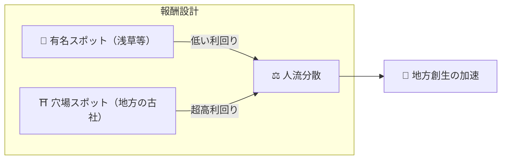

# ⛏️ マイニングの3本柱

> **行動証明（Proof of Action）**
> Matsuri Coin（MTC）は、GPUの計算能力ではなく **「人間の行動」** によってマイニング（採掘）されます。

Webアプリケーションと管理ダッシュボードは **すでに完成** しており、以下の活動で **今すぐ** 収益化が可能です。

---

## 1. 📖 メディアマイニング（読んで・聴いて・答えて稼ぐ）

**公式メディア「J-Times」連動**

知識は、旅の質を劇的に向上させます。
テキストや音声での学習に加え、**理解度チェック（クイズ）** にも報酬を与えます。

| アクション | 内容 | 報酬 |
| :--- | :--- | :--- |
| **📰 読んで稼ぐ** | 「J-Times」の記事（歴史・神道・禅）を読む | MTC付与 |
| **🎧 聴いて稼ぐ** | 限定ポッドキャストを視聴し深層文化を学ぶ | MTC付与 |
| **✅ 答えて稼ぐ** | クイズに正解し知識の定着を証明する | MTC付与（即時） |

:::tip 隙間時間がマイニングに
移動中や休憩時間が、そのまま報酬を生み出す時間に変わります。
:::

---

## 2. 🤝 ソーシャルマイニング（繋がって稼ぐ）

**GCF管理ダッシュボード連動 ── すでに稼働中**

GCFメンバーには、専用の **「GCF管理Web」** へのアクセス権が付与されます。

| 機能 | できること |
| :--- | :--- |
| **🎪 イベント作成** | 独自のイベントやツアーを企画・掲載 |
| **📢 コンテンツ配信** | J-Timesの記事やコンテンツを配信・拡散 |
| **📊 紹介追跡** | 紹介したユーザーの行動と収益をリアルタイムで追跡 |

:::info 自動報酬
紹介した友人が決済を行うたび、システムが **自動的に** あなたのウォレットへ報酬（売上分配）を振り込みます。
:::

---

## 3. 🗺️ アドベンチャーマイニング（歩いて稼ぐ）

**プロジェクト「巡礼」 ── 次期フェーズ（開発中）**

GPSとトークンインセンティブを活用し、物理的な「人の流れ」を制御する次世代機能です。

> **「稼げるから、地方へ行く」**
> この経済合理性が、オーバーツーリズムを解消し地方創生を加速させます。

### 🎲 「おみくじ」プロトコル

チェックイン完了時に **無料（ガス代のみ）** で実行される、おみくじ形式のスマートコントラクトです。

| 結果 | もらえるもの |
| :--- | :--- |
| **🎊 大吉** | ボーナスMTCのエアドロップ |
| **📜 NFTドロップ** | その場所限定の **「御朱印NFT」** |
| **🏆 コンプリート** | 特定NFTを揃えると特別イベントへの参加権をアンロック |

:::note ギャンブルではありません
金銭的な賭けは一切不要。**「訪問した」という行動** に対するランダムボーナスです。
:::

---

## 4. 🏦 流動性マイニング（預けて稼ぐ）

> **銀行になろう。**

Raydium上でMTC/SOLのペアを作成・提供したユーザーに対し、特別な報酬プログラムを用意しています。

| 項目 | 詳細 |
| :--- | :--- |
| **対象** | 初期の流動性提供者（「創業パートナー」） |
| **目標年利** | **50%**（リスクプレミアムとして設定） |
| **意義** | エコシステム初期の流動性を確保し、安定した取引環境を構築 |

---

**[▶ 次へ: ロードマップとチーム](/docs/roadmap)** ｜ **[◀ 前へ: 経済システム](/docs/economy)**