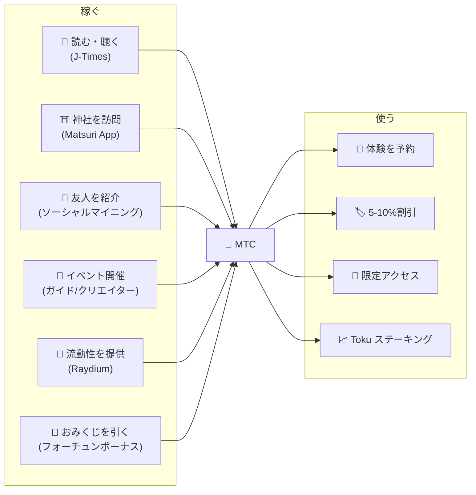
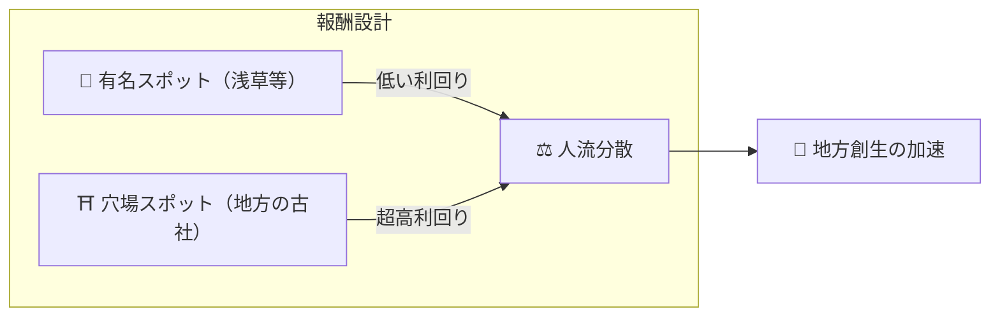
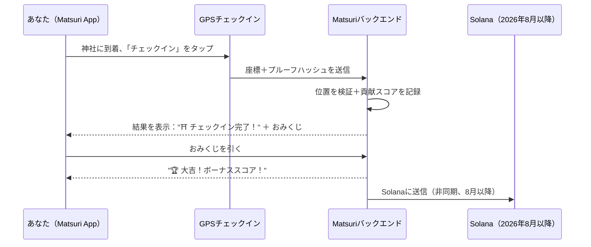
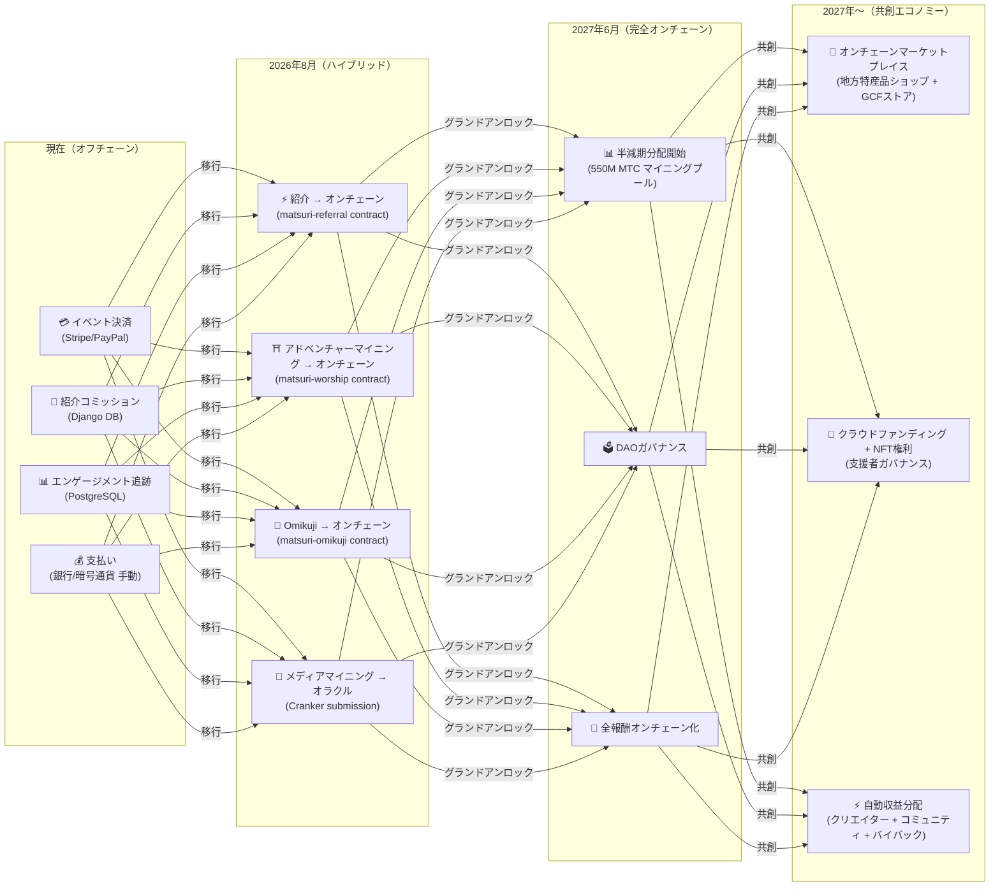

import useBaseUrl from '@docusaurus/useBaseUrl';

# ⛏️ マイニング5本柱と稼ぎ方

> **文化への「関わり」が、そのまま価値になる。**
> 読む、歩く、繋がる、創る、支える——あなたの行動一つひとつが、MTCを生み出します。

<small>*※ 「マイニング」とは？——ビットコインなどでは、コンピュータが膨大な計算を行い、その報酬として新しいコインを受け取ることを「マイニング（採掘）」と呼びます。MTCでは、コンピュータの計算力ではなく**あなた自身の行動**——記事を読む、神社を訪れる、イベントを開催する——が「採掘」にあたります。金鉱を掘る代わりに、文化への関わりがMTCを生み出す。それが私たちの「マイニング」です。*</small>

> 行動で稼ぐ。体験に使う。保有して成長させる。

MTCは投機的なトークンではありません。すべてのアクションが価値を生み出し、価値を獲得するリアルエコノミーを循環しています。Webアプリケーションと管理ダッシュボードは**すでに稼働中**です。現在はオフチェーン（Django）で貢献スコアを記録しており、2026年8月以降に順次オンチェーンへ移行します。

:::tip 全体像
MTCには**完全な循環型経済**があります：リアルな活動を通じて稼ぎ、リアルな体験に使い、エコシステムの拡大とともに価値が成長します。このページでは、その仕組みを詳しく解説します。
:::

---

## MTCライフサイクル

---

## 5つのマイニングピラー

### 1. 📖 メディアマイニング（読んで・聴いて・答えて稼ぐ）

**公式メディア「J-Times」連動**

知識は、旅の質を劇的に向上させます。**J-Timesアプリ**を開き、日本文化に関するコンテンツを楽しみましょう。テキストや音声での学習に加え、**理解度チェック（クイズ）**にも報酬を与えます。完了したアクションごとにMTCが自動的に付与されます。

| アクション | 完了条件 | 報酬目安 |
| :--- | :--- | :---: |
| **📰 記事を読む** | 75%までスクロール | 2〜30 MTC |
| **🎧 ポッドキャストを聴く** | 最後まで再生 | 2〜30 MTC |
| **🎬 動画を視聴する** | 視聴後に詳細画面を閉じる | 2〜30 MTC |
| **📤 コンテンツをシェア** | シェアシートを表示 | 2〜30 MTC |
| **✅ クイズに回答** | 理解度テストに合格 | 2〜30 MTC |

<small>*※ 報酬量はコンテンツの種類・長さ・エコシステム全体の供給バランスに応じて変動します*</small>

:::tip 隙間時間がマイニングに
移動中や休憩時間が、そのまま報酬を生み出す時間に変わります。
:::

:::info オフライン対応
地方の神社でインターネット接続がない？問題ありません。J-Timesはアクティビティをローカルに記録し、**オンラインに復帰すると自動的に同期**されます（7日間保持のオフラインキュー）。獲得したMTCを失うことはありません。
:::

**裏側の流れ：**
1. J-Timesアプリがあなたのアクション（読了・視聴完了・シェア等）を検出
2. オフラインでもローカルに記録（7日間保持）
3. ネットワーク復帰時にサーバーへ送信・検証
4. 貢献スコアとして残高に反映
5. 2026年8月以降：検証済みスコアをオラクル経由でオンチェーンに記録し、ブロックチェーン上で確認可能に

---

### 2. ⛩️ アドベンチャーマイニング（歩いて稼ぐ）

**プロジェクト「巡礼」 ── スマートコントラクト完成、2026年8月メインネットデプロイ**

GPSとトークンインセンティブを活用し、物理的な「人の流れ」を制御する次世代機能です。聖地マップはMatsuri Webアプリで**すでに稼働中**です。現在はオフチェーンで貢献スコアを記録し、2026年8月のスマートコントラクトデプロイ後にオンチェーン報酬配布が開始されます。

>**稼げるから、地方へ行く**
> この経済合理性が、オーバーツーリズムを解消し地方創生を加速させます。

**チェックインの仕組み：**

  
  

    
<strong>参拝マイニング</strong> ── 神社の近くでチェックインし、ARカメラでエネルギーを検知、おみくじでMTCボーナスを獲得。ティア倍率は Major 1.0× から Hidden Gem 10.0× まで。

  

**基本原則 — 訪問者が少ないサイトほど多く稼げる：**

| サイトタイプ | 例 | 報酬目安（1チェックイン） |
| :--- | :--- | :---: |
| 🏙️ **主要** | 浅草寺、清水寺、伏見稲荷 | 30〜50 MTC |
| 🌆 **地方中核** | 各県の一之宮、地方の大社 | 50〜100 MTC |
| 🏞️ **地方** | 歴史ある地方の神社 | 100〜150 MTC |
| ⛰️ **フロンティア** | 山岳寺院、離島の聖地 | 150〜200 MTC |

<small>*※ 上記はベース報酬の目安です。おみくじの倍率により最大数倍になります*</small>

**追加スコア要因：**
- **おみくじ倍率** — チェックインごとのランダムボーナス。大吉なら報酬が数倍に
- **訪問頻度** — 定期的な訪問者は時間とともにより多く獲得
- **スポンサードサイト** — 自治体が特定のサイトをブースト可能

:::info 貢献スコア → MTC
あなたの活動は**貢献スコア**として蓄積されます。各半減期エポック（2027年6月開始）において、スコアは550MマイニングプールからMTCに変換されます。コミュニティに対する貢献度が高いほど、より多くのMTCを受け取ります。正確なブースト係数は段階的に確定し、スマートコントラクトに実装されます — 実際のプール規模に合わせた公正な分配を保証します。
:::

---

### 3. 🤝 ソーシャルマイニング（繋がって稼ぐ）

友達に紹介するだけで、MTCを獲得できます。

#### 一般ユーザーの紹介報酬

シンプルな仕組みです。あなたの紹介リンクから友人が登録すると、**直接紹介1件につき300 MTC**が付与されます。

| 条件 | 報酬 |
| :--- | :--- |
| あなたが紹介した友人が登録 | **300 MTC** |

これだけです。多段階の報酬は発生しません。

#### GCF代理店の紹介報酬

[GCFメンバー](/docs/gcf)は、エコシステムの拡大を担う**公式代理店**として、より深い報酬構造を持ちます。

| レイヤー | 関係 | コミッション |
| :---: | :--- | :---: |
| **L1** | 直接紹介 | **20%** |
| **L2** | 紹介先の紹介 | **5%** |
| **L3** | 3次 | **5%** |
| **L4** | 4次 | **5%** |

:::note GCF代理店制度について
この多段階報酬は、GCFメンバーシップ（招待制）を持つ公式代理店のみに適用されます。一般ユーザーは直接紹介（300 MTC）のみです。
GCF代理店のコミッションは、紹介先の**実際の経済活動（体験の購入・イベント参加など）**に基づいて計算されます。人を集めるだけでは報酬は発生しません。
:::

**En-Miningスコアの仕組み（GCF代理店向け）：**

貢献スコアは2つの要素に基づいて計算されます：
- **ネットワークの広さ**（30%）— 何人を連れてきたか
- **経済活動**（70%）— 紹介ネットワークからの実際の購入

スコアは時間とともに蓄積され、各半減期エポックでMTCに変換されます。

#### GCF管理ダッシュボード ── Web版稼働中

GCFメンバーには、専用の管理ダッシュボードへのアクセス権が付与されます。

| 機能 | できること |
| :--- | :--- |
| **🎪 イベント作成** | 独自のイベントやツアーを企画・掲載 |
| **📢 コンテンツ配信** | J-Timesの記事やコンテンツを配信・拡散 |
| **📊 紹介追跡** | 紹介したユーザーの行動と収益をリアルタイムで追跡 |

:::warning 現在はオフチェーン → 2026年8月にオンチェーンへ移行
紹介コミッションは現在Django（PostgreSQL）で追跡され、銀行振込または暗号通貨で支払われています。**2026年8月**以降、Solana上の**Matsuri Referralスマートコントラクト**に移行し、オンチェーンで監査可能な支払いが実現します。
:::

  

*ゴールデン街でのコミュニティミートアップ ── つながりがマイニングパワーに。*

---

### 4. 🎓 クリエイター＆ガイドマイニング（創って稼ぐ）

コンテンツを消費するだけでなく、Matsuriプラットフォームでは**誰でも**コンテンツを制作し収益化できます。GCFメンバー、ガイド、またはコンテンツクリエイターの方は、以下の方法で稼げます。

| アクティビティ | 収益方法 |
| :--- | :--- |
| **🗺️ ツアーを開催** | ガイドコミッション（イベントごとに設定）＋チップ |
| **🎫 イベントチケットを販売** | EventPurchase経由の収益シェア |
| **📚 コースを公開** | 受講ごとの手数料（クリエイター収益分配） |
| **🎙️ ポッドキャストエピソードを制作** | サブスクリプション収益 |
| **🤝 クラウドファンディングキャンペーンを開始** | Solanaベースのオンチェーン貢献追跡 |
| **🛍️ ユーザーショップを開設** | 工芸品・グッズの直接販売 |

**チップシステム：** イベント終了後、ゲストはガイドにチップを送ることができます（Uber方式）。チップはStripeで処理され、公開リーダーボードで追跡されます。

:::tip AI搭載の制作支援
イベントホストは**内蔵AIアシスタント（GPT-4 Turbo）**を使って、イベント説明の作成、5言語への自動翻訳、SEO最適化メタデータの生成を管理ダッシュボード内で行えます。
:::

---

### 5. 🏦 流動性マイニング（預けて稼ぐ）

>**銀行になろう。**

Raydium DEX上でMTC/SOLの流動性を提供し、エコシステム初期の取引基盤を支えましょう。初期の流動性提供者には「創業パートナー」として特別な報酬プログラムを用意しています。

| 項目 | 詳細 |
| :--- | :--- |
| **対象** | MTCとSOLを保有するすべてのユーザー |
| **目標年利** | **20%**（初期流動性インセンティブ、リスクプレミアムとして設定） |
| **DEX** | Raydium (Solana) |
| **意義** | エコシステム初期の流動性を確保し、安定した取引環境を構築 |

---

## 🎲 Omikujiボーナス

すべてのアドベンチャーマイニングのチェックインには無料のOmikuji（おみくじ）が含まれます。チェックイン完了時に**無料（ガス代のみ）**で実行される、おみくじ形式のスマートコントラクトです。

| 運勢 | 報酬倍率 | 追加ボーナス |
| :--- | :---: | :--- |
| 🏆 **大吉** | ベース報酬 × 最大倍率 | 御朱印NFT |
| ✨ **吉** | ベース報酬 × 高倍率 | — |
| 🌸 **小吉** | ベース報酬 × 小倍率 | — |
| 🍃 **末吉** | ベース報酬 × 1.0 | — |
| 💀 **凶** | ベース報酬 × 1.0 | — |

確率と倍率はGCF管理ダッシュボードから調整可能で、エコシステム全体のMTC供給バランスに応じて運営が管理します。結果はSolana上の**改ざん防止コミット・リビールプロトコル**によって決定され、コミットフェーズ後は誰も結果を変更できません。

<small>*※ 凶が出てもベース報酬は受け取れます。チェックインした行動自体が報われる設計です*</small>

:::note ギャンブルではありません
金銭的な賭けは一切不要。**「訪問した」という行動**に対するランダムボーナスです。特定NFTを揃えると特別イベントへの参加権をアンロックできます。
:::

---

## MTCの使い道

| ユースケース | メリット | 利用可否 |
| :--- | :--- | :---: |
| **🎫 体験を予約** | ツアー、イベント、文化アクティビティをMTCで支払い | ✅ 利用可能 |
| **🏷️ 割引** | MTC支払いで円建て価格の5-10%割引 | ✅ 利用可能 |
| **🔑 限定アクセス** | NFTゲート付きイベント、VIP限定儀式、プライベートツアー | ✅ 利用可能 |
| **📈 Toku ステーキング** | MTCをロックして貢献スコアをブースト（最大約50%ブースト） | 🔜 2026年8月 |
| **🗳️ DAOガバナンス** | トレジャリー、プロトコルアップグレード、サイト認証に投票 | 🔜 2027年 |
| **🛍️ パートナー店舗** | 提携ショップやレストランで支払い | 🔜 拡大中 |

:::info 決済手段としてのMTC
Matsuri Appでは、MTCはクレジットカードやSolana Payと並ぶ第一級の決済手段です。変換は不要——チェックアウトで「MTCで支払う」を選択すれば、即座に残高から差し引かれます。
:::

### MTCの換金について

:::warning 重要：弊社はMTCの換金・交換サービスを提供しません
Matsuri運営は暗号資産交換業の登録を行っていないため、**MTCと法定通貨（円・ドル等）の直接交換は一切行いません。**

MTCを他の暗号資産や法定通貨に交換したい場合は、以下のユーザー自身の操作で可能です：
1. **Phantom Wallet**などのSolana対応ウォレットでMTCを管理
2. **Raydium（DEX）**でMTC → SOLに交換
3. SOLを暗号資産取引所（CEX）で法定通貨に換金

将来的にCEX（中央集権型取引所）への上場も視野に入れており、その場合はより簡便な換金手段が利用可能になります。
:::

---

## 例：MTCエコノミーの一日

> **朝：** 電車でJ-Timesの記事を3本読む → MTCを獲得。
> **午後：** Matsuri Appで地方の神社を訪問 → チェックイン、吉（×1.5）を引く → さらにMTCを獲得。
> **夜：** 獲得したMTCで¥9,000の新宿ゴールデン街文化ツアーを10%割引で予約（¥8,100相当を支払い）。
> **結果：** あなたの文化的好奇心がリアルな体験に変わり、ガイドも、神社も、コミュニティも直接支払いを受け取りました。OTAが20%の手数料を取ることはありません。

---

## 経済の持続可能性

:::warning マイニングプールが枯渇したらどうなる？
550M MTCの半減期プールは**数十年**持続するよう設計されています。2年ごとに放出量が半減するため、数学的に100%に到達することはなく、報酬は長期にわたって継続します（詳細は[トークノミクス](/docs/tokenomics)参照）。しかし、放出量が極めて少なくなった後も：

- **トランザクション手数料**がオンチェーン活動からネットワーク参加者に報酬を提供し続けます
- **バイバックプロトコル**（事業収益の20-25%）が恒常的な買い圧力を生み出します
- **Toku ステーキング**が流通供給量をロックし、売り圧力を軽減します
- **リアルな事業収益**（イベント、メンバーシップ、コース）がトークン配布とは独立してエコシステムを支えます

MTCは**リアルエコノミー**に裏打ちされています——単なるトークンエミッションではありません。
:::

---

## オンチェーン移行ロードマップ

Matsuriエコノミーは、オフチェーン（Django/PostgreSQL）からオンチェーン（Solanaスマートコントラクト）へ段階的に移行しています。この移行により、すべてのオペレーションが**トラストレス・監査可能・パーミッションレス**になります。

| フェーズ | タイムライン | オンチェーン化される内容 |
| :--- | :--- | :--- |
| **フェーズ1（現在）** | 稼働中 | MTCトークン（SPL）、Raydium LP、Solana Pay検証 |
| **フェーズ2（2026年8月）** | スマートコントラクトメインネットデプロイ | 紹介コミッション、アドベンチャーマイニング報酬、Omikuji抽選、オラクル経由メディアマイニング |
| **フェーズ3（2027年6月）** | グランドアンロック | 550M MTC半減期分配、DAOガバナンス、完全分散化 |
| **フェーズ4（2027年〜）** | 共創エコノミー | オンチェーンマーケットプレイス（地方特産品ショップ + GCFストア）、NFT権利付きクラウドファンディング、クリエイター + コミュニティ + バイバックへの自動収益分配 |

:::warning なぜ今すべてをオンチェーン化しないのか？
**セキュリティ監査が完了するまで、ユーザーの資金が動くオンチェーン機能は有効化しません。** これが私たちの原則です。

現在の状況：
- **ユーザー資金のリスク：なし** — 現時点ではすべての報酬・スコアはオフチェーン（Django）で管理されており、スマートコントラクト経由でユーザーの資金が移動する機能は稼働していません
- **監査スケジュール：2026年Q2〜Q3** — プロフェッショナルなセキュリティ監査を経て、安全性が確認されたコントラクトから順次メインネットにデプロイ
- **監査完了がデプロイの前提条件** — 監査が完了していないスマートコントラクトをメインネットで有効化することはありません

オフチェーン期間中の報酬も検証可能です——すべてのトランザクションには決済証明としての `solana_signature` が含まれています。
:::

---

**[▶ 次へ：トークノミクス](/docs/tokenomics)** ｜ **[◀ 前へ：エコシステム](/docs/ecosystem)**
