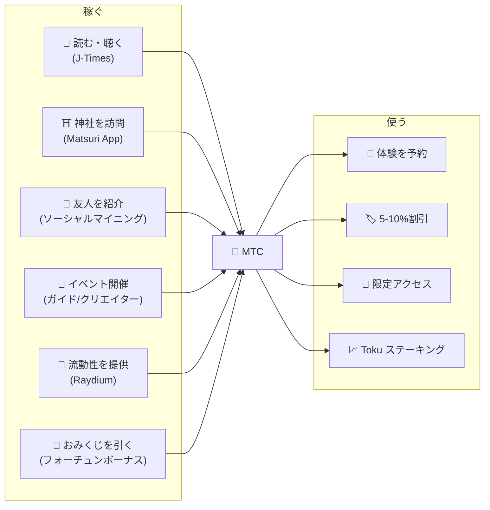
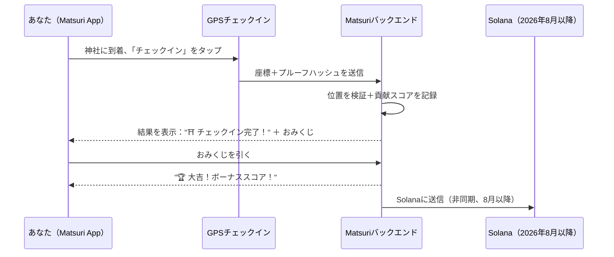
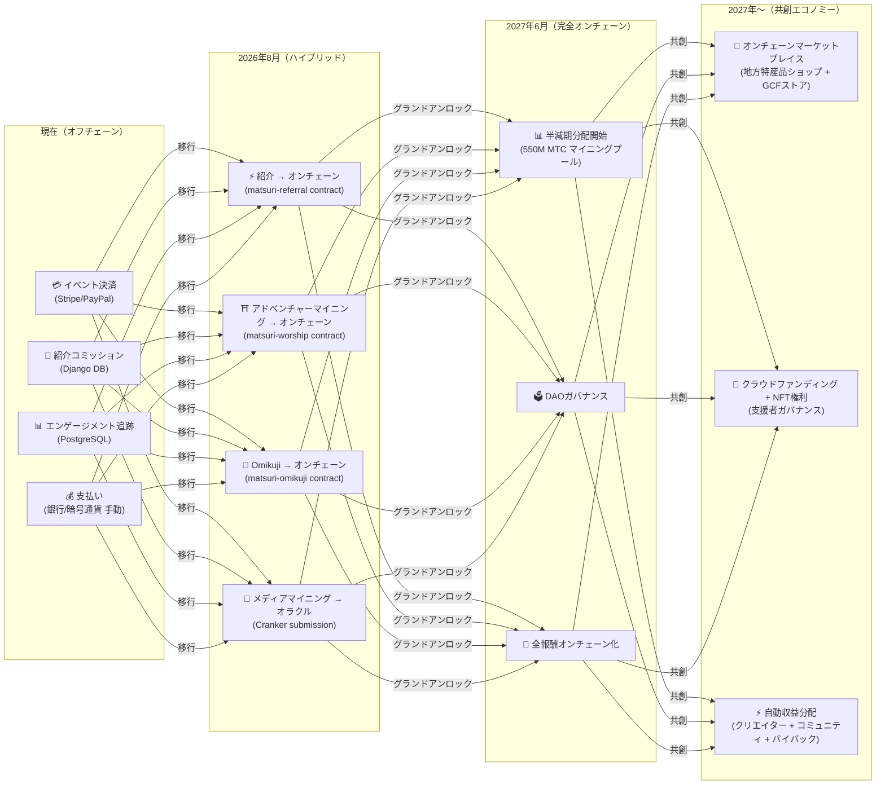

# 💎 MTCの稼ぎ方と使い方

> **行動で稼ぐ。体験に使う。保有して成長させる。**
> MTCは投機的なトークンではありません——すべてのアクションが価値を生み出し、価値を獲得するリアルエコノミーを循環しています。

:::tip 全体像
MTCには**完全な循環型経済**があります：リアルな活動を通じて稼ぎ、リアルな体験に使い、エコシステムの拡大とともに価値が成長します。このページでは、その仕組みを詳しく解説します。
:::

---

## MTCのライフサイクル

---

## MTCの稼ぎ方

### 1. 📖 メディアマイニング — J-Timesで読む・聴く・観る

**J-Timesアプリ**を開き、日本文化に関するコンテンツを楽しみましょう。完了したアクションごとにMTCが自動的に付与されます。

| アクション | 完了条件 | 報酬 |
| :--- | :--- | :---: |
| **記事を読む** | 75%までスクロール | MTC |
| **ポッドキャストを聴く** | 最後まで再生 | MTC |
| **動画を視聴する** | 視聴後に詳細画面を閉じる | MTC |
| **コンテンツをシェア** | シェアシートを表示 | MTC |
| **クイズに回答** | 理解度テストに合格 | MTC（即時） |

:::info オフライン対応
地方の神社でインターネット接続がない？問題ありません。J-Timesはアクティビティをローカルに記録し、**オンラインに復帰すると自動的に同期**されます（7日間保持のオフラインキュー）。獲得したMTCを失うことはありません。
:::

**裏側の仕組み：**
1. アプリ内の `EngagementTracker` が完了イベントを検出
2. アクションはローカルにキューイング（オフラインでも可）
3. ネットワーク復帰時にアクションをバッチ処理しDjango APIへ送信
4. APIが検証し、MTCを残高にクレジット
5. 2026年8月以降：Crankerオラクル経由でオンチェーンに送信

---

### 2. ⛩️ アドベンチャーマイニング — Matsuri Appで聖地を訪問

**Matsuri App**を開き、聖地マップ上で神社仏閣を見つけ、現地へ行き、チェックインしましょう。あなたの活動は**貢献スコア**として記録されます。

**仕組み：**

**基本原則 — 訪問者が少ないサイトほど多く稼げる：**

| サイトタイプ | 例 | スコア |
| :--- | :--- | :---: |
| 🏙️ **主要** | 浅草寺、清水寺、伏見稲荷 | 標準 |
| 🌆 **地方中核** | 各県の一之宮、地方の大社 | より高い |
| 🏞️ **地方** | 歴史ある地方の神社 | かなり高い |
| ⛰️ **フロンティア** | 山岳寺院、離島の聖地 | 最高 |

**追加スコア要因：**
- **訪問頻度** — 定期的な訪問者は時間とともにより多く稼げます
- **Omikuji** — ランダムなおみくじがボーナススコアを追加（大吉が最高！）
- **スポンサードサイト** — 自治体が特定のサイトをブースト可能

:::info 貢献スコア → MTC
あなたの活動は**貢献スコア**として蓄積されます。各半減期エポック（2027年6月開始）において、スコアは550MマイニングプールからMTCに変換されます。コミュニティに対する貢献度が高いほど、より多くのMTCを受け取ります。正確なブースト係数は段階的に確定し、スマートコントラクトに実装されます — 実際のプール規模に合わせた公正な分配を保証します。
:::

---

### 3. 🤝 ソーシャルマイニング — 友人を紹介してネットワークを構築

紹介コードをシェアしましょう。あなたのネットワークが取引すると、自動的に報酬が発生します。

| レイヤー | 関係 | コミッション |
| :---: | :--- | :---: |
| **L1** | あなた → 友人（直接） | **20%** |
| **L2** | 友人 → その友人 | **5%** |
| **L3** | 3次の関係 | **5%** |
| **L4** | 4次の関係 | **5%** |

**En-Miningスコアの仕組み：**

貢献スコアは2つの要素に基づいて計算されます：
- **ネットワークの広さ**（30%）— 何人を連れてきたか
- **経済活動**（70%）— 紹介ネットワークからの実際の購入

> **重要なポイント：** スコアの大部分はネットワーク内の**実際の経済活動**から算出されます。単なるサインアップではありません。一度も使わない1,000人を招待するより、アクティブに利用する10人を招待する方が稼げます。

スコアは時間とともに蓄積され、各半減期エポックでMTCに変換されます。ブースト倍率（例：MTCステーキング、シーズンランキング）はスマートコントラクトを通じて段階的に導入されます。

:::warning 現在はオフチェーン → 2026年8月にオンチェーンへ移行
紹介コミッションは現在Django（PostgreSQL）で追跡され、銀行振込または暗号通貨で支払われています。**2026年8月**以降、紹介コミッションシステム全体がSolana上の**Matsuri Referralスマートコントラクト**に移行し、トラストレス・即時・オンチェーンで監査可能な支払いが実現します。
:::

---

### 4. 🎪 クリエイター＆ガイドマイニング — イベント開催・コンテンツ制作

GCFメンバー、ガイド、またはコンテンツクリエイターの方：

| アクティビティ | 収益方法 |
| :--- | :--- |
| **ツアーを開催** | ガイドコミッション（イベントごとに設定）＋チップ |
| **イベントチケットを販売** | EventPurchase経由の収益シェア |
| **コースを公開** | 受講ごとの手数料 |
| **ポッドキャストエピソードを制作** | サブスクリプション収益 |
| **クラウドファンディングキャンペーンを開始** | Solanaベースのコントリビューション |

**チップシステム：** イベント終了後、ゲストはガイドにチップを送ることができます（Uber方式）。チップはStripeで処理され、公開リーダーボードで追跡されます。

---

### 5. 🏦 流動性マイニング — Raydiumで流動性を提供

Raydium DEXでMTC/SOLの流動性を提供し、報酬を獲得しましょう。

| 項目 | 詳細 |
| :--- | :--- |
| **目標APY** | 20%（初期流動性インセンティブ） |
| **DEX** | Raydium (Solana) |
| **対象者** | MTCとSOLを保有するすべてのユーザー |

---

### 6. 🎲 Omikujiボーナス — フォーチュンドロー

すべてのアドベンチャーマイニングのチェックインには無料のOmikuji（おみくじ）が含まれます — 通常スコアに加算されるボーナスです。

| 運勢 | レアリティ | ボーナス |
| :--- | :---: | :--- |
| 🏆 **大吉**（Great Blessing） | レア | 最大ボーナススコア + NFT |
| ✨ **吉**（Blessing） | アンコモン | 高ボーナススコア |
| 🌸 **小吉**（Small Blessing） | コモン | 小ボーナス |
| 🍃 **末吉**（Future Blessing） | コモン | 参加記録 |
| 💀 **凶**（Misfortune） | アンコモン | 参加記録 |

結果は、Solana上の**改ざん防止コミット・リビールプロトコル**によって決定されます。コミットフェーズ後は、サーバーでさえ結果を変更することはできません。正確な確率とボーナス量はスマートコントラクトの実装時に確定されます。

---

## MTCの使い道

| ユースケース | メリット | 利用可否 |
| :--- | :--- | :---: |
| **🎫 体験を予約** | ツアー、イベント、文化アクティビティをMTCで支払い | ✅ 利用可能 |
| **🏷️ 割引** | MTC支払いで円建て価格の5–10%割引 | ✅ 利用可能 |
| **🔑 限定アクセス** | NFTゲート付きイベント、VIP限定儀式、プライベートツアー | ✅ 利用可能 |
| **📈 Toku ステーキング** | MTCをロックして貢献スコアをブースト（最大約50%ブースト） | 🔜 2026年8月 |
| **🗳️ DAOガバナンス** | トレジャリー、プロトコルアップグレード、サイト認証に投票 | 🔜 2027年 |
| **🛍️ パートナー店舗** | 提携ショップやレストランで支払い | 🔜 拡大中 |

:::info 決済手段としてのMTC
Matsuri Appでは、MTCはクレジットカードやSolana Payと並ぶ第一級の決済手段です。変換は不要——チェックアウトで「MTCで支払う」を選択すれば、即座に残高から差し引かれます。
:::

### 例：MTCエコノミーの一日

> **朝：** 電車でJ-Timesの記事を3本読む → MTCを獲得。
> **午後：** Matsuri Appで地方の神社を訪問 → チェックイン、吉（×1.5）を引く → さらにMTCを獲得。
> **夜：** 獲得したMTCで¥9,000の新宿ゴールデン街文化ツアーを10%割引で予約（¥8,100相当を支払い）。
> **結果：** あなたの文化的好奇心がリアルな体験に変わり、ガイドも、神社も、コミュニティも直接支払いを受け取りました。OTAが20%の手数料を取ることはありません。

### 経済の持続可能性

:::warning マイニングプールが枯渇したらどうなる？
550M MTCの半減期プールは**数十年**持続するよう設計されています（20エポック × 2年 = 理論上40年）。しかし、プールが枯渇した後も：

- **トランザクション手数料**がオンチェーン活動からネットワーク参加者に報酬を提供し続けます
- **バイバックプロトコル**（事業収益の20-25%）が恒常的な買い圧力を生み出します
- **Toku ステーキング**が流通供給量をロックし、売り圧力を軽減します
- **リアルな事業収益**（イベント、メンバーシップ、コース）がトークン配布とは独立してエコシステムを支えます

MTCは**リアルエコノミー**に裏打ちされています——単なるトークンエミッションではありません。
:::

---

## オンチェーン移行ロードマップ

Matsuriエコノミーは、オフチェーン（Django/PostgreSQL）からオンチェーン（Solanaスマートコントラクト）へ段階的に移行しています。この移行により、すべてのオペレーションが**トラストレス・監査可能・パーミッションレス**になります。

| フェーズ | タイムライン | オンチェーン化される内容 |
| :--- | :--- | :--- |
| **フェーズ1（現在）** | 稼働中 | MTCトークン（SPL）、Raydium LP、Solana Pay検証 |
| **フェーズ2（2026年8月）** | スマートコントラクトメインネットデプロイ | 紹介コミッション、アドベンチャーマイニング報酬、Omikuji抽選、オラクル経由メディアマイニング |
| **フェーズ3（2027年6月）** | グランドアンロック | 550M MTC半減期分配、DAOガバナンス、完全分散化 |
| **フェーズ4（2027年〜）** | 共創エコノミー | オンチェーンマーケットプレイス（地方特産品ショップ + GCFストア）、NFT権利付きクラウドファンディング、クリエイター + コミュニティ + バイバックへの自動収益分配 |

:::warning なぜ今すべてをオンチェーン化しないのか？
**プロフェッショナルなセキュリティ監査**（2026年Q2に予定）の前にすべてをオンチェーン化することは無責任です。現在のハイブリッドアプローチにより、トラストレスなオンチェーン運用に向けて安全にイテレーションを重ねることができます。オフチェーンの報酬も検証可能です——すべてのトランザクションには決済証明としての `solana_signature` が含まれています。
:::

---

**[▶ 次へ：モバイルアプリ](/docs/mobile-apps)** ｜ **[◀ 前へ：エコシステムとマイニング](/docs/ecosystem)**
