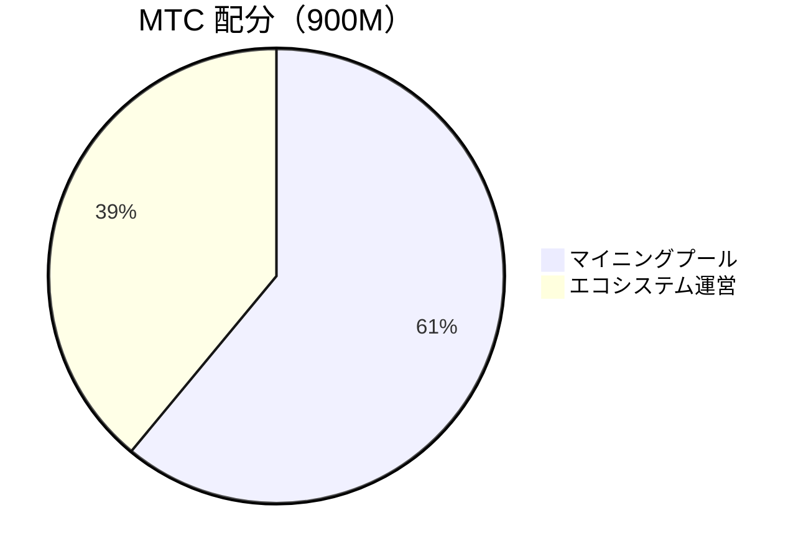

# 💰 トークノミクス——MTCの経済設計

> **信頼は、コードに刻まれている。**
> MTCの経済設計は、誰かの約束ではなく、数学とブロックチェーンによって保証されます。


> **「力による現状変更ができない経済の仕組み」——それがMTCのトークノミクスです。**

Matsuri Coin（MTC）の経済設計は、ひとつの信念に基づいています。
**運営すら改ざんできないルールこそが、投資家にとって最大の安心材料になる**ということ。

供給量は永久に固定。追加発行も資金凍結も不可能。事業の成長が数式レベルで価格に反映される——
これは「約束」ではなく、ブロックチェーン上に刻まれた**事実**です。

このページでは、MTCの経済メカニズムを透明にすべて公開します。

---

## トークン仕様

投資家の安全を保証するため、Solana上の「ミント権限」と「フリーズ権限」を永久に**放棄**しました。
追加発行は永久に不可能、資金の凍結も不可能。**完全なトラストレス設計**です。

| 項目 | 詳細 |
| :--- | :--- |
| **トークン名** | Matsuri Coin |
| **ティッカー** | MTC |
| **チェーン** | Solana |
| **ミントアドレス** | `DRENpzmRWM4TwECrCPCfS1k5VBPmanhQg9bcCWP8EZXF` [Solscan →](https://solscan.io/token/DRENpzmRWM4TwECrCPCfS1k5VBPmanhQg9bcCWP8EZXF) |
| **総供給量** | **9億枚**（900,000,000 MTC）固定 |
| **ミント権限** | 🚫 放棄済み（[オンチェーンで検証可能](https://solscan.io/token/DRENpzmRWM4TwECrCPCfS1k5VBPmanhQg9bcCWP8EZXF)） |
| **フリーズ権限** | 🚫 放棄済み（[オンチェーンで検証可能](https://solscan.io/token/DRENpzmRWM4TwECrCPCfS1k5VBPmanhQg9bcCWP8EZXF)） |
| **ロック管理** | Streamflow Finance（検証済み） |

:::info なぜこれが重要か
ミント権限の放棄は「運営が勝手にトークンを刷ってあなたの持ち分を薄めることができない」ことを意味します。フリーズ権限の放棄は「あなたのウォレットを誰も凍結できない」ことを意味します。これはトラストレス（信頼不要）の根幹です。
:::

---

## トークン配分

900M MTCの配分は以下の通りです。



| 区分 | 割合 | 枚数 | 用途 |
| :--- | :---: | :--- | :--- |
| **⛏️ マイニングプール** | **61%** | 5億5,000万枚 | 貢献者への報酬プール。2027年6月解禁、2年ごとの半減期で放出。貢献スコアに応じて分配 |
| **🌐 エコシステム運営** | **39%** | 3億5,000万枚 | マーケティング、GCF配布、運営費、流動性プール（LP）獲得、開発費、広告費、イベント開催費など |

:::note マイニングプールの放出制度
550M MTCは一括放出されません。2年ごとの半減期スケジュールに従い、**貢献スコアに応じて段階的に分配**されます。放出・分配のルールは2026年後半に順次スマートコントラクトとして実装され、オンチェーンで検証可能になります。
:::

:::note エコシステム運営枠について
39%の運営枠は、エコシステムの成長に必要な多目的資金です。具体的な使途にはマーケティング活動、GCFメンバーへの初期配布、Raydium流動性プールへの提供、開発チームへの報酬、広告宣伝、文化体験イベントの開催費用などが含まれます。使途の透明性は、DAO移行後にコミュニティガバナンスの対象となる予定です。
:::

---

## 収益構造

MTCの価値を支えるのは、**実業からの収益**です。投機ではなく、現実の経済活動がトークンの価値を裏付けます。

```mermaid
graph LR
    subgraph "収益源"
    A1["🏯 観光ガイド"] --> R1["決済手数料"]
    A2["🎪 イベント・体験"] --> R1
    A3["🏪 提携店・ショップ"] --> R1
    A4["🤝 GCF会員権"] --> R1
    A5["📚 コース・コンテンツ"] --> R1
    end

    R1 --> V["💎 MTCの価値向上"]
```



| 収益源 | 内容 |
| :--- | :--- |
| **🏯 体験・ガイド** | 観光ガイド、文化体験イベントからの決済手数料 |
| **🤝 GCF会員権** | メンバーシップ手数料 |
| **📚 コンテンツ** | コース受講料、メディアサブスクリプション |
| **🏪 マーケットプレイス** | 提携店・ショップからの取引手数料（順次拡大） |

:::tip 実需に裏付けられた成長
インバウンド観光客が増えるほど外貨が流入し、エコシステムが拡大する。MTCの価値は投機ではなく、**文化を体験する人の数**によって決まります。
:::

---

## 現在の事業実績

MTCの経済圏はまだ初期段階ですが、すでに実際の活動が始まっています。

| 指標 | 実績 |
| :--- | :--- |
| **イベント開催数** | 50回以上（テスト運用） |
| **GCFプラチナメンバー** | 20名参加済み（50名中） |
| **GCFゴールドメンバー** | これから募集開始 |
| **Webプラットフォーム** | 稼働中。テスト的にユーザーを集め運用中 |
| **iOSアプリ** | 開発完了、2026年4月リリース予定 |

:::note 正直に言います
私たちはまだ「大成功の実績」を持っていません。50回のイベントとテスト運用——それが今の現実です。しかし、プロダクトは動いており、コミュニティは存在し、ここから本格的に拡大していくフェーズにあります。
:::

---

## 買い戻しプロトコル

私たちは、「儲かったら運営の懐に入れる」ことはしません。
事業収益の一定割合を、MTCの市場からの買い戻しに充てる方針です。

| 収益源 | 還元率 | アクション |
| :--- | :---: | :--- |
| **Matsuri本部の売上**（ガイド・イベント） | **20%** | 市場からの**買い戻し**と流動性プール追加 |
| **GCF会員権**（会員権手数料） | **25%** | 市場からの**買い戻し** |

:::info 買い戻しの現在のステータス
買い戻しプロトコルは、事業収益の本格化に合わせて**これから運用を開始**します。初期はオフチェーン（手動）で実行し、2026年後半以降にスマートコントラクトによる自動実行へ段階的に移行します。オンチェーン化後は、買い戻しの実行履歴がブロックチェーン上で誰でも検証可能になります。
:::

買い戻しは「いつかやる」という約束ではありません。プロトコルとしてプログラムされたルールです。事業の売上が上がるたびに、自動的にMTCが市場から吸い上げられる——これが投資家にとっての**構造的な安心**です。

---

## 価格決定ロジック

MTCの価格上昇メカニズムは、希望的観測ではなく**AMM（自動マーケットメイカー）の数式**に基づいています。

```
価格 = 流動性(SOL) ÷ 供給量(MTC)
```

| ステップ | 何が起きるか | 結果 |
| :---: | :--- | :--- |
| **①** | 事業収益（SOL）がプールに注入される | **分子が増える** |
| **②** | その資金でMTCが市場から買い戻され焼却される | **分母が減る** |
| **③** | 分子↑ × 分母↓ | **希少性が高まる条件が整う** |

:::info メカニズムの説明であり、価格保証ではありません
この数式は「事業収益が継続し、買い戻しが実行される場合に、需給バランスが希少性の方向に動く」という構造的な設計を示しています。実際の価格は市場の需給、外部環境、流動性など多くの要因に左右されます。
:::

---

## 半減期スケジュール

2027年6月1日にロックアップが解除される**5億5000万枚（総供給の約61%）**のMTCは、市場に売却されるのではなく**貢献者への報酬プール**として確保されます。

ビットコインの4年周期よりも速い**2年ごとの半減期**を採用しています。
2年ごとに放出量が半分になり、理論上は数十年にわたって報酬が継続します。

| 期間 | 放出割合 | 放出枚数 | 累計放出率 |
| :--- | :---: | :--- | :---: |
| **第1期** 2027 – 2029 | **50%** | 約2.75億枚 | 50% |
| **第2期** 2029 – 2031 | **25%** | 約1.37億枚 | 75% |
| **第3期** 2031 – 2033 | **12.5%** | 約6,800万枚 | 87.5% |
| **第4期** 2033 – 2035 | **6.25%** | 約3,400万枚 | 93.75% |
| **第5期以降** | 半減を継続 | 漸減 | → 100%に漸近 |

<small>*※ 数学的に100%に到達することはなく、放出量は限りなくゼロに近づきます。ビットコインと同じ原理です。*</small>

:::tip 早く貢献を始めるほど、多くのMTCを受け取れます
半減期の仕組みにより、第1期（2027〜2029年）の放出量が最も多く、エポックが進むごとに1回あたりの放出枚数は減少します。つまり、**早い段階から貢献スコアを積み上げた人が、より多くのMTCを受け取る**設計です。

貢献スコアに反映される活動の例：
- イベントの作成・集客実績
- 人気ガイドコースの運営
- 優秀なガイドの紹介・育成
- J-Timesコンテンツの閲覧数・シェア数
- 聖地巡礼のチェックイン回数

報酬は「参加した順番」ではなく**「どれだけ貢献したか」**で決まります。
:::

---

:::note 次のページへ
MTCの経済設計を理解したら、次は**パートナーとして参加する方法**を確認しましょう。
**[GCFメンバーシップ →](/docs/gcf)**
:::
