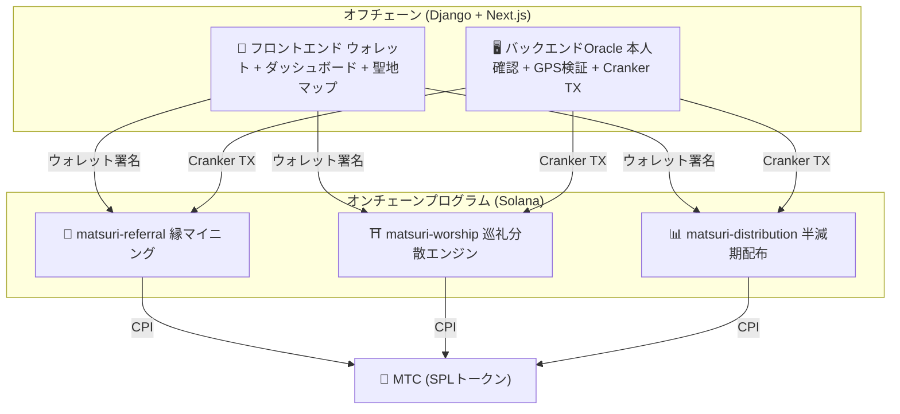
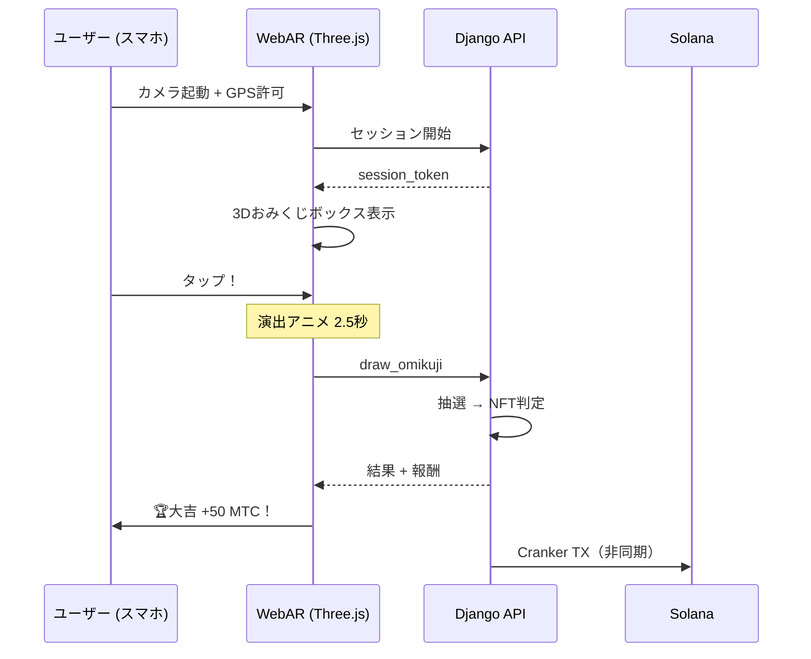

# ⚡ スマートコントラクト — オープンソース設計

>**信頼不要（トラストレス）の設計思想。**
> 報酬計算、紹介ツリー、半減期スケジュール —— すべてのロジックは**オンチェーン**で実行され、誰でも監査可能です。
> ソースコード: [GitHub](https://github.com/Cootakahashi/matsuri-contracts)

---

## Contributors

| メンバー | 役割 |
| :--- | :--- |
| **Ko Takahashi** | Founder / Lead Developer — アーキテクチャ設計、スマートコントラクト、フルスタック開発 |

> 🌏**今後、GCFメンバーや世界中の開発者コミュニティも共同開発に参加していきます。**
> Matsuri Protocol は、「文化のインフラ」として永続的に機能するよう、透明性と共同所有を原則としています。

---

## 全体構成

Matsuri は**3つのAnchor（Rust）プログラム**を Solana上にデプロイし、エコシステムの各柱を担います。

---

## 1. 📣 縁マイニング（En-Mining）

**目的:**「広さ（紹介ネットワーク）」と「深さ（経済インパクト）」の両方を報酬化するハイブリッド成長エンジン。単なるアフィリエイトではなく、現実世界の経済活動がオンチェーンの価値を生み出す完全なマイニングプロトコルです。

### スコアリング設計

貢献スコアは2つの加重コンポーネントに基づきます：

| コンポーネント | ウェイト | 目的 |
| :--- | :---: | :--- |
| **広さ**（紹介人数） | 30% | ネットワークの到達範囲 — 何人を連れてきたか |
| **深さ**（決済取引量） | 70% | 経済的インパクト — 単なるサインアップではなく実際の購入 |

スコアは時間とともに蓄積され、各半減期エポックでMTCに変換されます。追加のブーストメカニズムを予定しています：

| ブースト | 説明 | ステータス |
| :--- | :--- | :---: |
| **Toku（徳）ステーキング** | MTCをロックして貢献スコアをブースト（最大約50%ブースト）。ティアと正確な倍率は半減期プール放出スケジュールに基づいて調整 | ⬜ 係数未定 |
| **シーズンランキング** | 各エポックのトップパフォーマーが**エバンジェリスト**タイトル（永久SBT）とスコアブーストを獲得。正確な割合はガバナンスで決定 | ⬜ 係数未定 |

:::info プログレッシブパラメータ設計
ブースト係数（ステーキングティア、ランキングボーナス）は意図的に調整可能としています。実際のエコシステムデータ — 総アクティブユーザー数、半減期プール放出率、価格安定目標 — に基づいて確定し、スマートコントラクトにロックされます。このアプローチにより、固定リターンを過度に約束することなく**公正な分配**を保証します。
:::

### 反シビル防御（3層）

| 層 | メカニズム | 場所 |
| :--- | :--- | :--- |
| **本人確認ゲート** | X/Twitter OAuth + SMS | オフチェーン（Django） |
| **オンチェーンゲート** | `is_verified = true` のプロフィールのみ報酬獲得 | スマートコントラクト |
| **深さの重み付け** | スコアの70% = 実際の支払い → ボットは何も稼げない | スコアリングエンジン |

---

## 2. ⛩️ 巡礼分散エンジン（Worship Routing Engine）

**目的:** トークンエコノミクスを活用してオーバーツーリズムを解決する世界初の**ReFiプロトコル**。聖地を訪問してMTCを獲得。ただし重要なのは：*訪問者が少ないサイトほど指数関数的に多くの報酬を得られます。*

:::tip 核心インサイト
「逆Uberサージプライシング」— 混雑したサイトはペナルティ、フロンティアサイトはブースト。観光客は**より収益性が高いから**自発的に訪問者の少ない場所へ向かいます。
:::

### 報酬設計の原則

各訪問の貢献スコアは複数の要因で決定されます：

| 要因 | 原則 | 効果 |
| :--- | :--- | :--- |
| **サイトの人気度** | 訪問者が少ないサイトほど高スコア | 観光客を混雑エリアから分散 |
| **訪問タイミング** | その日の早い訪問者ほど高スコア | オフピーク訪問を促進 |
| **地域ティア** | 地方・フロンティアサイトが最上位 | 地方創生を推進 |
| **訪問頻度** | 定期的な訪問者がボーナススコアを蓄積 | 継続的なエンゲージメントを報酬化 |
| **おみくじ運勢** | チェックインごとのランダムボーナス抽選 | 楽しいゲーミフィケーション要素 |
| **スポンサードブースト** | 自治体が特定サイトをブースト可能 | B2B/B2G収益モデル |

:::info 係数は調整可能
各要因の正確な倍率（例：地方サイトが主要サイトよりどれだけ多く稼げるか）は、**半減期プールスケジュール**と実際の利用データに基づいて調整され、段階的にスマートコントラクトにロックされます。設計原則は固定 — 係数はエコシステムとともに進化します。
:::

---

## 3. 📊 半減期配布（Halving Distribution）

**目的:**ビットコインに着想を得た半減期スケジュールで、MTCの配布をエポックごとに自動で半減させます。数学的に保証された希少性。

| 命令 | 説明 |
| :--- | :--- |
| `initialize` | 配布プールの初期化 |
| `register_miner` | マイナーの登録 |
| `update_score` | スコアの更新 |
| `advance_epoch` | エポックの進行（半減実行） |
| `claim_distribution` | 配布報酬の受取 |

---

## 4. 🎴 ARマイニング — WebAR おみくじ体験

**目的:**スマホのブラウザだけで現実空間にARおみくじを出現させ、MTCをマイニングする体験。**アプリDL不要**。神道の精神性と最先端技術が融合した、世界初のWebAR×ブロックチェーンインフラです。

### アーキテクチャ

### おみくじ確率設定（GCF管理者）

Basis Points (10000 = 100%) で0.01%刻みの精密制御。GCF管理画面から調整可能。

| 等級 | レアリティ | ボーナス | NFT |
|------|-----------|---------|-----|
| 🏆 大吉 | レア | 最大ボーナス | ✅ |
| ✨ 吉 | アンコモン | 高ボーナス | 任意 |
| 🌸 小吉 | コモン | 小ボーナス | — |
| 🍃 末吉 | コモン | 参加記録 | — |
| 💀 凶 | アンコモン | 参加記録 | — |

確率と報酬係数はエコシステムの規模と半減期の放出量に基づいて段階的に確定し、スマートコントラクトに実装されます。

### ZK-Proof of Vision（5層セキュリティ）

GPS偽装やリプレイ攻撃を多層で排除。**プライバシー保護のため、カメラ画像はサーバーに送信しません。**

| Layer | 検証内容 | 配点 |
| :--- | :--- | :--- |
| Temporal | セッション時間 5-120秒 | /20 |
| Motion | ジャイロの自然さ（手持ち振動検知） | /20 |
| Light | 環境光×時間帯の整合性 | /20 |
| HMAC | proof_hash 署名の検証 | /20 |
| Fingerprint | デバイスの一意性 | /20 |
| **合計** | **60/100 以上で PASS** | |

### 報酬設計

報酬はサイトの種類、おみくじ結果、地域ティアなどの複数要因に基づく**貢献スコア**として記録されます。具体的な係数は半減期の放出スケジュールとエコシステムの成長に合わせて段階的に確定し、スマートコントラクトに実装されます。

---

## Pure Math Modules（監査可能なコアロジック）

すべてのプログラムは、スコアリング・報酬計算を**純粋で監査可能な `math.rs` モジュール**に分離しています：

- **副作用ゼロ** — I/Oなし、メモリ確保なし、外部呼び出しなし
- **文書化された公式** — rustdoc内のLaTeXスタイル表記
- **オーバーフロー解析** — 証明された範囲のu128中間値
- **包括的テスト** — エッジケース、境界条件、比率検証
- **調整可能な係数** — 報酬パラメータはガバナンスを通じて更新可能に設計されており、エコシステムの成長に合わせた段階的な調整が可能

---

## セキュリティモデル

本コントラクトは**完全オープンソース**です。セキュリティは不透明性ではなく、数学的な保証に基づいています。

| 原則 | 実装 |
| :--- | :--- |
| **PDA限定保管庫** | トークン保管庫はPDA（プログラム派生アドレス）で制御 — 人間の鍵では引き出せない |
| **チェック付き演算** | すべての計算に `checked_*` 演算を使用 — オーバーフロー不可能 |
| **権限分離** | 管理者（マルチシグ）≠ Cranker（限定操作）≠ ユーザー（自己管理） |
| **緊急停止** | 管理者は即座に全プログラムを停止可能（資金の奪取は不可） |
| **不変のトークノミクス** | 半減率・総プール・エポック期間は初期設定後に変更不可 |
| **純粋数学モジュール** | 報酬/スコアロジックは分離された、テスト可能な数学ライブラリ |
| **Vision Proof** | カメラデータ不送信の5層偽装検知（プライバシー保護） |

---

**[◀ ロードマップに戻る](/docs/roadmap)**｜**[ソースコードを見る](https://github.com/Cootakahashi/matsuri-contracts)**
