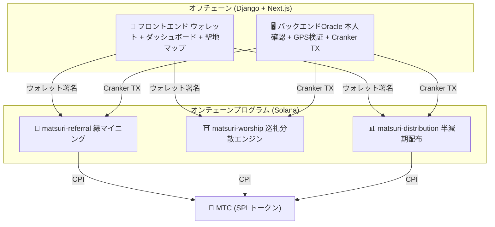
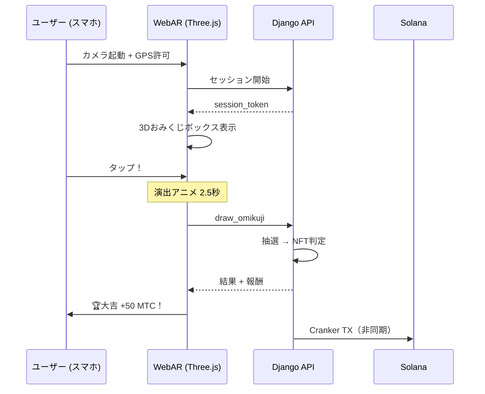

# ⚡ スマートコントラクト — オープンソース設計

>**信頼不要（トラストレス）の設計思想。**
> 報酬計算、紹介ツリー、半減期スケジュール —— すべてのロジックは**オンチェーン**で実行され、誰でも監査可能です。
> ソースコード: [GitHub](https://github.com/Cootakahashi/matsuri-contracts)

---

## Contributors

| メンバー | 役割 |
| :--- | :--- |
| **Ko Takahashi** | Founder / Lead Developer — アーキテクチャ設計、スマートコントラクト、フルスタック開発 |

> 🌏**今後、GCFメンバーや世界中の開発者コミュニティも共同開発に参加していきます。**
> Matsuri Protocol は、「文化のインフラ」として永続的に機能するよう、透明性と共同所有を原則としています。

---

## 全体構成

Matsuri は**3つのAnchor（Rust）プログラム**を Solana上にデプロイし、エコシステムの各柱を担います。



---

## 1. 📣 縁マイニング（En-Mining）

**目的:**「広さ（紹介ネットワーク）」と「深さ（経済インパクト）」の両方を報酬化するハイブリッド成長エンジン。単なるアフィリエイトではなく、現実世界の経済活動がオンチェーンの価値を生み出す完全なマイニングプロトコルです。

### スコアリング公式

```
S_final = S_raw × M_toku × B_title

  S_raw   = 0.30 × 紹介人数 + 0.70 × (取引高 / 10^9)
  M_toku  = f(MTC ステーク量) ∈ [1.0×, 10.0×]
  B_title = 1.0 + min(ランキング実績シーズン数 × 0.05, 0.50)
```

| 命令 | 説明 |
| :--- | :--- |
| `initialize` | プログラムの初期化（管理者のみ） |
| `register_profile` | ユーザープロファイル登録 |
| `register_referral` | 紹介関係を記録 |
| `record_action` | 購入/決済アクションの記録 |
| `stake_toku` / `unstake_toku` | 徳ステーキング（倍率ブースト） |
| `recalculate_score` | スコアの再計算 |
| `submit_leaderboard` | リーダーボードへのスコア提出 |
| `start_season` / `finalize_season` | シーズンの開始と確定 |
| `claim_rewards` | 報酬の受取 |

---

## 2. ⛩️ 巡礼分散エンジン（Worship Routing Engine）

**目的:****Uberのサージプライシングの逆**。混雑している有名観光地の報酬を下げ、隠れた名所の報酬を上げることで、観光客の流れを自然に分散させ、オーバーツーリズムを解決します。

### 報酬計算式

```
Reward = (日次プール / 訪問順序) × 動的倍率 × ティア倍率

ティア倍率 = { メジャー: 1×, 中規模: 2×, 地方: 5×, 秘境: 10× }
```

:::tip パイオニアボーナス
その日の最初の訪問者は報酬の100%、2番目は50%、3番目は33%... と、早い者ほど多くのMTCを獲得できます。
これにより、朝早くから穴場の聖地を訪れるインセンティブが生まれます。
:::

| 命令 | 説明 |
| :--- | :--- |
| `initialize` | プログラムの初期化 |
| `register_site` | 聖地の登録（管理者） |
| `check_in` | GPS検証済みチェックイン |
| `update_multiplier` | 動的倍率の変更（管理者） |
| `deposit_beacon` | スポンサード・ビーコンへのデポジット |
| `claim_mining_rewards` | マイニング報酬の受取 |

---

## 3. 📊 半減期配布（Halving Distribution）

**目的:**ビットコインに着想を得た半減期スケジュールで、MTCの配布をエポックごとに自動で半減させます。数学的に保証された希少性。

| 命令 | 説明 |
| :--- | :--- |
| `initialize` | 配布プールの初期化 |
| `register_miner` | マイナーの登録 |
| `update_score` | スコアの更新 |
| `advance_epoch` | エポックの進行（半減実行） |
| `claim_distribution` | 配布報酬の受取 |

---

## 4. 🎴 ARマイニング — WebAR おみくじ体験

**目的:**スマホのブラウザだけで現実空間にARおみくじを出現させ、MTCをマイニングする体験。**アプリDL不要**。神道の精神性と最先端技術が融合した、世界初のWebAR×ブロックチェーンインフラです。

### アーキテクチャ



### おみくじ確率設定

GCF管理画面から0.01%刻みで精密に制御できます。

| 等級 | デフォルト確率 | 報酬倍率 | NFT自動発行 |
| :--- | :--- | :--- | :--- |
| 🏆 大吉 | 5.00% | ×3.0 | ✅ |
| ✨ 吉 | 15.00% | ×1.5 | 任意設定 |
| 🌸 小吉 | 30.00% | ×1.2 | — |
| 🍃 末吉 | 35.00% | ×1.0 | — |
| 💀 凶 | 15.00% | ×1.0 | — |

### ZK-Proof of Vision（5層セキュリティ）

GPS偽装やリプレイ攻撃を多層で排除。**プライバシー保護のため、カメラ画像はサーバーに送信しません。**

| Layer | 検証内容 | 配点 |
| :--- | :--- | :--- |
| Temporal | セッション時間 5-120秒 | /20 |
| Motion | ジャイロの自然さ（手持ち振動検知） | /20 |
| Light | 環境光×時間帯の整合性 | /20 |
| HMAC | proof_hash 署名の検証 | /20 |
| Fingerprint | デバイスの一意性 | /20 |
| **合計** | **60/100 以上で PASS** | |

---

## Pure Math Modules（監査可能なコアロジック）

スコアリングと報酬計算は、副作用のない**純粋関数**として分離されています。これにより、形式検証が容易になり、セキュリティの透明性が最大化されます。

```rust
// 例: パイオニアボーナス計算 (worship/math.rs)
#[inline]
pub fn pioneer_reward(daily_pool: u64, visit_order: u32) -> u64 {
    if visit_order == 0 { return 0; }
    (daily_pool as u128 / visit_order as u128) as u64
}
```

---

## セキュリティモデル

本コントラクトは**完全オープンソース**です。セキュリティは不透明性ではなく、数学的な保証に基づいています。

| 原則 | 実装 |
| :--- | :--- |
| **PDA限定保管庫** | トークン保管庫はPDA（プログラム派生アドレス）で制御 — 人間の鍵では引き出せない |
| **チェック付き演算** | すべての計算に `checked_*` 演算を使用 — オーバーフロー不可能 |
| **権限分離** | 管理者（マルチシグ）≠ Cranker（限定操作）≠ ユーザー（自己管理） |
| **緊急停止** | 管理者は即座に全プログラムを停止可能（資金の奪取は不可） |
| **不変のトークノミクス** | 半減率・総プール・エポック期間は初期設定後に変更不可 |
| **純粋数学モジュール** | 報酬/スコアロジックは分離された、テスト可能な数学ライブラリ |
| **Vision Proof** | カメラデータ不送信の5層偽装検知（プライバシー保護） |

---

**[◀ ロードマップに戻る](/docs/roadmap)**｜**[ソースコードを見る](https://github.com/Cootakahashi/matsuri-contracts)**
