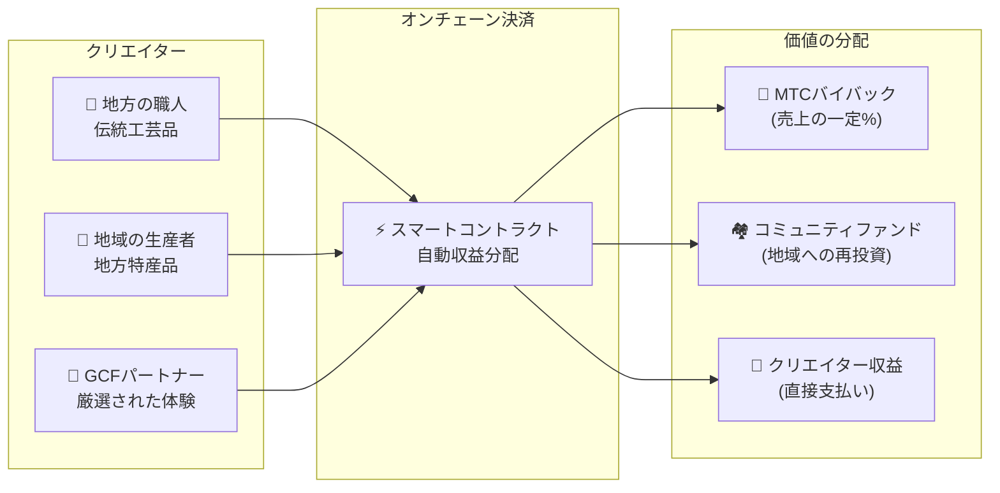

import useBaseUrl from '@docusaurus/useBaseUrl';

# 🗓️ ロードマップとチーム

>**ここまで読んでくださった方へ——ビジョン、経済設計、技術基盤はすべて揃っています。**
> 私たちは短期的な投機プロジェクトではありません。
>**主要なプラットフォーム開発はすでに完了**しており、あとは拡大させるフェーズに入っています。

---

## 戦略マイルストーン

### 🔥 フェーズ1：覚醒（2026年 前半 ── 現在）

**テーマ：基盤構築とキャッシュフローの確立**

Webプラットフォームは稼働中。iOSアプリ（Matsuri・J-Times）は2026年4月リリース予定。CEO直轄の金融システムによる収益化と初期流動性の確保に集中します。

| 状態 | マイルストーン | 詳細 |
| :---: | :--- | :--- |
| ✅ | **Webプラットフォーム稼働** | Matsuri Webアプリ、GCF管理ダッシュボード（Web版）の稼働開始 |
| ✅ | **決済と成長** | MTC決済機能＆紹介エアドロップ機能の実装完了 |
| ✅ | **メディア始動** | J-Times（Web＆ポッドキャスト）配信基盤構築 |
| ✅ | **ジェネシス** | SolanaチェーンでのMTCトークン発行 |
| ✅ | **流動性確保** | Raydiumにて初期流動性プール作成完了 |
| ⬜ | **インセンティブ開始** | 目標年利20%の流動性マイニング開始 |
| ⬜ | **オンチェーン決済** | Solana Pay検証の本番運用開始 |
| ⬜ | **VIP会員募集** | GCF初期VIPメンバー20名の選抜完了 |

### 🚀 フェーズ2：拡大（2026年 後半）

**テーマ：リアル資産とアドベンチャーマイニング**

完成したWebappをフル活用し、物理的な拠点と「巡礼機能」を拡充します。

| 状態 | マイルストーン | 詳細 |
| :---: | :--- | :--- |
| ⬜ | **新機能リリース** | アドベンチャーマイニング（巡礼）の実装・リリース |
| ⬜ | **海外展開** | アジア圏（タイ・台湾等）での提携拠点開拓＆VIPイベント開催 |
| ⬜ | **資産運用** | 不動産・株式・暗号資産ポートフォリオの構築 |
| ⬜ | **目標達成** | エコシステム全体の資産規模**10億円** |

### 🌊 フェーズ3：循環（2027年〜）

**テーマ：大規模普及、共創エコノミー、分散化**

一般開放、オンチェーンマーケットプレイス、完全なエコシステムの稼働フェーズです。

| 状態 | マイルストーン | 詳細 |
| :---: | :--- | :--- |
| ⬜ | **グランドオープン** | Matsuri Appの全世界正式リリース |
| ⬜ | **大解禁（2027/6/1）** | 創業者ロックアップ解除 ＋ マイニングプール（5.5億枚）稼働 ＋ 半減期サイクル開始 |
| ⬜ | **共創マーケットプレイス** | 地方特産品ショップ ＋ GCFパートナーストア ── MTC自動バイバック付きオンチェーン決済 |
| ⬜ | **クラウドファンディング（NFT権利付き）** | ユーザーがSolana上で文化プロジェクトに出資。支援者は所有権・収益分配・ガバナンス権を表すNFTを受け取る |
| ⬜ | **オンチェーン決済** | マーケットプレイスの全取引をスマートコントラクトで決済 ── 売上の一定割合がMTCバイバックプールへ自動送金 |
| ⬜ | **目標達成** | エコシステム全体の資産規模**100億円（〜$65M）** |
| ⬜ | **DAO移行** | 意思決定権限の一部をGCFコミュニティへ移譲 |

#### 🏪 共創マーケットプレイス構想

「文化OS」の究極的な表現 ── **文化の創り手と文化の愛好者が直接取引する**、搾取的な仲介者のいない分散型マーケットプレイスです。

| 機能 | 説明 | 状態 |
| :--- | :--- | :---: |
| **🏺 地方特産品ショップ** | 職人や地域の生産者が世界中の顧客に直接販売。MTC決済で5〜10%割引 | ⬜ 構想 |
| **🎫 クラウドファンディング ＋ NFT権利** | 文化プロジェクト（神社の修復、祭りの復興、職人の工房）に出資。貢献を証明するNFTを受け取り、収益分配やガバナンス権が付与される可能性あり | ⬜ 構想 |
| **⚡ オンチェーン決済** | すべてのマーケットプレイス取引がSolanaスマートコントラクトで決済。収益は自動分配：クリエイターへの支払い ＋ コミュニティファンド ＋ MTCバイバック ── 手動の経理処理は不要 | ⬜ 構想 |
| **🗳️ 支援者ガバナンス** | NFT保有者が、出資したプロジェクトのリソース配分について投票 ── 単なる寄付ではなく、真の共創 | ⬜ 構想 |

:::info なぜこれが重要なのか
今日、観光客はプラットフォームという「大家」にテナント料を払う店で土産物を買っています。明日には、**京都の田舎の職人がコペンハーゲンのファンに直接販売**し、その売上の一部が自動的にMTCエコノミーを強化します。これがフライホイールの最も完成された形です。
:::

---

## 👤 チーム

  

### Ko Takahashi ── 創業者 / CEO兼リードアーキテクト

| 項目 | 詳細 |
| :--- | :--- |
| **役割** | プロジェクト全体統括。プラットフォーム設計・スマートコントラクト・フルスタック開発 |
| **ビジョン** | 「文化を輸出し、富を輸入する」文化OSの提唱者 |
| **姿勢** | 自らコードを書き、自ら現場（ゴールデン街）に立つ「身銭を切る」の実践者 |

  

### Jon Anders Jensen ── 取締役 / GCF・イベントオペレーション

| 項目 | 詳細 |
| :--- | :--- |
| **役割** | GCF運営担当。イベント・ツアーのオペレーション設計と現場での運営 |
| **強み** | 国際的な視点とGCFメンバーとの信頼関係を軸に、エコシステムの「人」の循環を支える |

  

### Ryunosuke Honda ── 取締役 / 地域文化大使

| 項目 | 詳細 |
| :--- | :--- |
| **役割** | 日本各地の文化・コミュニティとMatsuriエコシステムをつなぐ架け橋 |
| **強み** | 地域の文化資源を発掘し、Matsuriプラットフォームに乗せることで「ディープ・ジャパン」体験を実現する |

### 🌏 GCFコミュニティ ── 世界に広がる開発メンバー

Matsuri Protocol は、創業チームだけで作られているわけではありません。
**世界中のGCFメンバー**がテスト、フィードバック、翻訳、地域展開を通じてプロトコルの進化に貢献しています。

| 領域 | 体制 |
| :--- | :--- |
| **💼 グローバル金融** | アジア圏のプライベート投資家ネットワークとの連携 |
| **⚙️ エンジニアリング** | ブロックチェーン＆モバイルアプリ開発の分散型エンジニアチーム |
| **🏮 オペレーション** | 新宿ゴールデン街＆主要観光地のローカルコミュニティとの強固なパイプライン |
| **🌐 コミュニティ** | 日本・ノルウェー・タイ・台湾をはじめとする多国籍GCFメンバー |

:::tip みんなで作る文化のインフラ
GCFに参加すれば、あなたもMatsuri Protocolの共同開発者です。
コードを書くだけが貢献ではありません。地域の聖地を紹介する、ドキュメントを翻訳する、イベントを企画する ——
すべてがこのプロトコルを世界に広げる力になります。
:::

---

## 🏛️ ガバナンス（DAO）

Matsuri Protocolは、中央集権から徐々に**分散型自律組織（DAO）**へと移行します。
GCFメンバー（プラチナ/ゴールド）は、将来的に以下の重要事項に対する**投票権**を持ちます。

| 投票事項 | 内容 |
| :--- | :--- |
| **💰 資金配分** | 事業収益をどの新規事業やマーケティングに投資するか |
| **⚙️ プロトコル更新** | アプリの手数料率やマイニング報酬率の微調整 |
| **⛩️ 文化認定** | どの祭りや神社を「公式巡礼地」として認定し、資金援助を行うか |

:::info 革命に参加しよう
私たちは、ただのアプリを作っているわけではありません。
**国境のない文化経済圏**を作っています。
:::

---

**[◀ 前: プロダクト＆技術](/docs/product-tech)**｜**[⛩️ ホワイトペーパーのトップへ戻る](/docs/intro)**
