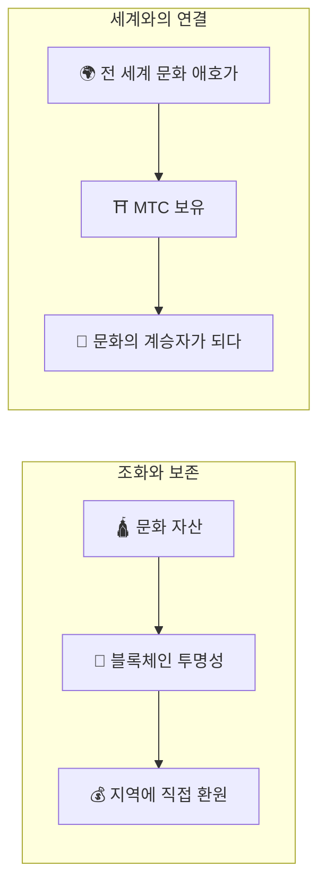

# ⛩️ Matsuri Coin에 오신 것을 환영합니다

> **조화를 위한 코드. 평화를 위한 가치.**
> 분열된 세계에 '和(와)'의 다리를 놓다. MTC는 경쟁에서 공동 창조로 이끄는 나침반입니다.

**Matsuri Coin(MTC)**은 솔라나 블록체인 위에 구축된 탈중앙화 유틸리티 토큰입니다.
일본의 정신적 자산 — '딥 재팬' — 을 글로벌 경제권에 연결하는 **'문화 OS'**로 설계되었습니다.

우리는 단순한 결제 수단을 만들고 있는 것이 아닙니다.
일본과 세계를 잇는 **다리**, 문화를 사랑하는 사람들이 국경을 넘어 손을 잡는 **새로운 공동 창조의 프레임워크**를 구축하고 있습니다.

---

## 🎯 우리의 사명

:::info 10조 엔의 시장 에너지를 문화의 미래로 연결
일본의 인바운드 관광 시장은 연간 **10조 엔** 규모로 성장하고 있습니다.
하지만 그 이면에는 **'불편한 진실'**이 숨어 있습니다.
:::

### 아무도 말하지 않는 문제들

| 문제 | 실태 |
| :--- | :--- |
| 💸 **수익 유출** | 해외 OTA(예약 플랫폼)와 중개업체에 대한 수수료로 수익의 대부분이 해외로 유출 |
| 😤 **지역 피로** | 오버투어리즘으로 혼잡과 부담만 남고, 정작 수익은 지역에 돌아오지 않음 |
| 🚧 **체험의 벽** | 효율화된 패키지 투어로는 '진짜 일본'과 깊이 연결될 수 없음 |

> **"일본인은 고생하고, 여행자는 진짜 모습을 모르고, 부는 플랫폼으로 사라진다."**

우리는 Web3 기술로 이 왜곡된 구조를 끝냅니다.
당신이 지불한 대가가 투명하게 **직접** 지역과 전통 보호에 도달하는 세계를 실현합니다.

---

## 🏗️ 하이브리드 모델: 문화 × 기술

대부분의 프로젝트는 '경제적 이익'만 추구하며 문화를 소모품으로 취급해왔습니다.
MTC는 **'문화를 지키기 위한 경제'** — 처음부터 있어야 했던 하이브리드 구조를 실현합니다.

| 축 | 의미 |
| :--- | :--- |
| **🛕 조화와 보존** | 관광객의 결제가 블록체인의 투명성을 통해 지역 문화 보존과 장인 지원에 확실히 전달. 외부 자본의 착취가 아닌, 지역 커뮤니티(GCF)가 주권을 가지고 문화를 지키고 키움 |
| **🌍 세계와의 연결** | 국경과 환율의 벽을 넘어 전 세계에서 일본의 '和'의 마음을 지원할 수 있는 인프라. MTC 보유는 일본의 살아있는 역사의 일부를 함께하는 것 |

---

## 💎 왜 MTC를 사용해야 하는가?

MTC 생태계는 참여자에게 **'정신적 충족'**과 **'경제적 실익'** 양쪽 모두를 제공합니다.

### ✨ 체험의 가치

| 혜택 | 상세 |
| :--- | :--- |
| **🎌 의미 있는 체험** | 일반 관광으로는 접근 불가능한 '딥 재팬'의 문을 열다. 금족지 참배, 비공개 신사 의식 초대 등 |
| **🌐 세계와의 유대** | 귀국 후에도 MTC를 통해 일본과의 연결 유지. '또 돌아올 곳'이 있다는 안도감 |
| **⚖️ 공정한 거래** | 스마트 컨트랙트가 중간 착취를 배제. 감사의 대가가 서비스 제공자와 지역에 직접 전달 |

### 💰 경제적 혜택

| 혜택 | 상세 |
| :--- | :--- |
| **🏷️ 우대 요율** | MTC 결제 시 일본 엔 가격 대비 항상 **5%~10% 할인**. 예: 3만 엔 투어 → 실질 2.7만 엔 상당 |
| **🔑 독점 접근권** | 일견 거절 가게와 한정 이벤트 예약권(티켓 NFT)은 MTC 홀더 전용 |
| **🛡️ 환율 리스크 회피** | 방일 전에 MTC를 구매하면 여행 중 환율 변동 걱정 없이 체험 가치 확보 |

---

## ⚡ 왜 솔라나인가?

'관광이라는 실수요'와 '고빈도 거래라는 금융'의 양립에 **솔라나 이외의 선택지는 존재하지 않았습니다.**

| 비교 항목 | Ethereum | Solana |
| :--- | :---: | :---: |
| **수수료** | 수백~수천 엔 | **약 0.04엔** |
| **처리 속도** | 12초~수 분 | **0.4초** |
| **초당 처리 능력** | 약 15건 | **수천 건** |

:::tip 새전함의 경제학
신사에서 '새전(100엔)'을 넣는 감각의 마이크로 결제를 실현하려면 **1엔 미만의 수수료**만 허용됩니다. 이를 실현할 수 있는 것은 솔라나뿐입니다.
:::

---

:::note 준비 완료
MTC는 문화를 소비하기만 하는 '관광'을 끝내고, 함께 미래를 만드는 **'공동 창조'의 여정**으로 초대합니다.
:::

**[▶ 비전: 왜 지금인가?](/docs/vision)** ｜ **[▶ GCF(VIP 멤버십) 참여하기](/docs/economy)**
