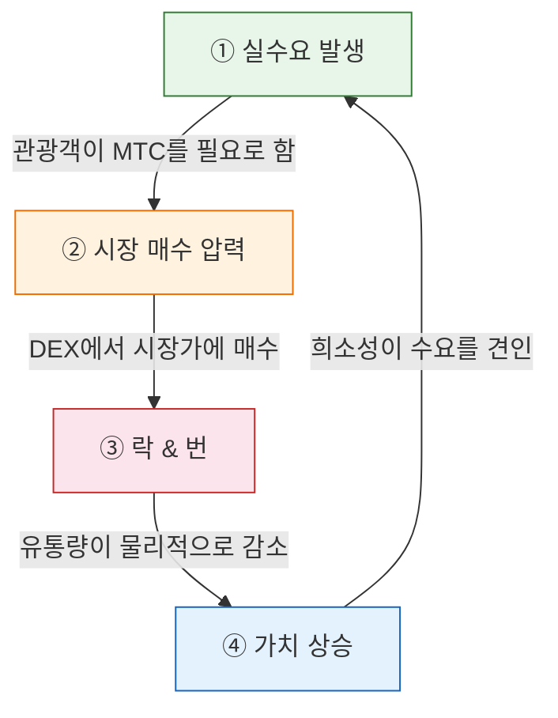
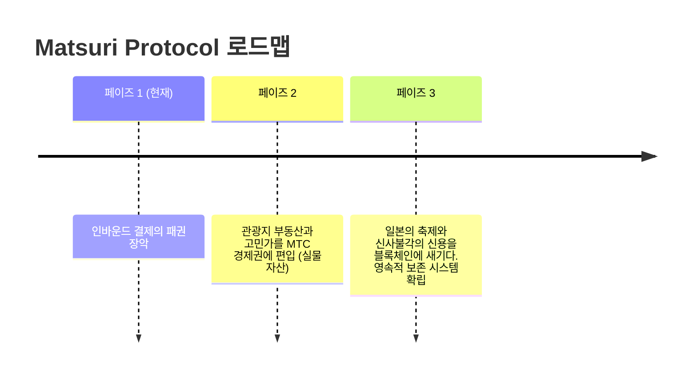

# 🎯 비전: '인바운드 퍼스트' 전략

> **보조금 의존에서 자립으로.**
> 세금으로 지방을 살리는 시대는 끝났다. 외화를 직접 문화에 흘려보낸다.

대부분의 지역 활성화 프로젝트는 실패합니다 — 축소되는 국내 경제 안에서 세금을 돌려막기하고 있을 뿐이기 때문입니다.

**Matsuri Protocol은 정반대의 접근법을 취합니다.**

---

## 1. 전략: 문화 수출 머신

일본의 관광 자원을 '소비재'가 아닌 **'수출 가능한 금융 자산'**으로 재정의합니다.

| 과제 | 실태 | 임팩트 |
| :--- | :--- | :--- |
| 💸 **수익 유출** | 해외 OTA(Booking.com, Expedia 등)에 대한 수수료 | 수익의 **15~20%가 해외로 유출**. 국가적 손실 |
| 🚧 **보이지 않는 벽** | 언어와 결제의 장벽 | 부유층이 원하는 '딥 재팬' 체험에 접근 불가 |

:::tip MTC의 역할
MTC는 이 '유출'을 막고, '벽'을 허무는 **유일한 마스터키**입니다.
:::

---

## 2. 경제 플라이휠 (성장의 순환)

Matsuri Protocol의 핵심 특징: **관광객의 열광이 MTC 가격 상승에 수학적으로 직결되는** 설계입니다.
감정론이 아닌 **수요와 공급의 메커니즘**입니다.

### 왜 MTC 가격은 오르는가?

**4단계 자동 사이클**이 가격을 견인합니다:

| 단계 | 명칭 | 메커니즘 |
| :---: | :--- | :--- |
| **①** | **실수요 발생** | 관광객이 가이드 예약과 티켓 NFT 구매에 MTC를 필요로 함 |
| **②** | **시장 매수 압력** | DEX(탈중앙 거래소)에서 MTC가 시장가로 매수됨. 투기가 아닌 '소비 기반의 강력한 매수' |
| **③** | **락 & 번** | 결제에 사용된 MTC의 일부가 스마트 컨트랙트에 의해 즉시 락(동결) 또는 번(소각). 유통량이 물리적으로 감소 |
| **④** | **가치 상승** | 매수 수요는 계속 늘고, 매도 공급은 계속 줆. 수급 균형에 의해 희소 가치가 수학적으로 상승 |

:::info 핵심
**"관광객이 일본을 즐길수록, MTC 홀더의 자산이 증가한다."**
이 단순한 진실이 프로젝트의 심장입니다.
:::

---

## 3. 최종 도달점: 문화 OS

우리의 최종 목표는 결제 앱이 아닙니다.
**문화 그 자체를 OS(기반)화하는 것**입니다.

> 우리는 **1000년 이어온 문화**를 **최첨단 블록체인**으로 지킵니다.
> 이것이 Matsuri Protocol이 그리는 미래입니다.

---

**[▶ 다음: 구체적으로 어떻게 수익을 내는가? (이코노미)](/docs/economy)**
