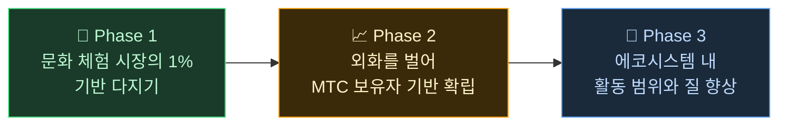

# 🌏 과제와 해결——불편한 진실, 그리고 희망

> **뜻은 아름답다. 그러나, 현실이 그것을 가로막고 있다.**

---

## 그러나, 이 뜻을 가로막는 불편한 진실이 있다

:::info 10조 엔(약 90조 원)의 시장 에너지가, 문화의 담당자에게 닿지 않는다
일본의 인바운드 시장은 연간 **10조 엔** 규모로 성장하고 있습니다.
그러나, 그 혜택의 대부분은 현장에 닿지 않고 있습니다.
:::

### MTC가 겨냥하는 시장

10조 엔 전체를 노리는 것은 아닙니다.

우리가 우선 겨냥하는 것은 그중에서도 **문화 체험·가이드·지역 투어 시장**입니다. 이 영역의 **1%(약 1,000억 엔 규모, 약 9,000억 원)** 를 첫 번째 목표로 삼고, 작게 시작해서 강하게 만듭니다.

| 페이즈 | 전략 | 목표 |
| :--- | :--- | :--- |
| **작게 시작한다** | 문화 체험·가이드 투어에 집중. 실적을 쌓고, 입소문으로 확대 | 수익 기반의 확립 |
| **강하게 만든다** | 외화(인바운드 수익)를 획득하고, MTC 보유자에게의 수익 분배 구조를 실증 | MTC 경제권의 신뢰 구축 |
| **질을 높인다** | 일정 규모에 도달한 뒤에는 확대보다 에코시스템 내 체험의 질·활동 범위·커뮤니티의 깊이 향상 | 지속 가능한 문화 경제권 |

> **양을 쫓는 것이 아니라, 관계하는 사람의 질과 체험의 깊이로 성장한다.** 그것이 MTC의 확장 전략입니다.

Web2 플랫폼은, 전 세계 사람들에게 여행의 훌륭함을 전해 주었습니다. 그 공로에는 감사하고 있습니다.
그러나, 중앙 관리형 구조에는 피할 수 없는 부작용이 있었습니다.

알고리즘이 "무엇을 보여 줄지"를 결정하고, 사업자는 표시 순위를 두고 경쟁하게 된다. 리뷰 평가 하나로 매출이 급변하고, 수수료율은 플랫폼의 일방적 판단으로 바뀐다——현장은 언제나 "선택받을 것인가, 사라질 것인가"의 불안 속에 놓입니다.

이 구조가 낳는 것은, 사업자들 사이의 분단과 보이지 않는 규칙에 대한 공포입니다.
옆 가게는 경쟁 상대가 되고, 협력보다 울타리 치기가 합리적이 된다. 여행자에게도 "별점 개수"나 "순위"로 획일화된 선택지만 닿게 되어, 정말로 가치 있는 체험은 묻혀 갑니다.

:::danger 현장이 안고 있는 3가지 과제
💸 **수익의 유출** — 수익의 대부분이 해외 OTA나 중개업자에게 수수료로 해외로 유출

😤 **지역의 피폐** — 오버투어리즘의 부담만 남고, 정작 수익은 지역에 환원되지 않음

🚧 **체험의 벽** — 알고리즘이 선정한 획일적인 투어만이 표시되어, "진짜 일본"을 만날 수 없음
:::

> **일본인은 고생하고, 여행자는 진짜 모습을 모르고, 부는 플랫폼으로 사라진다.**

---

## 그렇다면, 어떻게 바꿀 수 있는가?

그러나 지금, 이 구조를 근본부터 바꿀 수 있는 기술이 갖춰졌습니다.

:::tip 스마트 컨트랙트——다시 쓸 수 없는 공통 규칙
수수료도 조건도 코드에 새겨져, 누군가의 일방적 판단으로는 바꿀 수 없습니다. 모두에게 평등한 규칙이 자동으로 실행됩니다.
:::

:::tip 블록체인——모든 것이 보이는 투명성
거래는 전부 공개 원장에 기록되어, 누구나 검증할 수 있습니다. 데이터가 기업 안에 갇히는 시대는 끝납니다.
:::

:::tip Solana——0.4초 결제, 수수료 0.04엔
몇 겹의 중개 수수료도, 며칠씩 기다리는 결제도 필요 없습니다. 사람과 사람이 직접 이어집니다.
:::

:::tip AI——관리 비용 그 자체를 없앤다
폭발적인 생산성 향상이, 거대 플랫폼을 유지하기 위한 비용 구조를 과거의 것으로 만듭니다.
:::

이제 중간 관리자에게 의존하지 않아도, 사람은 직접 이어질 수 있는 시대입니다.

우리는 이 기술로 인바운드 경제를 독점에서 해방하고, 수익을 일본과 각국의 현장으로 되돌립니다.
그리고 일본뿐 아니라, **세계의 문화를 지키고, 이어 주는 구조**를 구축합니다.

---

**[◀ 이전: 비전·뜻](/docs/vision)**｜**[▶ 다음: MTC가 그리는 미래](/docs/future)**
