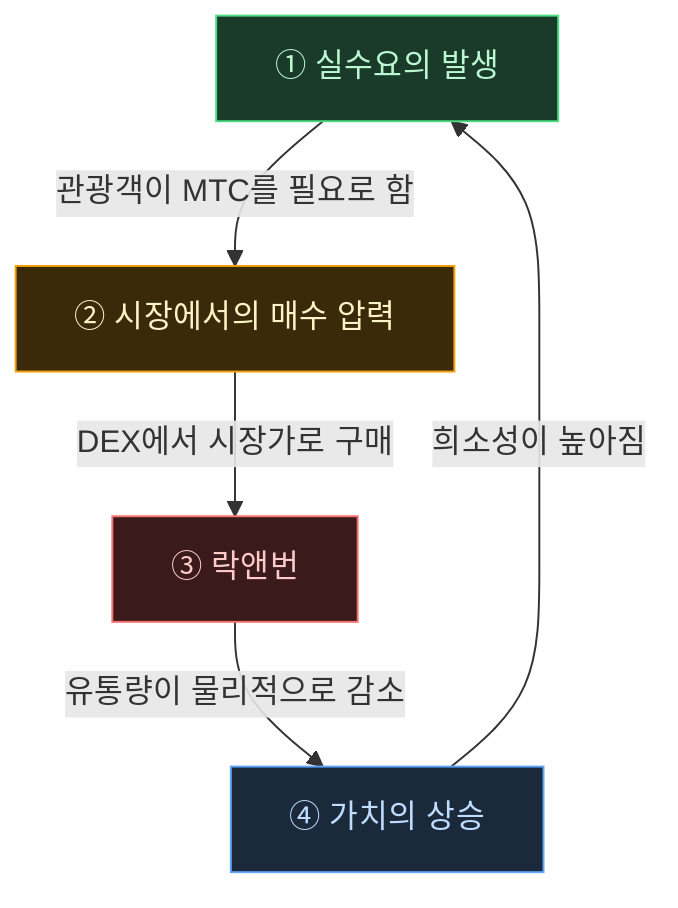

# 🔄 경제 플라이휠——성장의 순환과 문화 OS

> **관광객이 일본을 즐길수록, 에코시스템의 수요가 높아진다.**
> 이 수급 메커니즘이야말로, 프로젝트의 심장부입니다.

---

## MTC의 수급 메커니즘

Matsuri Protocol의 설계상, **실수요의 증가가 매수 압력을 낳고, 공급 감소와 결합되어 가치 향상의 조건이 갖춰지는** 구조로 되어 있습니다.
이는 감정론이 아닌, **수요와 공급의 메커니즘**입니다.

다음의 **4단계 순환**이 이 구조를 지탱합니다.

| 단계 | 명칭 | 구조 |
| :---: | :--- | :--- |
| **①** | **실수요의 발생** | 관광객이 가이드 예약이나 티켓 NFT 구매에 MTC를 필요로 한다 |
| **②** | **시장에서의 매수 압력** | DEX(탈중앙화 거래소)에서 MTC가 시장가로 구매된다. 투기가 아닌 소비에 기반한 강력한 매수 |
| **③** | **락앤번** | 결제에 사용된 MTC의 일부가 스마트 컨트랙트에 의해 즉시 락 또는 번. 유통량이 물리적으로 감소 |
| **④** | **희소성의 증가** | 매수 수요가 늘고, 매도 공급이 줄어든다. 수급 균형의 변화로 1개당 희소성이 높아지는 구조 |

---

---

:::note 이 수식이 지탱하는 비전
플라이휠 너머에 있는 "문화 OS"의 전체 그림은, 다음 페이지 [MTC가 그리는 미래](/docs/future)에서 자세히 풀어냅니다.
:::

---

**[◀ 이전: 과제와 해결](/docs/challenges)**｜**[▶ 다음: MTC가 그리는 미래](/docs/future)**
