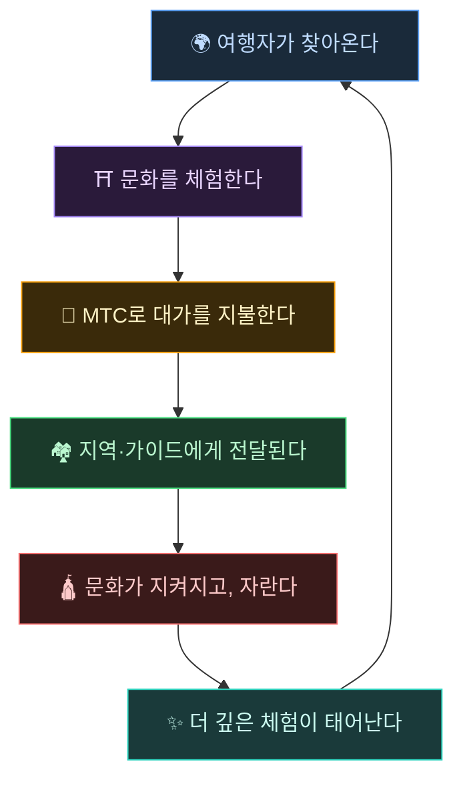
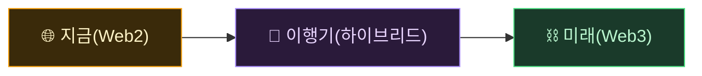
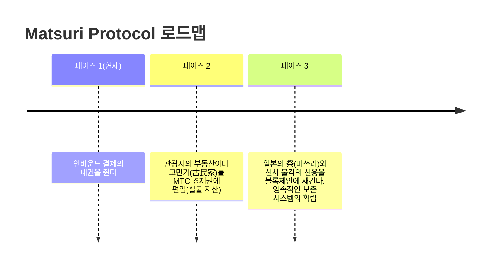

# 🌀 MTC가 그리는 미래——모든 "관계"가 순환하는 경제

> **체험하는 사람, 전하는 사람, 지키는 사람. 모든 마음이 경제로서 순환하여, 문화를 다음 세대로 전한다.**

---

## 우리가 실현하고 싶은 순환

MTC는 투기를 위한 토큰이 아닙니다.

여행자가 일본 문화에 닿고, 감동한다.
가이드가 그 감동을 전하고, 보답받는다.
지역이 윤택해지고, 문화를 계속 지킬 수 있다.
그리고 그 문화가, 또 새로운 여행자를 이끈다.

이 순환이야말로, MTC가 존재하는 이유입니다.

---

## 세 주체가 보답받는 경제

기존 관광에서는 여행자가 돈을 내고, 플랫폼이 이익을 가져가고, 현장에는 남지 않습니다.
MTC의 경제권에서는 관계하는 모든 사람이 보답받습니다.

| 관계하는 사람 | 무엇이 일어나는가 | 어떻게 보답받는가 |
| :--- | :--- | :--- |
| **🌍 체험하는 사람** | 일본 문화에 닿고, MTC로 지불한다 | 엔화보다 저렴하게 진짜 체험에 접근할 수 있다. 귀국 후에도 MTC를 통해 계속 이어진다 |
| **⛩️ 전하는 사람** | 가이드로서 이벤트를 개최하고, J-Times에서 콘텐츠를 발신한다 | 중간 착취 없는 직접 보상. 활동할수록 MTC로 보답받는다 |
| **🏘️ 지키는 사람** | 지역 커뮤니티로서 문화를 유지·계승한다 | 수익이 직접 전달된다. 오버투어리즘이 아닌, 지속 가능한 형태로 윤택해진다 |

---

## 경제권이 넓어질수록, 문화는 강해진다

MTC의 경제권은 체험 예약에서 시작하여, 머지않아 생활의 모든 면으로 넓어져 갑니다.

- **체험** — 진짜 문화 체험, 참배 마이닝
- **의식주** — 게스트하우스, 숍, 음식, 패션
- **공창 프로젝트** — 크라우드펀딩으로 문화를 지키는 투자
- **이문화의 국제 이해** — 국경을 넘은 교류와 상호 이해의 장

경제권이 넓어질수록, MTC를 통한 순환이 굵어지고, 문화를 지탱하는 힘이 강해진다.
이는 단순한 비즈니스 모델이 아닌, **문화의 생명 유지 장치**입니다.

---

## Web2에서 Web3로——무리 없이, 단계적으로

우리는 갑자기 "모든 것을 블록체인으로"라고 말하지 않습니다.

아직 Web3에 익숙하지 않은 사람이 대부분입니다. 그렇기에, **우선은 익숙한 형태로 시작해서, 서서히 Web3의 혜택을 체감하도록** 설계되어 있습니다.

| 페이즈 | 유저 체험 | 이면의 구조 |
| :--- | :--- | :--- |
| **지금** | 일반 웹앱처럼 체험 예약·결제. 신용카드로 OK | Django + Stripe. 지갑 없이 시작 가능 |
| **이행기** | 앱에서 MTC를 획득·이용. 지갑 연동은 원탭 | 오프체인 스코어가 순차적으로 온체인으로 이행 |
| **미래** | 모든 거래·권리가 블록체인 위에서 투명하게 기록. 당신의 공헌이 영구히 증명된다 | 스마트 컨트랙트에 의한 완전 자동·변조 불가능한 경제 |

:::tip Web3는 어렵지 않다
지갑 설정도 시드 프레이즈 관리도, 처음에는 필요 없습니다. 쓰다 보면 자연스럽게 Web3의 세계에 닿아 간다——**정신차려 보니, 이미 Web3의 주민이 되어 있다.** 그런 체험을 설계하고 있습니다.
:::

---

## 힘이 아닌, 공감으로 움직이는 경제

그리고 이 경제권은 스마트 컨트랙트로 움직입니다.
누군가의 권력이나 사정으로 일방적으로 규칙을 바꿀 수 없다——**힘에 의한 현상 변경이 불가능한 경제 구조**입니다.

그 위에서, 옛 지혜에서 배우면서 새로운 가치를 계속 만든다. 温故知新(온고지신), 그리고 창신(創新)으로.

> **엔화가 없어도, 달러가 없어도, 문화를 축으로 삶이 성립하는 세계.**
>
> 통화의 가치를 누군가에게 맡기는 것이 아니라, 자신의 "관계"로 가치를 만들어 내고, 사용한다.
> 그것이, MTC가 전하고 싶은 자유입니다.

---

## 🏁 최종 도달점: "문화 OS"

우리의 최종 목표는, 단순한 결제 앱이 아닙니다.
**문화 그 자체를 OS(기반)화하는 것**입니다.

> 우리는, 옛 지혜를 최신 블록체인으로 지킵니다.
> 이것이 Matsuri Protocol이 그리는 미래도입니다.

---

:::note 이야기 편은 여기까지입니다
여기까지 읽어 주신 분은, MTC가 왜 존재하는지를 이해해 주셨을 것입니다.
다음은 **【실천 편】**——실제로 MTC로 무엇을 할 수 있는지를 살펴보겠습니다.
:::

**[◀ 이전: 경제 플라이휠](/docs/flywheel)**｜**[▶ 다음: 에코시스템](/docs/ecosystem)**
