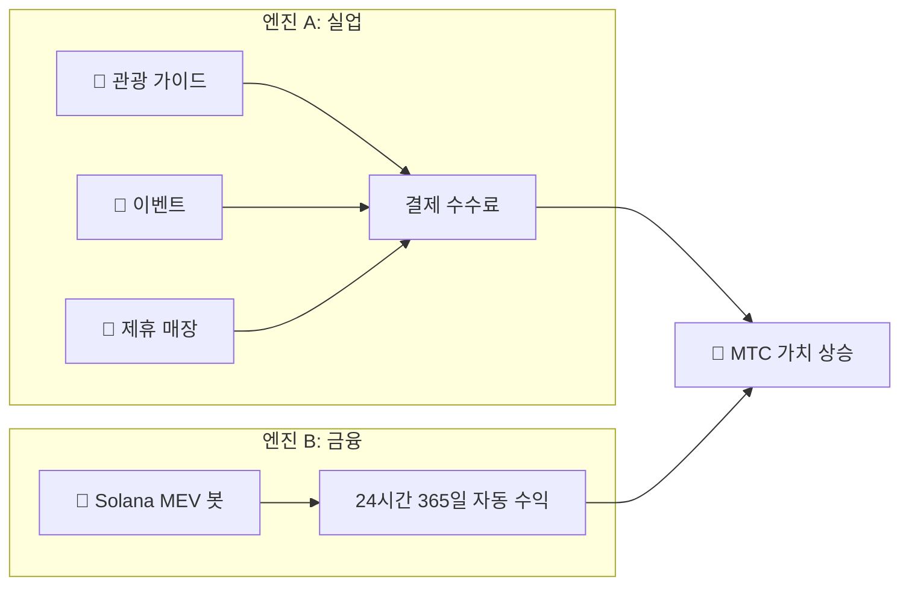

# 💰 경제 시스템

> Matsuri Coin(MTC) 경제권은 심플하면서도 견고합니다.
> **실업과 금융 알고리즘의 양 날개로 수익을 창출하고, 그 이익을 프로그래밍된 대로 홀더에게 환원합니다.**


---

## 1. 듀얼 수익 엔진



| 엔진 | 수익원 | 특징 |
| :--- | :--- | :--- |
| **🏯 엔진 A (실업)** | 관광 가이드·이벤트·제휴 매장의 결제 수수료 | 인바운드 관광객 증가 → 외화 유입 → 생태계 확장 |
| **🤖 엔진 B (금융)** | Solana MEV 봇 자동 매매 | CEO 직할 고빈도 거래 프로그램이 온체인 시장 비효율에서 24/7 수익 창출 |

---

## 2. 바이백 프로토콜 (가치 향상 메커니즘)

우리는 "수익이 나면 운영진 주머니에 넣지" 않습니다.
스마트 컨트랙트 규칙에 따라 이익을 **MTC 가치 향상**에 직접 투입합니다.

| 수익원 | 환원율 | 액션 |
| :--- | :---: | :--- |
| **Matsuri 본부 매출** (가이드·이벤트) | **20%** | 시장 **바이백** + 유동성 풀 추가 |
| **GCF 멤버십** (회원비) | **25%** | 시장 **바이백** |

:::info 핵심 로직
**"사업이 성장한다 = 시장에서 MTC가 항상 매수된다"**
이 등식이 당신의 자산 가치를 뒷받침합니다.
:::

---

## 3. 가격 결정 로직

가격 상승 메커니즘은 희망적 관측이 아닌 **AMM(자동 마켓 메이커) 수식**에 기반합니다.

```
가격 = 유동성(SOL) ÷ 공급량(MTC)
```

| 단계 | 무슨 일이 일어나는가 | 결과 |
| :---: | :--- | :--- |
| **①** | 사업 수익(SOL)이 풀에 주입됨 | **분자 ↑** |
| **②** | 그 자금으로 MTC가 시장에서 바이백되어 소각됨 | **분모 ↓** |
| **③** | 분자↑ × 분모↓ | **가격이 수학적으로 상승** |

---

## 4. GCF (글로벌 커뮤니티 프렌즈)

GCF는 Matsuri 생태계 확장을 담당하는 **완전 초대제** 파트너 조직(DAO)입니다.
단순한 회원이 아닌 **'사업 공동체'**로서 수익을 나눕니다.


### 회원 티어

| 티어 | 역할 | 특권 |
| :---: | :--- | :--- |
| **👑 플래티넘** | 오너 / VIP | 최상위 권익. 초기 **50명 한정**. 사업 전체 의사결정권과 두터운 배당 |
| **🥇 골드** | 앰배서더 | 실행 부대. '활동'을 통해 **상한 없이 수익** 창출. 마이닝과 추천 보상 환원율 최대화 |

### 혜택 ①: 실동 마이닝 (채굴권)

2027년 6월 1일 락업 해제되는 **5억 5천만 매(총 공급의 약 61%)**의 MTC는 시장에 매도되지 않고 **기여자 보상 풀**로 확보됩니다.

:::tip 완전 성과 보상제
당신의 활동량(매출, 집객 수, 가이드 횟수)에 따라 풀에서 자동으로 MTC가 지급됩니다.
:::

**반감기 스케줄 (2년 주기):**

| 기간 | 방출 비율 | 방출 수량 |
| :--- | :---: | :--- |
| **1기** 2027 – 2029 | **50%** | 약 2.75억 매 |
| **2기** 2029 – 2031 | **25%** | 약 1.37억 매 |
| **3기** 2031 – 2033 | **12.5%** | 약 6,800만 매 |

:::caution 선점자 우위
비트코인(4년 주기)보다 빠른 **2년 반감기** 채택.
2027년부터 **최초 2년간** 올인한 멤버가 압도적인 선점자 이익을 확보합니다.
:::

### 혜택 ②: 프리미엄 추천 보상

고가 상품(멤버십, VIP 투어, 제휴 부동산 등)을 추천하여 일반 어필리에이트와는 차원이 다른 **고액 보상(USDC + MTC)**을 획득. 스마트 컨트랙트를 통해 **즉시 환원**됩니다.

---

## 5. 토큰 사양

투자자의 안전을 보장하기 위해 솔라나 상의 '민트 권한'과 '프리즈 권한'을 영구적으로 **포기**했습니다.
추가 발행 영원히 불가능, 자금 동결 영원히 불가능. **완전한 트러스트리스 설계**입니다.

| 항목 | 상세 |
| :--- | :--- |
| **토큰명** | Matsuri Coin |
| **티커** | MTC |
| **체인** | Solana |
| **총 공급량** | **9억 매** (900,000,000 MTC) 고정 |
| **민트 권한** | 🚫 포기 완료 |
| **프리즈 권한** | 🚫 포기 완료 |
| **락 관리** | Streamflow Finance (검증 완료) |

:::warning 초대제 — 잔여 자리 소수
GCF는 한정된 자리(플래티넘 50명 / 골드 조정 중)가 차는 즉시 모집을 종료합니다.
이 권리를 가진다는 것은 Matsuri 경제권의 **'특권 계층'**이 된다는 의미입니다.
:::

---

**[▶ 다음: 생태계와 마이닝](/docs/ecosystem)** ｜ **[Discord 참여하기](#)**
