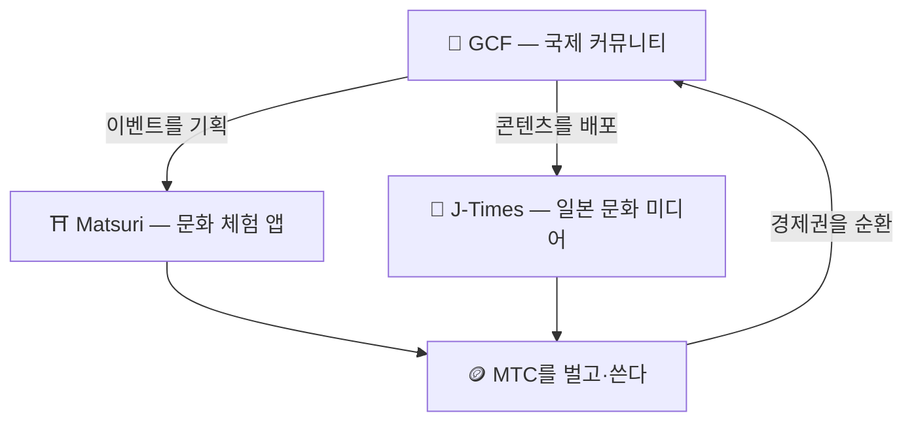

# 🏗️ MTC 에코시스템——체험·미디어·커뮤니티가 순환하는 경제권

> **뜻을 실현하기 위한, 세 가지 "장(場)".**
> 체험하는 장, 아는 장, 이어지는 장——각자 독립되어 있으면서도, MTC를 통해 하나의 경제권으로 순환합니다.

MTC는 단순한 토큰이 아닙니다. 3가지 프로덕트와 국제 커뮤니티가 연계하여, 문화를 지키기 위한 경제를 실현합니다.

:::tip 🤝 GCF — 에코시스템을 움직이는 국제 커뮤니티
일본 문화를 사랑하는 사람들이 국경을 넘어 이어지는 장. GCF가 가이드를 모집하고, 그 GCF 가이드가 Matsuri 위에서 체험 운영을 담당합니다. 나아가 J-Times에서 매력적인 콘텐츠를 발신——커뮤니티의 활동이 에코시스템 전체를 움직이는 엔진입니다.
:::

:::tip ⛩️ Matsuri — 문화 체험 앱
문화 체험의 예약에서 시작하여, **게스트하우스**, **숍**, **크라우드펀딩**으로 단계적으로 확장. 체험에서 의·식·주·공창 투자로 경제권이 넓어집니다.

**참배 마이닝(성지 순례)** — 신사 불각이나 문화적 랜드마크를 실제로 방문함으로써 MTC를 획득. 유명 스팟에서 지방의 숨은 명소로 자연스럽게 사람의 흐름을 분산시켜, 오버투어리즘 해소와 지방 창생을 동시에 실현합니다.
:::

:::tip 📰 J-Times — 일본 문화 미디어
일본 문화의 매력을 세계로 전하는 미디어 플랫폼. 기사를 읽거나·공유하는 등의 참여를 통해 MTC를 획득할 수 있습니다.
:::

---

## 🤝 소셜 마이닝(이어져서 번다)

**GCF 관리 대시보드 연동 ── 웹판 가동 중(iOS 앱은 2026년 4월 출시 예정)**

GCF 멤버에게는, 전용 **GCF 관리 웹**에 대한 접근 권한이 부여됩니다.

| 기능 | 할 수 있는 일 |
| :--- | :--- |
| **🎪 이벤트 생성** | 독자 이벤트나 투어를 기획·게재 |
| **📢 콘텐츠 배포** | J-Times의 기사나 콘텐츠를 배포·확산 |
| **📊 추천 추적** | 추천한 유저의 행동과 수익을 실시간으로 추적 |

:::info 자동 보상
추천한 친구가 결제할 때마다, 시스템이 **자동으로** 당신의 지갑으로 보상(매출 분배)을 입금합니다.
:::

---

## 🎓 크리에이터 에코노미(만들어서 번다)

콘텐츠를 소비할 뿐만 아니라, Matsuri 플랫폼에서는 **누구나** 콘텐츠를 제작하고 수익화할 수 있습니다.

| 플랫폼 | 크리에이터가 할 수 있는 일 | 수익 모델 |
| :--- | :--- | :--- |
| **📚 코스 마켓플레이스** | 일본 문화·언어·공예에 관한 동영상/텍스트 코스를 공개 | 수강 건당 수수료(크리에이터 수익 분배) |
| **🎙️ 팟캐스트 스튜디오** | Spotify, Apple Podcasts, RSS 배포의 오디오 시리즈를 제작 | 구독 한정 에피소드 |
| **🤝 크라우드펀딩** | 문화 프로젝트를 위한 Solana 기반 자금 조달 캠페인을 시작 | 온체인에서의 기여 추적 |
| **🛍️ 유저 숍** | 플랫폼 내에서 개인 숍을 개설(공예품, 굿즈) | 상품/리뷰 시스템을 갖춘 직접 판매 |

:::tip AI 탑재 제작 지원
이벤트 호스트는 **내장 AI 어시스턴트(GPT-4 Turbo)** 를 사용해 이벤트 설명 작성, 5개 언어로의 자동 번역, SEO 최적화 메타데이터 생성을 관리 대시보드 내에서 할 수 있습니다.
:::

---

  

*골든가이에서의 커뮤니티 미트업 ── 이어짐이 마이닝 파워로.*

---

:::note 다음 페이지로
구체적인 마이닝 구조와 수익 방식을 알고 싶은 분은, **[마이닝과 수익 방식 →](/docs/mining)** 로 진행하세요.
:::
