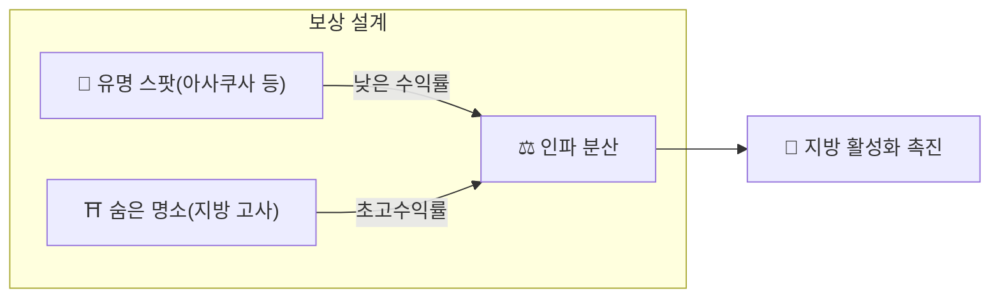

# ⛏️ 마이닝의 3대 축

> **행동 증명(Proof of Action)**
> Matsuri Coin은 GPU의 연산 능력이 아닌 **'인간의 행동'**으로 채굴됩니다.

웹 애플리케이션과 관리 대시보드는 **이미 완성**되어 있으며, 아래 활동으로 **지금 바로** 수익화가 가능합니다.

---

## 1. 📖 미디어 마이닝 (읽고·듣고·맞추고 벌기)

**공식 미디어 'J-Times' 연동**

지식은 여행의 질을 극적으로 높입니다.
텍스트와 오디오 학습에 더해 **이해도 체크(퀴즈)**에도 보상을 부여합니다.

| 액션 | 내용 | 보상 |
| :--- | :--- | :--- |
| **📰 읽고 벌기** | J-Times 기사(역사·신도·선) 읽기 | MTC 부여 |
| **🎧 듣고 벌기** | 한정 팟캐스트를 들으며 심층 문화 학습 | MTC 부여 |
| **✅ 맞추고 벌기** | 퀴즈 정답으로 지식 정착 증명 | MTC 부여(즉시) |

:::tip 자투리 시간이 마이닝으로
이동 중이나 휴식 시간이 그대로 보상을 만들어내는 시간으로 변합니다.
:::

---

## 2. 🤝 소셜 마이닝 (연결하고 벌기)

**GCF 관리 대시보드 연동 — 이미 가동 중**

GCF 멤버에게는 전용 **'GCF 관리 웹'** 접근 권한이 부여됩니다.

| 기능 | 할 수 있는 것 |
| :--- | :--- |
| **🎪 이벤트 생성** | 자체 이벤트와 투어를 기획·게재 |
| **📢 콘텐츠 배포** | J-Times 기사와 콘텐츠를 배포·확산 |
| **📊 추천 추적** | 추천한 사용자의 활동과 수익을 실시간 추적 |

:::info 자동 보상
추천한 친구가 결제를 할 때마다, 시스템이 **자동으로** 당신의 지갑에 보상(매출 분배)을 입금합니다.
:::

---

## 3. 🗺️ 어드벤처 마이닝 (걸으며 벌기)

**프로젝트 '순례' — 차기 페이즈(개발 중)**

GPS와 토큰 인센티브를 활용해 물리적인 '사람의 흐름'을 제어하는 차세대 기능입니다.

> **"돈이 되니까 지방으로 간다"**
> 이 경제적 합리성이 오버투어리즘을 해소하고 지방 활성화를 가속합니다.

### 🎲 '오미쿠지' 프로토콜

체크인 완료 시 **무료(가스비만)**로 실행되는 오미쿠지 형식의 스마트 컨트랙트입니다.

| 결과 | 받을 수 있는 것 |
| :--- | :--- |
| **🎊 대길** | 보너스 MTC 에어드롭 |
| **📜 NFT 드롭** | 해당 장소 한정 **'고슈인 NFT'** |
| **🏆 컴플리트** | 특정 NFT를 모으면 특별 이벤트 참가권 해금 |

:::note 도박이 아닙니다
금전적 걸기는 일절 불필요. **'방문했다'는 행동**에 대한 랜덤 보너스입니다.
:::

---

## 4. 🏦 유동성 마이닝 (맡기고 벌기)

> **은행이 되어보세요.**

Raydium에서 MTC/SOL 페어를 생성·제공한 유저에게 특별 보상 프로그램을 준비했습니다.

| 항목 | 상세 |
| :--- | :--- |
| **대상** | 초기 유동성 제공자('창업 파트너') |
| **목표 APY** | **50%** (리스크 프리미엄 설정) |
| **의의** | 생태계 초기 유동성을 확보하여 안정적 거래 환경 구축 |

---

**[▶ 다음: 로드맵과 팀](/docs/roadmap)** ｜ **[◀ 이전: 경제 시스템](/docs/economy)**
