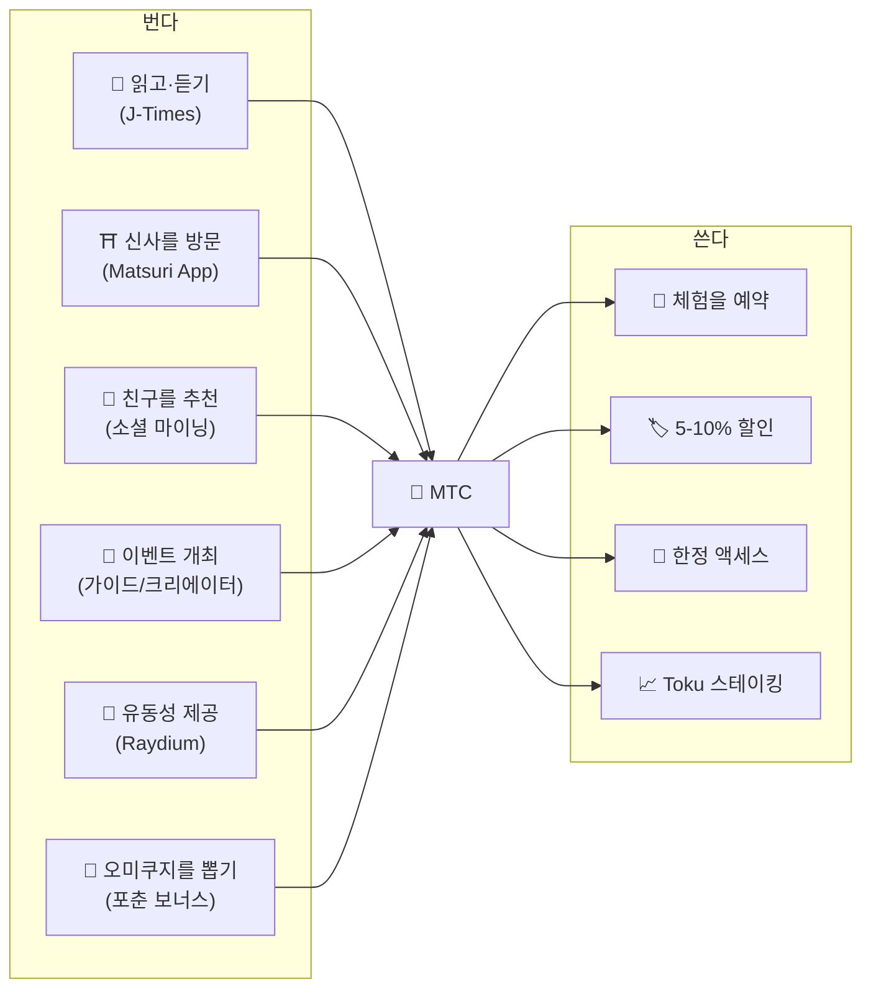
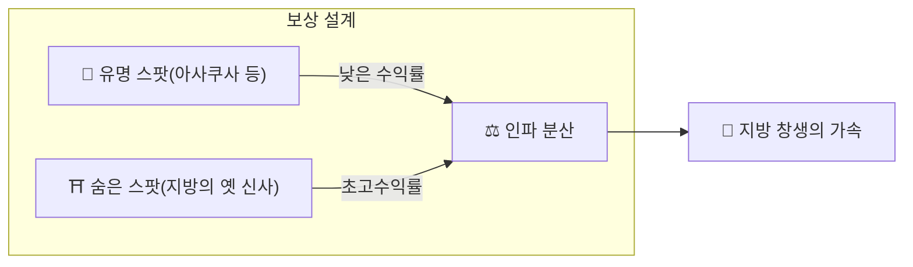
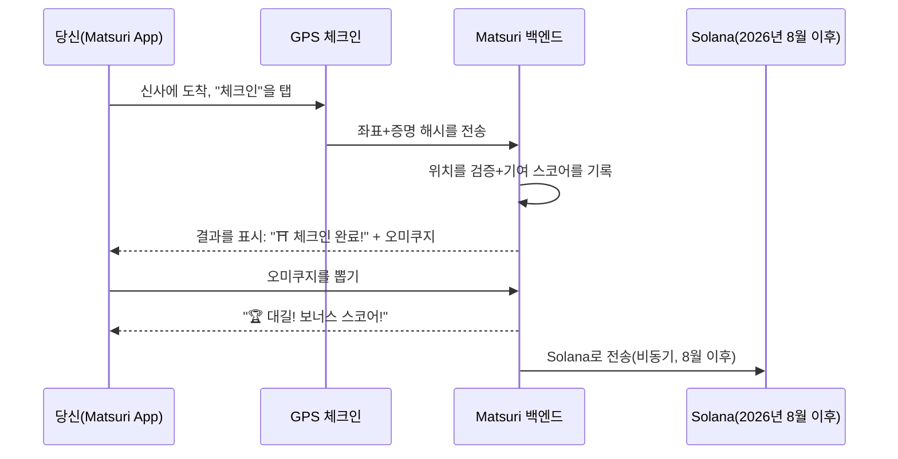
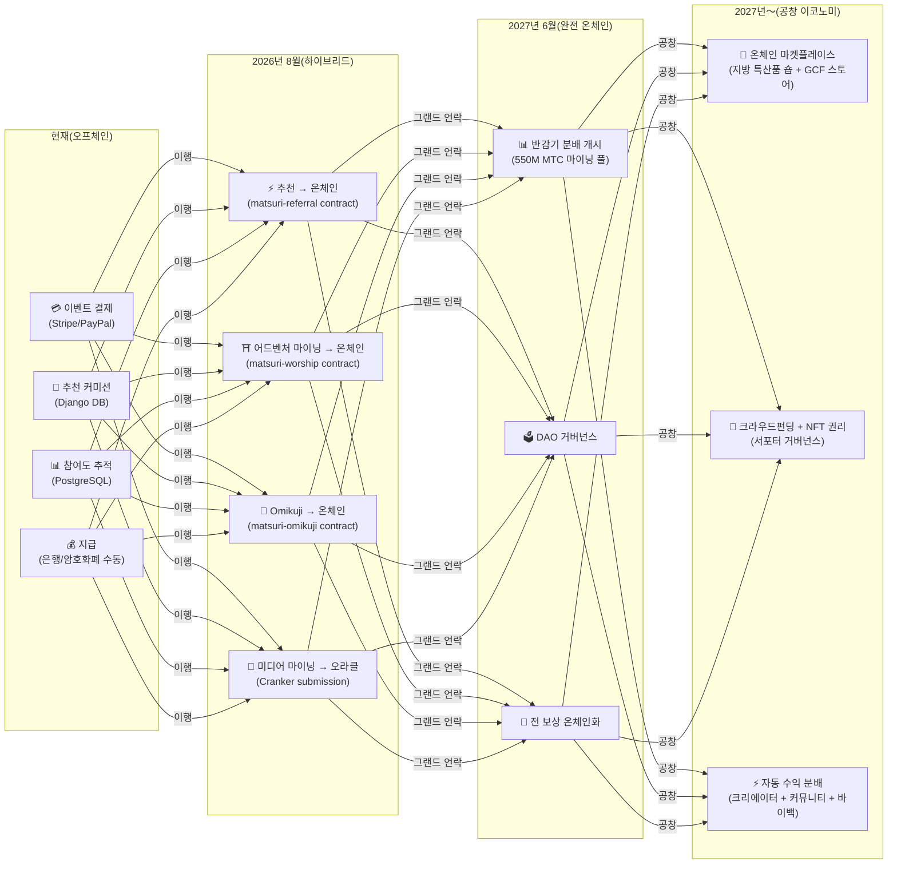

# ⛏️ 마이닝 5개 기둥과 수익 방식

> **문화에 대한 "관계"가, 그대로 가치가 된다.**
> 읽고, 걷고, 이어지고, 만들고, 지탱하는——당신의 행동 하나하나가 MTC를 만들어 냅니다.

<small>*※ "마이닝"이란?——비트코인 등에서는 컴퓨터가 방대한 계산을 수행하고, 그 보상으로 새로운 코인을 받는 것을 "마이닝(채굴)"이라고 부릅니다. MTC에서는 컴퓨터의 계산력이 아닌 **당신 자신의 행동**——기사를 읽고, 신사를 방문하고, 이벤트를 개최하는 것——이 "채굴"에 해당합니다. 금광을 캐는 대신, 문화에 대한 관계가 MTC를 낳는다. 그것이 우리의 "마이닝"입니다.*</small>

> 행동으로 번다. 체험에 쓴다. 보유해서 키운다.

MTC는 투기적인 토큰이 아닙니다. 모든 액션이 가치를 만들어 내고, 가치를 획득하는 리얼 이코노미를 순환하고 있습니다. 웹 애플리케이션과 관리 대시보드는 **이미 가동 중**입니다. 현재는 오프체인(Django)에서 기여 스코어를 기록하고 있으며, 2026년 8월 이후에 순차적으로 온체인으로 이행합니다.

:::tip 전체 그림
MTC에는 **완전한 순환형 경제**가 있습니다: 실제 활동을 통해 벌고, 실제 체험에 사용하고, 에코시스템의 확대와 함께 가치가 성장합니다. 이 페이지에서는 그 구조를 자세히 설명합니다.
:::

---

## MTC 라이프사이클

---

## 5가지 마이닝 필러

### 1. 📖 미디어 마이닝(읽고·듣고·답하며 번다)

**공식 미디어 "J-Times" 연동**

지식은 여행의 질을 극적으로 향상시킵니다. **J-Times 앱**을 열고, 일본 문화에 관한 콘텐츠를 즐겨 봅시다. 텍스트나 음성 학습에 더해, **이해도 체크(퀴즈)** 에도 보상을 드립니다. 완료한 액션마다 MTC가 자동으로 부여됩니다.

| 액션 | 완료 조건 | 보상 가이드 |
| :--- | :--- | :---: |
| **📰 기사를 읽기** | 75%까지 스크롤 | 2〜30 MTC |
| **🎧 팟캐스트를 듣기** | 끝까지 재생 | 2〜30 MTC |
| **🎬 동영상을 시청** | 시청 후 상세 화면을 닫기 | 2〜30 MTC |
| **📤 콘텐츠를 공유** | 공유 시트를 표시 | 2〜30 MTC |
| **✅ 퀴즈에 답하기** | 이해도 테스트에 합격 | 2〜30 MTC |

<small>*※ 보상량은 콘텐츠의 종류·길이·에코시스템 전체의 공급 균형에 따라 변동합니다*</small>

:::tip 틈새 시간이 마이닝으로
이동 중이나 휴식 시간이, 그대로 보상을 만들어 내는 시간으로 바뀝니다.
:::

:::info 오프라인 지원
지방 신사에서 인터넷 접속이 없다? 문제없습니다. J-Times는 액티비티를 로컬에 기록하고, **온라인으로 복귀하면 자동으로 동기화**됩니다(7일간 보관되는 오프라인 큐). 획득한 MTC를 잃는 일은 없습니다.
:::

**이면의 흐름:**
1. J-Times 앱이 당신의 액션(읽기 완료·시청 완료·공유 등)을 감지
2. 오프라인에서도 로컬에 기록(7일간 보관)
3. 네트워크 복귀 시 서버로 송신·검증
4. 기여 스코어로 잔액에 반영
5. 2026년 8월 이후: 검증된 스코어를 오라클 경유로 온체인에 기록하여, 블록체인 위에서 확인 가능하게

---

### 2. ⛩️ 어드벤처 마이닝(걸으며 번다)

**프로젝트 "순례" ── 스마트 컨트랙트 완성, 2026년 8월 메인넷 배포**

GPS와 토큰 인센티브를 활용하여, 물리적 "사람의 흐름"을 제어하는 차세대 기능입니다. 성지 맵은 Matsuri 웹앱에서 **이미 가동 중**입니다. 현재는 오프체인에서 기여 스코어를 기록하고, 2026년 8월 스마트 컨트랙트 배포 이후 온체인 보상 배포가 시작됩니다.

>**벌 수 있기에, 지방으로 간다**
> 이 경제적 합리성이, 오버투어리즘을 해소하고 지방 창생을 가속시킵니다.

**체크인 구조:**

**기본 원칙 — 방문자가 적은 사이트일수록 더 많이 번다:**

| 사이트 타입 | 예시 | 보상 가이드(1회 체크인) |
| :--- | :--- | :---: |
| 🏙️ **주요** | 센소지, 기요미즈데라, 후시미 이나리 | 30〜50 MTC |
| 🌆 **지방 거점** | 각 현의 일지궁(一之宮), 지방의 대사(大社) | 50〜100 MTC |
| 🏞️ **지방** | 역사 있는 지방 신사 | 100〜150 MTC |
| ⛰️ **프런티어** | 산악 사원, 낙도의 성지 | 150〜200 MTC |

<small>*※ 위는 베이스 보상의 가이드입니다. 오미쿠지 배율로 최대 수 배가 됩니다*</small>

**추가 스코어 요인:**
- **오미쿠지 배율** — 체크인마다 랜덤 보너스. 대길이면 보상이 수 배로
- **방문 빈도** — 정기 방문자는 시간이 지나면서 더 많이 획득
- **스폰서드 사이트** — 지자체가 특정 사이트를 부스트 가능

:::info 기여 스코어 → MTC
당신의 활동은 **기여 스코어**로 축적됩니다. 각 반감기 에포크(2027년 6월 시작)에서, 스코어는 550M 마이닝 풀에서 MTC로 변환됩니다. 커뮤니티에 대한 기여도가 높을수록, 더 많은 MTC를 받습니다. 정확한 부스트 계수는 단계적으로 확정되어 스마트 컨트랙트에 구현됩니다 — 실제 풀 규모에 맞춘 공정한 분배를 보장합니다.
:::

---

### 3. 🤝 소셜 마이닝(이어져서 번다)

친구에게 추천하기만 해도, MTC를 획득할 수 있습니다.

#### 일반 유저의 추천 보상

심플한 구조입니다. 당신의 추천 링크로 친구가 등록하면, **직접 추천 1건당 300 MTC**가 부여됩니다.

| 조건 | 보상 |
| :--- | :--- |
| 당신이 추천한 친구가 등록 | **300 MTC** |

이것뿐입니다. 다단계 보상은 발생하지 않습니다.

#### GCF 대리점의 추천 보상

[GCF 멤버](/docs/gcf)는 에코시스템의 확대를 담당하는 **공식 대리점**으로서, 더욱 깊은 보상 구조를 가집니다.

| 레이어 | 관계 | 커미션 |
| :---: | :--- | :---: |
| **L1** | 직접 추천 | **20%** |
| **L2** | 추천 대상의 추천 | **5%** |
| **L3** | 3차 | **5%** |
| **L4** | 4차 | **5%** |

:::note GCF 대리점 제도에 대해
이 다단계 보상은 GCF 멤버십(초대제)을 가진 공식 대리점에만 적용됩니다. 일반 유저는 직접 추천(300 MTC)뿐입니다.
GCF 대리점의 커미션은 추천 대상의 **실제 경제 활동(체험 구매·이벤트 참가 등)** 에 근거하여 계산됩니다. 사람을 모으는 것만으로는 보상이 발생하지 않습니다.
:::

**En-Mining 스코어의 구조(GCF 대리점용):**

기여 스코어는 두 가지 요소에 기초하여 계산됩니다:
- **네트워크의 넓이**(30%) — 몇 명을 데려왔는가
- **경제 활동**(70%) — 추천 네트워크로부터의 실제 구매

스코어는 시간이 지나면서 축적되고, 각 반감기 에포크에서 MTC로 변환됩니다.

#### GCF 관리 대시보드 ── 웹판 가동 중

GCF 멤버에게는, 전용 관리 대시보드에 대한 접근 권한이 부여됩니다.

| 기능 | 할 수 있는 일 |
| :--- | :--- |
| **🎪 이벤트 생성** | 독자 이벤트나 투어를 기획·게재 |
| **📢 콘텐츠 배포** | J-Times의 기사나 콘텐츠를 배포·확산 |
| **📊 추천 추적** | 추천한 유저의 행동과 수익을 실시간으로 추적 |

:::warning 현재는 오프체인 → 2026년 8월에 온체인으로 이행
추천 커미션은 현재 Django(PostgreSQL)에서 추적되고, 은행 이체 또는 암호화폐로 지급되고 있습니다. **2026년 8월** 이후, Solana 위의 **Matsuri Referral 스마트 컨트랙트**로 이행하여, 온체인에서 감사 가능한 지급이 실현됩니다.
:::

  

*골든가이에서의 커뮤니티 미트업 ── 이어짐이 마이닝 파워로.*

---

### 4. 🎓 크리에이터 & 가이드 마이닝(만들어서 번다)

콘텐츠를 소비할 뿐만 아니라, Matsuri 플랫폼에서는 **누구나** 콘텐츠를 제작하고 수익화할 수 있습니다. GCF 멤버, 가이드, 또는 콘텐츠 크리에이터 분은 다음과 같은 방법으로 벌 수 있습니다.

| 액티비티 | 수익 방법 |
| :--- | :--- |
| **🗺️ 투어를 개최** | 가이드 커미션(이벤트마다 설정)+팁 |
| **🎫 이벤트 티켓을 판매** | EventPurchase 경유의 수익 공유 |
| **📚 코스를 공개** | 수강 건당 수수료(크리에이터 수익 분배) |
| **🎙️ 팟캐스트 에피소드를 제작** | 구독 수익 |
| **🤝 크라우드펀딩 캠페인을 시작** | Solana 기반 온체인 기여 추적 |
| **🛍️ 유저 숍을 개설** | 공예품·굿즈의 직접 판매 |

**팁 시스템:** 이벤트 종료 후, 게스트는 가이드에게 팁을 보낼 수 있습니다(Uber 방식). 팁은 Stripe로 처리되고, 공개 리더보드에서 추적됩니다.

:::tip AI 탑재 제작 지원
이벤트 호스트는 **내장 AI 어시스턴트(GPT-4 Turbo)** 를 사용해 이벤트 설명 작성, 5개 언어로의 자동 번역, SEO 최적화 메타데이터 생성을 관리 대시보드 내에서 할 수 있습니다.
:::

---

### 5. 🏦 유동성 마이닝(맡겨서 번다)

>**은행이 되자.**

Raydium DEX 위에서 MTC/SOL의 유동성을 제공하고, 에코시스템 초기의 거래 기반을 지탱합시다. 초기 유동성 제공자에게는 "창업 파트너"로서 특별한 보상 프로그램을 준비하고 있습니다.

| 항목 | 상세 |
| :--- | :--- |
| **대상** | MTC와 SOL을 보유하는 모든 유저 |
| **목표 연이율** | **20%** (초기 유동성 인센티브, 리스크 프리미엄으로 설정) |
| **DEX** | Raydium (Solana) |
| **의의** | 에코시스템 초기의 유동성을 확보하고, 안정된 거래 환경을 구축 |

---

## 🎲 Omikuji 보너스

모든 어드벤처 마이닝의 체크인에는 무료 Omikuji(오미쿠지)가 포함됩니다. 체크인 완료 시 **무료(가스비만)** 로 실행되는, 오미쿠지 형식의 스마트 컨트랙트입니다.

| 운세 | 보상 배율 | 추가 보너스 |
| :--- | :---: | :--- |
| 🏆 **대길** | 베이스 보상 × 최대 배율 | 고슈인(御朱印) NFT |
| ✨ **길** | 베이스 보상 × 고배율 | — |
| 🌸 **소길** | 베이스 보상 × 소배율 | — |
| 🍃 **말길** | 베이스 보상 × 1.0 | — |
| 💀 **흉** | 베이스 보상 × 1.0 | — |

확률과 배율은 GCF 관리 대시보드에서 조정 가능하며, 에코시스템 전체의 MTC 공급 균형에 따라 운영이 관리합니다. 결과는 Solana 위의 **변조 방지 커밋·리빌 프로토콜**로 결정되며, 커밋 단계 이후에는 누구도 결과를 변경할 수 없습니다.

<small>*※ 흉이 나와도 베이스 보상은 받을 수 있습니다. 체크인한 행동 자체가 보답받는 설계입니다*</small>

:::note 도박이 아닙니다
금전적인 베팅은 일절 불필요. **"방문했다"는 행동**에 대한 랜덤 보너스입니다. 특정 NFT를 모으면 특별 이벤트 참가권을 언락할 수 있습니다.
:::

---

## MTC의 사용처

| 유스케이스 | 메리트 | 이용 가능 여부 |
| :--- | :--- | :---: |
| **🎫 체험을 예약** | 투어, 이벤트, 문화 액티비티를 MTC로 지불 | ✅ 이용 가능 |
| **🏷️ 할인** | MTC 지불로 엔화 가격의 5-10% 할인 | ✅ 이용 가능 |
| **🔑 한정 액세스** | NFT 게이트 이벤트, VIP 한정 의식, 프라이빗 투어 | ✅ 이용 가능 |
| **📈 Toku 스테이킹** | MTC를 락해서 기여 스코어를 부스트(최대 약 50% 부스트) | 🔜 2026년 8월 |
| **🗳️ DAO 거버넌스** | 트레저리, 프로토콜 업그레이드, 사이트 인증에 투표 | 🔜 2027년 |
| **🛍️ 파트너 점포** | 제휴 숍이나 레스토랑에서 지불 | 🔜 확대 중 |

:::info 결제 수단으로서의 MTC
Matsuri App에서는, MTC는 신용카드나 Solana Pay와 나란히 제1급 결제 수단입니다. 변환은 불필요——체크아웃에서 "MTC로 지불"을 선택하면, 즉시 잔액에서 차감됩니다.
:::

### MTC의 환금에 대해

:::warning 중요: 당사는 MTC의 환금·교환 서비스를 제공하지 않습니다
Matsuri 운영은 암호자산 교환업의 등록을 하지 않았기 때문에, **MTC와 법정통화(엔화·달러 등)의 직접 교환은 일절 하지 않습니다.**

MTC를 다른 암호자산이나 법정통화로 교환하고 싶은 경우는, 다음과 같이 유저 본인의 조작으로 가능합니다:
1. **Phantom Wallet** 등 Solana 대응 지갑으로 MTC를 관리
2. **Raydium(DEX)** 에서 MTC → SOL로 교환
3. SOL을 암호자산 거래소(CEX)에서 법정통화로 환금

장래에는 CEX(중앙집권형 거래소) 상장도 시야에 두고 있으며, 그 경우에는 더 간편한 환금 수단을 이용할 수 있게 됩니다.
:::

---

## 예시: MTC 이코노미의 하루

> **아침:** 전철에서 J-Times 기사를 3개 읽기 → MTC 획득.
> **오후:** Matsuri App에서 지방 신사를 방문 → 체크인, 길(×1.5)을 뽑기 → 더 많은 MTC 획득.
> **저녁:** 획득한 MTC로 ¥9,000짜리 신주쿠 골든가이 문화 투어를 10% 할인으로 예약(¥8,100 상당을 지불).
> **결과:** 당신의 문화적 호기심이 리얼한 체험으로 변하고, 가이드도, 신사도, 커뮤니티도 직접 지불을 받았습니다. OTA가 20% 수수료를 가져가는 일은 없습니다.

---

## 경제의 지속 가능성

:::warning 마이닝 풀이 고갈되면 어떻게 되나?
550M MTC의 반감기 풀은 **수십 년** 지속되도록 설계되어 있습니다. 2년마다 방출량이 반감되기 때문에, 수학적으로 100%에 도달하지 않으며, 보상은 장기간에 걸쳐 계속됩니다(자세한 것은 [토크노믹스](/docs/tokenomics) 참조). 그러나, 방출량이 극히 적어진 후에도:

- **트랜잭션 수수료**가 온체인 활동에서 네트워크 참가자에게 보상을 계속 제공합니다
- **바이백 프로토콜**(사업 수익의 20-25%)이 항시적인 매수 압력을 만들어 냅니다
- **Toku 스테이킹**이 유통 공급량을 락하여, 매도 압력을 경감합니다
- **리얼한 사업 수익**(이벤트, 멤버십, 코스)이 토큰 배분과 독립적으로 에코시스템을 지탱합니다

MTC는 **리얼 이코노미**에 뒷받침되고 있습니다——단순한 토큰 에미션이 아닙니다.
:::

---

## 온체인 이행 로드맵

Matsuri 이코노미는, 오프체인(Django/PostgreSQL)에서 온체인(Solana 스마트 컨트랙트)으로 단계적으로 이행하고 있습니다. 이 이행으로, 모든 오퍼레이션이 **트러스트리스·감사 가능·퍼미션리스**가 됩니다.

| 페이즈 | 타임라인 | 온체인화되는 내용 |
| :--- | :--- | :--- |
| **페이즈 1(현재)** | 가동 중 | MTC 토큰(SPL), Raydium LP, Solana Pay 검증 |
| **페이즈 2(2026년 8월)** | 스마트 컨트랙트 메인넷 배포 | 추천 커미션, 어드벤처 마이닝 보상, Omikuji 추첨, 오라클 경유 미디어 마이닝 |
| **페이즈 3(2027년 6월)** | 그랜드 언락 | 550M MTC 반감기 분배, DAO 거버넌스, 완전 분산화 |
| **페이즈 4(2027년〜)** | 공창 이코노미 | 온체인 마켓플레이스(지방 특산품 숍 + GCF 스토어), NFT 권리 부여 크라우드펀딩, 크리에이터 + 커뮤니티 + 바이백으로의 자동 수익 분배 |

:::warning 왜 지금 모든 것을 온체인화하지 않는가?
**보안 감사가 완료될 때까지, 유저의 자금이 움직이는 온체인 기능은 유효화하지 않습니다.** 이것이 우리의 원칙입니다.

현재 상황:
- **유저 자금 리스크: 없음** — 현 시점에서는 모든 보상·스코어는 오프체인(Django)에서 관리되고 있으며, 스마트 컨트랙트 경유로 유저의 자금이 이동하는 기능은 가동하고 있지 않습니다
- **감사 스케줄: 2026년 Q2〜Q3** — 프로페셔널한 보안 감사를 거쳐, 안전성이 확인된 컨트랙트부터 순차적으로 메인넷에 배포
- **감사 완료가 배포의 전제 조건** — 감사가 완료되지 않은 스마트 컨트랙트를 메인넷에서 유효화하는 일은 없습니다

오프체인 기간 중의 보상도 검증 가능합니다——모든 트랜잭션에는 결제 증명으로서의 `solana_signature`가 포함되어 있습니다.
:::

---

**[▶ 다음: 토크노믹스](/docs/tokenomics)** ｜ **[◀ 이전: 에코시스템](/docs/ecosystem)**
