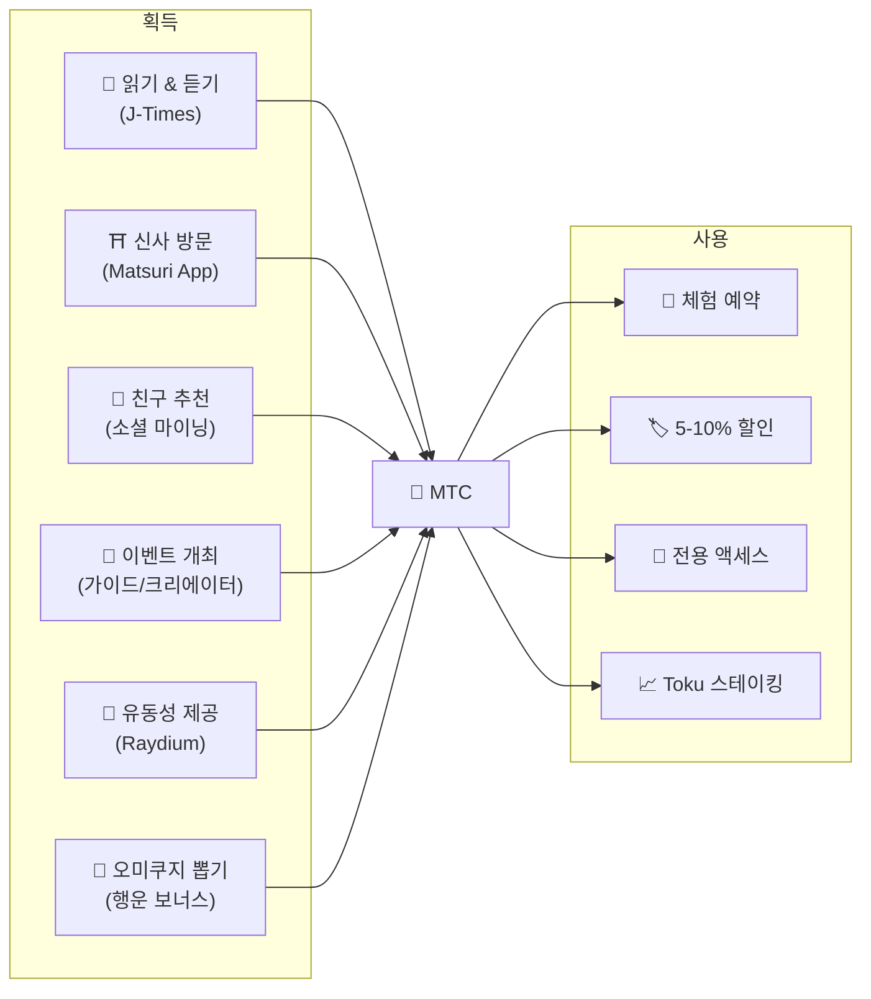
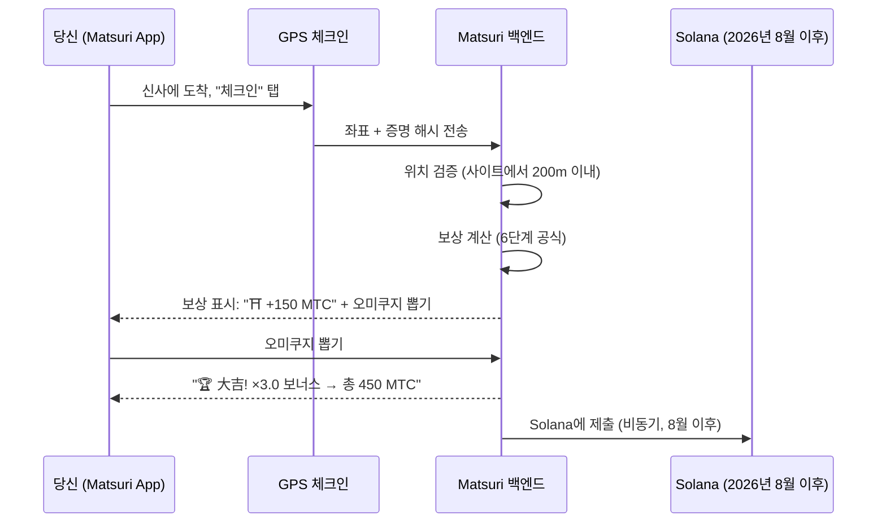
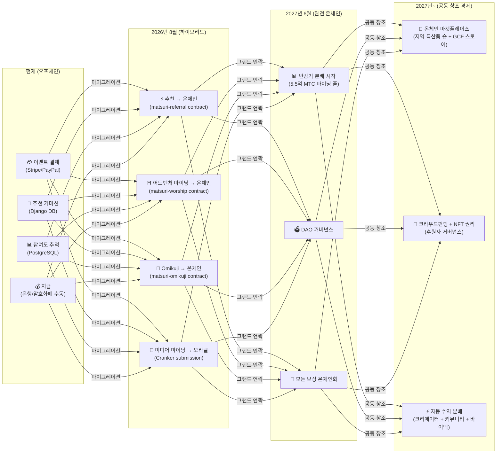

# 💎 MTC 획득 및 사용 방법

> **행동으로 벌고, 경험에 쓰고, 보유하여 성장시킨다.**
> MTC는 단순한 투기 토큰이 아닙니다 — 모든 행동이 가치를 창출하고 포착하는 실물 경제를 순환합니다.

:::tip 전체 그림
MTC에는 **완전한 순환 경제**가 있습니다: 실제 활동을 통해 벌고, 실제 경험에 사용하며, 생태계가 확장됨에 따라 가치가 성장합니다. 이 페이지에서 그 구체적인 방법을 알려드립니다.
:::

---

## MTC 라이프사이클



---

## MTC 획득 방법

### 1. 📖 미디어 마이닝 — J-Times에서 읽기, 듣기, 시청하기

**J-Times 앱**을 열고 일본 문화에 관한 콘텐츠를 즐기세요. 완료된 각 행동마다 MTC가 자동으로 지급됩니다.

| 행동 | 완료 조건 | 보상 |
| :--- | :--- | :---: |
| **기사 읽기** | 75% 깊이까지 스크롤 | MTC |
| **팟캐스트 듣기** | 끝까지 재생 | MTC |
| **동영상 시청** | 시청 후 상세 화면 나가기 | MTC |
| **콘텐츠 공유** | 공유 시트 표시 | MTC |
| **퀴즈 완료** | 이해도 테스트 통과 | MTC (즉시) |

:::info 오프라인 지원
시골 신사에서 인터넷이 안 된다고요? 걱정 마세요. J-Times는 활동을 로컬에 기록하고 **온라인으로 돌아오면 자동으로 동기화**합니다 (7일간 보관되는 오프라인 큐). 획득한 MTC를 잃는 일은 없습니다.
:::

**내부 작동 방식:**
1. 앱 내 `EngagementTracker`가 완료 이벤트를 감지
2. 행동이 로컬에 대기열로 저장 (오프라인에서도 가능)
3. 네트워크 복구 시 행동을 일괄 처리하여 Django API로 전송
4. API가 검증 후 MTC를 잔액에 적립
5. 2026년 8월 이후: Cranker 오라클을 통해 온체인에 제출

---

### 2. ⛩️ 어드벤처 마이닝 — Matsuri App으로 성지 방문

**Matsuri App**을 열고, 성지 지도에서 신사나 사찰을 찾아 현장에 가서 체크인하세요. 방문객이 적은 곳일수록 더 많이 벌 수 있습니다.

**단계별 흐름:**



**보상 배율 — 시골일수록 더 높은 이유:**

| 사이트 유형 | 예시 | 배율 |
| :--- | :--- | :---: |
| 🏙️ **주요** | 센소지, 기요미즈데라, 후시미이나리 | ×1 |
| 🌆 **지역 거점** | 각 현의 이치노미야, 지방 대사 | ×2 |
| 🏞️ **시골** | 역사 깊은 지방 신사 | ×5 |
| ⛰️ **프론티어** | 산악 사찰, 외딴 섬 성지 | ×10 |

**추가 보너스:**
- **개척자 보너스** — 그날 첫 번째 방문자가 가장 많이 획득 (조화 감쇠)
- **연속 보너스** — 연일 방문으로 최대 +50%
- **Omikuji** — 무작위 운세 뽑기: 大吉 = ×3.0, 吉 = ×1.5, 小吉 = ×1.2
- **스폰서 비콘** — 지자체가 MTC를 예치하여 특정 사이트의 보상을 증가

> **예시:** 산악 오지 신사(×10)를 그날 2번째 방문자로 방문하고, 5일 연속 방문(+10%)에 吉(×1.5)을 뽑은 경우 = 기본 보상이 **16.5배** 증폭.

---

### 3. 🤝 소셜 마이닝 — 친구를 추천하고 네트워크 구축

추천 코드를 공유하세요. 네트워크에서 거래가 발생하면 자동으로 수익이 생깁니다.

| 계층 | 관계 | 커미션 |
| :---: | :--- | :---: |
| **L1** | 나 → 친구 (직접) | **20%** |
| **L2** | 친구 → 그들의 친구 | **5%** |
| **L3** | 3차 관계 | **5%** |
| **L4** | 4차 관계 | **5%** |

**En-Mining 점수의 작동 방식:**

```
당신의 점수 = (직접 추천 × 30%) + (네트워크 거래량 × 70%)
             × Toku 스테이킹 배율 (1.0× – 10.0×)
             × 타이틀 부스트 (시즌당 +5%, 최대 +50%)
```

> **핵심 인사이트:** 점수의 70%는 네트워크 내의 **실제 경제 활동**에서 산출되며, 단순한 가입 수가 아닙니다. 한 번도 소비하지 않는 1,000명을 초대하는 것보다 활발히 사용하는 10명을 초대하는 것이 더 많이 벌 수 있습니다.

:::warning 현재 오프체인 → 2026년 8월 온체인으로 이전
추천 커미션은 현재 Django (PostgreSQL)에서 추적되며 은행 송금 또는 암호화폐로 지급됩니다. **2026년 8월**부터 전체 추천 커미션 시스템이 Solana의 **Matsuri Referral 스마트 계약**으로 이전되어, 트러스트리스하고 즉각적이며 온체인에서 감사 가능한 지급이 실현됩니다.
:::

---

### 4. 🎪 크리에이터 & 가이드 마이닝 — 이벤트 개최, 콘텐츠 제작

GCF 회원, 가이드 또는 콘텐츠 크리에이터라면:

| 활동 | 수익 방법 |
| :--- | :--- |
| **투어 개최** | 가이드 커미션 (이벤트별 설정) + 팁 |
| **이벤트 티켓 판매** | EventPurchase를 통한 수익 분배 |
| **코스 게시** | 수강 건당 수수료 |
| **팟캐스트 에피소드 제작** | 구독 수익 |
| **크라우드펀딩 캠페인 론칭** | Solana 기반 기여 |

**팁 시스템:** 모든 이벤트 후 게스트는 가이드에게 팁을 보낼 수 있습니다 (Uber 방식). 팁은 Stripe로 처리되며 공개 리더보드에서 추적됩니다.

---

### 5. 🏦 유동성 마이닝 — Raydium에서 유동성 제공

Raydium DEX에서 MTC/SOL 유동성을 제공하고 보상을 획득하세요.

| 항목 | 세부 사항 |
| :--- | :--- |
| **목표 APY** | 50% (초기 유동성 인센티브) |
| **DEX** | Raydium (Solana) |
| **대상** | MTC와 SOL을 보유한 모든 사용자 |

---

### 6. 🎲 Omikuji 보너스 — 행운 배율

모든 어드벤처 마이닝 체크인에는 무료 Omikuji (오미쿠지) 뽑기가 포함됩니다. 이 배율은 다른 모든 보너스 위에 적용됩니다.

| 운세 | 확률 | 배율 |
| :--- | :---: | :---: |
| 🏆 **大吉** (Great Blessing) | 5% | ×3.0 |
| ✨ **吉** (Blessing) | 15% | ×1.5 |
| 🌸 **小吉** (Small Blessing) | 30% | ×1.2 |
| 🍃 **末吉** (Future Blessing) | 35% | ×1.0 |
| 💀 **凶** (Misfortune) | 15% | ×1.0 |

결과는 Solana의 **위변조 방지 커밋-리빌 프로토콜**에 의해 결정됩니다. 커밋 단계 이후에는 서버조차 결과를 변경할 수 없습니다.

---

## MTC 사용처

| 사용 사례 | 혜택 | 이용 가능 |
| :--- | :--- | :---: |
| **🎫 체험 예약** | 투어, 이벤트, 문화 활동을 MTC로 결제 | ✅ 현재 가능 |
| **🏷️ 할인** | MTC 결제 시 엔화 가격 대비 5–10% 할인 | ✅ 현재 가능 |
| **🔑 전용 액세스** | NFT 게이트 이벤트, VIP 전용 의식, 프라이빗 투어 | ✅ 현재 가능 |
| **📈 Toku 스테이킹** | MTC를 잠금하여 마이닝 배율 부스트 (1.0× → 10.0×) | 🔜 2026년 8월 |
| **🗳️ DAO 거버넌스** | 국고, 프로토콜 업그레이드, 사이트 인증에 투표 | 🔜 2027년 |
| **🛍️ 제휴 매장** | 참여 매장 및 레스토랑에서 결제 | 🔜 확대 중 |

:::info 결제 수단으로서의 MTC
Matsuri App에서 MTC는 신용카드 및 Solana Pay와 함께 일급 결제 수단입니다. 변환이 필요 없습니다 — 결제 시 "MTC로 결제"를 선택하면 즉시 잔액에서 차감됩니다.
:::

### 예시: MTC 경제의 하루

> **아침:** 전철에서 J-Times 기사 3개 읽기 → MTC 획득.
> **오후:** Matsuri App으로 시골 신사 방문 → 체크인, 吉(×1.5) 뽑기 → 더 많은 MTC 획득.
> **저녁:** 획득한 MTC로 ¥9,000 골든가이 문화 투어를 10% 할인으로 예약 (¥8,100 상당 결제).
> **결과:** 당신의 문화적 호기심이 실제 경험에 투자되었고, 가이드, 신사, 커뮤니티 모두 직접 대금을 받았습니다. OTA가 20%의 수수료를 가져가지 않았습니다.

### 경제적 지속 가능성

:::warning 마이닝 풀이 소진되면 어떻게 되나요?
5억 5천만 MTC 반감기 풀은 **수십 년** 동안 지속되도록 설계되었습니다 (20 에포크 × 2년 = 이론상 40년). 하지만 풀이 소진된 이후에도:

- **트랜잭션 수수료**가 온체인 활동에서 네트워크 참여자에게 지속적으로 보상
- **바이백 프로토콜** (사업 수익의 20-25%)이 지속적인 매수 압력을 생성
- **Toku 스테이킹**이 유통 공급량을 잠금하여 매도 압력을 감소
- **실제 사업 수익** (이벤트, 멤버십, 코스)이 토큰 배포와 독립적으로 생태계를 지탱

MTC는 **실물 경제**에 의해 뒷받침됩니다 — 단순한 토큰 발행이 아닙니다.
:::

---

## 온체인 마이그레이션 로드맵

Matsuri 경제는 오프체인 (Django/PostgreSQL)에서 온체인 (Solana 스마트 계약)으로 점진적으로 이전하고 있습니다. 이 전환을 통해 모든 운영이 **트러스트리스, 감사 가능, 퍼미션리스**가 됩니다.



| 단계 | 타임라인 | 온체인화 내용 |
| :--- | :--- | :--- |
| **1단계 (현재)** | 운영 중 | MTC 토큰 (SPL), Raydium LP, Solana Pay 검증 |
| **2단계 (2026년 8월)** | 스마트 계약 메인넷 배포 | 추천 커미션, 어드벤처 마이닝 보상, Omikuji 추첨, 오라클 미디어 마이닝 |
| **3단계 (2027년 6월)** | 그랜드 언락 | 5.5억 MTC 반감기 분배, DAO 거버넌스, 완전 탈중앙화 |
| **4단계 (2027년~)** | 공동 창조 경제 | 온체인 마켓플레이스 (지역 특산품 숍 + GCF 스토어), NFT 권리 크라우드펀딩, 크리에이터 + 커뮤니티 + 바이백 자동 수익 분배 |

:::warning 왜 오늘 모든 것을 온체인화하지 않는가?
**전문 보안 감사** (2026년 2분기 예정) 이전에 모든 것을 온체인으로 옮기는 것은 무책임한 행위입니다. 현재의 하이브리드 접근 방식을 통해 트러스트리스한 온체인 운영을 준비하면서 안전하게 반복 개선할 수 있습니다. 오프체인 보상도 검증 가능합니다 — 모든 트랜잭션에는 결제 증명으로서 `solana_signature`가 포함되어 있습니다.
:::

---

**[▶ 다음: 모바일 앱](/docs/mobile-apps)** ｜ **[◀ 이전: 생태계 & 마이닝](/docs/ecosystem)**
