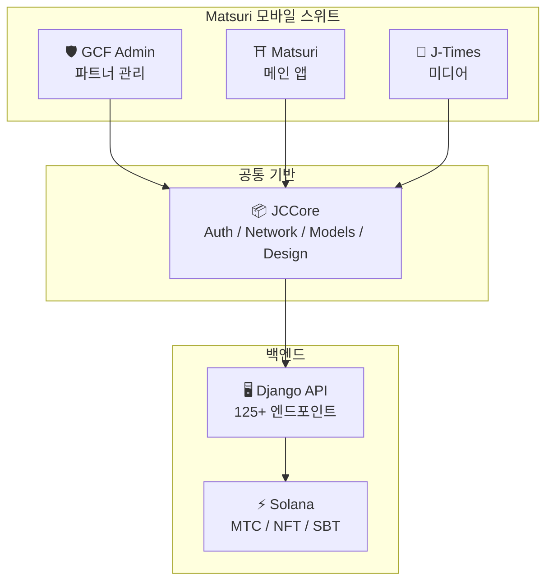
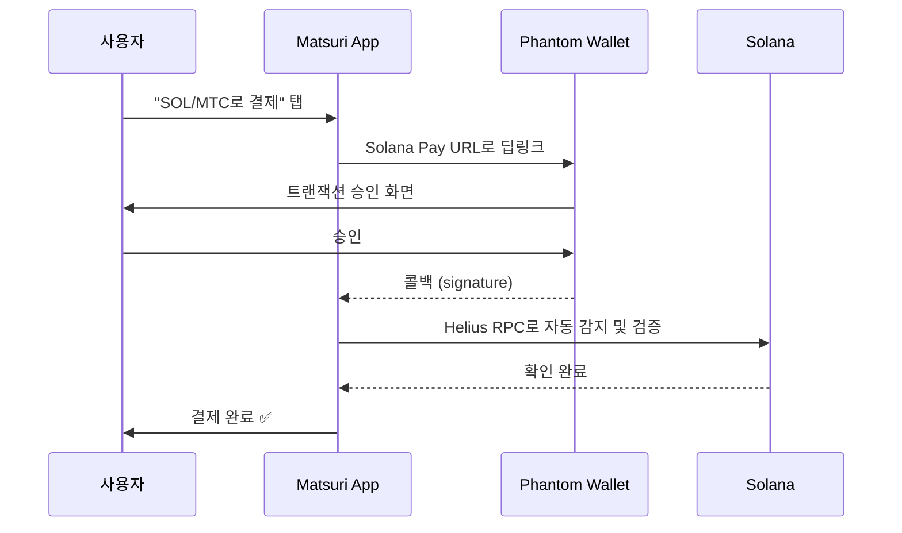
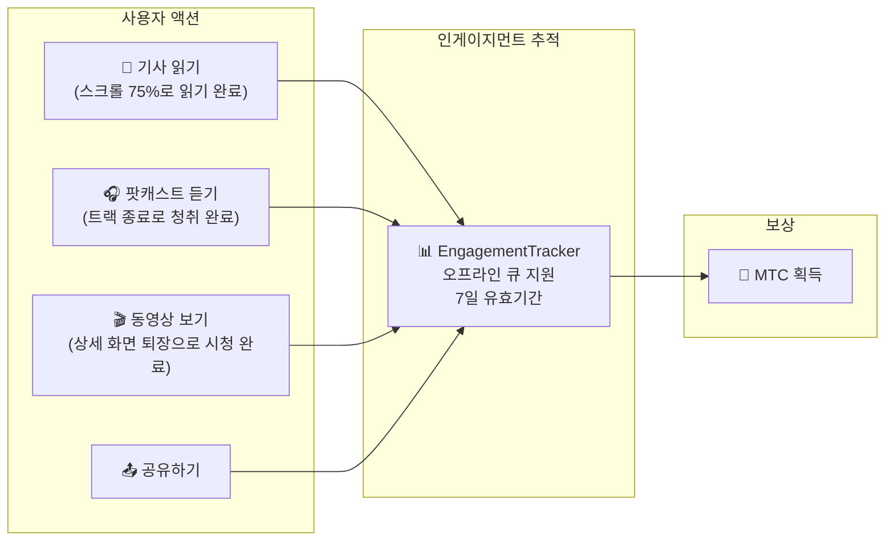
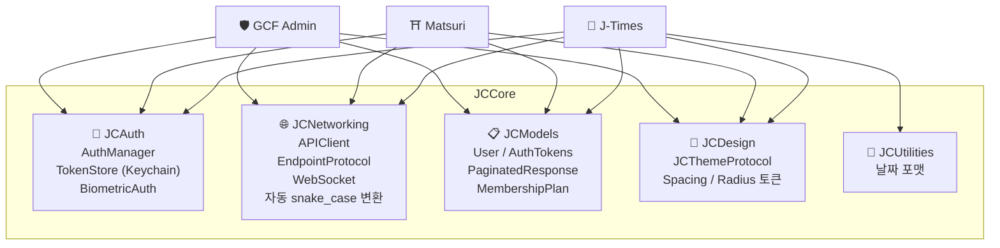

# 📱 모바일 앱 스위트

> **Matsuri 생태계의 모든 레이어를 커버하는 세 가지 네이티브 iOS 앱.**
> Swift 6 / iOS 17+로 완전히 구축. 공유 **JCCore** 라이브러리를 통해 인증, 네트워킹, 디자인을 통합.

:::tip 투자자에게 중요한 이유
대부분의 Web3 프로젝트는 웹사이트와 백서만 있습니다. Matsuri는 **3개의 프로덕션 iOS 앱과 827개 이상의 자동화 테스트**, 공유 인프라, 네이티브 Solana 통합을 보유하고 있습니다. 이는 토큰 업계에서 보기 드문 실행 깊이입니다.
:::

---

## 앱 개요

| 앱 | 용도 | 상태 | 언어 |
| :--- | :--- | :---: | :--- |
| **GCF Admin** | 파트너 관리 및 운영 | ✅ 출시 완료 | 🇯🇵🇬🇧🇨🇳🇹🇭🇳🇴 |
| **Matsuri** | 소비자 대상 메인 앱 | 🔜 2026년 4월 하순 | 🇯🇵🇬🇧🇨🇳🇹🇭🇳🇴 |
| **J-Times** | 문화 미디어 및 학습 | 🔜 2026년 4월 하순 | 🇯🇵🇬🇧 |

---

## 1. 🛡️ GCF Admin — 파트너 관리 앱

:::info 상태: App Store 출시 완료 (v1.0)
GCF (Global Community Friends) 멤버를 위한 업무 관리 앱. 웹 관리 화면의 모든 기능을 모바일에 집약.
:::

  
  
  

### 이 앱으로 할 수 있는 것

| 카테고리 | 기능 |
| :--- | :--- |
| **📊 대시보드** | KPI 카드, 매출 차트, 빠른 액션 |
| **👥 멤버 관리** | 목록・상세・편집・등급 관리 |
| **💰 수익 관리** | 커미션 추적, MTC 출금 관리, 지급 관리 |
| **📝 콘텐츠 관리** | 이벤트・기사・팟캐스트・동영상 생성・편집・게시 |
| **🎫 가이드 슬롯** | 가이드 자리 관리, 수익 추적 |
| **🖼️ NFT 대시보드** | Founder's Collection, 온체인 확인, NFT 전송 |
| **⛩️ 성지 관리** | 사이트 CRUD, 비콘 설정 |
| **🎲 AR 마이닝 설정** | 오미쿠지 확률 테이블, 보상 파라미터 관리 |
| **📊 분석** | 오류 보고, 사용 현황 분석 |
| **🔗 리퍼럴** | 커스텀 QR 코드 생성, 추천 프로그램 관리 |

### 기술 사양

| 항목 | 상세 |
| :--- | :--- |
| **아키텍처** | Clean Architecture + MVVM + `@Observable` (iOS 17) |
| **언어 / SDK** | Swift 6.0 / Xcode 16+ / iOS 17.0+ |
| **API 연동** | 125개 이상의 엔드포인트 |
| **테스트** | 226개 테스트 / 45개 테스트 클래스 |
| **로컬라이제이션** | 5개 언어 (일영중태노) / 957개 이상의 번역 키 |
| **Swift Concurrency** | Strict Concurrency 준수 / 빌드 경고 제로 |

### QR 코드 통합

GCF Admin에서는 Matsuri 로고가 들어간 커스텀 QR 코드를 생성할 수 있습니다. 이벤트 초대, 리퍼럴 링크, 결제 요청 등 다양한 용도에 대응합니다.

---

## 2. ⛩️ Matsuri — 메인 앱

:::info 상태: 2026년 4월 하순 출시 예정 (v3.0)
일반 사용자를 위한 메인 앱. 이벤트 예약, 결제, Web3 지갑, AR 마이닝까지 모든 것을 하나의 앱에서 완결.
:::

  
  
  

### 이 앱으로 할 수 있는 것

| 카테고리 | 기능 |
| :--- | :--- |
| **🎪 이벤트 예약** | 검색・예약・Stripe 결제・티켓 QR 관리 |
| **💳 4가지 결제 수단** | 신용카드 / 저장된 카드 / MTC 잔액 / 암호화폐 (SOL/MTC) |
| **👛 Web3 지갑** | MTC 잔액 표시, 송수신, 거래 이력 |
| **🖼️ NFT 갤러리** | 보유 NFT/SBT 목록, 온체인 확인 |
| **🗺️ 성지 지도** | 신사・사찰 지도 표시, 체크인 |
| **🎲 AR 마이닝** | WebAR 오미쿠지 체험, MTC 획득 |
| **💬 채팅** | 컨텍스트 메뉴 지원 메시징 |
| **⭐ 위시리스트** | 즐겨찾기 이벤트・체험 저장 |
| **🔍 고급 검색** | 음성 검색 지원 |
| **🤝 리퍼럴** | 추천 프로그램 참여, 보상 추적 |
| **📊 GCF 대시보드** | GCF 멤버용 간이 관리 화면 |

### Phantom Wallet 연동 — 입력 제로의 암호화폐 결제

> **주소 복사 붙여넣기 제로.** Phantom Wallet이 자동으로 열리고, 사용자가 승인하면 결제가 완료됩니다. 트랜잭션 서명은 Helius RPC를 통해 자동 감지됩니다 — 시장에서 가장 매끄러운 암호화폐 결제 UX입니다.

:::tip 이것이 중요한 이유
대부분의 Web3 앱은 사용자에게 지갑 주소를 복사하고, 수동으로 금액을 입력하고, 확인을 기다리도록 합니다. Matsuri의 Solana Pay 통합은 이를 **한 번의 탭**으로 줄여줍니다 — 온체인 결제이면서 Apple Pay의 UX에 맞먹습니다.
:::

### 기술 사양

| 항목 | 상세 |
| :--- | :--- |
| **아키텍처** | Clean Architecture + MVVM + Swift Concurrency |
| **언어 / SDK** | Swift 6.0 / Xcode 16+ / iOS 17.0+ |
| **결제** | Stripe PaymentSheet + MTC Balance + Phantom (Solana Pay) |
| **API 연동** | 72개 엔드포인트 / 16개 카테고리 |
| **테스트** | 230개 이상 (Model, ViewModel, Network, Security, DeepLink, E2E) |
| **로컬라이제이션** | 5개 언어 (일영중태노) / 406개 번역 키 |
| **ViewModel 수** | 25 (완전 MVVM — View에서 직접 API 호출 제로) |
| **인증** | Apple Sign In / Google Sign In (PKCE) |

---

## 3. 📰 J-Times — 문화 미디어 앱

:::info 상태: 2026년 4월 하순 출시 예정
일본 문화의 깊이를 전하는 미디어 플랫폼. 기사를 읽고, 팟캐스트를 듣고, 동영상을 보는 — 모든 행동으로 MTC를 획득.
:::

  

### 이 앱으로 할 수 있는 것

| 카테고리 | 기능 |
| :--- | :--- |
| **📖 기사** | 패럴랙스 히어로, 드롭캡, 읽기 진행률 바, 리치 콘텐츠 (Markdown, 테이블, 인용) |
| **🎧 팟캐스트** | 시리즈 브라우징, 파형 플레이어, 슬립 타이머, AirPlay, 잠금 화면 컨트롤 |
| **🎬 동영상** | 어댑티브 그리드/리스트 표시, 쇼트 동영상 (TikTok 스타일, 더블 탭) |
| **🔍 검색** | 멀티 필터, 트렌드 태그, 음성 검색 |
| **🧭 디스커버리** | 피처 캐러셀, 스태프 픽, 이번 주 인기 |
| **📚 라이브러리** | 즐겨찾기, 이력 (날짜별), 다운로드, 플레이리스트 |
| **🎵 오디오 플레이어** | 미니 플레이어 (스와이프 조작), 풀 플레이어 (파형, 가사, 반복) |
| **👤 멤버십** | 3등급 (Free / Premium / Pro) 기능 비교, 구매 복원 |

### Media Mining — 읽기・듣기・보기가 마이닝이 된다

> **오프라인에서도 기록됩니다.** 전파가 닿지 않는 깊은 산속의 신사에서 기사를 읽어도, 네트워크 복귀 시 자동으로 인게이지먼트가 전송되어 MTC가 부여됩니다.

### 디자인 시스템 — 일본 미학 "네 기둥"

J-Times는 일본의 전통적인 미학을 현대 UI에 녹여낸 독자적인 디자인 시스템을 채택합니다.

| 기둥 | 개념 | UI 적용 |
| :--- | :--- | :--- |
| **墨 (Sumi)** | 따뜻한 뉴트럴 그레이 | 배경색, 텍스트 계층 |
| **朱 (Shu)** | 일본의 빨강 (#C53030) | 액센트 컬러, 중요 액션 |
| **間 (Ma)** | 4pt 그리드 여백 | 스페이싱, 여유감 |
| **紙 (Kami)** | 미세한 텍스처, 글래스모피즘 | 카드 표면, 깊이 표현 |

### 기술 사양

| 항목 | 상세 |
| :--- | :--- |
| **아키텍처** | Clean Architecture + MVVM + Swift Concurrency |
| **언어 / SDK** | Swift 6.0 / Xcode 16+ / iOS 17.0+ |
| **외부 의존성** | **제로** — Apple 순정 프레임워크만 사용 |
| **API 연동** | 40개 이상의 엔드포인트 |
| **테스트** | 371개 테스트 / 20개 파일 |
| **로컬라이제이션** | 2개 언어 (일영) / 310개 이상의 번역 키 |
| **오프라인 지원** | ContentCache (50MB) + ImageDiskCache (200MB) + 다운로드 매니저 |
| **인증** | Apple Sign In / Google Sign In (PKCE) |

---

## 공통 기반: JCCore 라이브러리

세 앱 모두가 공유하는 Swift Package 라이브러리.

| 모듈 | 역할 |
| :--- | :--- |
| **JCAuth** | Keychain 기반 토큰 관리, 생체 인증 (Face ID / Touch ID) |
| **JCNetworking** | 타입 안전 API 클라이언트, WebSocket, 자동 JSON snake_case 변환 |
| **JCModels** | 앱 간 공유 데이터 모델 (User, AuthTokens 등) |
| **JCDesign** | 테마 프로토콜, 디자인 토큰 (스페이싱, 모서리 둥글기) |
| **JCUtilities** | 날짜・문자열 유틸리티 |

---

## 보안 및 프라이버시

| 항목 | 구현 |
| :--- | :--- |
| **인증 토큰** | iOS Keychain에 암호화 저장 (TokenStore) |
| **생체 인증** | Face ID / Touch ID를 통한 이중 인증 |
| **API 통신** | HTTPS + Certificate Pinning |
| **지갑 비밀키** | 앱 내에 비밀키를 저장하지 않음 — Phantom Wallet에 위임 |
| **AR 마이닝** | 카메라 이미지를 서버에 전송하지 않음 (VisionProof) |
| **오프라인 데이터** | SwiftData 암호화 + 자동 만료 |
| **Swift Concurrency** | Actor 격리를 통한 경쟁 상태 방지 |

---

## 개발 품질

세 앱 합계 **827개 이상의 자동화 테스트** 구현.

| 앱 | 테스트 수 | 커버리지 영역 |
| :--- | :---: | :--- |
| **GCF Admin** | 226 | Model, ViewModel, Repository, API, Localization, Navigation |
| **Matsuri** | 230+ | Model, ViewModel, Network, Security, DeepLink, Regression, Performance, E2E |
| **J-Times** | 371 | Model, ViewModel, API, Repository, Navigation, Localization, Security, Performance |

---

**[▶ 다음: 로드맵 & 팀](/docs/roadmap)** ｜ **[◀ 이전: 생태계 & 마이닝](/docs/ecosystem)**
