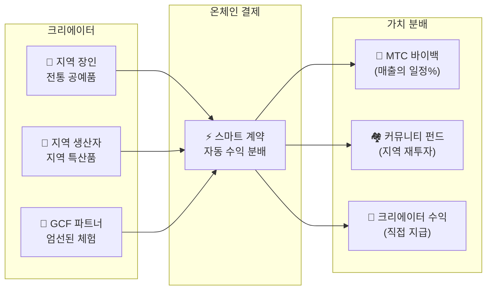

# 🗓️ 로드맵과 거버넌스

> **확실성으로의 길.**
> 우리는 단기 투기 프로젝트가 아닙니다.
> **핵심 플랫폼 개발은 이미 완료**되었으며, 확장 페이즈에 진입했습니다.

---

## 전략 마일스톤

### 🔥 페이즈 1: 각성 (2026년 상반기 — 현재)

**테마: 기반 구축과 현금 흐름 확보**

프로덕트는 완성됨. CEO 직할 금융 시스템에 의한 수익화와 초기 유동성 확보에 집중합니다.

| 상태 | 마일스톤 | 상세 |
| :---: | :--- | :--- |
| ✅ | **프로덕트 완성** | Matsuri Webapp 및 GCF 관리 대시보드 가동 개시 |
| ✅ | **결제와 성장** | MTC 결제 기능 & 추천 에어드롭 기능 구현 완료 |
| ✅ | **미디어 시동** | J-Times(웹 & 팟캐스트) 배포 기반 구축 |
| ✅ | **제네시스** | 솔라나 체인에서 MTC 토큰 발행 |
| ✅ | **유동성 확보** | Raydium에 초기 유동성 풀 생성 완료 |
| ⬜ | **인센티브 시작** | 목표 APY 20% 유동성 마이닝 시작 |
| ⬜ | **시스템 시동** | Solana MEV/차익거래 봇 본가동 |
| ⬜ | **VIP 모집** | GCF 초기 VIP 멤버 20명 선발 완료 |

### 🚀 페이즈 2: 확장 (2026년 하반기)

**테마: 실물 자산과 어드벤처 마이닝**

완성된 Webapp을 풀 활용하여 물리적 거점과 '순례 기능'을 확충합니다.

| 상태 | 마일스톤 | 상세 |
| :---: | :--- | :--- |
| ⬜ | **신기능 릴리스** | 어드벤처 마이닝(순례) 구현·릴리스 |
| ⬜ | **해외 전개** | 아시아권(태국·대만 등) 제휴 거점 개척 & VIP 이벤트 개최 |
| ⬜ | **자산 운용** | 부동산·주식·암호자산 포트폴리오 구축 |
| ⬜ | **목표 달성** | 생태계 전체 자산 규모 **10억 엔 (~$6.5M)** |

### 🌊 페이즈 3: 순환 (2027년~)

**테마: 대규모 보급, 공동 창조 경제, 탈중앙화**

일반 공개, 온체인 마켓플레이스, 완전한 생태계 가동 페이즈입니다.

| 상태 | 마일스톤 | 상세 |
| :---: | :--- | :--- |
| ⬜ | **그랜드 오픈** | Matsuri App 전 세계 정식 릴리스 |
| ⬜ | **대해금 (2027/6/1)** | 창업자 락업 해제 + 마이닝 풀(5.5억 매) 가동 + 반감기 사이클 시작 |
| ⬜ | **공동 창조 마켓플레이스** | 지역 특산품 숍 + GCF 파트너 스토어 — MTC 자동 바이백 온체인 결제 |
| ⬜ | **크라우드펀딩 (NFT 권리 포함)** | 사용자가 Solana에서 문화 프로젝트에 출자. 후원자는 소유권, 수익 분배, 거버넌스 권리를 나타내는 NFT를 수령 |
| ⬜ | **온체인 결제** | 마켓플레이스의 모든 거래를 스마트 계약으로 결제 — 매출의 일정 비율이 MTC 바이백 풀로 자동 송금 |
| ⬜ | **목표 달성** | 생태계 전체 자산 규모 **100억 엔 (~$65M)** |
| ⬜ | **DAO 이행** | 의사결정 권한의 일부를 GCF 커뮤니티에 이양 |

#### 🏪 공동 창조 마켓플레이스 비전

"문화 OS"의 궁극적인 표현 — **문화 창작자와 문화 애호가가 직접 거래하는**, 착취적 중개자 없는 탈중앙 마켓플레이스입니다.

| 기능 | 설명 | 상태 |
| :--- | :--- | :---: |
| **🏺 지역 특산품 숍** | 장인과 지역 생산자가 전 세계 고객에게 직접 판매. MTC 결제 시 5~10% 할인 | ⬜ 비전 |
| **🎫 크라우드펀딩 + NFT 권리** | 문화 프로젝트(신사 복원, 축제 부흥, 장인 공방)에 출자. 기여를 증명하는 NFT를 수령 — 수익 분배 또는 거버넌스 권리 부여 가능 | ⬜ 비전 |
| **⚡ 온체인 결제** | 모든 마켓플레이스 거래가 Solana 스마트 계약으로 결제. 수익 자동 분배: 크리에이터 지급 + 커뮤니티 펀드 + MTC 바이백 — 수동 회계 불필요 | ⬜ 비전 |
| **🗳️ 후원자 거버넌스** | NFT 보유자가 출자한 프로젝트의 자원 배분에 투표 — 단순한 기부가 아닌 진정한 공동 창조 | ⬜ 비전 |

:::info 왜 이것이 중요한가
오늘날, 관광객은 플랫폼이라는 '임대인'에게 임대료를 내는 가게에서 기념품을 삽니다. 내일이면, **교토 시골의 장인이 코펜하겐의 팬에게 직접 판매**하고 — 그 매출의 일부가 자동으로 MTC 경제를 강화합니다. 이것이 플라이휠의 가장 완성된 형태입니다.
:::

---

## 👤 팀

### Ko Takahashi — 창업자 / CEO 겸 리드 아키텍트

| 항목 | 상세 |
| :--- | :--- |
| **역할** | 프로젝트 전체 총괄. 핵심 금융 알고리즘(Solana MEV 봇) 설계·개발 |
| **비전** | '문화를 수출하고, 부를 수입하는' 문화 OS의 제창자 |
| **자세** | 직접 코드를 짜고, 직접 현장(골든가이)에 서는 '몸으로 투자하는' 실천가 |

### Jon Anders Jensen

### Ryunosuke Honda

### 🌏 GCF 커뮤니티 — 전 세계 개발 기여자

Matsuri Protocol은 창업팀만으로 만들어진 것이 아닙니다.
**전 세계 GCF 멤버**가 테스트, 피드백, 번역, 지역 확장을 통해 프로토콜의 진화에 기여하고 있습니다.

| 영역 | 체제 |
| :--- | :--- |
| **💼 글로벌 금융** | 아시아권 프라이빗 투자자 네트워크와의 연계 |
| **⚙️ 엔지니어링** | 블록체인 & 모바일 앱 개발 분산형 엔지니어 팀 |
| **🏮 오퍼레이션** | 신주쿠 골든가이 & 주요 관광지 로컬 커뮤니티와의 강력한 파이프라인 |
| **🌐 커뮤니티** | 일본·노르웨이·태국·대만을 비롯한 다국적 GCF 멤버 |

:::tip 함께 만드는 문화의 인프라
GCF에 참여하면 당신도 Matsuri Protocol의 공동 개발자입니다.
코드를 쓰는 것만이 기여가 아닙니다 — 지역 성지를 소개하고, 문서를 번역하고, 이벤트를 기획하는 모든 활동이 이 프로토콜을 세계로 퍼뜨리는 힘이 됩니다.
:::

### 전략 파트너

| 영역 | 체제 |
| :--- | :--- |
| **💼 글로벌 금융** | 아시아권 프라이빗 투자자 네트워크와의 연계 |
| **⚙️ 엔지니어링** | 블록체인 & 모바일 앱 개발 분산형 엔지니어 팀 |
| **🏮 오퍼레이션** | 신주쿠 골든가이 & 주요 관광지 로컬 커뮤니티와의 강력한 파이프라인 |

---

## 🏛️ 거버넌스 (DAO)

Matsuri Protocol은 중앙집권에서 점진적으로 **탈중앙 자율 조직(DAO)**으로 이행합니다.
GCF 멤버(플래티넘/골드)는 장래에 다음 중요 사항에 대한 **투표권**을 갖습니다.

| 투표 사항 | 내용 |
| :--- | :--- |
| **💰 자금 배분** | 사업 수익을 어떤 신규 사업이나 마케팅에 투자할지 |
| **⚙️ 프로토콜 업데이트** | 앱의 수수료율과 마이닝 보상률 미세 조정 |
| **⛩️ 문화 인증** | 어떤 축제와 신사를 '공식 순례지'로 인증하고 자금 지원할지 |

:::info 혁명에 합류하세요
우리는 단순히 앱을 만드는 것이 아닙니다.
**'국경 없는 문화 경제권'**을 만들고 있습니다.
:::

---

**[◀ 백서 첫 페이지로 돌아가기](/docs/intro)** ｜ **[Discord 참여하기](#)**
