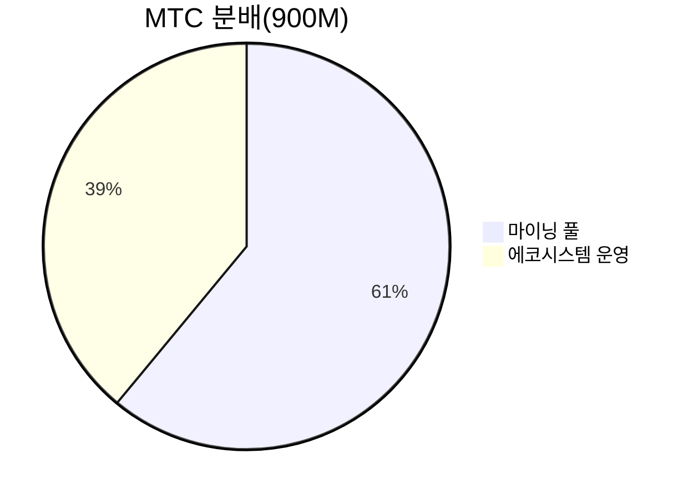
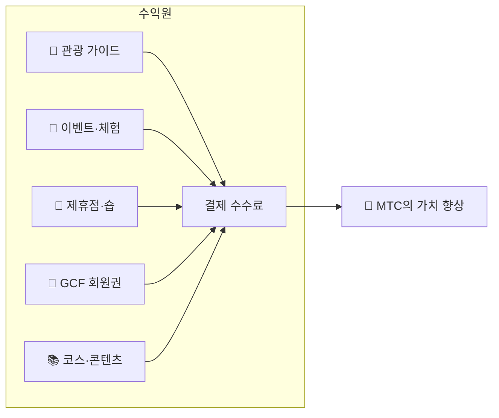

# 💰 토크노믹스——MTC의 경제 설계

> **신뢰는, 코드에 새겨져 있다.**
> MTC의 경제 설계는, 누군가의 약속이 아닌, 수학과 블록체인에 의해 보장됩니다.


> **"힘에 의한 현상 변경이 불가능한 경제 구조"——그것이 MTC의 토크노믹스입니다.**

Matsuri Coin(MTC)의 경제 설계는, 하나의 신념에 기초합니다.
**운영조차 변조할 수 없는 규칙이야말로, 투자자에게 최대의 안심 재료가 된다**는 것.

공급량은 영구히 고정. 추가 발행도 자금 동결도 불가능. 사업의 성장이 수식 레벨에서 가격에 반영된다——
이것은 "약속"이 아닌, 블록체인 위에 새겨진 **사실**입니다.

이 페이지에서는 MTC의 경제 메커니즘을 투명하게 모두 공개합니다.

---

## 토큰 사양

투자자의 안전을 보장하기 위해, Solana 위의 "민트 권한"과 "프리즈 권한"을 영구히 **포기**했습니다.
추가 발행은 영구히 불가능, 자금 동결도 불가능. **완전한 트러스트리스 설계**입니다.

| 항목 | 상세 |
| :--- | :--- |
| **토큰명** | Matsuri Coin |
| **티커** | MTC |
| **체인** | Solana |
| **민트 주소** | `DRENpzmRWM4TwECrCPCfS1k5VBPmanhQg9bcCWP8EZXF` [Solscan →](https://solscan.io/token/DRENpzmRWM4TwECrCPCfS1k5VBPmanhQg9bcCWP8EZXF) |
| **총 공급량** | **9억 개**(900,000,000 MTC) 고정 |
| **민트 권한** | 🚫 포기 완료([온체인에서 검증 가능](https://solscan.io/token/DRENpzmRWM4TwECrCPCfS1k5VBPmanhQg9bcCWP8EZXF)) |
| **프리즈 권한** | 🚫 포기 완료([온체인에서 검증 가능](https://solscan.io/token/DRENpzmRWM4TwECrCPCfS1k5VBPmanhQg9bcCWP8EZXF)) |
| **락 관리** | Streamflow Finance(검증 완료) |

:::info 왜 이것이 중요한가
민트 권한의 포기는 "운영이 멋대로 토큰을 찍어 당신의 보유분을 희석할 수 없다"는 것을 의미합니다. 프리즈 권한의 포기는 "당신의 지갑을 누구도 동결할 수 없다"는 것을 의미합니다. 이것이 트러스트리스(신뢰 불필요)의 근간입니다.
:::

---

## 토큰 분배

900M MTC의 분배는 다음과 같습니다.



| 구분 | 비율 | 수량 | 용도 |
| :--- | :---: | :--- | :--- |
| **⛏️ 마이닝 풀** | **61%** | 5억 5,000만 개 | 기여자에 대한 보상 풀. 2027년 6월 해금, 2년마다의 반감기로 방출. 기여 스코어에 따라 분배 |
| **🌐 에코시스템 운영** | **39%** | 3억 5,000만 개 | 마케팅, GCF 배포, 운영비, 유동성 풀(LP) 획득, 개발비, 광고비, 이벤트 개최비 등 |

:::note 마이닝 풀의 방출 제도
550M MTC는 일괄 방출되지 않습니다. 2년마다의 반감기 스케줄에 따라, **기여 스코어에 따라 단계적으로 분배**됩니다. 방출·분배 규칙은 2026년 후반에 순차적으로 스마트 컨트랙트로 구현되어, 온체인에서 검증 가능해집니다.
:::

:::note 에코시스템 운영 분량에 대해
39%의 운영 분량은, 에코시스템의 성장에 필요한 다목적 자금입니다. 구체적인 사용처에는 마케팅 활동, GCF 멤버에게의 초기 배포, Raydium 유동성 풀에의 제공, 개발 팀에의 보상, 광고 선전, 문화 체험 이벤트의 개최 비용 등이 포함됩니다. 사용처의 투명성은, DAO 이행 후에 커뮤니티 거버넌스의 대상이 될 예정입니다.
:::

---

## 수익 구조

MTC의 가치를 지탱하는 것은, **실업으로부터의 수익**입니다. 투기가 아닌, 현실의 경제 활동이 토큰의 가치를 뒷받침합니다.



| 수익원 | 내용 |
| :--- | :--- |
| **🏯 체험·가이드** | 관광 가이드, 문화 체험 이벤트로부터의 결제 수수료 |
| **🤝 GCF 회원권** | 멤버십 수수료 |
| **📚 콘텐츠** | 코스 수강료, 미디어 구독 |
| **🏪 마켓플레이스** | 제휴점·숍으로부터의 거래 수수료(순차적으로 확대) |

:::tip 실수요에 뒷받침된 성장
인바운드 관광객이 늘수록 외화가 유입되고, 에코시스템이 확대됩니다. MTC의 가치는 투기가 아닌, **문화를 체험하는 사람의 수**에 의해 결정됩니다.
:::

---

## 현재의 사업 실적

MTC의 경제권은 아직 초기 단계지만, 이미 실제 활동이 시작되었습니다.

| 지표 | 실적 |
| :--- | :--- |
| **이벤트 개최 횟수** | 50회 이상(테스트 운용) |
| **GCF 플래티넘 멤버** | 20명 참가 완료(50명 중) |
| **GCF 골드 멤버** | 이제부터 모집 개시 |
| **웹 플랫폼** | 가동 중. 테스트적으로 유저를 모으며 운용 중 |
| **iOS 앱** | 개발 완료, 2026년 4월 출시 예정 |

:::note 솔직히 말합니다
우리는 아직 "대성공의 실적"을 가지고 있지 않습니다. 50회의 이벤트와 테스트 운용——그것이 지금의 현실입니다. 그러나, 프로덕트는 움직이고 있고, 커뮤니티는 존재하며, 여기서부터 본격적으로 확대해 가는 페이즈에 있습니다.
:::

---

## 바이백 프로토콜

우리는 "벌면 운영의 주머니에 넣는" 일은 하지 않습니다.
사업 수익의 일정 비율을, MTC의 시장으로부터의 바이백에 충당하는 방침입니다.

| 수익원 | 환원율 | 액션 |
| :--- | :---: | :--- |
| **Matsuri 본부의 매출**(가이드·이벤트) | **20%** | 시장으로부터의 **바이백**과 유동성 풀 추가 |
| **GCF 회원권**(회원권 수수료) | **25%** | 시장으로부터의 **바이백** |

:::info 바이백의 현재 상태
바이백 프로토콜은, 사업 수익의 본격화에 맞추어 **이제부터 운용을 개시**합니다. 초기는 오프체인(수동)에서 실행하고, 2026년 후반 이후에 스마트 컨트랙트에 의한 자동 실행으로 단계적으로 이행합니다. 온체인화 후에는, 바이백의 실행 이력이 블록체인 위에서 누구나 검증 가능해집니다.
:::

바이백은 "언젠가 한다"는 약속이 아닙니다. 프로토콜로서 프로그램된 규칙입니다. 사업의 매출이 오를 때마다, 자동으로 MTC가 시장에서 흡수된다——이것이 투자자에게의 **구조적인 안심**입니다.

---

## 가격 결정 로직

MTC의 가격 상승 메커니즘은, 희망적 관측이 아닌 **AMM(자동 마켓 메이커)의 수식**에 기초합니다.

```
가격 = 유동성(SOL) ÷ 공급량(MTC)
```

| 단계 | 무엇이 일어나는가 | 결과 |
| :---: | :--- | :--- |
| **①** | 사업 수익(SOL)이 풀에 주입된다 | **분자가 늘어난다** |
| **②** | 그 자금으로 MTC가 시장에서 바이백되어 소각된다 | **분모가 줄어든다** |
| **③** | 분자↑ × 분모↓ | **희소성이 높아지는 조건이 갖춰진다** |

:::info 메커니즘의 설명이며, 가격 보장이 아닙니다
이 수식은 "사업 수익이 계속되고, 바이백이 실행되는 경우에, 수급 균형이 희소성의 방향으로 움직인다"는 구조적인 설계를 보여 줍니다. 실제 가격은 시장의 수급, 외부 환경, 유동성 등 많은 요인에 좌우됩니다.
:::

---

## 반감기 스케줄

2027년 6월 1일에 락업이 해제되는 **5억 5,000만 개(총 공급의 약 61%)** 의 MTC는, 시장에 매각되는 것이 아닌 **기여자에의 보상 풀**로서 확보됩니다.

비트코인의 4년 주기보다 빠른 **2년마다의 반감기**를 채용하고 있습니다.
2년마다 방출량이 절반이 되어, 이론상 수십 년에 걸쳐 보상이 계속됩니다.

| 기간 | 방출 비율 | 방출 개수 | 누계 방출률 |
| :--- | :---: | :--- | :---: |
| **제1기** 2027 – 2029 | **50%** | 약 2.75억 개 | 50% |
| **제2기** 2029 – 2031 | **25%** | 약 1.37억 개 | 75% |
| **제3기** 2031 – 2033 | **12.5%** | 약 6,800만 개 | 87.5% |
| **제4기** 2033 – 2035 | **6.25%** | 약 3,400만 개 | 93.75% |
| **제5기 이후** | 반감 계속 | 점감 | → 100%에 점근 |

<small>*※ 수학적으로 100%에 도달하는 일은 없으며, 방출량은 한없이 제로에 가까워집니다. 비트코인과 같은 원리입니다.*</small>

:::tip 빨리 기여를 시작할수록, 더 많은 MTC를 받을 수 있습니다
반감기의 구조에 의해, 제1기(2027〜2029년)의 방출량이 가장 많고, 에포크가 진행할 때마다 1회당 방출 개수는 감소합니다. 즉, **이른 단계부터 기여 스코어를 쌓아 올린 사람이, 더 많은 MTC를 받는** 설계입니다.

기여 스코어에 반영되는 활동의 예:
- 이벤트의 작성·집객 실적
- 인기 가이드 코스의 운영
- 우수한 가이드의 추천·육성
- J-Times 콘텐츠의 열람 수·공유 수
- 성지 순례의 체크인 횟수

보상은 "참가한 순서"가 아닌 **"얼마나 기여했는가"** 로 결정됩니다.
:::

---

:::note 다음 페이지로
MTC의 경제 설계를 이해했다면, 다음은 **파트너로서 참가하는 방법**을 확인합시다.
**[GCF 멤버십 →](/docs/gcf)**
:::
