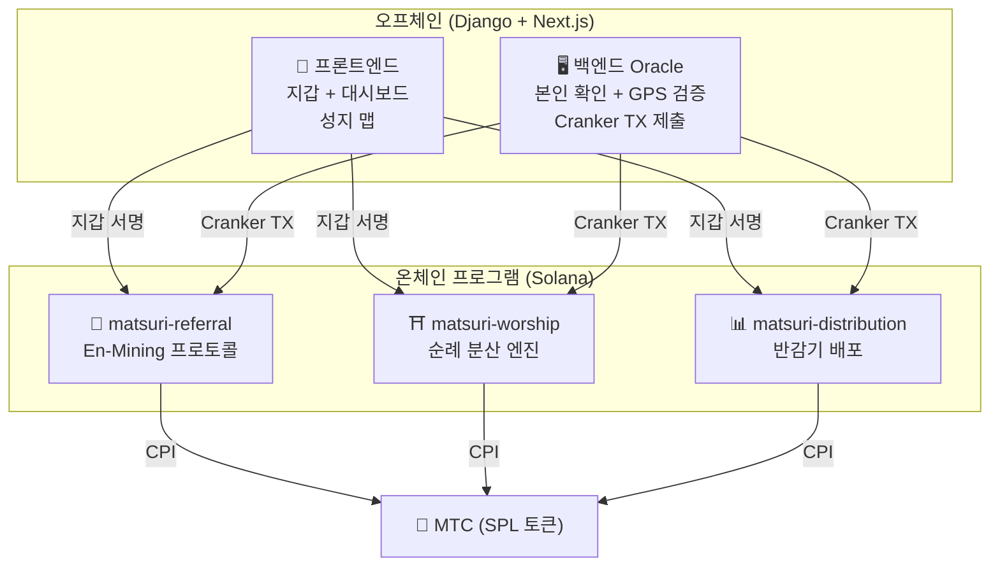
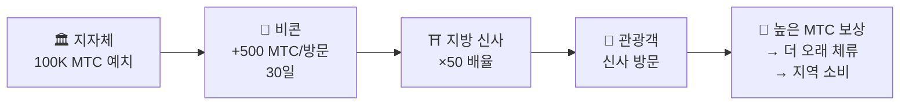
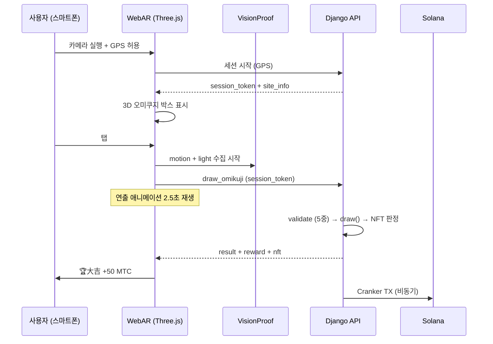

# ⚡ 스마트 컨트랙트 — 오픈 소스 아키텍처

> **무신뢰(Trustless) 설계.**
> 보상 로직, 추천 트리, 반감기 스케줄 — 모든 것이 **온체인**에서 실행되며 누구나 감사할 수 있습니다.
> 소스 코드: [GitHub](https://github.com/matsuri-protocol/contracts)

---

## 개요

Matsuri는 **3개의 Anchor(Rust) 프로그램**을 Solana에 배포하여 생태계의 각 기둥을 담당합니다:



---

## 1. 📣 En-Mining (縁マイニング) 프로토콜

**목적:** '넓이(추천 네트워크)'와 '깊이(경제적 영향)'를 모두 보상하는 하이브리드 성장 엔진. 단순한 제휴 프로그램이 아닌, 현실 경제 활동이 온체인 가치를 창출하는 완전한 마이닝 프로토콜입니다.

### 스코어링 공식

```
S_final = S_raw × M_toku × B_title

where:
  S_raw   = 0.30 × 추천 수 + 0.70 × (거래량 / 10^9)
  M_toku  = f(스테이킹된 MTC) ∈ [1.0×, 10.0×]
  B_title = 1.0 + min(랭킹 시즌 수 × 0.05, 0.50)
```

| 구성 요소 | 가중치 | 목적 |
| :--- | :---: | :--- |
| **넓이** (추천 수) | 30% | 네트워크 도달 — 얼마나 많은 사람을 데려오는가 |
| **깊이** (결제 거래량) | 70% | 경제적 영향 — 단순 가입이 아닌 실제 구매 |
| **Toku 배율** | ×1–10 | MTC를 락업하여 마이닝 파워 강화 |
| **타이틀 부스트** | +5%/시즌 | 지속적인 상위 퍼포머에 대한 영구 보상 |

### Toku (徳) 스테이킹 티어

| 스테이킹 MTC | 배율 | 티어 |
| :--- | :---: | :--- |
| 0 | 1.0× | — |
| 1,000+ | 1.5× | 브론즈 |
| 10,000+ | 3.0× | 실버 |
| 100,000+ | 5.0× | 골드 |
| 1,000,000+ | 10.0× | 다이아몬드 |

### En no Banzuke (시즌 랭킹)

매 시즌(에포크)마다 최고 퍼포머가 랭킹됩니다:
- 상위 10%는 **에반젤리스트** 타이틀 획득 (영구 SBT 플래그)
- 매 랭킹 시즌마다 **+5% 마이닝 부스트** (누적, 상한: 50%)

### 반시빌 방어 (3중 계층)

| 계층 | 메커니즘 | 위치 |
| :--- | :--- | :--- |
| **본인 확인** | X/Twitter OAuth + SMS | 오프체인 (Django) |
| **온체인 게이트** | `is_verified = true` 프로필만 보상 획득 | 스마트 컨트랙트 |
| **깊이 가중치** | 점수의 70% = 실제 결제 → 봇은 아무것도 벌 수 없음 | 스코어링 엔진 |

---

## 2. ⛩️ 순례 분산 엔진 (Worship Routing Engine)

**목적:** **토큰 이코노믹스로 오버투어리즘을 해결하는 세계 최초의 ReFi 프로토콜.** 성지를 방문하면 MTC를 획득. 핵심은: *덜 방문된 곳일수록 기하급수적으로 더 많은 보상을 받습니다.*

:::tip 핵심 인사이트
'역방향 우버 서지 프라이싱' — 혼잡한 곳은 보상이 줄고, 프런티어 사이트는 보상이 올라갑니다. 관광객들은 **더 수익성이 높기 때문에** 스스로 덜 방문된 곳으로 이동합니다.
:::

### 6중 보상 공식

```
R_final = R_pioneer × M_dynamic × M_regional × M_streak × M_omikuji

where:
  R_pioneer  = daily_pool / visit_order     (조화 1/n 감쇠)
  M_dynamic  = 관리자 설정 ∈ [0.1×, 50×]
  M_regional = tier_table[tier] ∈ {1×, 2×, 5×, 10×}
  M_streak   = 1.0 + min(days × 0.02, 0.50)
  M_omikuji  = 운세 추첨 ∈ {1.0, 1.2, 1.5, 3.0}
```

### 계층 1: 파이오니어 보너스 (선행자 이익)

조화 감쇠 — 관광객을 분산시키는 수학:

| 방문 순서 | 1번째 대비 보상 | 실제 예시 (1000 MTC 풀) |
| :---: | :---: | :--- |
| 1번째 | 100% | 1,000 MTC |
| 5번째 | 20% | 200 MTC |
| 10번째 | 10% | 100 MTC |
| 100번째 | 1% | 10 MTC |

> **첫 번째 방문자 = 100번째 방문자보다 100배 높은 보상.** 비수기에 방문할 강력한 인센티브를 만들어냅니다.

### 계층 2: 동적 배율 (혼잡 분산)

GCF 관리자 패널을 통해 실시간 제어:

| 시나리오 | 배율 | 효과 |
| :--- | :---: | :--- |
| **과밀 관광** (아사쿠사 피크) | 0.1× | 90% 보상 감소 |
| **보통** | 1.0× | 표준 |
| **미방문** | 10× | 10배 보상 증가 |
| **프런티어 캠페인** | 50× | 최대 인센티브 |

### 계층 3: 지역 티어

| 티어 | 라벨 | 배율 | 예시 |
| :---: | :--- | :---: | :--- |
| 0 | 🏙️ 메이저 | 1× | 浅草寺, 清水寺, 伏見稲荷 |
| 1 | 🌆 중간 | 2× | 지방 一宮, 현청 소재지의 대사 |
| 2 | 🏞️ 지방 | 5× | 시골의 유서 깊은 고찰 |
| 3 | ⛰️ 비경 | 10× | 산속 영장, 외딴 섬의 성소 |

### 계층 4: 연속 보너스

연속일마다 +2%, 상한 +50%. 꾸준한 방문자를 보상합니다.

### 계층 5: 🎲 오미쿠지 프로토콜

| 결과 | 확률 | 배율 |
| :--- | :---: | :---: |
| 🏆 **大吉** | 5% | 3.0× |
| ✨ **吉** | 15% | 1.5× |
| 🌸 **小吉** | 30% | 1.2× |
| 🍃 **末吉** | 35% | 1.0× |
| 💀 **凶** | 15% | 1.0× |

### 계층 6: 스폰서 비콘 (B2B/B2G)

지방자치단체, 철도 회사, 관광청이 **MTC를 예치**하여 특정 사이트에 기간 한정 고보상 존을 생성할 수 있습니다.



> **B2B 수익 모델:** 스폰서가 MTC를 지불하여 관광객을 유도합니다. MTC 구매 압력 → 토큰 가치 상승. 모두가 이기는 구조.

---

## 3. 📊 반감기 배포

**목적:** 5.5억 MTC 마이닝 풀이 비트코인의 4년 주기보다 빠른 **2년 반감기 주기**로 수십 년에 걸쳐 배포됩니다.

### 반감기 스케줄

```
총 풀: 550,000,000 MTC

에포크 0 (2027–2029):  275,000,000 MTC  (50%)
에포크 1 (2029–2031):  137,500,000 MTC  (25%)
에포크 2 (2031–2033):   68,750,000 MTC  (12.5%)
에포크 3 (2033–2035):   34,375,000 MTC  (6.25%)
        ...              ...
∑ → 550,000,000 MTC (점근적 합계)
```

### 개인 보상 공식

```
your_reward = epoch_budget × (your_score / total_score)
```

모든 연산은 **128비트 중간 계산** 사용 — 오버플로우가 수학적으로 불가능합니다.

### 성과 점수 소스

| 활동 | 점수 가중치 |
| :--- | :--- |
| **가이드 세션 수행** | 높음 |
| **이벤트 티켓 판매** | 높음 |
| **추천 네트워크 활동** | 중간 |
| **참배 마이닝 방문** | 중간 |
| **미디어 참여** | 낮음 |

:::info 무허가 에포크 진행
`advance_epoch` 명령은 **누구나** 호출 가능 — 관리자가 필요 없습니다. 시스템 클록이 에포크 전환을 결정하여 팀이 사라져도 무신뢰 운영을 보장합니다.
:::

---

## 4. 🎴 AR 마이닝 — WebAR 오미쿠지 마이닝

**목적:** 스마트폰 브라우저만으로 현실 공간에 AR 오미쿠지를 출현시켜 MTC를 마이닝하는 경험. **앱 다운로드 불필요.** 신도의 정신성과 최첨단 기술이 융합된 세계 최초의 WebAR×블록체인 인프라입니다.

### 아키텍처



### Optimistic UI (대기 시간 제로)

| 단계 | 시간 | 처리 |
|---------|------|------|
| 탭 → 연출 시작 | 0ms | 프론트에서 즉시 애니메이션 재생 |
| API draw_omikuji | ~50ms | Django에서 추첨 + NFT 판정 |
| 연출 완료 | 2500ms | 결과 확정 완료 → 표시 |
| Solana TX | ~400ms | 백그라운드에서 전송 |

### 오미쿠지 확률 설정 (GCF 관리자)

Basis Points (10000 = 100%)로 0.01% 단위 정밀 제어.

| 등급 | 기본값 | 보상 배율 | NFT |
|------|-----------|---------|-----|
| 🏆 大吉 | 5.00% (500bp) | ×3.0 | ✅ |
| ✨ 吉 | 15.00% (1500bp) | ×1.5 | 선택 |
| 🌸 小吉 | 30.00% (3000bp) | ×1.2 | — |
| 🍃 末吉 | 35.00% (3500bp) | ×1.0 | — |
| 💀 凶 | 15.00% (1500bp) | ×1.0 | — |

### ZK-Proof of Vision (5중 검증)

GPS 위조 및 리플레이 공격을 다중 계층으로 배제. 프라이버시 보호를 위해 카메라 이미지는 전송하지 않습니다.

| Layer | 검증 내용 | 배점 |
|-------|---------|------|
| Temporal | 세션 시간 5-120초 | /20 |
| Motion | 자이로 분산 0.005-0.5 (손 떨림 자연도) | /20 |
| Light | 환경광×시간대 정합성 | /20 |
| HMAC | proof_hash 서명 검증 | /20 |
| Fingerprint | 디바이스 고유성 | /20 |
| **합계** | **PASS 임계값** | **60/100** |

### 보상 계산식

```
Reward = Base(10 MTC) × SiteMultiplier × OmikujiMult × TierMult

TierMult = { 메이저: 1.0, 중간: 2.0, 지방: 5.0, 비경: 10.0 }
```

---

## 수학 모듈 (오픈 소스 코어)

두 프로그램 모두 모든 스코어링/보상 수학을 **순수하고 감사 가능한 `math.rs` 모듈**로 분리하며:

- **부작용 없음** — I/O 없음, 할당 없음, 외부 호출 없음
- **문서화된 공식** — rustdoc의 LaTeX 스타일 표기법
- **오버플로우 분석** — 증명된 범위의 u128 중간값
- **종합 테스트** — 엣지 케이스, 경계 조건, 비율 검증

```rust
// 예: 파이오니어 보너스 (worship/math.rs에서)
#[inline]
pub fn pioneer_reward(daily_pool: u64, visit_order: u32) -> u64 {
    if visit_order == 0 { return 0; }
    (daily_pool as u128 / visit_order as u128) as u64
}
```

---

## 보안 모델 (오픈 소스)

이 컨트랙트는 **완전 오픈 소스**입니다. 보안은 불투명성이 아닌 수학적 보증에 의존합니다.

| 원칙 | 구현 |
| :--- | :--- |
| **PDA 전용 보관소** | 토큰 보관소는 PDA(프로그램 파생 주소)로 제어 — 인간의 키로는 인출 불가 |
| **체크드 연산** | 모든 계산에 `checked_*` 연산 사용 — 오버플로우 불가능 |
| **권한 분리** | 관리자(멀티시그) ≠ Cranker(제한 운영) ≠ 사용자(자기 관리) |
| **긴급 정지** | 관리자는 즉시 모든 프로그램 중단 가능; 자금 탈취는 불가 |
| **불변 토크노믹스** | 반감기 비율, 총 풀, 에포크 기간은 한 번 설정 후 변경 불가 |
| **순수 수학 모듈** | 스코어링/보상 로직은 감사·테스트 가능한 수학 라이브러리로 분리 |
| **Vision Proof** | 카메라 데이터 미전송의 5중 위조 방지 (프라이버시 보호) |

---

**[◀ 로드맵으로 돌아가기](/docs/roadmap)** ｜ **[소스 코드 보기](https://github.com/matsuri-protocol/contracts)**
