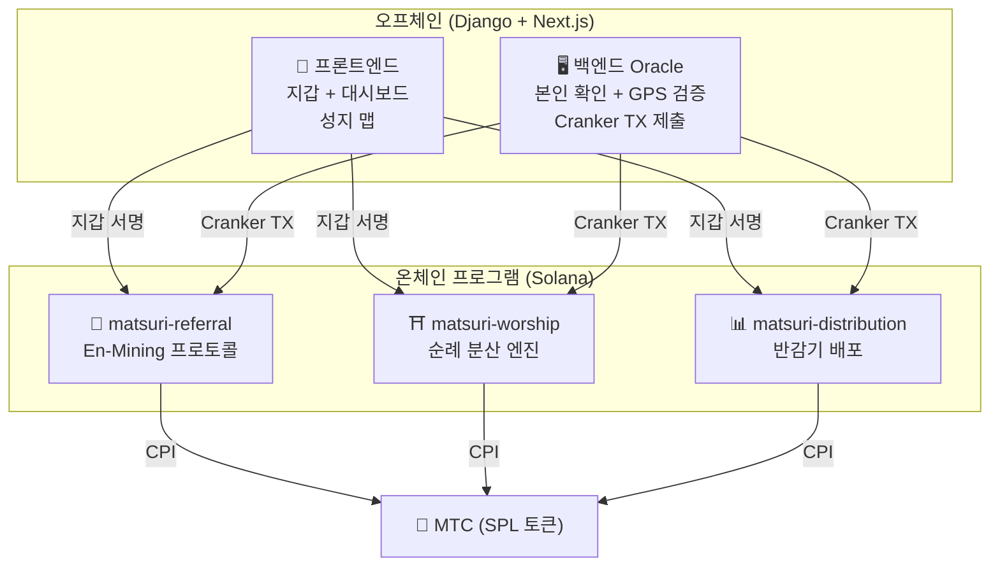
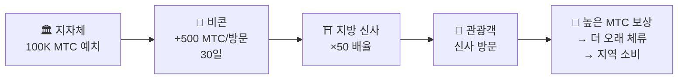
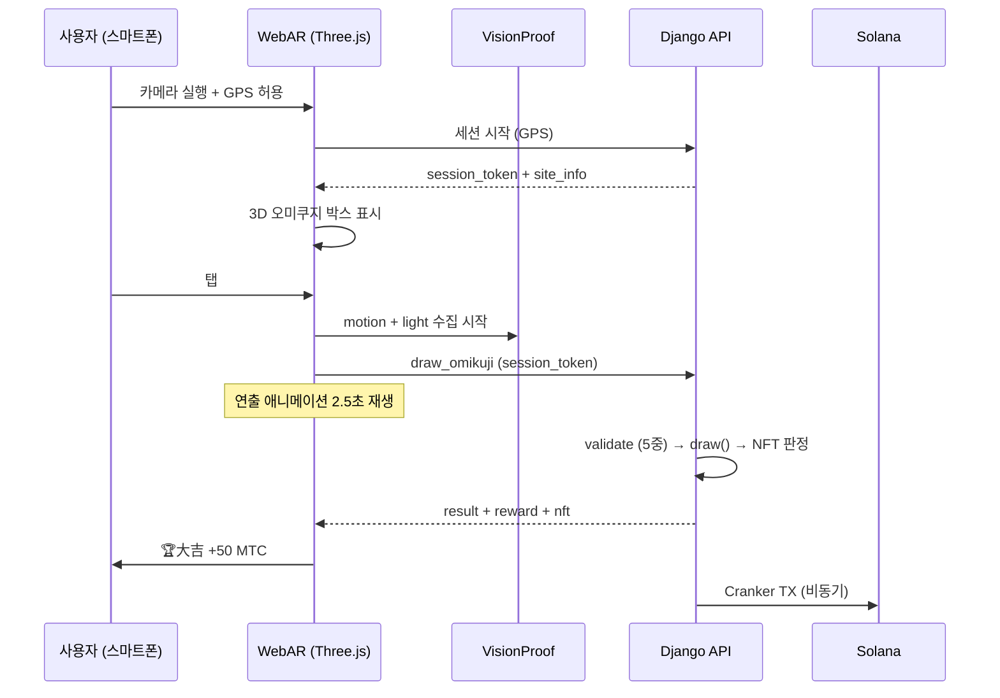

# ⚡ 스마트 컨트랙트 — 오픈 소스 아키텍처

> **무신뢰(Trustless) 설계.**
> 보상 로직, 추천 트리, 반감기 스케줄 — 모든 것이 **온체인**에서 실행되며 누구나 감사할 수 있습니다.
> 소스 코드: [GitHub](https://github.com/Cootakahashi/matsuri-contracts)

---

## 개요

Matsuri는 **3개의 Anchor(Rust) 프로그램**을 Solana에 배포하여 생태계의 각 기둥을 담당합니다:



---

## 1. 📣 En-Mining (縁マイニング) 프로토콜

**목적:** '넓이(추천 네트워크)'와 '깊이(경제적 영향)'를 모두 보상하는 하이브리드 성장 엔진. 단순한 제휴 프로그램이 아닌, 현실 경제 활동이 온체인 가치를 창출하는 완전한 마이닝 프로토콜입니다.

### 스코어링 설계

기여 점수는 두 가지 가중 구성 요소를 기반으로 합니다:

| 구성 요소 | 가중치 | 목적 |
| :--- | :---: | :--- |
| **넓이** (추천 수) | 30% | 네트워크 도달 — 얼마나 많은 사람을 데려오는가 |
| **깊이** (결제 거래량) | 70% | 경제적 영향 — 단순 가입이 아닌 실제 구매 |

점수는 시간이 지남에 따라 축적되며 각 반감기 에포크에서 MTC로 전환됩니다. 추가 부스트 메커니즘이 계획되어 있습니다:

| 부스트 | 설명 | 상태 |
| :--- | :--- | :---: |
| **Toku (徳) 스테이킹** | MTC를 잠금하여 기여 점수 부스트 (최대 약 50% 부스트). 티어와 정확한 배율은 반감기 풀 방출 일정에 따라 조정 | ⬜ 계수 미정 |
| **시즌 랭킹** | 각 에포크의 상위 퍼포머가 **에반젤리스트** 타이틀 (영구 SBT)과 점수 부스트 획득. 정확한 비율은 거버넌스를 통해 결정 | ⬜ 계수 미정 |

:::info 점진적 파라미터 설계
부스트 계수 (스테이킹 티어, 랭킹 보너스)는 의도적으로 조정 가능하게 설계되었습니다. 실제 생태계 데이터 — 총 활성 사용자 수, 반감기 풀 방출률, 가격 안정 목표 — 에 기반하여 확정된 후 스마트 컨트랙트에 잠금됩니다. 이 접근 방식은 고정 수익을 과도하게 약속하지 않으면서 **공정한 분배**를 보장합니다.
:::

### 반시빌 방어 (3중 계층)

| 계층 | 메커니즘 | 위치 |
| :--- | :--- | :--- |
| **본인 확인** | X/Twitter OAuth + SMS | 오프체인 (Django) |
| **온체인 게이트** | `is_verified = true` 프로필만 보상 획득 | 스마트 컨트랙트 |
| **깊이 가중치** | 점수의 70% = 실제 결제 → 봇은 아무것도 벌 수 없음 | 스코어링 엔진 |

---

## 2. ⛩️ 순례 분산 엔진 (Worship Routing Engine)

**목적:** **토큰 이코노믹스로 오버투어리즘을 해결하는 세계 최초의 ReFi 프로토콜.** 성지를 방문하면 MTC를 획득. 핵심은: *덜 방문된 곳일수록 기하급수적으로 더 많은 보상을 받습니다.*

:::tip 핵심 인사이트
'역방향 우버 서지 프라이싱' — 혼잡한 곳은 보상이 줄고, 프런티어 사이트는 보상이 올라갑니다. 관광객들은 **더 수익성이 높기 때문에** 스스로 덜 방문된 곳으로 이동합니다.
:::

### 보상 설계 원칙

각 방문의 기여 점수는 여러 요인에 의해 결정됩니다:

| 요인 | 원칙 | 효과 |
| :--- | :--- | :--- |
| **사이트 인기도** | 방문자가 적은 사이트일수록 높은 점수 | 관광객을 혼잡 지역에서 분산 |
| **방문 시간** | 당일 일찍 방문한 사람일수록 높은 점수 | 비수기 방문 장려 |
| **지역 티어** | 지방·프런티어 사이트가 최상위 | 지역 활성화 추진 |
| **방문 빈도** | 정기 방문자가 보너스 점수 축적 | 지속적 참여 보상 |
| **오미쿠지 운세** | 체크인마다 랜덤 보너스 추첨 | 재미있는 게이미피케이션 요소 |
| **스폰서 부스트** | 지자체가 특정 사이트를 부스트 가능 | B2B/B2G 수익 모델 |

:::info 계수는 조정 가능
각 요인의 정확한 배율 (예: 지방 사이트가 주요 사이트보다 얼마나 더 많이 벌 수 있는지)은 **반감기 풀 일정**과 실제 사용 데이터에 기반하여 **보정**된 후 단계적으로 스마트 컨트랙트에 잠금됩니다. 설계 원칙은 고정 — 계수는 생태계와 함께 진화합니다.
:::

### 스폰서 비콘 (B2B/B2G)

지방자치단체, 철도 회사, 관광청이 **MTC를 예치**하여 특정 사이트에 기간 한정 고보상 존을 생성할 수 있습니다.



> **B2B 수익 모델:** 스폰서가 MTC를 지불하여 관광객을 유도합니다. MTC 구매 압력 → 토큰 가치 상승. 모두가 이기는 구조.

---

## 3. 📊 반감기 배포

**목적:** 5.5억 MTC 마이닝 풀이 비트코인의 4년 주기보다 빠른 **2년 반감기 주기**로 수십 년에 걸쳐 배포됩니다.

### 반감기 스케줄

```
총 풀: 550,000,000 MTC

에포크 0 (2027–2029):  275,000,000 MTC  (50%)
에포크 1 (2029–2031):  137,500,000 MTC  (25%)
에포크 2 (2031–2033):   68,750,000 MTC  (12.5%)
에포크 3 (2033–2035):   34,375,000 MTC  (6.25%)
        ...              ...
∑ → 550,000,000 MTC (점근적 합계)
```

### 개인 보상 공식

```
your_reward = epoch_budget × (your_score / total_score)
```

모든 연산은 **128비트 중간 계산** 사용 — 오버플로우가 수학적으로 불가능합니다.

### 성과 점수 소스

| 활동 | 점수 가중치 |
| :--- | :--- |
| **가이드 세션 수행** | 높음 |
| **이벤트 티켓 판매** | 높음 |
| **추천 네트워크 활동** | 중간 |
| **참배 마이닝 방문** | 중간 |
| **미디어 참여** | 낮음 |

:::info 무허가 에포크 진행
`advance_epoch` 명령은 **누구나** 호출 가능 — 관리자가 필요 없습니다. 시스템 클록이 에포크 전환을 결정하여 팀이 사라져도 무신뢰 운영을 보장합니다.
:::

---

## 4. 🎴 AR 마이닝 — WebAR 오미쿠지 마이닝

**목적:** 스마트폰 브라우저만으로 현실 공간에 AR 오미쿠지를 출현시켜 MTC를 마이닝하는 경험. **앱 다운로드 불필요.** 신도의 정신성과 최첨단 기술이 융합된 세계 최초의 WebAR×블록체인 인프라입니다.

### 아키텍처



### Optimistic UI (대기 시간 제로)

| 단계 | 시간 | 처리 |
|---------|------|------|
| 탭 → 연출 시작 | 0ms | 프론트에서 즉시 애니메이션 재생 |
| API draw_omikuji | ~50ms | Django에서 추첨 + NFT 판정 |
| 연출 완료 | 2500ms | 결과 확정 완료 → 표시 |
| Solana TX | ~400ms | 백그라운드에서 전송 |

### 오미쿠지 확률 설정 (GCF 관리자)

Basis Points (10000 = 100%)로 0.01% 단위 정밀 제어. GCF 관리자 화면에서 조정 가능.

| 등급 | 희귀도 | 보너스 | NFT |
|------|-----------|---------|-----|
| 🏆 大吉 | 레어 | 최고 보너스 | ✅ |
| ✨ 吉 | 언커먼 | 높은 보너스 | 선택 |
| 🌸 小吉 | 커먼 | 소액 보너스 | — |
| 🍃 末吉 | 커먼 | 참여 기록 | — |
| 💀 凶 | 언커먼 | 참여 기록 | — |

확률과 보상 계수는 생태계 규모와 반감기 방출량에 기반하여 단계적으로 확정되어 스마트 컨트랙트에 구현됩니다.

### ZK-Proof of Vision (5중 검증)

GPS 위조 및 리플레이 공격을 다중 계층으로 배제. 프라이버시 보호를 위해 카메라 이미지는 전송하지 않습니다.

| Layer | 검증 내용 | 배점 |
|-------|---------|------|
| Temporal | 세션 시간 5-120초 | /20 |
| Motion | 자이로 분산 0.005-0.5 (손 떨림 자연도) | /20 |
| Light | 환경광×시간대 정합성 | /20 |
| HMAC | proof_hash 서명 검증 | /20 |
| Fingerprint | 디바이스 고유성 | /20 |
| **합계** | **PASS 임계값** | **60/100** |

### 보상 설계

보상은 사이트 유형, 오미쿠지 결과, 지역 티어 등 여러 요인에 기반한 **기여 점수**로 기록됩니다. 구체적인 계수는 반감기 방출 일정과 생태계 성장에 맞춰 단계적으로 확정되어 스마트 컨트랙트에 구현됩니다.

---

## 수학 모듈 (오픈 소스 코어)

모든 프로그램은 스코어링/보상 수학을 **순수하고 감사 가능한 `math.rs` 모듈**로 분리합니다:

- **부작용 없음** — I/O 없음, 할당 없음, 외부 호출 없음
- **문서화된 공식** — rustdoc의 LaTeX 스타일 표기법
- **오버플로우 분석** — 증명된 범위의 u128 중간값
- **종합 테스트** — 엣지 케이스, 경계 조건, 비율 검증
- **조정 가능한 계수** — 보상 파라미터는 거버넌스를 통해 업데이트 가능하도록 설계되어 생태계 성장에 따른 점진적 보정이 가능

---

## 보안 모델 (오픈 소스)

이 컨트랙트는 **완전 오픈 소스**입니다. 보안은 불투명성이 아닌 수학적 보증에 의존합니다.

| 원칙 | 구현 |
| :--- | :--- |
| **PDA 전용 보관소** | 토큰 보관소는 PDA(프로그램 파생 주소)로 제어 — 인간의 키로는 인출 불가 |
| **체크드 연산** | 모든 계산에 `checked_*` 연산 사용 — 오버플로우 불가능 |
| **권한 분리** | 관리자(멀티시그) ≠ Cranker(제한 운영) ≠ 사용자(자기 관리) |
| **긴급 정지** | 관리자는 즉시 모든 프로그램 중단 가능; 자금 탈취는 불가 |
| **불변 토크노믹스** | 반감기 비율, 총 풀, 에포크 기간은 한 번 설정 후 변경 불가 |
| **순수 수학 모듈** | 스코어링/보상 로직은 감사·테스트 가능한 수학 라이브러리로 분리 |
| **Vision Proof** | 카메라 데이터 미전송의 5중 위조 방지 (프라이버시 보호) |

---

**[◀ 로드맵으로 돌아가기](/docs/roadmap)** ｜ **[소스 코드 보기](https://github.com/Cootakahashi/matsuri-contracts)**
