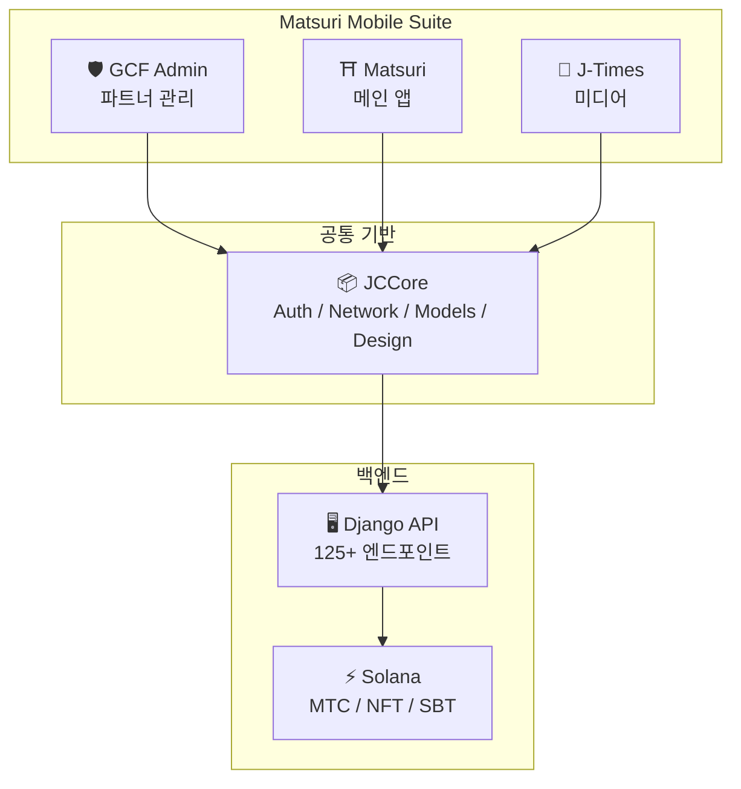
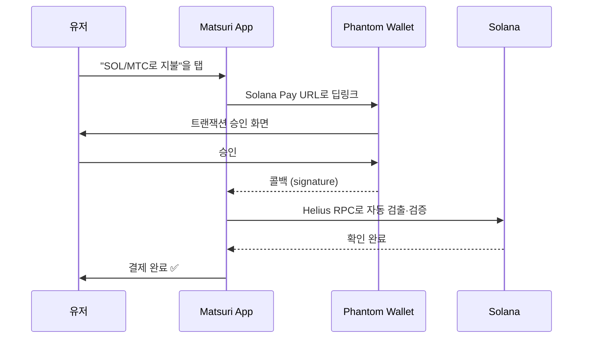
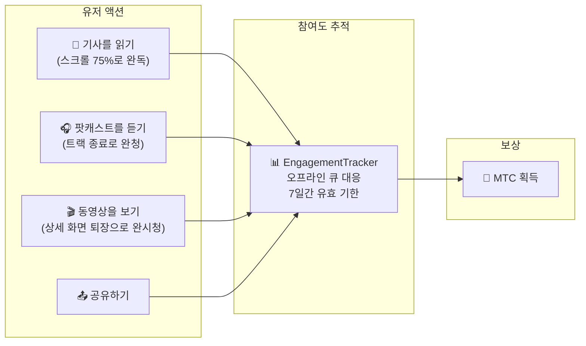
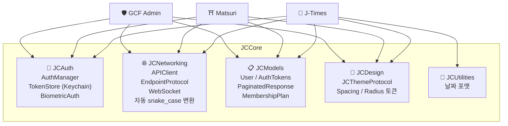
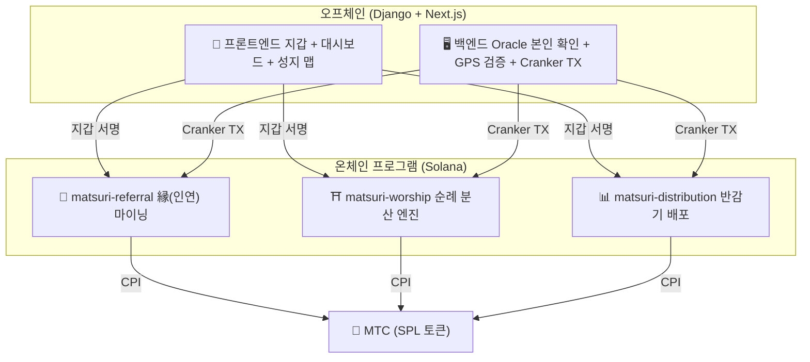
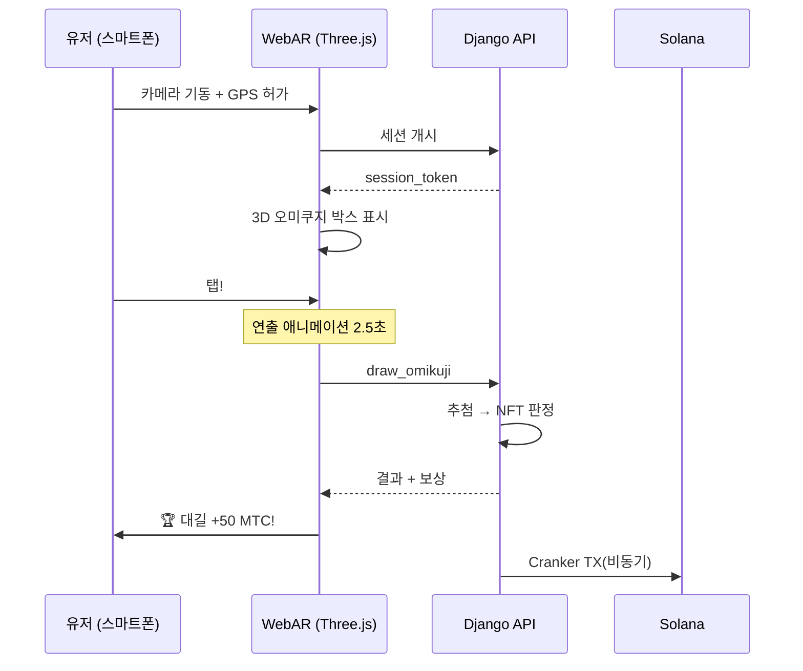

# 🔧 프로덕트와 기술——움직이는 것이 모든 것을 증명한다

> **움직이는 것이, 모든 것을 증명한다.**
> 우리의 뜻은 말뿐이 아닙니다. 웹 플랫폼은 이미 가동되고 있으며, iOS 앱은 최종 단계에 있습니다.

웹앱·관리 대시보드는 **실서비스 운용 중**. 3개의 네이티브 iOS 앱은 개발 완료되어 2026년 4월에 출시 예정. Solana 위의 스마트 컨트랙트는 오픈소스로 공개 완료——구상이 아닌, **움직이는 코드와, 곧 다다를 프로덕트**로 말합니다.

---

## 앱 일람

| 앱 | 용도 | 상태 | 대응 언어 |
| :--- | :--- | :---: | :--- |
| **GCF Admin** | 파트너 관리·운영 도구 | ✅ 출시 완료 | 🇯🇵🇬🇧🇨🇳🇹🇭🇳🇴 |
| **Matsuri** | 일반 유저용 메인 앱 | 🔜 2026년 4월 출시 | 🇯🇵🇬🇧🇨🇳🇹🇭🇳🇴 |
| **J-Times** | 컬처 미디어&학습 | 🔜 2026년 4월 출시 | 🇯🇵🇬🇧 |

---

## 1. 🛡️ GCF Admin — 파트너 관리 앱

:::info 상태: App Store 출시 완료 (v1.0)
GCF (Global Community Friends) 멤버를 위한 업무 관리 앱. 웹 관리 화면의 전 기능을 모바일로 집약.
:::

  
  
  

### 이 앱으로 할 수 있는 일

| 카테고리 | 기능 |
| :--- | :--- |
| **📊 대시보드** | KPI 카드, 매출 차트, 퀵 액션 |
| **👥 멤버 관리** | 일람·상세·편집·티어 관리 |
| **💰 수익 관리** | 커미션 추적, MTC 출금 관리, 페이아웃 관리 |
| **📝 콘텐츠 관리** | 이벤트·기사·팟캐스트·동영상의 작성·편집·공개 |
| **🎫 가이드 슬롯** | 가이드 분량 관리, 수익 트래킹 |
| **🖼️ NFT 대시보드** | Founder's Collection, 온체인 확인, NFT 전송 |
| **⛩️ 성지 관리** | 사이트의 CRUD, 비콘 설정 |
| **🎲 AR 마이닝 설정** | 오미쿠지 확률 테이블, 보상 파라미터 관리 |
| **📊 애널리틱스** | 에러 리포트, 이용 상황 분석 |
| **🔗 리퍼럴** | 커스텀 QR 코드 생성, 추천 프로그램 관리 |

### 기술 사양

| 항목 | 상세 |
| :--- | :--- |
| **아키텍처** | Clean Architecture + MVVM + `@Observable` (iOS 17) |
| **언어 / SDK** | Swift 6.0 / Xcode 16+ / iOS 17.0+ |
| **API 연계** | 125개 이상의 엔드포인트 |
| **테스트** | 226 테스트 / 45 테스트 클래스 |
| **로컬라이제이션** | 5개 언어 (일영중태노) / 957개 이상의 번역 키 |
| **Swift Concurrency** | Strict Concurrency 준거 / 빌드 경고 제로 |

### QR 코드 통합

GCF Admin에서는, Matsuri 로고가 달린 커스텀 QR 코드를 생성 가능. 이벤트 초대, 리퍼럴 링크, 결제 요청 등 다용도로 대응.

---

## 2. ⛩️ Matsuri — 메인 앱

:::info 상태: 2026년 4월 후반 출시 예정 (v3.0)
일반 유저용 메인 앱. 이벤트 예약, 결제, Web3 지갑, AR 마이닝까지, 모든 것을 하나의 앱으로 완결.
:::

  
  
  

### 이 앱으로 할 수 있는 일

| 카테고리 | 기능 |
| :--- | :--- |
| **🎪 이벤트 예약** | 검색·예약·Stripe 결제·티켓 QR 관리 |
| **💳 4가지 결제 수단** | 신용카드 / 저장된 카드 / MTC 잔액 / 암호자산 (SOL/MTC) |
| **👛 Web3 지갑** | MTC 잔액 표시, 송수신, 트랜잭션 이력 |
| **🖼️ NFT 갤러리** | 보유 NFT/SBT 일람, 온체인 확인 |
| **🗺️ 성지 맵** | 신사 불각의 지도 표시, 체크인 |
| **🎲 AR 마이닝** | WebAR 오미쿠지 체험, MTC 획득 |
| **💬 채팅** | 컨텍스트 메뉴 달린 메시징 |
| **⭐ 위시리스트** | 즐겨찾기 이벤트·체험의 저장 |
| **🔍 고급 검색** | 음성 검색 대응 |
| **🤝 리퍼럴** | 추천 프로그램 참가, 보상 추적 |
| **📊 GCF 대시보드** | GCF 멤버용 간이 관리 화면 |

### Phantom Wallet 연계 — 제로 입력의 암호자산 결제

>**유저는 주소의 복사·붙여넣기가 불필요.** Phantom Wallet이 자동으로 기동하고, 승인만으로 결제 완료. 트랜잭션 서명은 Helius RPC로 자동 검출된다.

### 기술 사양

| 항목 | 상세 |
| :--- | :--- |
| **아키텍처** | Clean Architecture + MVVM + Swift Concurrency |
| **언어 / SDK** | Swift 6.0 / Xcode 16+ / iOS 17.0+ |
| **결제** | Stripe PaymentSheet + MTC Balance + Phantom (Solana Pay) |
| **API 연계** | 72 엔드포인트 / 16 카테고리 |
| **테스트** | 230 이상 (Model, ViewModel, Network, Security, DeepLink, E2E) |
| **로컬라이제이션** | 5개 언어 (일영중태노) / 406 번역 키 |
| **ViewModel 수** | 25 (완전 MVVM — View로부터의 직접 API 호출 제로) |
| **인증** | Apple Sign In / Google Sign In (PKCE) |

---

## 3. 📰 J-Times — 컬처 미디어 앱

:::info 상태: 2026년 4월 후반 출시 예정
일본 문화의 심층을 전하는 미디어 플랫폼. 기사를 읽고, 팟캐스트를 듣고, 동영상을 본다 — 모든 액션으로 MTC를 획득.
:::

  

### 이 앱으로 할 수 있는 일

| 카테고리 | 기능 |
| :--- | :--- |
| **📖 기사** | 패럴랙스 히어로, 드롭 캡, 독서 진행 바, 리치 콘텐츠 (Markdown, 테이블, 인용) |
| **🎧 팟캐스트** | 시리즈 브라우징, 파형 표시 플레이어, 슬립 타이머, AirPlay, 잠금 화면 컨트롤 |
| **🎬 동영상** | 적응형 그리드/리스트 표시, 쇼트 동영상 (TikTok 스타일, 더블 탭) |
| **🔍 검색** | 멀티 필터, 트렌드 태그, 음성 검색 |
| **🧭 디스커버리** | 피처 캐러셀, 스태프 픽, 이번 주 인기 |
| **📚 라이브러리** | 즐겨찾기, 이력 (날짜별), 다운로드, 플레이리스트 |
| **🎵 오디오 플레이어** | 미니 플레이어 (스와이프 조작), 풀 플레이어 (파형, 가사, 리피트) |
| **👤 멤버십** | 3 티어 (Free / Premium / Pro)의 기능 비교, 구매 복원 |

### Media Mining — 읽고·듣고·보는 것이 마이닝이 된다

>**오프라인에서도 기록된다.** 전파가 닿지 않는 산속 신사에서 기사를 읽어도, 인터넷 복귀 시에 자동으로 참여도가 전송되어, MTC가 부여된다.

### 디자인 시스템 — 일본의 미의식 "사주(四柱)"

J-Times는 일본의 전통적인 미의식을 현대 UI에 녹여낸 독자적인 디자인 시스템을 채용.

| 기둥 | 개념 | UI에의 적용 |
| :--- | :--- | :--- |
| **墨 (Sumi, 먹)** | 따뜻함 있는 뉴트럴 그레이 | 배경색, 텍스트 계층 |
| **朱 (Shu, 주)** | 일본의 빨강 (#C53030) | 액센트 컬러, 중요 액션 |
| **間 (Ma, 사이)** | 4pt 그리드의 여백 | 스페이싱, 호흡감 |
| **紙 (Kami, 종이)** | 미세한 텍스처, 글래스모피즘 | 카드 표면, 깊이 표현 |

### 기술 사양

| 항목 | 상세 |
| :--- | :--- |
| **아키텍처** | Clean Architecture + MVVM + Swift Concurrency |
| **언어 / SDK** | Swift 6.0 / Xcode 16+ / iOS 17.0+ |
| **외부 의존** | **제로**— Apple 순정 프레임워크만 |
| **API 연계** | 40 이상의 엔드포인트 |
| **테스트** | 371 테스트 / 20 파일 |
| **로컬라이제이션** | 2개 언어 (일영) / 310 이상의 번역 키 |
| **오프라인 대응** | ContentCache (50MB) + ImageDiskCache (200MB) + 다운로드 매니저 |
| **인증** | Apple Sign In / Google Sign In (PKCE) |

---

## 공통 기반: JCCore 라이브러리

3개의 앱 모두가 공유하는 Swift Package 라이브러리.

| 모듈 | 역할 |
| :--- | :--- |
| **JCAuth** | Keychain 기반 토큰 관리, 생체 인증 (Face ID / Touch ID) |
| **JCNetworking** | 타입 안전한 API 클라이언트, WebSocket, 자동 JSON snake_case 변환 |
| **JCModels** | 앱 횡단의 공통 데이터 모델 (User, AuthTokens, etc.) |
| **JCDesign** | 테마 프로토콜, 디자인 토큰 (스페이싱, 각진 모서리) |
| **JCUtilities** | 날짜·문자열의 유틸리티 |

---

## 보안과 프라이버시

| 항목 | 구현 |
| :--- | :--- |
| **인증 토큰** | iOS Keychain에 암호화 저장 (TokenStore) |
| **생체 인증** | Face ID / Touch ID에 의한 이요소 인증 |
| **API 통신** | HTTPS + Certificate Pinning |
| **지갑 비밀 키** | 앱 내에 비밀 키를 저장하지 않음 — Phantom Wallet에 위임 |
| **AR 마이닝** | 카메라 이미지를 서버에 전송하지 않음 (VisionProof) |
| **오프라인 데이터** | SwiftData 암호화 + 자동 유효 기한 |
| **Swift Concurrency** | Actor 격리에 의한 경합 상태 방지 |

---

## 개발 품질

### 모바일 앱: 3개 앱 합계로 **827개 이상의 자동 테스트**를 구현.

| 앱 | 테스트 수 | 커버리지 영역 |
| :--- | :---: | :--- |
| **GCF Admin** | 226 | Model, ViewModel, Repository, API, Localization, Navigation |
| **Matsuri** | 230+ | Model, ViewModel, Network, Security, DeepLink, Regression, Performance, E2E |
| **J-Times** | 371 | Model, ViewModel, API, Repository, Navigation, Localization, Security, Performance |

### 스마트 컨트랙트: 테스트 구현을 순차적으로 확충 중

Solana 위의 Rust 프로그램에 대해서는, 코어 로직(수학 모듈)의 유닛 테스트부터 착수하고 있으며, 보안 감사(2026년 Q2〜Q3)를 향해 테스트 커버리지를 순차적으로 확충하고 있습니다.

---

## 스마트 컨트랙트 — 오픈소스 설계

>**신뢰 불필요(트러스트리스)의 설계 사상.**
> 보상 계산, 추천 트리, 반감기 스케줄 —— 모든 로직은 **온체인**에서 실행되며, 누구나 감사 가능합니다.
> 소스 코드: [GitHub](https://github.com/Cootakahashi/matsuri-contracts)

---

### Contributors

| 멤버 | 역할 |
| :--- | :--- |
| **Ko Takahashi** | Founder / Lead Developer — 아키텍처 설계, 스마트 컨트랙트, 풀스택 개발 |

> 🌏**향후, GCF 멤버와 전 세계의 개발자 커뮤니티도 공동 개발에 참여해 갑니다.**
> Matsuri Protocol은, "문화의 인프라"로서 영속적으로 기능하도록, 투명성과 공동 소유를 원칙으로 하고 있습니다.

---

### 전체 구성

Matsuri는 **3개의 Anchor(Rust) 프로그램**을 Solana 위에 배포하고, 에코시스템의 각 기둥을 담당합니다.

---

### 1. 📣 縁(인연) 마이닝 (En-Mining)

**목적:** "넓이(추천 네트워크)"와 "깊이(경제 임팩트)" 양쪽을 보상화하는 하이브리드 성장 엔진. 단순한 어필리에이트가 아닌, 현실 세계의 경제 활동이 온체인의 가치를 만들어 내는 완전한 마이닝 프로토콜입니다.

#### 스코어링 설계

기여 스코어는 2가지 가중 컴포넌트에 기초합니다:

| 컴포넌트 | 웨이트 | 목적 |
| :--- | :---: | :--- |
| **넓이**(추천 인원) | 30% | 네트워크의 도달 범위 — 몇 명을 데려왔는가 |
| **깊이**(결제 거래량) | 70% | 경제적 임팩트 — 단순한 사인업이 아닌 실제 구매 |

스코어는 시간이 지나면서 축적되고, 각 반감기 에포크에서 MTC로 변환됩니다. 추가적인 부스트 메커니즘을 예정하고 있습니다:

| 부스트 | 설명 | 상태 |
| :--- | :--- | :---: |
| **Toku(徳) 스테이킹** | MTC를 락해서 기여 스코어를 부스트(최대 약 50% 부스트). 티어와 정확한 배율은 반감기 풀 방출 스케줄에 기초하여 조정 | ⬜ 계수 미정 |
| **시즌 랭킹** | 각 에포크의 톱 퍼포머가 **에반젤리스트** 타이틀(영구 SBT)과 스코어 부스트를 획득. 정확한 비율은 거버넌스에서 결정 | ⬜ 계수 미정 |

:::info 프로그레시브 파라미터 설계
부스트 계수(스테이킹 티어, 랭킹 보너스)는 의도적으로 조정 가능하게 되어 있습니다. 실제의 에코시스템 데이터 — 총 액티브 유저 수, 반감기 풀 방출률, 가격 안정 목표 — 에 기초하여 확정되어, 스마트 컨트랙트에 록됩니다. 이 어프로치에 의해, 고정 리턴을 과도하게 약속하지 않고 **공정한 분배**를 보장합니다.
:::

#### 반(反) 시빌 방어(3층)

| 층 | 메커니즘 | 장소 |
| :--- | :--- | :--- |
| **본인 확인 게이트** | X/Twitter OAuth + SMS | 오프체인(Django) |
| **온체인 게이트** | `is_verified = true`인 프로필만 보상 획득 | 스마트 컨트랙트 |
| **깊이의 가중치** | 스코어의 70% = 실제 지불 → 봇은 아무것도 벌 수 없음 | 스코어링 엔진 |

---

### 2. ⛩️ 순례 분산 엔진 (Worship Routing Engine)

**목적:** 토큰 이코노믹스를 활용해 오버투어리즘을 해결하는 세계 최초의 **ReFi 프로토콜**. 성지를 방문해서 MTC를 획득. 단 중요한 것은: *방문자가 적은 사이트일수록 지수 함수적으로 많은 보상을 얻을 수 있습니다.*

:::tip 핵심 인사이트
"역 Uber 서지 프라이싱" — 붐비는 사이트는 페널티, 프런티어 사이트는 부스트. 관광객은 **더 수익성이 높기 때문에** 자발적으로 방문자가 적은 장소로 향합니다.
:::

#### 보상 설계의 원칙

각 방문의 기여 스코어는 복수의 요인으로 결정됩니다:

| 요인 | 원칙 | 효과 |
| :--- | :--- | :--- |
| **사이트의 인기도** | 방문자가 적은 사이트일수록 고스코어 | 관광객을 붐비는 에어리어에서 분산 |
| **방문 타이밍** | 그날의 이른 방문자일수록 고스코어 | 오프피크 방문을 촉진 |
| **지역 티어** | 지방·프런티어 사이트가 최상위 | 지방 창생을 추진 |
| **방문 빈도** | 정기적인 방문자가 보너스 스코어를 축적 | 지속적인 참여를 보상화 |
| **오미쿠지 운세** | 체크인마다 랜덤 보너스 추첨 | 즐거운 게이미피케이션 요소 |
| **스폰서드 부스트** | 지자체가 특정 사이트를 부스트 가능 | B2B/B2G 수익 모델 |

:::info 계수는 조정 가능
각 요인의 정확한 배율(예: 지방 사이트가 주요 사이트보다 얼마나 많이 벌 수 있는가)은, **반감기 풀 스케줄**과 실제의 이용 데이터에 기초하여 조정되어, 단계적으로 스마트 컨트랙트에 록됩니다. 설계 원칙은 고정 — 계수는 에코시스템과 함께 진화합니다.
:::

---

### 3. 📊 반감기 배포 (Halving Distribution)

**목적:** 비트코인에서 착안한 반감기 스케줄로, MTC의 배포를 에포크마다 자동으로 반감시킵니다. 수학적으로 보장된 희소성.

| 명령 | 설명 |
| :--- | :--- |
| `initialize` | 배포 풀의 초기화 |
| `register_miner` | 마이너의 등록 |
| `update_score` | 스코어의 갱신 |
| `advance_epoch` | 에포크의 진행(반감 실행) |
| `claim_distribution` | 배포 보상의 수령 |

---

### 4. 🎴 AR 마이닝 — WebAR 오미쿠지 체험

**목적:** 스마트폰의 브라우저만으로 현실 공간에 AR 오미쿠지를 출현시켜, MTC를 마이닝하는 체험. **앱 다운로드 불필요**. 신도의 정신성과 최첨단 기술이 융합한, 세계 최초의 WebAR × 블록체인 인프라입니다.

#### 아키텍처

#### 오미쿠지 확률 설정(GCF 관리자)

Basis Points (10000 = 100%)로 0.01% 단위의 정밀 제어. GCF 관리 화면에서 조정 가능.

| 등급 | 레어리티 | 보너스 | NFT |
|------|-----------|---------|-----|
| 🏆 대길 | 레어 | 최대 보너스 | ✅ |
| ✨ 길 | 언커먼 | 고보너스 | 임의 |
| 🌸 소길 | 커먼 | 소보너스 | — |
| 🍃 말길 | 커먼 | 참가 기록 | — |
| 💀 흉 | 언커먼 | 참가 기록 | — |

확률과 보상 계수는 에코시스템의 규모와 반감기의 방출량에 기초하여 단계적으로 확정되어, 스마트 컨트랙트에 구현됩니다.

#### ZK-Proof of Vision(5층 보안)

GPS 위조나 리플레이 공격을 다층으로 배제. **프라이버시 보호를 위해, 카메라 이미지는 서버에 전송하지 않습니다.**

| Layer | 검증 내용 | 배점 |
| :--- | :--- | :--- |
| Temporal | 세션 시간 5-120초 | /20 |
| Motion | 자이로의 자연스러움(손으로 들기 진동 검지) | /20 |
| Light | 환경 광×시간대의 정합성 | /20 |
| HMAC | proof_hash 서명의 검증 | /20 |
| Fingerprint | 디바이스의 일의성 | /20 |
| **합계** | **60/100 이상으로 PASS** | |

#### 보상 설계

보상은 사이트의 종류, 오미쿠지 결과, 지역 티어 등의 복수 요인에 기초한 **기여 스코어**로 기록됩니다. 구체적인 계수는 반감기의 방출 스케줄과 에코시스템의 성장에 맞추어 단계적으로 확정되어, 스마트 컨트랙트에 구현됩니다.

---

### Pure Math Modules(감사 가능한 코어 로직)

모든 프로그램은, 스코어링·보상 계산을 **순수하고 감사 가능한 `math.rs` 모듈**에 분리하고 있습니다:

- **부작용 제로** — I/O 없음, 메모리 확보 없음, 외부 호출 없음
- **문서화된 공식** — rustdoc 내의 LaTeX 스타일 표기
- **오버플로우 해석** — 증명된 범위의 u128 중간값
- **포괄적 테스트** — 엣지 케이스, 경계 조건, 비율 검증
- **조정 가능한 계수** — 보상 파라미터는 거버넌스를 통해 갱신 가능하게 설계되어 있으며, 에코시스템의 성장에 맞춘 단계적인 조정이 가능

---

### 보안 모델

본 컨트랙트는 **완전 오픈소스**입니다. 보안은 불투명성이 아닌, 수학적인 보장에 기초합니다.

| 원칙 | 구현 |
| :--- | :--- |
| **PDA 한정 금고** | 토큰 금고는 PDA(프로그램 파생 주소)로 제어 — 인간의 키로는 인출 불가 |
| **체크 부여 연산** | 모든 계산에 `checked_*` 연산을 사용 — 오버플로우 불가능 |
| **권한 분리** | 관리자(멀티시그) ≠ Cranker(한정 조작) ≠ 유저(자기 관리) |
| **긴급 정지** | 보안상의 위협에 대해서만 관리자가 프로그램을 일시 정지 가능. 단 **자금의 이동·탈취는 불가능**——정지는 "지키기 위한 방패"이며, 규칙 변경의 수단이 아님 |
| **불변의 토크노믹스** | 반감률·총 풀·에포크 기간은 초기 설정 후에 변경 불가 |
| **순수 수학 모듈** | 보상/스코어 로직은 분리된, 테스트 가능한 수학 라이브러리 |
| **Vision Proof** | 카메라 데이터 미전송의 5층 위조 검지(프라이버시 보호) |

---

**[▶ 다음: 로드맵 & 팀](/docs/roadmap)**｜**[◀ 이전: 토크노믹스](/docs/tokenomics)**
