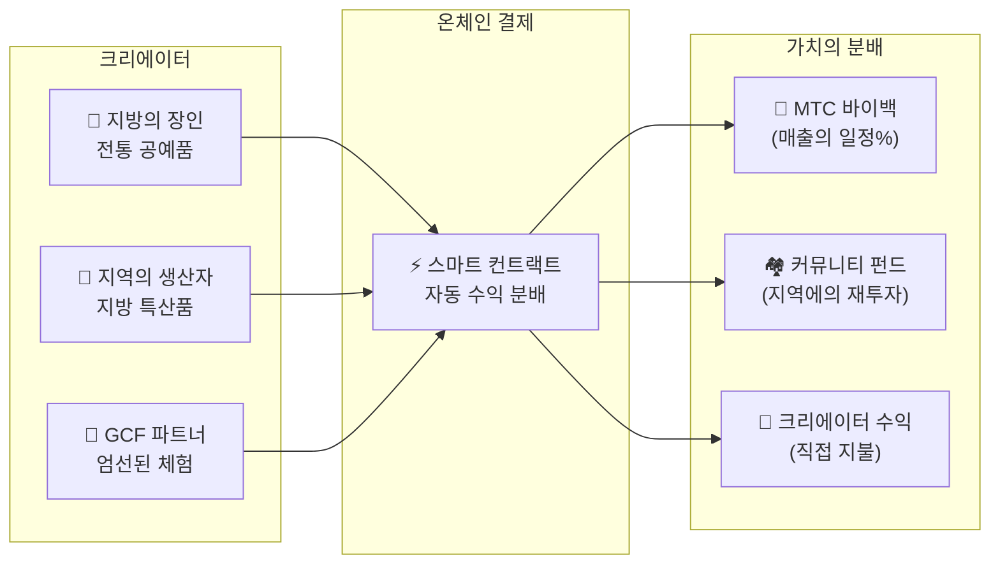

import useBaseUrl from '@docusaurus/useBaseUrl';

# 🗓️ 로드맵과 팀

>**여기까지 읽어 주신 분께——비전, 경제 설계, 기술 기반은 모두 갖추어져 있습니다.**
> 우리는 단기적인 투기 프로젝트가 아닙니다.
>**주요 플랫폼 개발은 이미 완료**되어 있으며, 이후에는 확대하는 페이즈에 들어가 있습니다.

---

## 전략 마일스톤

### 🔥 페이즈 1: 각성(2026년 전반 ── 현재)

**테마: 기반 구축과 캐시플로우의 확립**

웹 플랫폼은 가동 중이며, 세 개의 iOS 앱(GCF Admin·J-Times·Matsuri) 모두 App Store에 출시되었습니다(2026년 4월 시점). CEO 직할의 금융 시스템에 의한 수익화와 초기 유동성의 확보에 집중합니다.

| 상태 | 마일스톤 | 상세 |
| :---: | :--- | :--- |
| ✅ | **웹 플랫폼 가동** | Matsuri 웹앱, GCF 관리 대시보드(웹판)의 가동 개시 |
| ✅ | **결제와 성장** | MTC 결제 기능 & 추천 에어드랍 기능의 구현 완료 |
| ✅ | **미디어 시동** | J-Times(웹 & 팟캐스트) 배포 기반 구축 |
| ✅ | **제네시스** | Solana 체인에서의 MTC 토큰 발행 |
| ✅ | **유동성 확보** | Raydium에서 초기 유동성 풀 작성 완료 |
| ⬜ | **인센티브 개시** | 목표 연이율 20%의 유동성 마이닝 개시 |
| ⬜ | **온체인 결제** | Solana Pay 검증의 실서비스 운용 개시 |
| ⬜ | **VIP 회원 모집** | GCF 초기 VIP 멤버 20명의 선발 완료 |

### 🚀 페이즈 2: 확대(2026년 후반)

**테마: 리얼 자산과 어드벤처 마이닝**

완성된 웹앱을 풀 활용하여, 물리적인 거점과 "순례 기능"을 확충합니다.

| 상태 | 마일스톤 | 상세 |
| :---: | :--- | :--- |
| ⬜ | **신기능 출시** | 어드벤처 마이닝(순례)의 구현·출시 |
| ⬜ | **해외 전개** | 아시아권(태국·대만 등)에서의 제휴 거점 개척 & VIP 이벤트 개최 |
| ⬜ | **자산 운용** | 부동산·주식·암호자산 포트폴리오의 구축 |
| ⬜ | **목표 달성** | 에코시스템 전체의 자산 규모 **10억 엔**(약 90억 원) |

### 🌊 페이즈 3: 순환(2027년〜)

**테마: 대규모 보급, 공창 이코노미, 분산화**

일반 개방, 온체인 마켓플레이스, 완전한 에코시스템의 가동 페이즈입니다.

| 상태 | 마일스톤 | 상세 |
| :---: | :--- | :--- |
| ⬜ | **그랜드 오픈** | Matsuri App의 전 세계 정식 출시 |
| ⬜ | **대해금(2027/6/1)** | 창업자 락업 해제 + 마이닝 풀(5.5억 개) 가동 + 반감기 사이클 개시 |
| ⬜ | **공창 마켓플레이스** | 지방 특산품 숍 + GCF 파트너 스토어 ── MTC 자동 바이백 부여 온체인 결제 |
| ⬜ | **크라우드펀딩(NFT 권리 부여)** | 유저가 Solana 위에서 문화 프로젝트에 출자. 지원자는 소유권·수익 분배·거버넌스권을 나타내는 NFT를 받는다 |
| ⬜ | **온체인 결제** | 마켓플레이스의 전 거래를 스마트 컨트랙트로 결제 ── 매출의 일정 비율이 MTC 바이백 풀로 자동 송금 |
| ⬜ | **목표 달성** | 에코시스템 전체의 자산 규모 **100억 엔(〜$65M, 약 900억 원)** |
| ⬜ | **DAO 이행** | 의사 결정 권한의 일부를 GCF 커뮤니티로 이양 |

#### 🏪 공창 마켓플레이스 구상

"문화 OS"의 궁극적인 표현 ── **문화의 만드는 사람과 문화의 애호가가 직접 거래하는**, 착취적인 중개자 없는 분산형 마켓플레이스입니다.

| 기능 | 설명 | 상태 |
| :--- | :--- | :---: |
| **🏺 지방 특산품 숍** | 장인이나 지역의 생산자가 전 세계의 고객에게 직접 판매. MTC 결제로 5〜10% 할인 | ⬜ 구상 |
| **🎫 크라우드펀딩 + NFT 권리** | 문화 프로젝트(신사의 복구, 祭(마쓰리)의 부흥, 장인의 공방)에 출자. 기여를 증명하는 NFT를 받고, 수익 분배나 거버넌스 권리가 부여될 가능성 있음 | ⬜ 구상 |
| **⚡ 온체인 결제** | 모든 마켓플레이스 거래가 Solana 스마트 컨트랙트에서 결제. 수익은 자동 분배: 크리에이터에의 지불 + 커뮤니티 펀드 + MTC 바이백 ── 수동 경리 처리는 불필요 | ⬜ 구상 |
| **🗳️ 서포터 거버넌스** | NFT 보유자가, 출자한 프로젝트의 리소스 배분에 대해 투표 ── 단순한 기부가 아닌, 진정한 공창 | ⬜ 구상 |

:::info 왜 이것이 중요한가
오늘, 관광객은 플랫폼이라는 "지주"에게 테넌트 비용을 내는 가게에서 기념품을 삽니다. 내일에는, **교토 시골의 장인이 코펜하겐의 팬에게 직접 판매**하고, 그 매출의 일부가 자동으로 MTC 이코노미를 강화합니다. 이것이 플라이휠의 가장 완성된 형태입니다.
:::

---

## 👤 팀

  

### Ko Takahashi ── 창업자 / CEO 겸 리드 아키텍트

| 항목 | 상세 |
| :--- | :--- |
| **역할** | 프로젝트 전체 총괄. 플랫폼 설계·스마트 컨트랙트·풀스택 개발 |
| **비전** | "문화를 수출하고, 부를 수입한다" 문화 OS의 제창자 |
| **자세** | 스스로 코드를 쓰고, 스스로 현장(골든가이)에 서는 "자기 돈을 거는" 실천자 |

  

### Jon Anders Jensen ── 이사 / GCF·이벤트 오퍼레이션

| 항목 | 상세 |
| :--- | :--- |
| **역할** | GCF 운영 담당. 이벤트·투어의 오퍼레이션 설계와 현장 운영 |
| **강점** | 국제적인 시점과 GCF 멤버와의 신뢰 관계를 축으로, 에코시스템의 "사람"의 순환을 지탱한다 |

  

### Ryunosuke Honda ── 이사 / 지역 문화 대사

| 항목 | 상세 |
| :--- | :--- |
| **역할** | 일본 각지의 문화·커뮤니티와 Matsuri 에코시스템을 잇는 가교 |
| **강점** | 지역의 문화 자원을 발굴하고, Matsuri 플랫폼에 실음으로써 "딥 재팬" 체험을 실현한다 |

### 🌏 GCF 커뮤니티 ── 세계로 퍼지는 개발 멤버

Matsuri Protocol은, 창업 팀만으로 만들어지고 있는 것이 아닙니다.
**세계 각지의 GCF 멤버**가 테스트, 피드백, 번역, 지역 전개를 통해 프로토콜의 진화에 공헌하고 있습니다.

| 영역 | 체제 |
| :--- | :--- |
| **💼 글로벌 금융** | 아시아권의 프라이빗 투자자 네트워크와의 연계 |
| **⚙️ 엔지니어링** | 블록체인 & 모바일 앱 개발의 분산형 엔지니어 팀 |
| **🏮 오퍼레이션** | 신주쿠 골든가이 & 주요 관광지의 로컬 커뮤니티와의 견고한 파이프라인 |
| **🌐 커뮤니티** | 일본·노르웨이·태국·대만을 비롯한 다국적 GCF 멤버 |

:::tip 다 같이 만드는 문화의 인프라
GCF에 참여하면, 당신도 Matsuri Protocol의 공동 개발자입니다.
코드를 쓰는 것만이 공헌이 아닙니다. 지역의 성지를 소개하고, 문서를 번역하고, 이벤트를 기획한다 ──
모든 것이 이 프로토콜을 세계로 퍼뜨리는 힘이 됩니다.
:::

---

## 🏛️ 거버넌스(DAO)

Matsuri Protocol은, 중앙집권에서 서서히 **분산형 자율 조직(DAO)** 으로 이행합니다.
GCF 멤버(플래티넘/골드)는, 장래적으로 다음의 중요 사항에 대한 **투표권**을 가집니다.

| 투표 사항 | 내용 |
| :--- | :--- |
| **💰 자금 배분** | 사업 수익을 어느 신규 사업이나 마케팅에 투자할지 |
| **⚙️ 프로토콜 갱신** | 앱의 수수료율이나 마이닝 보상률의 미조정 |
| **⛩️ 문화 인정** | 어느 祭(마쓰리)나 신사를 "공식 순례지"로 인정하고, 자금 원조를 할지 |

:::info 혁명에 참가하자
우리는, 단순한 앱을 만들고 있는 것이 아닙니다.
**국경 없는 문화 경제권**을 만들고 있습니다.
:::

---

**[◀ 이전: 프로덕트와 기술](/docs/product-tech)**｜**[⛩️ 백서의 톱으로 돌아가기](/docs/intro)**
