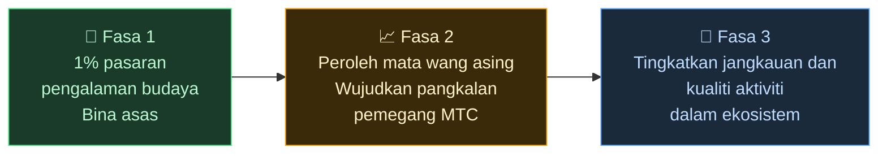

# 🌏 Cabaran & Penyelesaian — kebenaran tidak selesa, dan harapan

> **Misinya indah. Realiti menghalangnya.**

---

## Tetapi ada kebenaran tidak selesa yang menghalang misi ini

:::info Pasaran ¥10 trilion (~66 bilion $), dan tenaganya tidak sampai kepada orang yang membawa budaya
Pasaran inbound Jepun berkembang ke arah **¥10 trilion (~66 bilion $) setahun**.
Namun sangat sedikit daripada manfaat itu yang sampai ke lapangan.
:::

### Pasaran yang disasar MTC

Kami tidak cuba mengambil keseluruhan ¥10 trilion sekali gus.

Sasaran pertama kami dalam pasaran tersebut ialah segmen **pengalaman budaya, pemandu, dan tur tempatan.** Kami menetapkan **1% daripada segmen tersebut (sekitar ¥100 bilion / ~660 juta $)** sebagai matlamat awal: mula kecil, berkembang kuat.

| Fasa | Strategi | Matlamat |
| :--- | :--- | :--- |
| **Mula kecil** | Fokus pada pengalaman budaya dan tur berpemandu. Bina rekod dan berkembang dari mulut ke mulut | Membina asas pendapatan |
| **Berkembang kuat** | Bawa masuk mata wang asing (pendapatan inbound) dan buktikan mekanisme perkongsian pendapatan dengan pemegang MTC | Membina kepercayaan dalam ekonomi MTC |
| **Naikkan kualiti** | Setelah mencapai skala tertentu, berhenti mengejar pertumbuhan demi pertumbuhan; perdalamkan kualiti pengalaman, jangkauan aktiviti, dan komuniti dalam ekosistem | Ekonomi budaya yang mampan |

> **Berkembang melalui kualiti orang yang terlibat dan kedalaman pengalaman, bukan melalui isi padu.** Itulah strategi pengembangan MTC.

Platform Web2 telah membawa kegembiraan perjalanan kepada orang di seluruh dunia, dan kami amat berterima kasih atas apa yang mereka bina. Tetapi struktur berpusat datang dengan kesan sampingan yang tidak dapat dielakkan.

Algoritma yang menentukan apa yang dilihat. Pengendali dipaksa bersaing untuk penempatan. Satu ulasan boleh menyebabkan jualan goyah dengan ganasnya. Kadar komisen berubah mengikut kehendak platform — dan orang di lapangan hidup dalam ketakutan berterusan akan dipilih, atau hilang.

Apa yang dihasilkan struktur ini ialah perpecahan antara pengendali, dan kebimbangan terhadap peraturan yang tidak kelihatan.
Kedai sebelah menjadi pesaing; memagari pelanggan lebih masuk akal daripada bekerjasama. Pelancong pula hanya melihat pilihan yang diratakan menjadi "bilangan bintang" dan "kedudukan," dan pengalaman yang benar-benar berharga tertimbus.

:::danger Tiga masalah yang dialami lapangan
💸 **Pendapatan keluar** — sebahagian besar pendapatan mengalir keluar negara sebagai komisen kepada OTA dan perantara luar negara

😤 **Keletihan tempatan** — hanya beban overtourism yang tinggal; pendapatan yang penting tidak pernah kembali kepada komuniti

🚧 **Tembok pengalaman** — hanya tur dihomogenkan yang dipilih algoritma yang muncul, dan pelawat tidak pernah bertemu "Jepun yang sebenar"
:::

> **Orang Jepun bertungkus-lumus, pelancong tidak pernah bertemu perkara yang sebenar, dan kekayaan hilang ke dalam platform.**

---

## Jadi bagaimana kita mengubahnya?

Hari ini, teknologi untuk mengubah struktur ini dari akar umbinya akhirnya tiba.

:::tip Smart contracts — peraturan bersama yang tidak boleh ditulis semula
Kadar komisen dan syarat diukir ke dalam kod. Tiada siapa boleh mengubahnya mengikut kehendak. Setiap orang beroperasi di bawah peraturan yang sama, secara automatik.
:::

:::tip Blockchain — ketelusan yang anda benar-benar boleh lihat
Setiap transaksi direkodkan pada lejar awam yang boleh disahkan oleh sesiapa sahaja. Era data terkunci di dalam syarikat sudah berakhir.
:::

:::tip Solana — penyelesaian 0.4 saat, yuran ~0.0003 $
Tiada timbunan yuran perantara, tiada penyelesaian berhari-hari. Orang berhubung terus dengan orang.
:::

:::tip AI — kos pengurusan itu sendiri pun melarut
Lonjakan produktiviti yang meletup membuatkan struktur kos yang diperlukan untuk menjalankan platform gergasi menjadi perkara masa lalu.
:::

Kita tidak lagi berada dalam era di mana orang memerlukan perantara untuk berhubung.

Dengan teknologi ini kami membebaskan ekonomi inbound daripada monopoli dan mengembalikan pendapatan kepada orang di lapangan di Jepun dan luar negara.
Dan bukan sahaja di Jepun — kami membina **struktur untuk melindungi dan menghubungkan budaya-budaya dunia.**

---

**[◀ Sebelum: Wawasan & Misi](/docs/vision)** | **[▶ Seterusnya: Masa depan yang dibayangkan MTC](/docs/future)**
