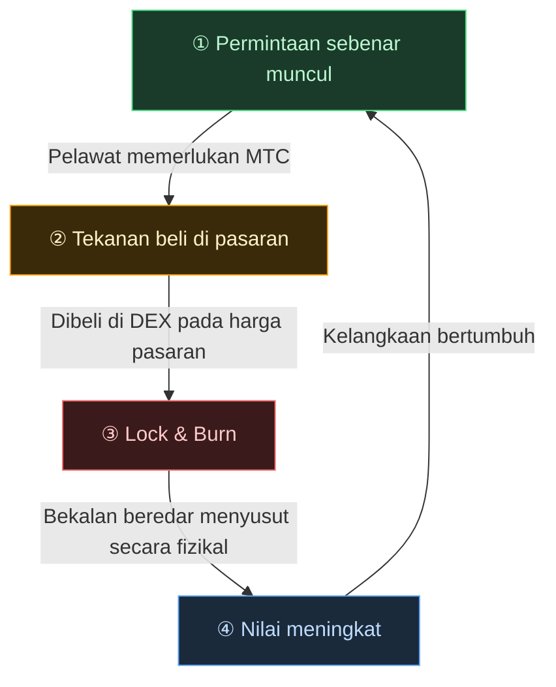

# 🔄 Roda gergasi ekonomi — gelung pertumbuhan dan OS budaya

> **Semakin pelawat menikmati Jepun, semakin banyak permintaan yang dijana ekosistem.**
> Mekanisme penawaran-permintaan ini adalah jantung berdetak projek.

---

## Mekanisme penawaran-permintaan MTC

Berdasarkan reka bentuk Matsuri Protocol, **permintaan sebenar yang meningkat mencipta tekanan beli dan, digabungkan dengan bekalan yang menyusut, menetapkan syarat untuk nilai meningkat.**
Ini bukan sentimen — ia adalah **mekanisme penawaran dan permintaan.**

Mekanisme tersebut berjalan pada **gelung empat langkah** di bawah.

| Langkah | Nama | Mekanisme |
| :---: | :--- | :--- |
| **①** | **Permintaan sebenar muncul** | Pelawat memerlukan MTC untuk menempah pemandu atau membeli ticket NFT |
| **②** | **Tekanan beli di pasaran** | MTC dibeli pada harga pasaran di DEX (decentralized exchange). Tekanan beli kuat berdasarkan penggunaan, bukan spekulasi |
| **③** | **Lock & Burn** | Sebahagian MTC yang digunakan dalam penyelesaian segera dikunci atau dibakar oleh smart contract. Bekalan beredar jatuh secara fizikal |
| **④** | **Kelangkaan meningkat** | Permintaan beli berkembang, bekalan jual menyusut. Peralihan dalam keseimbangan penawaran-permintaan menjadikan setiap token lebih jarang |

---

---

:::note Wawasan di sebalik persamaan ini
Gambaran lebih besar — "OS budaya" yang terletak di sebalik roda gergasi — diterokai secara terperinci pada halaman seterusnya, [Masa depan yang dibayangkan MTC](/docs/future).
:::

---

**[◀ Sebelum: Cabaran & Penyelesaian](/docs/challenges)** | **[▶ Seterusnya: Masa depan yang dibayangkan MTC](/docs/future)**
