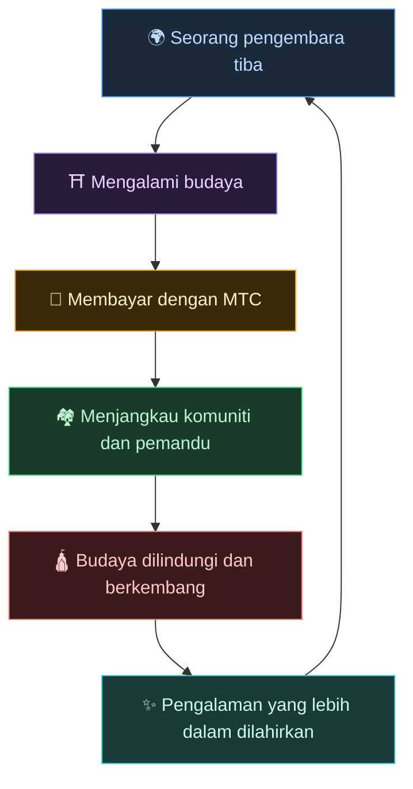
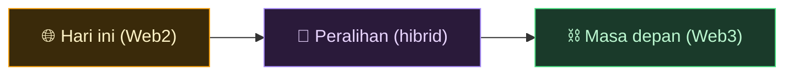
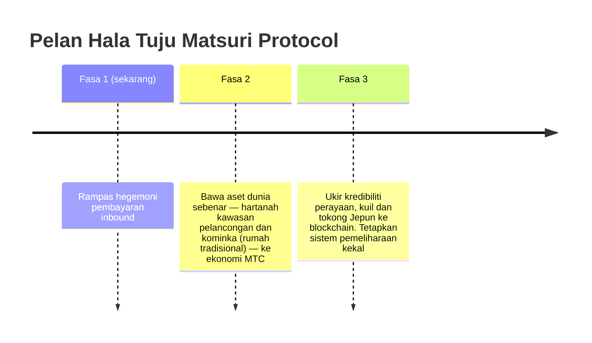

# 🌀 Masa depan yang dibayangkan MTC — ekonomi di mana setiap bentuk penglibatan beredar

> **Orang yang mengalaminya, orang yang menyampaikannya, orang yang melindunginya — setiap perasaan beredar sebagai ekonomi dan membawa budaya kepada generasi seterusnya.**

---

## Peredaran yang ingin kami wujudkan

MTC bukan token untuk spekulasi.

Pengembara bertemu budaya Jepun dan tergerak.
Pemandu menyampaikan perasaan itu dan diberi ganjaran.
Komuniti berkembang dan terus melindungi budaya mereka.
Dan budaya itu menarik pengembara seterusnya.

Peredaran ini adalah sebab utama kewujudan MTC.

---

## Ekonomi di mana ketiga-tiga pihak diberi ganjaran

Dalam model pelancongan lama, pengembara membayar, platform mengambil keuntungan, dan tiada apa yang tinggal di lapangan.
Dalam ekonomi MTC, semua yang terlibat diberi ganjaran.

| Siapa yang terlibat | Apa yang berlaku | Bagaimana mereka diberi ganjaran |
| :--- | :--- | :--- |
| **🌍 Mereka yang mengalaminya** | Bertemu budaya Jepun, membayar dalam MTC | Lebih murah daripada yen dan akses sebenar kepada pengalaman autentik. Kekal terhubung melalui MTC walaupun selepas pulang |
| **⛩️ Mereka yang menyampaikannya** | Menganjurkan acara sebagai pemandu, menerbit di J-Times | Ganjaran langsung, tanpa perantara mengambil dari atas. Semakin anda bertindak, semakin banyak MTC yang anda peroleh |
| **🏘️ Mereka yang melindunginya** | Sebagai komuniti tempatan, mengekal dan mewariskan budaya | Pendapatan tiba terus. Komuniti berkembang secara mampan dan bukan menderita overtourism |

---

## Semakin luas ekonomi, semakin kuat budaya

Ekonomi MTC bermula dengan menempah pengalaman, dan meluas ke setiap bahagian kehidupan.

- **Pengalaman** — pengalaman budaya autentik, perlombongan lawatan kuil
- **Sandang, makanan, tempat tinggal** — rumah tumpangan, kedai, masakan, fesyen
- **Projek kreasi bersama** — crowdfunding untuk melabur dalam melindungi budaya
- **Pemahaman antarabangsa silang budaya** — ruang pertukaran dan saling memahami merentasi sempadan

Semakin luas ekonomi berkembang, semakin tebal aliran MTC melaluinya, dan semakin besar kuasanya untuk mengekalkan budaya.
Ini bukan sekadar model perniagaan. Ia adalah **sistem sokongan hayat untuk budaya.**

---

## Daripada Web2 ke Web3 — secara berperingkat, tanpa paksaan

Kami tidak mengatakan "letakkan semua di blockchain" sejak hari pertama.

Kebanyakan orang hari ini masih asing dengan Web3. Justeru itulah kami merekanya untuk **mula dengan bentuk yang sudah orang kenali, dan biarkan mereka merasai manfaat Web3 secara beransur.**

| Fasa | Pengalaman pengguna | Apa yang berlaku di bawahnya |
| :--- | :--- | :--- |
| **Hari ini** | Tempah dan bayar seperti aplikasi web biasa. Kad kredit memadai | Django + Stripe. Tidak perlu wallet untuk bermula |
| **Peralihan** | Peroleh dan gunakan MTC dalam aplikasi. Sambungan wallet hanya satu ketukan | Skor off-chain beransur berpindah on-chain |
| **Masa depan** | Setiap transaksi dan hak direkodkan secara telus on-chain. Sumbangan anda terbukti selamanya | Ekonomi sepenuhnya automatik dan kalis-rosak yang dikuasakan smart contracts |

:::tip Web3 tidak semestinya sukar
Tiada persediaan wallet, tiada pengurusan seed phrase pada permulaan. Sambil anda menggunakan aplikasi, anda secara semula jadi melangkah ke Web3. **Sebelum anda menyedarinya, anda sudah menjadi warga Web3.** Itulah pengalaman yang kami reka.
:::

---

## Ekonomi yang bergerak atas empati, bukan paksaan

Dan ekonomi ini berjalan atas smart contracts.
Peraturan tidak boleh ditulis semula sebelah pihak mengikut kehendak sesiapa — **ekonomi di mana status quo tidak boleh diubah dengan paksa.**

Atas asas itu, kami belajar daripada kebijaksanaan kuno dan terus mencipta nilai baru. 温故知新, dan kemudian penciptaan.

> **Sebuah dunia di mana kehidupan boleh berhimpun di sekitar budaya, walaupun tanpa yen atau dolar.**
>
> Bukan menyumber luar makna mata wang kepada orang lain, tetapi menjana dan membelanjakan nilai melalui "penglibatan" anda sendiri.
> Itulah kebebasan yang ingin disampaikan MTC.

---

## 🏁 Destinasi akhir: "OS budaya"

Matlamat utama kami bukan sekadar aplikasi pembayaran.
Ia adalah untuk mengubah **budaya itu sendiri menjadi OS (lapisan asas).**

> Kami melindungi kebijaksanaan kuno dengan blockchain terkini.
> Itulah masa depan yang sedang dilukis Matsuri Protocol.

---

:::note Akhir bahagian Cerita
Jika anda telah membaca sejauh ini, anda sepatutnya memahami mengapa MTC wujud.
Seterusnya ialah **[Amalan]** — mari kita lihat apa yang sebenarnya boleh anda lakukan dengan MTC.
:::

**[◀ Sebelum: Roda gergasi ekonomi](/docs/flywheel)** | **[▶ Seterusnya: Ekosistem](/docs/ecosystem)**
