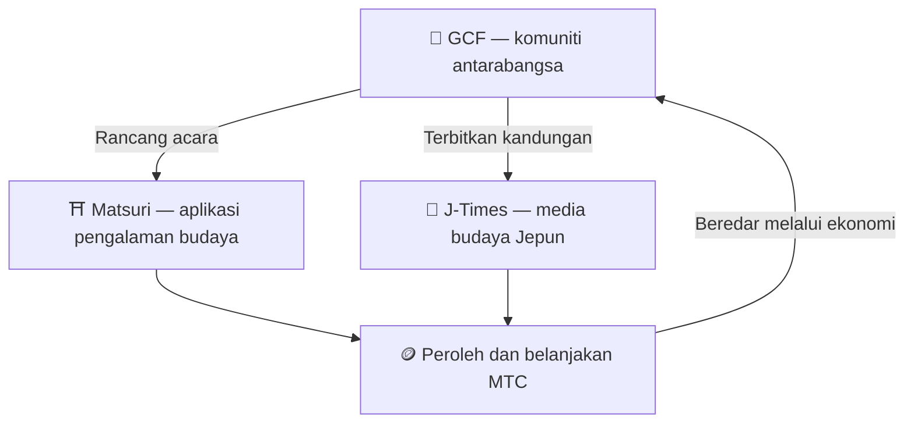

# 🏗️ Ekosistem MTC — ekonomi di mana pengalaman, media, dan komuniti beredar

> **Tiga "tempat" untuk merealisasikan misi.**
> Tempat untuk mengalami, tempat untuk belajar, tempat untuk berhubung — masing-masing berdiri sendiri, dan MTC menghubungkannya menjadi satu ekonomi yang beredar.

MTC bukan sekadar token. Tiga produk dan komuniti antarabangsa bekerja bersama untuk membina ekonomi yang melindungi budaya.

:::tip 🤝 GCF — komuniti antarabangsa yang menggerakkan ekosistem
Tempat berkumpul untuk orang yang menyayangi budaya Jepun, merentasi sempadan. GCF merekrut pemandu, dan pemandu GCF tersebut menjalankan pengalaman di Matsuri. Mereka juga menerbitkan kandungan menarik di J-Times — aktiviti komuniti adalah enjin yang menggerakkan keseluruhan ekosistem.
:::

:::tip ⛩️ Matsuri — aplikasi pengalaman budaya
Bermula dengan tempahan pengalaman budaya dan berkembang secara berperingkat ke **rumah tumpangan**, **kedai**, dan **crowdfunding**. Ekonomi berkembang daripada pengalaman ke sandang, makanan, tempat tinggal, dan pelaburan kreasi bersama.

**Perlombongan lawatan kuil (seichi junrei — ziarah suci)** — peroleh MTC dengan secara fizikal melawat kuil, tokong, dan mercu tanda budaya. Pengembara mengalir secara semula jadi daripada hotspot terkenal kepada permata tempatan tersembunyi, menyelesaikan overtourism dan menghidupkan kembali kawasan serantau pada masa yang sama.
:::

:::tip 📰 J-Times — media budaya Jepun
Platform media yang menyampaikan tarikan budaya Jepun ke seluruh dunia. Anda memperoleh MTC melalui penglibatan seperti membaca dan berkongsi artikel.
:::

---

## 🤝 Perlombongan sosial (berhubung dan peroleh)

**Terikat ke papan pemuka admin GCF — versi web aktif (aplikasi iOS dijadualkan April 2026).**

Ahli GCF menerima akses ke antara muka **GCF admin web** khusus.

| Ciri | Apa yang anda boleh lakukan |
| :--- | :--- |
| **🎪 Cipta acara** | Rancang dan senaraikan acara dan tur anda sendiri |
| **📢 Edarkan kandungan** | Terbitkan dan sebarkan artikel dan kandungan J-Times |
| **📊 Penjejakan rujukan** | Jejak aktiviti dan pendapatan pengguna yang dirujuk dalam masa nyata |

:::info Ganjaran automatik
Setiap kali rakan yang anda rujuk membuat pembayaran, sistem **secara automatik** mendepositkan ganjaran (perkongsian pendapatan) ke wallet anda.
:::

---

## 🎓 Ekonomi creator (cipta dan peroleh)

Anda tidak hanya menggunakan kandungan — di Matsuri, **sesiapa pun** boleh mencipta dan memonetinya.

| Platform | Apa yang creator boleh lakukan | Model pendapatan |
| :--- | :--- | :--- |
| **📚 Pasaran kursus** | Terbitkan kursus video / teks tentang budaya, bahasa, atau kraf Jepun | Yuran setiap pendaftaran (perkongsian pendapatan creator) |
| **🎙️ Studio podcast** | Hasilkan siri audio yang diedarkan melalui Spotify, Apple Podcasts, dan RSS | Episod khusus pelanggan |
| **🤝 Crowdfunding** | Lancarkan kempen pengumpulan dana berasaskan Solana untuk projek budaya | Penjejakan sumbangan on-chain |
| **🛍️ Kedai pengguna** | Buka kedai peribadi dalam platform (kraf, barangan) | Jualan langsung dengan sistem produk / ulasan |

:::tip Bantuan pengeluaran berkuasa AI
Penganjur acara boleh menggunakan **pembantu AI terbina (GPT-4 Turbo)** dalam papan pemuka admin untuk menulis penerangan acara, menterjemah secara automatik ke 5 bahasa, dan menjana metadata yang dioptimumkan SEO.
:::

---

  

*Pertemuan komuniti di Golden Gai — sambungan menjadi kuasa perlombongan.*

---

:::note Halaman seterusnya
Untuk melihat bagaimana perlombongan sebenarnya berfungsi dan cara memperoleh, teruskan ke **[Melombong & memperoleh →](/docs/mining)**.
:::
