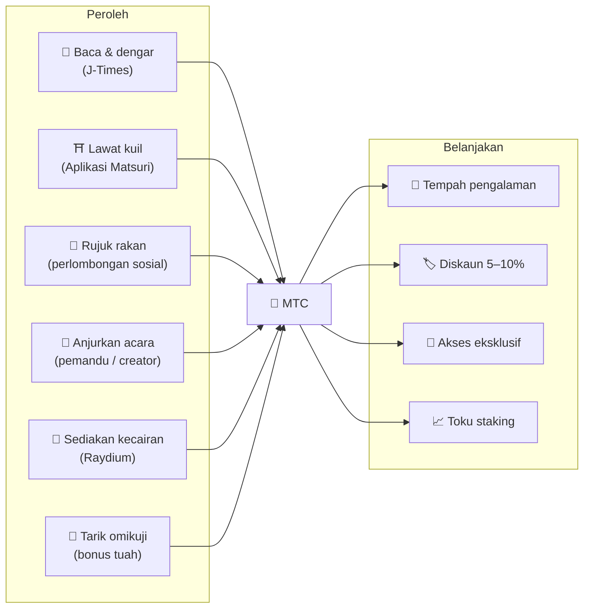
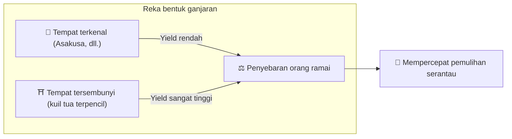
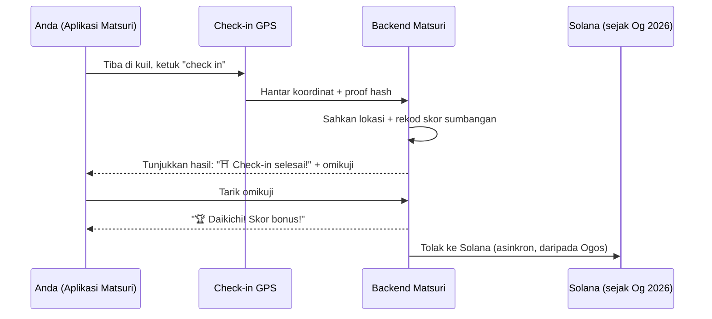
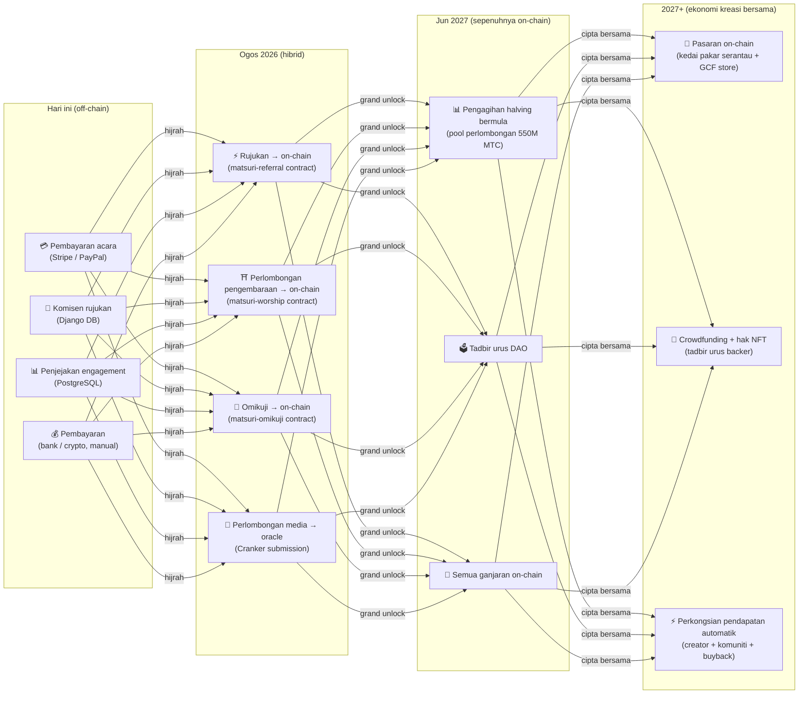

import useBaseUrl from '@docusaurus/useBaseUrl';

# ⛏️ Lima tonggak perlombongan dan cara memperoleh

> **Setiap bentuk "penglibatan" dalam budaya menjadi nilai.**
> Membaca, berjalan, berhubung, mencipta, menyokong — setiap tindakan anda menghasilkan MTC.

<small>*Apa itu "perlombongan"? — Pada Bitcoin dan rangkaian serupa, komputer melakukan pengiraan besar dan menerima koin baru sebagai ganjaran; ini dipanggil "perlombongan." Dengan MTC, yang melakukan perlombongan bukanlah kuasa pengiraan, tetapi **tindakan anda sendiri** — membaca artikel, melawat kuil, menganjurkan acara. Daripada menggali emas, penglibatan dengan budaya menghasilkan MTC. Itulah maksud "perlombongan" di sini.*</small>

> Peroleh melalui tindakan. Belanjakan untuk pengalaman. Pegang dan saksikan ia berkembang.

MTC bukan token spekulatif. Ia beredar melalui ekonomi sebenar di mana setiap tindakan menghasilkan nilai dan menangkapnya. Aplikasi web dan papan pemuka admin **sudah aktif**. Skor sumbangan kini direkodkan off-chain (di Django) dan akan berpindah on-chain secara berperingkat bermula Ogos 2026.

:::tip Gambaran besar
MTC mempunyai **ekonomi yang sepenuhnya tertutup**: anda peroleh melalui aktiviti sebenar, anda belanjakan untuk pengalaman sebenar, dan nilai berkembang apabila ekosistem berkembang. Halaman ini menjelaskan mekaniknya secara terperinci.
:::

---

## Kitaran hayat MTC

---

## Lima tonggak perlombongan

### 1. 📖 Perlombongan media (baca, dengar, jawab — dan peroleh)

**Terikat dengan platform media rasmi "J-Times"**

Pengetahuan secara dramatik meningkatkan kualiti perjalanan. Buka **aplikasi J-Times** dan nikmati kandungan tentang budaya Jepun. Selain teks dan audio, kami memberi ganjaran kepada **pemeriksaan kefahaman (kuiz)**. Setiap tindakan yang selesai secara automatik mengkreditkan MTC kepada anda.

| Tindakan | Syarat selesai | Ganjaran tipikal |
| :--- | :--- | :---: |
| **📰 Baca artikel** | Tatal hingga 75% | 2–30 MTC |
| **🎧 Dengar podcast** | Mainkan hingga akhir | 2–30 MTC |
| **🎬 Tonton video** | Tutup skrin terperinci selepas menonton | 2–30 MTC |
| **📤 Kongsi kandungan** | Buka share sheet | 2–30 MTC |
| **✅ Jawab kuiz** | Lulus ujian kefahaman | 2–30 MTC |

<small>*Jumlah ganjaran berbeza mengikut jenis kandungan, panjang, dan keseimbangan bekalan keseluruhan ekosistem.*</small>

:::tip Saat lapang menjadi perlombongan
Berulang-alik dan rehat bertukar menjadi masa yang menjana ganjaran.
:::

:::info Sokongan luar talian
Tiada internet di kuil terpencil? Tidak masalah. J-Times merekod aktiviti secara tempatan dan **secara automatik menyegerak sebaik sahaja anda dalam talian semula** (pengekalan baris gilir luar talian 7 hari). Anda tidak akan kehilangan MTC yang telah anda peroleh.
:::

**Apa yang berlaku di sebalik tabir:**
1. Aplikasi J-Times mengesan tindakan anda (baca, selesai tonton, kongsi, dll.)
2. Merekodnya secara tempatan walaupun luar talian (disimpan selama 7 hari)
3. Menghantarnya ke pelayan untuk pengesahan apabila rangkaian kembali
4. Mencerminkannya dalam baki anda sebagai skor sumbangan
5. Daripada Ogos 2026: skor yang disahkan direkodkan on-chain melalui oracle dan menjadi boleh disahkan pada blockchain

---

### 2. ⛩️ Perlombongan pengembaraan (jalan dan peroleh)

**Projek "Junrei" — smart contract selesai, pelaksanaan mainnet Ogos 2026**

Ciri generasi seterusnya yang menggunakan GPS dan insentif token untuk membentuk "aliran orang" fizikal. Peta tapak suci **sudah aktif** dalam aplikasi web Matsuri. Skor sumbangan kini direkodkan off-chain; pengagihan ganjaran on-chain bermula selepas pelaksanaan smart contract Ogos 2026.

>**Kerana anda memperoleh lebih banyak, anda pergi ke luar bandar.**
> Logik ekonomi mudah ini melarutkan overtourism dan mempercepatkan pemulihan serantau.

**Bagaimana check-in berfungsi:**

  
  

    
<strong>Worship Mining</strong> — check in dekat kuil, kesan tenaga dengan kamera AR, tarik omikuji untuk MTC bonus. Pengganda tier berkisar daripada 1.0× (Major) hingga 10.0× (Hidden Gem).

  

**Prinsip teras — semakin sedikit pelawat, semakin banyak yang anda peroleh:**

| Jenis tapak | Contoh | Ganjaran tipikal (per check-in) |
| :--- | :--- | :---: |
| 🏙️ **Major** | Sensōji, Kiyomizudera, Fushimi Inari | 30–50 MTC |
| 🌆 **Pusat serantau** | Ichinomiya setiap wilayah, kuil agung serantau | 50–100 MTC |
| 🏞️ **Serantau** | Kuil serantau bersejarah | 100–150 MTC |
| ⛰️ **Frontier** | Tokong gunung, tapak suci pulau | 150–200 MTC |

<small>*Nilai di atas adalah anggaran ganjaran asas. Pengganda omikuji boleh meningkatkannya beberapa kali ganda.*</small>

**Faktor pemarkahan tambahan:**
- **Pengganda omikuji** — bonus rawak pada setiap check-in. Daikichi mengganda ganjaran beberapa kali
- **Kekerapan lawatan** — pelawat tetap menumpuk lebih banyak dari semasa ke semasa
- **Tapak ditaja** — perbandaran boleh meningkatkan tapak tertentu

:::info Skor sumbangan → MTC
Aktiviti anda terkumpul sebagai **skor sumbangan**. Pada setiap epoch halving (mulai Jun 2027), skor ditukar menjadi MTC daripada pool perlombongan 550M. Semakin besar sumbangan anda kepada komuniti, semakin banyak MTC yang anda terima. Pekali boost yang tepat dimuktamadkan secara berperingkat dan dilaksanakan dalam smart contracts — ini menjamin pengagihan adil yang sejajar dengan saiz pool sebenar.
:::

---

### 3. 🤝 Perlombongan sosial (berhubung dan peroleh)

Anda peroleh MTC hanya dengan memperkenalkan rakan.

#### Ganjaran rujukan untuk pengguna biasa

Mudah. Apabila rakan mendaftar melalui pautan rujukan anda, anda menerima **300 MTC setiap rujukan langsung.**

| Syarat | Ganjaran |
| :--- | :--- |
| Rakan yang anda rujuk mendaftar | **300 MTC** |

Itu sahaja. Tiada ganjaran berbilang peringkat.

#### Ganjaran rujukan ejen GCF

[Ahli GCF](/docs/gcf) adalah **ejen rasmi** yang bertanggungjawab untuk pengembangan ekosistem dan mempunyai struktur ganjaran yang lebih dalam.

| Lapisan | Hubungan | Komisen |
| :---: | :--- | :---: |
| **L1** | Rujukan langsung | **20%** |
| **L2** | Rujukan mereka | **5%** |
| **L3** | Tier ketiga | **5%** |
| **L4** | Tier keempat | **5%** |

:::note Tentang program ejen GCF
Ganjaran berbilang peringkat ini hanya terpakai kepada ejen rasmi yang memegang keahlian GCF (jemputan sahaja). Pengguna biasa hanya menerima rujukan langsung (300 MTC).
Komisen ejen GCF dikira berdasarkan **aktiviti ekonomi sebenar** (pembelian pengalaman, penyertaan acara, dll.) rujukan mereka. Sekadar mengumpul orang tidak menghasilkan ganjaran.
:::

**Bagaimana skor En-Mining berfungsi (untuk ejen GCF):**

Skor sumbangan dikira daripada dua komponen:
- **Lebar rangkaian** (30%) — berapa ramai orang yang anda bawa masuk
- **Aktiviti ekonomi** (70%) — pembelian sebenar daripada rangkaian rujukan anda

Skor terkumpul dari semasa ke semasa dan ditukar menjadi MTC pada setiap epoch halving.

#### Papan pemuka admin GCF — versi web aktif

Ahli GCF menerima akses ke papan pemuka admin yang khusus.

| Ciri | Apa yang anda boleh lakukan |
| :--- | :--- |
| **🎪 Cipta acara** | Rancang dan senaraikan acara dan tur anda sendiri |
| **📢 Edarkan kandungan** | Terbitkan dan sebarkan artikel dan kandungan J-Times |
| **📊 Penjejakan rujukan** | Jejak aktiviti dan pendapatan pengguna yang dirujuk dalam masa nyata |

:::warning Kini off-chain → berhijrah on-chain pada Ogos 2026
Komisen rujukan kini dijejak di Django (PostgreSQL) dan dibayar melalui pemindahan bank atau crypto. Daripada **Ogos 2026**, mereka berpindah ke **smart contract Matsuri Referral** di Solana, membawa pembayaran on-chain yang boleh diaudit.
:::

  

*Pertemuan komuniti di Golden Gai — sambungan menjadi kuasa perlombongan.*

---

### 4. 🎓 Perlombongan creator & pemandu (cipta dan peroleh)

Anda tidak hanya menggunakan kandungan — di Matsuri, **sesiapa pun** boleh mencipta dan memonetinya. Jika anda ahli GCF, pemandu, atau creator kandungan, ini cara anda peroleh.

| Aktiviti | Cara anda peroleh |
| :--- | :--- |
| **🗺️ Anjurkan tur** | Komisen pemandu (ditetapkan setiap acara) + tip |
| **🎫 Jual tiket acara** | Perkongsian pendapatan melalui EventPurchase |
| **📚 Terbitkan kursus** | Yuran setiap pendaftaran (perkongsian pendapatan creator) |
| **🎙️ Hasilkan episod podcast** | Pendapatan langganan |
| **🤝 Lancar kempen crowdfunding** | Penjejakan sumbangan on-chain berasaskan Solana |
| **🛍️ Buka kedai pengguna** | Jualan langsung kraf dan barangan |

**Sistem tip:** selepas acara, tetamu boleh memberi tip kepada pemandu (gaya Uber). Tip diproses melalui Stripe dan dijejak pada papan pendahulu awam.

:::tip Bantuan pengeluaran berkuasa AI
Penganjur acara boleh menggunakan **pembantu AI terbina (GPT-4 Turbo)** dalam papan pemuka admin untuk menulis penerangan acara, menterjemah secara automatik ke 5 bahasa, dan menjana metadata yang dioptimumkan SEO.
:::

---

### 5. 🏦 Perlombongan kecairan (deposit dan peroleh)

>**Jadilah bank.**

Sediakan kecairan MTC/SOL pada Raydium DEX dan menyokong infrastruktur perdagangan ekosistem peringkat awal. Penyedia kecairan awal dianggap sebagai "founding partners" dalam program ganjaran khas.

| Item | Butiran |
| :--- | :--- |
| **Layak** | Sesiapa yang memegang MTC dan SOL |
| **APY sasaran** | **20%** (insentif kecairan awal, ditetapkan sebagai premium risiko) |
| **DEX** | Raydium (Solana) |
| **Tujuan** | Pastikan kecairan peringkat awal dan bina persekitaran perdagangan stabil |

---

## 🎲 Bonus omikuji

Setiap check-in perlombongan pengembaraan datang dengan tarikan Omikuji (helaian tuah) percuma. Ia adalah smart contract bergaya omikuji yang berjalan **secara percuma (gas sahaja)** semasa selesai check-in.

| Tuah | Pengganda ganjaran | Bonus tambahan |
| :--- | :---: | :--- |
| 🏆 **Daikichi (rahmat agung)** | Asas × pengganda tertinggi | NFT Goshuin |
| ✨ **Kichi (rahmat)** | Asas × pengganda tinggi | — |
| 🌸 **Shōkichi (rahmat kecil)** | Asas × pengganda kecil | — |
| 🍃 **Suekichi (rahmat masa depan)** | Asas × 1.0 | — |
| 💀 **Kyō (kutukan)** | Asas × 1.0 | — |

Kebarangkalian dan pengganda boleh diselaraskan daripada papan pemuka admin GCF dan diuruskan oleh pengendali mengikut keseimbangan bekalan MTC seluruh ekosistem. Hasil ditentukan oleh **protokol commit-reveal kalis-rosak** pada Solana — tiada siapa boleh mengubah hasil selepas fasa commit.

<small>*Walaupun pada hasil kyō anda masih menerima ganjaran asas. Reka bentuk memberi ganjaran kepada tindakan check-in itu sendiri.*</small>

:::note Ini bukan perjudian
Tiada wang dipertaruhkan. Ia hanyalah bonus rawak di atas **tindakan "telah melawat".** Mengumpul set NFT tertentu boleh membuka hak untuk menyertai acara khas.
:::

---

## Untuk apa MTC

| Use case | Manfaat | Ketersediaan |
| :--- | :--- | :---: |
| **🎫 Tempah pengalaman** | Bayar untuk tur, acara, dan aktiviti budaya dalam MTC | ✅ Tersedia |
| **🏷️ Diskaun** | Diskaun 5–10% daripada harga yen apabila membayar dalam MTC | ✅ Tersedia |
| **🔑 Akses eksklusif** | Acara gated NFT, ritual khusus VIP, tur peribadi | ✅ Tersedia |
| **📈 Toku staking** | Kunci MTC untuk meningkatkan skor sumbangan anda (boost sehingga ~50%) | 🔜 Ogos 2026 |
| **🗳️ Tadbir urus DAO** | Undi tentang treasury, naik taraf protokol, dan akreditasi tapak | 🔜 2027 |
| **🛍️ Kedai rakan kongsi** | Bayar di kedai dan restoran rakan kongsi | 🔜 Mengembang |

:::info MTC sebagai kaedah pembayaran
Di dalam Matsuri App, MTC adalah kaedah pembayaran kelas pertama bersama-sama kad kredit dan Solana Pay. Tiada langkah penukaran — pilih "Bayar dengan MTC" pada checkout dan baki anda didebit serta-merta.
:::

### Tentang menukar MTC

:::warning Penting: kami tidak menyediakan perkhidmatan penukaran / pertukaran MTC
Matsuri tidak didaftar sebagai bursa aset crypto, jadi **kami tidak menukar MTC kepada mata wang fiat (yen, dolar, dll.) secara langsung, dalam apa jua keadaan.**

Jika anda ingin menukar MTC kepada aset crypto lain atau fiat, anda boleh melakukannya sendiri:
1. Pegang MTC dalam wallet yang serasi Solana seperti **Phantom Wallet**
2. Swap MTC → SOL pada **Raydium (DEX)**
3. Tukar SOL kepada fiat pada bursa berpusat (CEX)

Kami juga sedang mempertimbangkan listing CEX pada masa depan, di mana laluan penukaran yang lebih mudah akan tersedia.
:::

---

## Contoh: satu hari dalam ekonomi MTC

> **Pagi:** anda membaca tiga artikel J-Times dalam kereta api → peroleh MTC.
> **Tengah hari:** anda melawat kuil serantau melalui Aplikasi Matsuri → check in, tarik kichi (×1.5) → peroleh lebih banyak MTC.
> **Petang:** dengan MTC anda menempah tur budaya Shinjuku Golden Gai ¥9,000 (~63 $) dengan diskaun 10% (bayar bersamaan ¥8,100 / ~57 $).
> **Hasil:** rasa ingin tahu anda menjadi pengalaman sebenar, dan pemandu, kuil, dan komuniti menerima pembayaran terus. Tiada OTA mengambil potongan 20%.

---

## Kemampanan ekonomi

:::warning Apa yang berlaku apabila pool perlombongan habis?
Pool halving 550M MTC direka untuk bertahan **selama berdekad-dekad**. Kerana kadar pelepasan dibahagi dua setiap dua tahun, secara matematik ia tidak pernah mencapai 100%, dan ganjaran berterusan merentasi ufuk yang sangat panjang (lihat [Tokenomics](/docs/tokenomics)). Walaupun apabila pelepasan menjadi sangat kecil:

- **Yuran transaksi** terus memberi ganjaran kepada peserta rangkaian daripada aktiviti on-chain
- **Protokol buyback** (20–25% daripada pendapatan perniagaan) menghasilkan tekanan beli yang stabil
- **Toku staking** mengunci bekalan beredar dan meredakan tekanan jual
- **Pendapatan perniagaan sebenar** (acara, keahlian, kursus) mengekalkan ekosistem secara bebas daripada pengagihan token

MTC disokong oleh **ekonomi sebenar** — bukan sekadar pelepasan token.
:::

---

## Pelan hala tuju penghijrahan on-chain

Ekonomi Matsuri sedang berhijrah secara berperingkat daripada off-chain (Django/PostgreSQL) ke on-chain (smart contracts Solana). Melalui penghijrahan ini, semua operasi menjadi **trustless, boleh diaudit, dan permissionless**.

| Fasa | Jadual | Apa yang go on-chain |
| :--- | :--- | :--- |
| **Fasa 1 (sekarang)** | Aktif | Token MTC (SPL), Raydium LP, pengesahan Solana Pay |
| **Fasa 2 (Ogos 2026)** | Pelaksanaan mainnet smart contract | Komisen rujukan, ganjaran perlombongan pengembaraan, tarikan Omikuji, perlombongan media berasaskan oracle |
| **Fasa 3 (Jun 2027)** | Grand unlock | Pengagihan halving 550M MTC, tadbir urus DAO, ternyahpusat penuh |
| **Fasa 4 (2027+)** | Ekonomi kreasi bersama | Pasaran on-chain (kedai pakar serantau + GCF store), crowdfunding dengan hak NFT, perkongsian pendapatan automatik kepada creator + komuniti + buyback |

:::warning Mengapa kami tidak meletakkan semua on-chain sekarang?
**Kami tidak mengaktifkan sebarang ciri on-chain yang menggerakkan dana pengguna sehingga audit keselamatan selesai.** Itulah prinsip kami.

Status semasa:
- **Risiko terhadap dana pengguna: tiada** — semua ganjaran dan skor kini diuruskan off-chain (Django). Tiada ciri smart contract yang menggerakkan dana pengguna yang aktif
- **Jadual audit: Q2–Q3 2026** — kontrak akan dilaksanakan ke mainnet satu demi satu, hanya selepas lulus audit keselamatan profesional
- **Penyiapan audit adalah prasyarat untuk pelaksanaan** — kami tidak akan pernah mengaktifkan smart contract tanpa audit pada mainnet

Ganjaran yang diperoleh dalam tempoh off-chain masih boleh disahkan — setiap transaksi termasuk `solana_signature` sebagai bukti penyelesaian.
:::

---

**[▶ Seterusnya: Tokenomics](/docs/tokenomics)** | **[◀ Sebelum: Ekosistem](/docs/ecosystem)**
