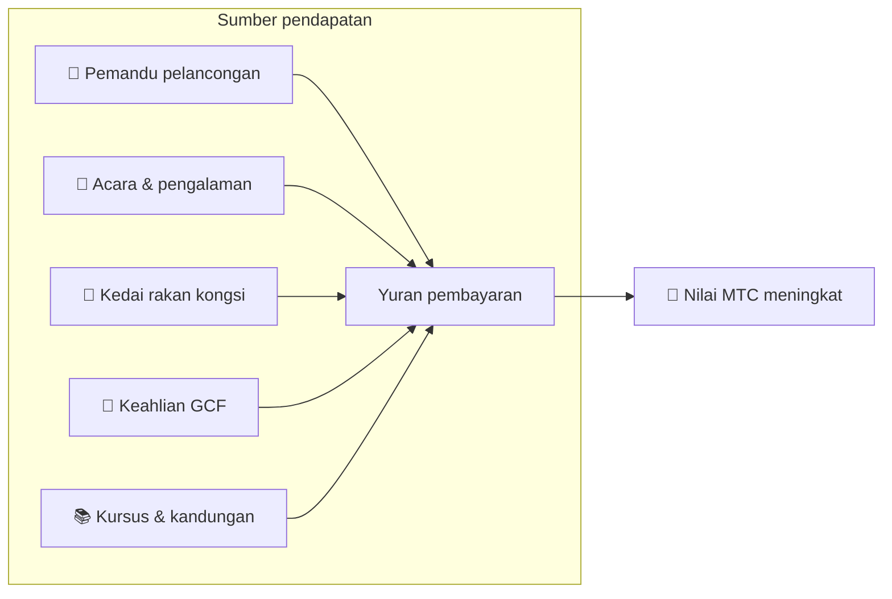

# 💰 Tokenomics — reka bentuk ekonomi MTC

> **Kepercayaan diukir dalam kod.**
> Reka bentuk ekonomi MTC dijamin bukan oleh janji seseorang, tetapi oleh matematik dan blockchain.


> **"Ekonomi di mana status quo tidak boleh diubah dengan paksa" — itulah tokenomics MTC.**

Reka bentuk ekonomi Matsuri Coin (MTC) berdiri di atas satu keyakinan:
**peraturan yang malah pengendali pun tidak boleh ganggu adalah jaminan terkuat yang mungkin untuk pelabur.**

Bekalan ditetapkan secara kekal. Penerbitan tambahan dan pembekuan dana adalah mustahil. Pertumbuhan perniagaan tergambar dalam harga pada tahap persamaan —
bukan "janji," tetapi **fakta** yang diukir ke dalam blockchain.

Halaman ini secara terbuka mendedahkan semua mekanik ekonomi MTC.

---

## Spesifikasi token

Untuk menjamin keselamatan pelabur, kami secara kekal **melepaskan** kedua-dua "mint authority" dan "freeze authority" pada Solana.
Penerbitan tambahan secara kekal mustahil. Dana tidak boleh dibekukan. Ia adalah **reka bentuk yang sepenuhnya trustless.**

| Item | Butiran |
| :--- | :--- |
| **Nama token** | Matsuri Coin |
| **Ticker** | MTC |
| **Chain** | Solana |
| **Alamat mint** | `DRENpzmRWM4TwECrCPCfS1k5VBPmanhQg9bcCWP8EZXF` [Solscan →](https://solscan.io/token/DRENpzmRWM4TwECrCPCfS1k5VBPmanhQg9bcCWP8EZXF) |
| **Bekalan keseluruhan** | **900 juta** (900,000,000 MTC), tetap |
| **Mint authority** | 🚫 Dilepaskan ([boleh disahkan on-chain](https://solscan.io/token/DRENpzmRWM4TwECrCPCfS1k5VBPmanhQg9bcCWP8EZXF)) |
| **Freeze authority** | 🚫 Dilepaskan ([boleh disahkan on-chain](https://solscan.io/token/DRENpzmRWM4TwECrCPCfS1k5VBPmanhQg9bcCWP8EZXF)) |
| **Pengurusan lock** | Streamflow Finance (disahkan) |

:::info Mengapa ini penting
Melepaskan mint authority bermakna "pengendali tidak boleh mencetak lebih banyak token dan mencairkan bahagian anda." Melepaskan freeze authority bermakna "tiada siapa boleh membekukan wallet anda." Inilah asas trustlessness.
:::

---

## Peruntukan token

900M MTC diperuntukkan seperti berikut.

<div className="mtc-alloc">
  <div className="mtc-alloc__donut" role="img" aria-label="Peruntukan MTC: 61% Pool Perlombongan, 39% Operasi Ekosistem">
    <div className="mtc-alloc__hole">
      <span className="mtc-alloc__total">900M</span>
      <span className="mtc-alloc__unit">MTC</span>
    </div>
  </div>
  <div className="mtc-alloc__legend">
    <div className="mtc-alloc__row mtc-alloc__row--mining">
      <span className="mtc-alloc__dot"></span>
      <span className="mtc-alloc__pct">61%</span>
      <span className="mtc-alloc__amount">⛏️ 550M MTC</span>
    </div>
    <div className="mtc-alloc__row mtc-alloc__row--ecosystem">
      <span className="mtc-alloc__dot"></span>
      <span className="mtc-alloc__pct">39%</span>
      <span className="mtc-alloc__amount">🌐 350M MTC</span>
    </div>
  </div>
</div>

| Kategori | Bahagian | Jumlah | Tujuan |
| :--- | :---: | :--- | :--- |
| **⛏️ Pool perlombongan** | **61%** | 550 juta | Pool ganjaran untuk penyumbang. Dibuka kunci Jun 2027, dilepaskan pada kitaran halving dua tahun. Diagihkan mengikut skor sumbangan |
| **🌐 Operasi ekosistem** | **39%** | 350 juta | Pemasaran, pengagihan GCF, perbelanjaan operasi, pembiayaan liquidity pool (LP), kos pembangunan, pengiklanan, penganjuran acara, dan banyak lagi |

:::note Bagaimana pool perlombongan dilepaskan
550M MTC tidak dilepaskan sekali gus. Ia mengikut jadual halving dua tahun dan **diagihkan secara berperingkat mengikut skor sumbangan.** Peraturan pelepasan dan pengagihan akan dilaksanakan sebagai smart contracts secara berperingkat dari hujung 2026, dan menjadi boleh disahkan on-chain.
:::

:::note Tentang peruntukan operasi ekosistem
Peruntukan operasi 39% adalah dana pelbagai tujuan yang diperlukan untuk mengembangkan ekosistem. Penggunaan konkrit termasuk aktiviti pemasaran, pengagihan awal kepada ahli GCF, menyediakan kecairan kepada pool Raydium, pampasan untuk pasukan pembangunan, pengiklanan, dan pembiayaan acara pengalaman budaya. Ketelusan penggunaan akan tertakluk kepada tadbir urus komuniti selepas perpindahan ke DAO.
:::

---

## Struktur pendapatan

Apa yang menyokong nilai MTC adalah **pendapatan daripada aktiviti perniagaan sebenar.** Bukan spekulasi — aktiviti ekonomi sebenar menyokong nilai token.



| Sumber pendapatan | Butiran |
| :--- | :--- |
| **🏯 Pengalaman & pemandu** | Yuran pembayaran daripada pemandu pelancongan dan acara pengalaman budaya |
| **🤝 Keahlian GCF** | Yuran keahlian |
| **📚 Kandungan** | Yuran pendaftaran kursus, langganan media |
| **🏪 Pasaran** | Yuran transaksi daripada kedai rakan kongsi (mengembang secara berperingkat) |

:::tip Pertumbuhan disokong oleh permintaan sebenar
Semakin banyak pelawat inbound tiba, semakin banyak mata wang asing mengalir masuk dan semakin besar ekosistem berkembang. Nilai MTC ditetapkan bukan oleh spekulasi tetapi oleh **bilangan orang yang mengalami budaya.**
:::

---

## Traksi perniagaan semasa

Ekonomi MTC masih awal, tetapi aktiviti sebenar telah pun bermula.

| Metrik | Status |
| :--- | :--- |
| **Acara dianjurkan** | 50+ (operasi ujian) |
| **Ahli GCF Platinum** | 20 daripada 50 kerusi diisi |
| **Ahli GCF Gold** | Pengambilan akan dibuka tidak lama lagi |
| **Platform web** | Aktif, kini mengumpul dan melayani pengguna ujian |
| **Aplikasi iOS** | Pembangunan selesai, dijadualkan dilancarkan April 2026 |

:::note Pernyataan jujur
Kami belum mempunyai rekod "kejayaan besar." 50 acara dan operasi ujian — itulah realiti hari ini. Tetapi produk berjalan, komuniti wujud, dan kami berada dalam fasa scaling up dari sini secara serius.
:::

---

## Protokol buyback

Kami tidak hanya mengantongi keuntungan.
Peratusan tetap pendapatan perniagaan diperuntukkan untuk **membeli semula MTC daripada pasaran.**

| Sumber pendapatan | Peruntukan | Tindakan |
| :--- | :---: | :--- |
| **Pendapatan Matsuri HQ** (pemandu, acara) | **20%** | **Buyback** daripada pasaran + tambahan liquidity pool |
| **Keahlian GCF** (yuran keahlian) | **25%** | **Buyback** daripada pasaran |

:::info Status buyback hari ini
Protokol buyback akan **mula beroperasi** apabila pendapatan perniagaan meningkat. Pada awalnya ia berjalan off-chain (manual); ia berhijrah secara berperingkat ke pelaksanaan automatik oleh smart contract dari hujung 2026. Sebaik sahaja on-chain, sejarah pelaksanaan penuh buyback akan boleh disahkan pada blockchain oleh sesiapa sahaja.
:::

Buyback bukanlah janji "satu hari nanti." Mereka adalah peraturan yang diprogramkan sebagai protokol. Setiap kali pendapatan perniagaan meningkat, MTC secara automatik diserap daripada pasaran — **jaminan struktur** untuk pelabur.

---

## Logik pembentukan harga

Mekanisme harga naik MTC berdasarkan bukan harapan, tetapi **persamaan AMM (automated market maker).**

```
Harga = Kecairan (SOL) ÷ Bekalan (MTC)
```

| Langkah | Apa yang berlaku | Hasil |
| :---: | :--- | :--- |
| **①** | Pendapatan perniagaan (SOL) disuntik ke dalam pool | **Pengangka meningkat** |
| **②** | Dana tersebut membeli kembali MTC daripada pasaran dan membakarnya | **Penyebut menurun** |
| **③** | Pengangka ↑ × penyebut ↓ | **Syarat untuk kelangkaan meningkat dipenuhi** |

:::info Penerangan mekanisme, bukan jaminan harga
Persamaan ini menerangkan reka bentuk struktur: jika pendapatan perniagaan berterusan dan buyback dilaksanakan, keseimbangan penawaran-permintaan bergerak ke arah kelangkaan. Harga sebenar bergantung pada permintaan pasaran, keadaan luaran, kecairan, dan banyak faktor lain.
:::

---

## Jadual halving

**550 juta MTC (kira-kira 61% daripada bekalan keseluruhan)** yang dibuka kunci pada 1 Jun 2027 tidak akan dijatuhkan ke pasaran. Mereka dirizabkan sebagai **pool ganjaran untuk penyumbang.**

Kami telah mengguna pakai **kitaran halving dua tahun**, lebih pantas daripada kitaran empat tahun Bitcoin.
Kadar pelepasan dibahagi dua setiap dua tahun, mengekalkan ganjaran mengalir secara teori selama berdekad-dekad.

| Tempoh | Bahagian pelepasan | Jumlah dilepaskan | Terkumpul |
| :--- | :---: | :--- | :---: |
| **Tempoh 1** 2027–2029 | **50%** | ~275M | 50% |
| **Tempoh 2** 2029–2031 | **25%** | ~137M | 75% |
| **Tempoh 3** 2031–2033 | **12.5%** | ~68M | 87.5% |
| **Tempoh 4** 2033–2035 | **6.25%** | ~34M | 93.75% |
| **Daripada Tempoh 5** | Halving berterusan | Berkurang | → asimtot ke 100% |

<small>*Secara matematik ia tidak pernah mencapai 100%, dan pelepasan secara asimtot menghampiri sifar. Prinsip yang sama dengan Bitcoin.*</small>

:::tip Lebih awal anda menyumbang, lebih banyak MTC anda terima
Kerana halving, tempoh 1 (2027–2029) mempunyai jumlah pelepasan terbesar, dan setiap epoch berikutnya melepaskan lebih sedikit setiap acara. Dengan kata lain, **mereka yang membina skor sumbangan lebih awal menerima lebih banyak MTC.**

Contoh aktiviti yang dikira ke arah skor sumbangan:
- Rekod penciptaan dan kehadiran acara
- Menjalankan kursus berpemandu yang popular
- Merujuk dan membangunkan pemandu yang cemerlang
- Tontonan dan perkongsian kandungan J-Times
- Check-in ziarah tapak suci

Ganjaran ditentukan bukan oleh "urutan menyertai" tetapi oleh **"kuantiti dan kualiti sumbangan".**
:::

---

:::note Halaman seterusnya
Sekarang setelah anda memahami reka bentuk ekonomi MTC, mari kita lihat **bagaimana untuk menyertai sebagai rakan kongsi.**
**[Keahlian GCF →](/docs/gcf)**
:::
