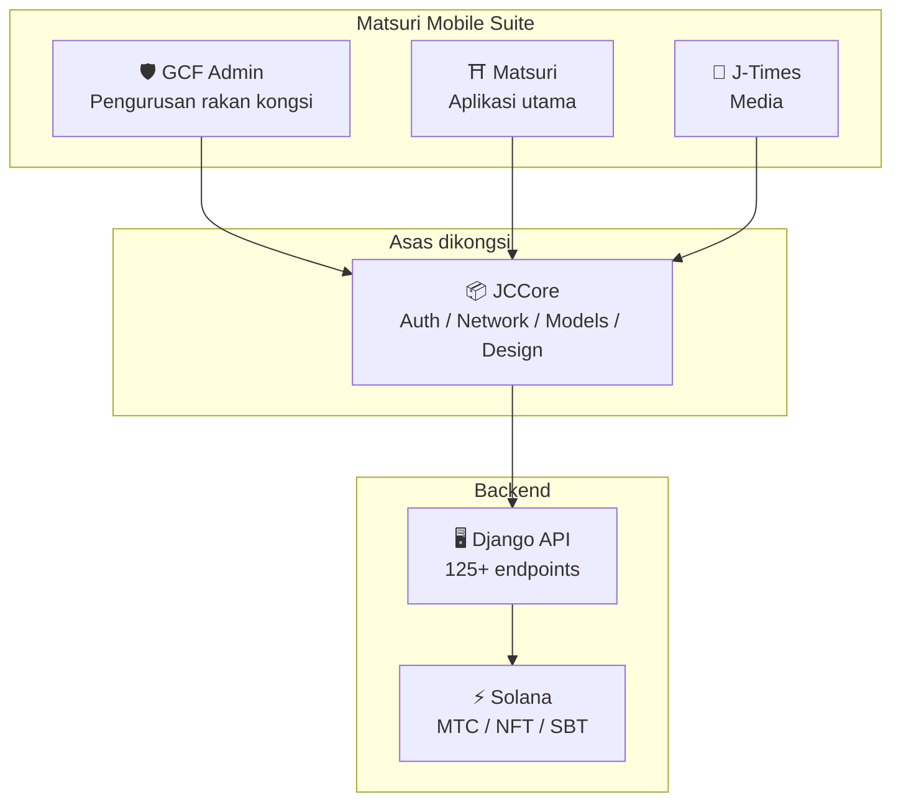
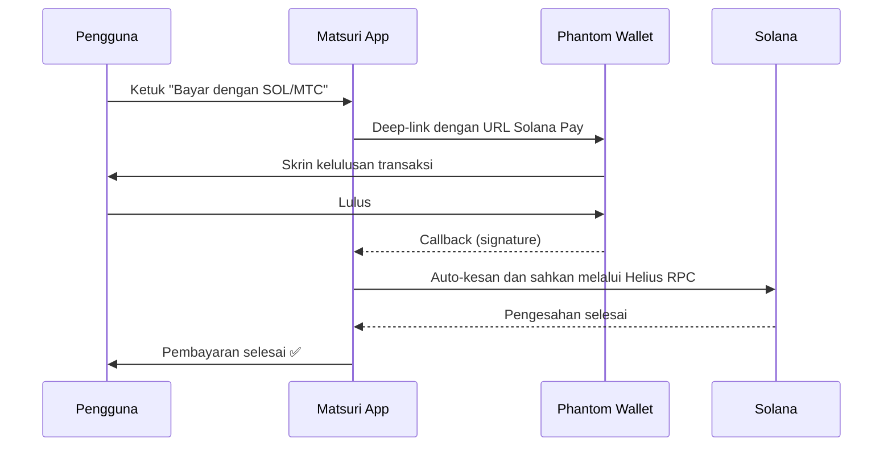
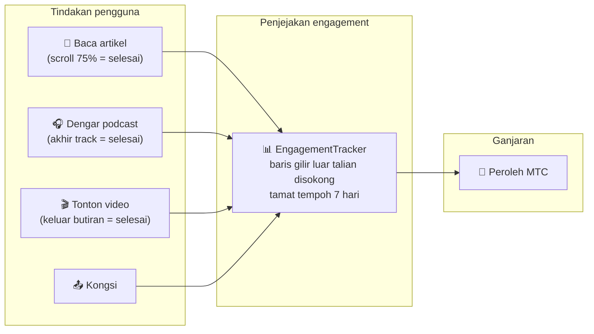
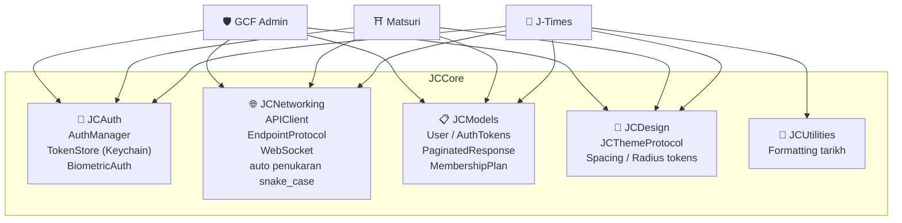
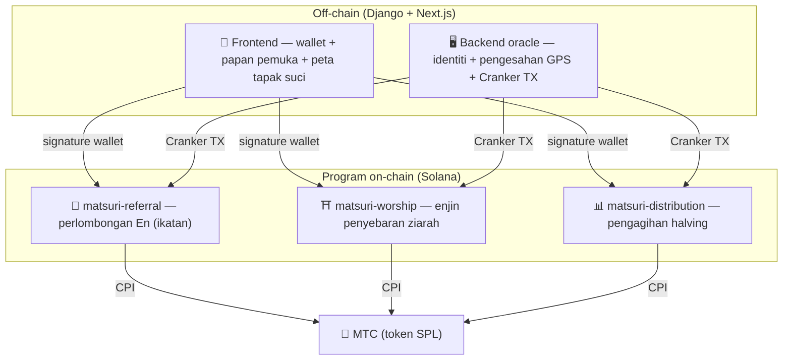
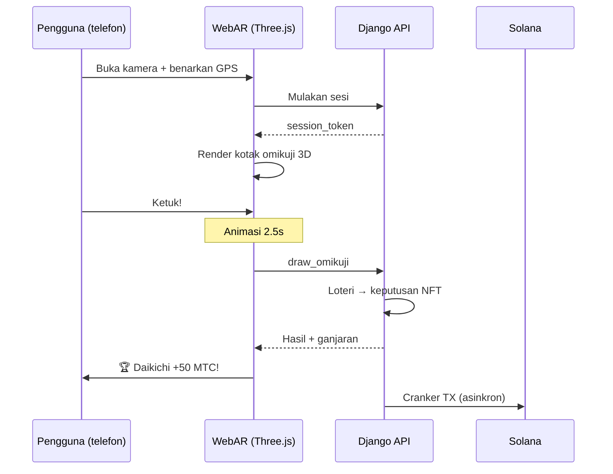

import useBaseUrl from '@docusaurus/useBaseUrl';

# 🔧 Produk & teknologi — yang berjalan membuktikan segalanya

> **Yang berjalan membuktikan segalanya.**
> Misi kami bukan sekadar perkataan. Platform web sudah aktif, dan aplikasi iOS berada pada peringkat akhir.

Aplikasi web dan papan pemuka admin **dalam pengeluaran**. Tiga aplikasi iOS native telah selesai dan dikeluarkan dalam April–Mei 2026 (Matsuri awal Mei). Smart contracts pada Solana adalah open source — kami bercakap bukan dalam konsep, tetapi dalam **kod yang berjalan dan produk yang akan mendarat tidak lama lagi.**

---

## Tinjauan aplikasi

| Aplikasi | Tujuan | Status | Bahasa disokong |
| :--- | :--- | :---: | :--- |
| **GCF Admin** | Pengurusan rakan kongsi dan tooling operasi | ✅ Dikeluarkan | 🇯🇵🇬🇧🇨🇳🇹🇭🇳🇴 |
| **Matsuri** | Aplikasi pengguna utama | ✅ Dikeluarkan | 🇯🇵🇬🇧🇨🇳🇹🇭🇳🇴 |
| **J-Times** | Media budaya dan pembelajaran | ✅ Dikeluarkan | 🇯🇵🇬🇧 |

---

## 1. 🛡️ GCF Admin — aplikasi pengurusan rakan kongsi

:::info Status: dikeluarkan di App Store (v1.0)
Aplikasi pengurusan operasi untuk ahli GCF (Global Community Friends). Keseluruhan fungsi skrin admin web, dipadatkan pada mudah alih.
:::

  

  
  
  

### Apa yang aplikasi boleh lakukan

| Kategori | Ciri |
| :--- | :--- |
| **📊 Papan pemuka** | Kad KPI, carta pendapatan, tindakan pantas |
| **👥 Pengurusan ahli** | Senarai, butiran, suntingan, pengurusan tahap |
| **💰 Pengurusan pendapatan** | Penjejakan komisen, pengurusan pengeluaran MTC, pengurusan pembayaran |
| **📝 Pengurusan kandungan** | Cipta, sunting, dan terbitkan acara, artikel, podcast, dan video |
| **🎫 Slot pemandu** | Urus slot pemandu dan jejak pendapatan |
| **🖼️ Papan pemuka NFT** | Founder's Collection, pengesahan on-chain, pemindahan NFT |
| **⛩️ Pengurusan tapak suci** | CRUD tapak, konfigurasi beacon |
| **🎲 Konfigurasi perlombongan AR** | Jadual kebarangkalian Omikuji, pengurusan parameter ganjaran |
| **📊 Analytics** | Laporan ralat, analitik penggunaan |
| **🔗 Rujukan** | Penjanaan kod QR khusus, pengurusan program rujukan |

### Spesifikasi teknikal

| Item | Butiran |
| :--- | :--- |
| **Seni bina** | Clean Architecture + MVVM + `@Observable` (iOS 17) |
| **Bahasa / SDK** | Swift 6.0 / Xcode 16+ / iOS 17.0+ |
| **Integrasi API** | 125+ endpoints |
| **Tests** | 226 tests / 45 kelas test |
| **Pengantarabangsaan** | 5 bahasa (JP/EN/CN/TH/NO) / 957+ kunci terjemahan |
| **Swift Concurrency** | Patuh Strict Concurrency / sifar amaran build |

### Integrasi kod QR

GCF Admin boleh menjana kod QR khusus berjenama Matsuri. Use case serbaguna — jemputan acara, pautan rujukan, permintaan pembayaran, dan banyak lagi.

---

## 2. ⛩️ Matsuri — aplikasi utama

:::info Status: dikeluarkan di App Store (v3.0)
Aplikasi utama untuk pengguna biasa. Tempahan acara, pembayaran, wallet Web3, perlombongan AR — semuanya selesai dalam satu aplikasi. **Kini aktif di App Store.**
:::

  

  
  
  

### Apa yang aplikasi boleh lakukan

| Kategori | Ciri |
| :--- | :--- |
| **🎪 Tempahan acara** | Cari, tempah, pembayaran Stripe, pengurusan QR tiket |
| **💳 Empat kaedah pembayaran** | Kad kredit / kad disimpan / baki MTC / crypto (SOL/MTC) |
| **👛 Wallet Web3** | Lihat baki MTC, hantar/terima, sejarah transaksi |
| **🖼️ Galeri NFT** | Senarai NFT/SBT yang dipegang, pengesahan on-chain |
| **🗺️ Peta tapak suci** | Pandangan peta kuil dan tokong, check-in |
| **🎲 Perlombongan AR** | Pengalaman omikuji WebAR, peroleh MTC |
| **💬 Chat** | Mesej dengan menu konteks |
| **⭐ Wishlist** | Simpan acara dan pengalaman kegemaran |
| **🔍 Carian lanjutan** | Carian suara disokong |
| **🤝 Rujukan** | Sertai program rujukan, jejak ganjaran |
| **📊 Papan pemuka GCF** | Pandangan admin ringan untuk ahli GCF |

### Integrasi Phantom Wallet — pembayaran crypto tanpa input

>**Tiada copy-paste alamat diperlukan.** Phantom Wallet dilancarkan secara automatik dan pembayaran selesai dengan satu kelulusan. Signature transaksi dikesan secara automatik melalui Helius RPC.

### Spesifikasi teknikal

| Item | Butiran |
| :--- | :--- |
| **Seni bina** | Clean Architecture + MVVM + Swift Concurrency |
| **Bahasa / SDK** | Swift 6.0 / Xcode 16+ / iOS 17.0+ |
| **Pembayaran** | Stripe PaymentSheet + MTC Balance + Phantom (Solana Pay) |
| **Integrasi API** | 72 endpoints / 16 kategori |
| **Tests** | 230+ (Model, ViewModel, Network, Security, DeepLink, E2E) |
| **Pengantarabangsaan** | 5 bahasa (JP/EN/CN/TH/NO) / 406 kunci terjemahan |
| **ViewModels** | 25 (sepenuhnya MVVM — sifar panggilan API langsung daripada Views) |
| **Pengesahan** | Apple Sign In / Google Sign In (PKCE) |

---

## 3. 📰 J-Times — aplikasi media budaya

:::info Status: dikeluarkan — aktif di App Store
Platform media yang menyampaikan kedalaman budaya Jepun. Baca artikel, dengar podcast, tonton video — setiap tindakan memperoleh MTC.
:::

  

  
  

### Apa yang aplikasi boleh lakukan

| Kategori | Ciri |
| :--- | :--- |
| **📖 Artikel** | Hero parallax, drop caps, bar kemajuan baca, kandungan kaya (Markdown, jadual, petikan) |
| **🎧 Podcast** | Pelayaran siri, pemain gelombang, sleep timer, AirPlay, kawalan skrin kunci |
| **🎬 Video** | Pandangan grid/senarai adaptif, video pendek (gaya TikTok, ketuk dua kali) |
| **🔍 Carian** | Multi-penapis, tag trending, carian suara |
| **🧭 Discovery** | Carousel pilihan, pilihan staf, weekly top |
| **📚 Library** | Kegemaran, sejarah (mengikut tarikh), muat turun, playlist |
| **🎵 Pemain audio** | Mini player (kawalan leret), pemain penuh (gelombang, lirik, ulang) |
| **👤 Keahlian** | Perbandingan ciri merentas 3 tahap (Free / Premium / Pro), pemulihan pembelian |

### Media Mining — membaca, mendengar, dan menonton sebagai perlombongan

>**Direkodkan walaupun luar talian.** Baca artikel di kuil gunung di mana tiada isyarat — apabila rangkaian kembali, engagement dihantar secara automatik dan MTC dikreditkan.

### Sistem reka bentuk — "empat tonggak" estetika Jepun

J-Times menggunakan sistem reka bentuk asli yang membawa estetika Jepun tradisional ke UI moden.

| Tonggak | Konsep | Aplikasi UI |
| :--- | :--- | :--- |
| **墨 (sumi — dakwat)** | Kelabu neutral hangat | Latar belakang, hierarki teks |
| **朱 (shu — vermillion)** | Merah Jepun (#C53030) | Warna aksen, tindakan penting |
| **間 (ma — ruang)** | Ruang negatif pada grid 4pt | Spacing, ruang bernafas |
| **紙 (kami — kertas)** | Tekstur halus, glassmorphism | Permukaan kad, kedalaman |

### Spesifikasi teknikal

| Item | Butiran |
| :--- | :--- |
| **Seni bina** | Clean Architecture + MVVM + Swift Concurrency |
| **Bahasa / SDK** | Swift 6.0 / Xcode 16+ / iOS 17.0+ |
| **Kebergantungan luaran** | **Sifar** — hanya framework first-party Apple |
| **Integrasi API** | 40+ endpoints |
| **Tests** | 371 tests / 20 fail |
| **Pengantarabangsaan** | 2 bahasa (JP/EN) / 310+ kunci terjemahan |
| **Sokongan luar talian** | ContentCache (50MB) + ImageDiskCache (200MB) + pengurus muat turun |
| **Pengesahan** | Apple Sign In / Google Sign In (PKCE) |

---

## Asas dikongsi: pustaka JCCore

Pustaka Swift Package yang dikongsi merentasi ketiga-tiga aplikasi.

| Modul | Peranan |
| :--- | :--- |
| **JCAuth** | Pengurusan token berasaskan Keychain, pengesahan biometrik (Face ID / Touch ID) |
| **JCNetworking** | Klien API yang selamat jenis, WebSocket, penukaran JSON snake_case automatik |
| **JCModels** | Model data biasa merentas aplikasi (User, AuthTokens, dll.) |
| **JCDesign** | Protokol tema, design tokens (spacing, corner radius) |
| **JCUtilities** | Utiliti tarikh dan rentetan |

---

## Keselamatan dan privasi

| Item | Pelaksanaan |
| :--- | :--- |
| **Token pengesahan** | Disulitkan dan disimpan dalam iOS Keychain (TokenStore) |
| **Pengesahan biometrik** | Dua faktor melalui Face ID / Touch ID |
| **Komunikasi API** | HTTPS + certificate pinning |
| **Kunci peribadi wallet** | Tidak pernah disimpan dalam aplikasi — diserahkan kepada Phantom Wallet |
| **Perlombongan AR** | Imej kamera tidak dihantar ke pelayan (VisionProof) |
| **Data luar talian** | Penyulitan SwiftData + tamat tempoh automatik |
| **Swift Concurrency** | Pengasingan actor menghalang race conditions |

---

## Kualiti pembangunan

### Aplikasi mudah alih: **827+ test automatik** merentasi tiga aplikasi.

| Aplikasi | Tests | Kawasan liputan |
| :--- | :---: | :--- |
| **GCF Admin** | 226 | Model, ViewModel, Repository, API, Pengantarabangsaan, Navigasi |
| **Matsuri** | 230+ | Model, ViewModel, Network, Security, DeepLink, Regression, Performance, E2E |
| **J-Times** | 371 | Model, ViewModel, API, Repository, Navigasi, Pengantarabangsaan, Security, Performance |

### Smart contracts: tests berkembang secara berperingkat

Untuk program Rust pada Solana, kami telah memulakan dengan unit tests untuk logik teras (modul math), dan memperluas liputan test secara berperingkat sebagai persediaan untuk audit keselamatan (Q2–Q3 2026).

---

## Smart contracts — reka bentuk open source

>**Falsafah reka bentuk trustless.**
> Pengiraan ganjaran, pohon rujukan, jadual halving — setiap kepingan logik berjalan **on-chain** dan boleh diaudit oleh sesiapa sahaja.
> Sumber: [GitHub](https://github.com/Cootakahashi/matsuri-contracts)

---

### Penyumbang

| Ahli | Peranan |
| :--- | :--- |
| **Ko Takahashi** | Founder / Lead Developer — seni bina, smart contracts, pembangunan full-stack |

> 🌏**Pada masa hadapan, ahli GCF dan komuniti pembangun seluruh dunia juga akan menyertai usaha pembangunan bersama.**
> Sebagai "infrastruktur budaya" yang dibina untuk kekal, Matsuri Protocol dibina di atas ketelusan dan pemilikan bersama.

---

### Struktur keseluruhan

Matsuri melaksanakan **tiga program Anchor (Rust)** pada Solana, masing-masing membawa salah satu tonggak ekosistem.

---

### 1. 📣 En-Mining (縁 — ikatan / sambungan)

**Tujuan:** Enjin pertumbuhan hibrid yang memberi ganjaran kedua-dua "lebar" (rangkaian rujukan) dan "kedalaman" (kesan ekonomi). Bukan pemasaran afiliasi mudah, tetapi protokol perlombongan lengkap di mana aktiviti ekonomi dunia sebenar menjana nilai on-chain.

#### Reka bentuk pemarkahan

Skor sumbangan berdasarkan dua komponen berwajaran:

| Komponen | Wajaran | Tujuan |
| :--- | :---: | :--- |
| **Lebar** (bilangan rujukan) | 30% | Jangkauan rangkaian — berapa ramai orang yang anda bawa |
| **Kedalaman** (volum pembayaran) | 70% | Kesan ekonomi — pembelian sebenar, bukan sekadar pendaftaran |

Skor terkumpul dari semasa ke semasa dan ditukar menjadi MTC pada setiap epoch halving. Mekanisme boost tambahan dirancang:

| Boost | Penerangan | Status |
| :--- | :--- | :---: |
| **Toku (徳 — kebaikan) staking** | Kunci MTC untuk meningkatkan skor sumbangan (boost sehingga ~50%). Tahap dan pengganda yang tepat dikalibrasikan terhadap jadual pelepasan pool halving | ⬜ Pekali TBD |
| **Kedudukan musim** | Pemain teratas setiap epoch memperoleh gelaran **Evangelist** (SBT kekal) dan boost skor. Kadar yang tepat ditentukan oleh tadbir urus | ⬜ Pekali TBD |

:::info Reka bentuk parameter progresif
Pekali boost (tahap staking, bonus kedudukan) sengaja boleh diselaraskan. Mereka akan dimuktamadkan dan dikunci ke dalam smart contracts berdasarkan data ekosistem sebenar — jumlah pengguna aktif, kadar pelepasan pool halving, matlamat kestabilan harga. Pendekatan ini menjamin **pengagihan adil** tanpa terlalu menjanjikan pulangan tetap.
:::

#### Pertahanan anti-sybil (tiga lapisan)

| Lapisan | Mekanisme | Lokasi |
| :--- | :--- | :--- |
| **Pintu identiti** | OAuth X/Twitter + SMS | Off-chain (Django) |
| **Pintu on-chain** | Hanya profil dengan `is_verified = true` peroleh ganjaran | Smart contract |
| **Pemberat kedalaman** | 70% skor = pembayaran sebenar → bot tidak peroleh apa-apa | Enjin pemarkahan |

---

### 2. ⛩️ Enjin penyebaran ziarah (Worship Routing Engine)

**Tujuan:** **Protokol ReFi** pertama di dunia yang menyelesaikan overtourism menggunakan ekonomi token. Lawat tapak suci untuk peroleh MTC. Twist kritikal: *semakin sedikit pelawat di tapak, semakin banyak ganjaran yang anda peroleh secara eksponen.*

:::tip Wawasan teras
"Penetapan harga surge Uber terbalik" — tapak yang sesak dihukum, tapak frontier diboost. Pelancong secara sukarela bergerak ke arah tempat yang kurang dilawati **kerana mereka lebih menguntungkan.**
:::

#### Prinsip reka bentuk ganjaran

Skor sumbangan untuk setiap lawatan ditentukan oleh pelbagai faktor:

| Faktor | Prinsip | Kesan |
| :--- | :--- | :--- |
| **Populariti tapak** | Lebih sedikit pelawat = skor lebih tinggi | Sebarkan pelancong daripada kawasan sesak |
| **Masa lawatan** | Pelawat lebih awal pada hari tertentu peroleh lebih banyak | Galakkan lawatan luar puncak |
| **Tahap serantau** | Tapak serantau dan frontier mendapat kedudukan tertinggi | Mendorong pemulihan serantau |
| **Kekerapan lawatan** | Pelawat tetap mengumpul skor bonus | Memberi ganjaran engagement berterusan |
| **Tuah omikuji** | Cabutan bonus rawak setiap check-in | Elemen gamification yang menyeronokkan |
| **Boost ditaja** | Perbandaran boleh meningkatkan tapak tertentu | Model pendapatan B2B/B2G |

:::info Pekali boleh diselaraskan
Pengganda yang tepat untuk setiap faktor (sebagai contoh, berapa banyak lebih yang diperoleh tapak serantau berbanding tapak major) ditala berdasarkan **jadual pool halving** dan data penggunaan sebenar, dan dikunci ke dalam smart contracts secara berperingkat. Prinsip reka bentuk tetap — pekali berkembang dengan ekosistem.
:::

---

### 3. 📊 Pengagihan halving

**Tujuan:** Diilhamkan oleh jadual halving Bitcoin, pengagihan MTC secara automatik halving setiap epoch. Kelangkaan dijamin secara matematik.

| Instruction | Penerangan |
| :--- | :--- |
| `initialize` | Inisialisasi pool pengagihan |
| `register_miner` | Daftarkan penambang |
| `update_score` | Kemas kini skor |
| `advance_epoch` | Majukan epoch (laksanakan halving) |
| `claim_distribution` | Tuntut ganjaran pengagihan |

---

### 4. 🎴 Perlombongan AR — pengalaman omikuji WebAR

**Tujuan:** Buat omikuji AR muncul dalam ruang sebenar, hanya menggunakan pelayar telefon, dan lombong MTC melaluinya. **Tiada muat turun aplikasi diperlukan.** Infrastruktur WebAR × blockchain pertama di dunia, menggabungkan kerohanian Shintō dengan teknologi terkini.

#### Seni bina

#### Konfigurasi kebarangkalian Omikuji (admin GCF)

Basis Points (10000 = 100%) dengan ketepatan 0.01%. Boleh diselaraskan daripada skrin admin GCF.

| Gred | Kelangkaan | Bonus | NFT |
|------|-----------|---------|-----|
| 🏆 Daikichi | Jarang | Bonus maksimum | ✅ |
| ✨ Kichi | Tidak biasa | Bonus tinggi | Pilihan |
| 🌸 Shōkichi | Biasa | Bonus kecil | — |
| 🍃 Suekichi | Biasa | Rekod penyertaan | — |
| 💀 Kyō | Tidak biasa | Rekod penyertaan | — |

Kebarangkalian dan pekali ganjaran akan dimuktamadkan secara berperingkat berdasarkan saiz ekosistem dan jumlah pelepasan halving, dan dilaksanakan dalam smart contracts.

#### ZK-Proof of Vision (keselamatan 5 lapis)

Menghapuskan spoofing GPS dan serangan replay dalam beberapa lapisan. **Untuk melindungi privasi, imej kamera tidak pernah dihantar ke pelayan.**

| Lapis | Apa yang disahkan | Wajaran |
| :--- | :--- | :--- |
| Temporal | Masa sesi 5–120s | /20 |
| Motion | Naturaliti gyro (pengesanan getaran tangan) | /20 |
| Light | Konsistensi cahaya sekitar × masa hari | /20 |
| HMAC | Pengesahan signature proof_hash | /20 |
| Fingerprint | Keunikan peranti | /20 |
| **Jumlah** | **60/100 atau lebih = LULUS** | |

#### Reka bentuk ganjaran

Ganjaran direkodkan sebagai **skor sumbangan** berdasarkan pelbagai faktor termasuk jenis tapak, hasil omikuji, dan tahap serantau. Pekali tertentu dimuktamadkan secara berperingkat sejajar dengan jadual pelepasan halving dan pertumbuhan ekosistem, dan dilaksanakan dalam smart contracts.

---

### Modul math tulen (logik teras yang boleh diaudit)

Setiap program mengasingkan pengiraan skor dan ganjaran ke dalam **modul `math.rs` tulen yang boleh diaudit:**

- **Sifar kesan sampingan** — tiada I/O, tiada peruntukan memori, tiada panggilan luaran
- **Formula didokumentasikan** — notasi gaya LaTeX dalam rustdoc
- **Analisis overflow** — pertengahan u128 dengan julat terbukti
- **Tests komprehensif** — kes pinggir, syarat sempadan, pengesahan nisbah
- **Pekali boleh diselaraskan** — parameter ganjaran direka untuk boleh dikemas kini melalui tadbir urus, membolehkan kalibrasi berperingkat apabila ekosistem berkembang

---

### Model keselamatan

Kontrak ini **sepenuhnya open source.** Keselamatan berdasarkan jaminan matematik, bukan kekaburan.

| Prinsip | Pelaksanaan |
| :--- | :--- |
| **Vault hanya PDA** | Vault token dikawal oleh PDA (program-derived addresses) — tiada kunci manusia boleh keluarkan |
| **Aritmetik checked** | Semua pengiraan menggunakan aritmetik `checked_*` — overflow mustahil |
| **Pemisahan kuasa** | Admin (multisig) ≠ Cranker (tindakan terhad) ≠ Pengguna (jagaan sendiri) |
| **Pause kecemasan** | Admin boleh pause program hanya sebagai tindak balas kepada ancaman keselamatan. Tetapi **tiada pergerakan atau rampasan dana yang mungkin** — pause adalah "perisai untuk melindungi," bukan cara untuk mengubah peraturan |
| **Tokenomics tak boleh diubah** | Kadar halving, jumlah pool, dan panjang epoch tidak boleh diubah selepas konfigurasi awal |
| **Modul math tulen** | Logik ganjaran/pemarkahan tinggal dalam pustaka math berasingan yang boleh diuji |
| **Vision Proof** | Pengesanan spoof 5 lapis yang tidak pernah menghantar data kamera (memelihara privasi) |

---

**[▶ Seterusnya: Pelan hala tuju & pasukan](/docs/roadmap)** | **[◀ Sebelum: Tokenomics](/docs/tokenomics)**
