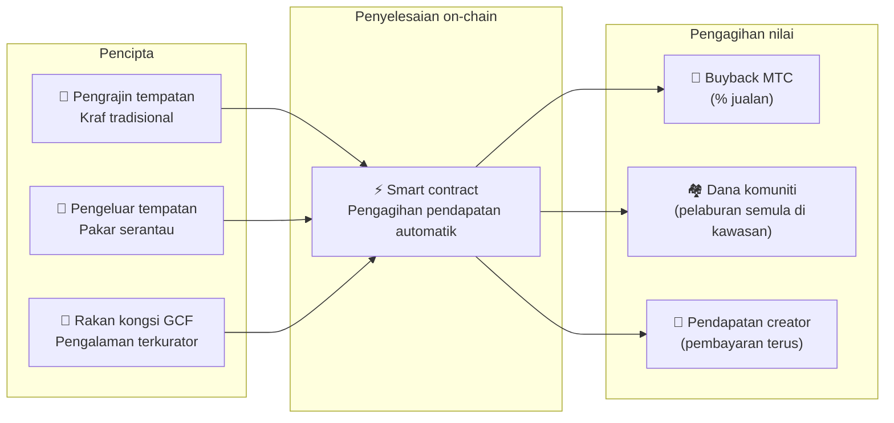

import useBaseUrl from '@docusaurus/useBaseUrl';

# 🗓️ Pelan hala tuju & pasukan

>**Kepada mereka yang telah membaca sejauh ini — wawasan, reka bentuk ekonomi, dan asas teknikal semua sudah pada tempatnya.**
> Kami bukan projek spekulatif jangka pendek.
>**Pembangunan platform utama sudah selesai,** dan kami memasuki fasa scaling-up.

---

## Tonggak strategik

### 🔥 Fasa 1: Kebangkitan (separuh pertama 2026 — sekarang)

**Tema: asas dan aliran tunai**

Platform web aktif, dan ketiga-tiga aplikasi iOS (GCF Admin, J-Times, Matsuri) kini aktif di App Store sejak April 2026. Kami fokus pada monetisasi melalui sistem kewangan dipimpin CEO dan menjamin kecairan awal.

| Status | Tonggak | Butiran |
| :---: | :--- | :--- |
| ✅ | **Platform web aktif** | Aplikasi web Matsuri dan papan pemuka admin GCF (web) berjalan |
| ✅ | **Pembayaran dan pertumbuhan** | Fungsi pembayaran MTC dan fungsi airdrop rujukan dilaksanakan |
| ✅ | **Pelancaran media** | Asas pengagihan J-Times (web & podcast) dibina |
| ✅ | **Genesis** | Token MTC diterbitkan pada chain Solana |
| ✅ | **Kecairan dijamin** | Pool kecairan awal di Raydium dicipta |
| ⬜ | **Insentif bermula** | Pelancaran perlombongan kecairan dengan APY sasaran 20% |
| ⬜ | **Pembayaran on-chain** | Pengesahan Solana Pay masuk pengeluaran |
| ⬜ | **Pengambilan VIP** | Pemilihan 20 ahli VIP GCF awal selesai |

### 🚀 Fasa 2: Pengembangan (separuh kedua 2026)

**Tema: aset sebenar dan perlombongan pengembaraan**

Kami sepenuhnya memanfaatkan webapp yang telah selesai, mengembangkan pangkalan fizikal dan ciri "ziarah".

| Status | Tonggak | Butiran |
| :---: | :--- | :--- |
| ⬜ | **Pelepasan ciri baru** | Pelaksanaan dan pelepasan perlombongan pengembaraan (ziarah) |
| ⬜ | **Pengembangan luar negara** | Pembangunan pangkalan rakan kongsi di Asia (Thailand, Taiwan, dll.) & acara VIP |
| ⬜ | **Pengurusan aset** | Bina portfolio hartanah, ekuiti, dan crypto |
| ⬜ | **Sasaran** | Skala aset seluruh ekosistem **¥1 bilion (~6.5 juta $)** |

### 🌊 Fasa 3: Peredaran (sejak 2027)

**Tema: penerimaan massa, ekonomi kreasi bersama, ternyahpusat**

Buka untuk umum, pasaran on-chain, dan operasi ekosistem penuh.

| Status | Tonggak | Butiran |
| :---: | :--- | :--- |
| ⬜ | **Pembukaan rasmi** | Pelepasan rasmi Matsuri App seluruh dunia |
| ⬜ | **Great unlock (1/6/2027)** | Lockup founder buka kunci + pool perlombongan (550M) aktif + kitaran halving bermula |
| ⬜ | **Pasaran kreasi bersama** | Kedai pakar serantau + kedai rakan kongsi GCF — pembayaran on-chain dengan buyback MTC automatik |
| ⬜ | **Crowdfunding (hak NFT)** | Pengguna membiayai projek budaya pada Solana. Backer menerima NFT yang mewakili pemilikan, perkongsian pendapatan, dan hak tadbir urus |
| ⬜ | **Pembayaran on-chain** | Semua transaksi pasaran diselesaikan oleh smart contract — peratusan tetap jualan secara automatik dihalakan ke pool buyback MTC |
| ⬜ | **Sasaran** | Skala aset seluruh ekosistem **¥10 bilion (~65 juta $)** |
| ⬜ | **Peralihan DAO** | Beransur memindahkan kuasa membuat keputusan kepada komuniti GCF |

#### 🏪 Konsep pasaran kreasi bersama

Ungkapan tertinggi "OS budaya" — pasaran ternyahpusat di mana **pencipta budaya dan pencinta budaya bertransaksi terus**, tanpa perantara eksploitatif.

| Ciri | Penerangan | Status |
| :--- | :--- | :---: |
| **🏺 Kedai pakar serantau** | Pengrajin dan pengeluar tempatan menjual terus kepada pelanggan di seluruh dunia. Diskaun 5–10% apabila membayar dalam MTC | ⬜ Konsep |
| **🎫 Crowdfunding + hak NFT** | Biayai projek budaya (pemulihan kuil, kebangkitan perayaan, bengkel pengrajin). Terima NFT yang membuktikan sumbangan anda dan boleh memberi perkongsian pendapatan atau hak tadbir urus | ⬜ Konsep |
| **⚡ Penyelesaian on-chain** | Setiap transaksi pasaran diselesaikan melalui smart contract Solana. Pendapatan auto-split: pembayaran creator + dana komuniti + buyback MTC — tiada perakaunan manual diperlukan | ⬜ Konsep |
| **🗳️ Tadbir urus backer** | Pemegang NFT mengundi tentang bagaimana projek mereka biayai memperuntukkan sumber — bukan sekadar derma, tetapi kreasi bersama sebenar | ⬜ Konsep |

:::info Mengapa ini penting
Hari ini, pelancong membeli cenderamata daripada kedai yang membayar "sewa" kepada tuan tanah mereka — platform. Esok, **seorang pengrajin luar bandar di Kyoto akan menjual terus kepada peminat di Copenhagen**, dan sebahagian daripada jualan itu secara automatik akan mengukuhkan ekonomi MTC. Inilah roda gergasi dalam bentuk paling lengkap.
:::

---

## 👤 Pasukan

  

### Ko Takahashi — founder / CEO & lead architect

| Item | Butiran |
| :--- | :--- |
| **Peranan** | Kepimpinan keseluruhan projek. Reka bentuk platform, smart contracts, pembangunan full-stack |
| **Wawasan** | Pendukung "OS budaya" yang "mengeksport budaya dan mengimport kekayaan" |
| **Pendirian** | Menulis kod sendiri dan berdiri di lapangan sendiri (Golden Gai) — pengamal "skin in the game" |

  

### Jon Anders Jensen — pengarah / operasi GCF & acara

| Item | Butiran |
| :--- | :--- |
| **Peranan** | Operasi GCF. Mereka bentuk operasi acara dan tur dan bekerja di lapangan |
| **Kekuatan** | Menyokong aliran "manusia" ekosistem melalui perspektif antarabangsa dan hubungan yang dipercayai dengan ahli GCF |

  

### Ryunosuke Honda — pengarah / duta budaya serantau

| Item | Butiran |
| :--- | :--- |
| **Peranan** | Jambatan antara budaya serantau dan komuniti merentasi Jepun dan ekosistem Matsuri |
| **Kekuatan** | Menemui aset budaya serantau dan membawanya ke platform Matsuri untuk menyampaikan pengalaman "Deep Japan" |

### 🌏 Komuniti GCF — ahli pembangunan tersebar di seluruh dunia

Matsuri Protocol tidak dibina oleh pasukan pengasas sahaja.
**Ahli GCF di seluruh dunia** menyumbang kepada evolusi protokol melalui ujian, maklum balas, terjemahan, dan penyebaran serantau.

| Kawasan | Struktur |
| :--- | :--- |
| **💼 Kewangan global** | Perkongsian dengan rangkaian pelabur swasta merentasi Asia |
| **⚙️ Engineering** | Pasukan engineering teragih merentasi pembangunan blockchain dan aplikasi mudah alih |
| **🏮 Operasi** | Saluran kuat dengan komuniti tempatan di Shinjuku Golden Gai dan destinasi pelancongan utama |
| **🌐 Komuniti** | Pangkalan ahli GCF berbilang negara termasuk Jepun, Norway, Thailand, dan Taiwan |

:::tip Infrastruktur budaya yang kita bina bersama
Jika anda menyertai GCF, anda juga menjadi pembangun bersama Matsuri Protocol.
Menulis kod bukan satu-satunya bentuk sumbangan. Memperkenalkan tapak suci di kawasan anda, menterjemah dokumentasi, merancang acara —
semuanya adalah kuasa yang membawa protokol ini ke dunia.
:::

---

## 🏛️ Tadbir urus (DAO)

Matsuri Protocol berhijrah secara beransur daripada pemusatan kepada **DAO (organisasi autonomi ternyahpusat)**.
Ahli GCF (Platinum / Gold) akhirnya akan memegang **hak undi** terhadap perkara utama berikut.

| Item undian | Kandungan |
| :--- | :--- |
| **💰 Peruntukan dana** | Perniagaan baru dan pemasaran apa untuk melabur pendapatan perniagaan |
| **⚙️ Kemas kini protokol** | Penalaan halus kadar yuran aplikasi dan kadar ganjaran perlombongan |
| **⛩️ Akreditasi budaya** | Perayaan dan kuil mana yang akan diakreditasi sebagai "tapak ziarah rasmi" dan disokong dari segi kewangan |

:::info Sertai revolusi
Kami bukan sekadar membina aplikasi.
Kami sedang membina **ekonomi budaya tanpa sempadan.**
:::

---

**[◀ Sebelum: Produk & teknologi](/docs/product-tech)** | **[⛩️ Kembali ke atas whitepaper](/docs/intro)**
