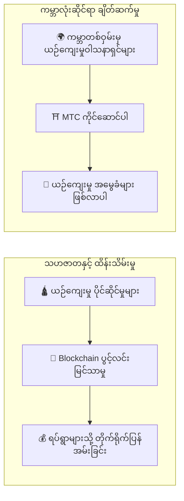

# ⛩️ Matsuri Coin မှ ကြိုဆိုပါသည်

> **သဟဇာတအတွက် ကုဒ်။ ငြိမ်းချမ်းရေးအတွက် တန်ဖိုး။**
> ကွဲပြားနေသော ကမ္ဘာတွင် "Wa" ၏ တံတား။ MTC သည် ယှဉ်ပြိုင်မှုမှ အတူတကွဖန်တီးမှုသို့ ဦးတည်စေသော လမ်းညွှန်အိမ်မြှောင်ဖြစ်သည်။

**Matsuri Coin (MTC)** သည် Solana blockchain ပေါ်တွင် တည်ဆောက်ထားသော ဗဟိုမဲ့ utility token ဖြစ်သည်။
**"Culture OS"** အဖြစ် ဒီဇိုင်းထုတ်ထားပြီး ဂျပန်၏ ဝိညာဉ်ရေး အမွေအနှစ် — "Deep Japan" — ကို ကမ္ဘာ့စီးပွားရေးနှင့် ချိတ်ဆက်ပေးသည်။

ကျွန်ုပ်တို့သည် ငွေပေးချေမှု လမ်းကြောင်းတစ်ခုကိုသာ တည်ဆောက်နေခြင်းမဟုတ်ပါ။
ကျွန်ုပ်တို့သည် **ဂျပန်နှင့် ကမ္ဘာကြားတွင် တံတားတစ်စင်း** — ယဉ်ကျေးမှုကို ချစ်မြတ်နိုးသူများ နယ်စပ်ဖြတ်ကျော်၍ လက်တွဲကြသော အတူတကွ ဖန်တီးမှု မူဘောင်အသစ်ကို တည်ဆောက်နေသည်။

---

## 🎯 ကျွန်ုပ်တို့၏ မစ်ရှင်

:::info ယန်း ၁၀ ထရီလီယံ ဈေးကွက်စွမ်းအင်ကို ယဉ်ကျေးမှု၏ အနာဂတ်သို့ ပေးပို့ခြင်း
ဂျပန်၏ inbound ခရီးသွားဈေးကွက်သည် နှစ်စဉ် **ယန်း ၁၀ ထရီလီယံ** သို့ မြင့်တက်နေသည်။
သို့သော် ထိုခေါင်းစဉ်အောက်တွင် **အဆင်မပြေသော အမှန်တရား** တစ်ခု ရှိသည်။
:::

### ဘယ်သူမှ မပြောသော ပြဿနာများ

| ပြဿနာ | အမှန်တကယ် ဖြစ်နေသည်မှာ |
| :--- | :--- |
| 💸 **ဝင်ငွေ ယိုစိမ့်မှု** | Inbound ဝင်ငွေ၏ အကြီးမားဆုံးအစိတ်အပိုင်းသည် နိုင်ငံခြား OTA များနှင့် ကြားခံများထံ ကော်မရှင်အဖြစ် နိုင်ငံပြင်သို့ ယိုစိမ့်နေသည် |
| 😤 **ရပ်ရွာ ပင်ပန်းနွမ်းနယ်မှု** | Over-tourism သည် ဒေသများကို လူစုလူဝေးဖြင့် ရေလွှမ်းမိုးနေသော်လည်း ဤဝန်ထုပ်ဝန်ပိုးကို ထမ်းဆောင်နေသော ရပ်ရွာများသို့ အမြတ်တစ်စုံတစ်ရာ ပြန်လည်စီးဆင်းခြင်းမရှိ |
| 🚧 **အတွေ့အကြုံ အတားအဆီး** | ပက်ကေ့ချ် ခရီးစဉ်များသည် မျက်နှာပြင်ကိုသာ ခြစ်ရန်သက်သက်ဖြစ်ပြီး — ခရီးသွားများသည် *စစ်မှန်သော* ဂျပန်နှင့် မချိတ်ဆက်နိုင် |

> **"ဒေသခံများ ရုန်းကန်နေသည်၊ ခရီးသွားများက ပြကွက်တစ်ခုကိုသာ မြင်ရသည်၊ ဆိုလျှင် ချမ်းသာမှုက ပလက်ဖောင်းကြေးများထဲသို့ ပျောက်ကွယ်သွားသည်။"**

ကျွန်ုပ်တို့သည် ဤပျက်စီးနေသော စနစ်ကို ဖြိုခွဲရန် Web3 ကို အသုံးပြုနေသည်။
သင်၏ ငွေပေးချေမှုသည် ဒေသရပ်ရွာများနှင့် အမွေအနှစ်ထိန်းသိမ်းရေးသို့ **တိုက်ရိုက်** ရောက်ရှိသည် — အပြည့်အဝ ပွင့်လင်းမြင်သာစွာ၊ ကြားခံခံ လုံးဝမရှိ။

---

## 🏗️ ပေါင်းစပ်မော်ဒယ်: ယဉ်ကျေးမှု × နည်းပညာ

Crypto ပရောဂျက်အများစုသည် အမြတ်ကို လိုက်စားပြီး ယဉ်ကျေးမှုကို စွန့်ပစ်နိုင်သည့်အရာအဖြစ် ဆက်ဆံသည်။
MTC က ပြောင်းပြန်လုပ်သည်: ကျွန်ုပ်တို့သည် **"ယဉ်ကျေးမှုကို ကာကွယ်သော စီးပွားရေး"** — ပထမနေ့ကတည်းက ရှိသင့်ခဲ့သော ပေါင်းစပ်ဖွဲ့စည်းပုံကို တည်ဆောက်သည်။

| မဏ္ဍိုင် | အဓိပ္ပာယ် |
| :--- | :--- |
| **🛕 သဟဇာတနှင့် ထိန်းသိမ်းမှု** | ခရီးသွားငွေပေးချေမှုများသည် blockchain လမ်းကြောင်းမှတဆင့် ယဉ်ကျေးမှုထိန်းသိမ်းရေးနှင့် လက်မှုပညာရှင် ထောက်ပံ့ရေးသို့ တိုက်ရိုက်စီးဆင်းသည် |
| **🌍 ကမ္ဘာလုံးဆိုင်ရာ ချိတ်ဆက်မှု** | မည်သူမဆို မည်သည့်နေရာကမဆို ဂျပန်၏ "Wa" စိတ်ဓာတ်ကို ပံ့ပိုးနိုင်သော အခြေခံအဆောက်အအုံ |

---

## 💎 MTC ကို ဘာကြောင့် အသုံးပြုရသနည်း။

MTC ဂေဟစနစ်သည် **ဝိညာဉ်ရေးဆိုင်ရာ ပြည့်ဝမှု** နှင့် **ရုပ်ဝတ္ထုဆိုင်ရာ ငွေကြေးအကျိုးအမြတ်** နှစ်မျိုးလုံးကို ပေးစွမ်းသည်။

### ✨ အတွေ့အကြုံ တန်ဖိုး

| အကျိုးခံစားခွင့် | အသေးစိတ် |
| :--- | :--- |
| **🎌 အဓိပ္ပာယ်ပြည့်ဝသော အတွေ့အကြုံများ** | "Deep Japan" ကို ဖွင့်လှစ်ပါ — အများပြည်သူ မဝင်ခွင့်ရသော ဘုရားကျောင်းများ၊ သီးသန့်ဘုရားကျောင်း ဓလေ့ထုံးစံများ |
| **🌐 တစ်သက်တာ ပူးပေါင်းမှု** | အိမ်ပြန်ပြီးနောက်တိုင် MTC မှတဆင့် ဂျပန်နှင့် ချိတ်ဆက်နေပါ |
| **⚖️ မျှတသော ဖလှယ်မှု** | Smart contract များသည် ကြားခံများကို ဖယ်ရှားပေးသည် |

### 💰 ငွေကြေးဆိုင်ရာ အကျိုးအမြတ်

| အကျိုးခံစားခွင့် | အသေးစိတ် |
| :--- | :--- |
| **🏷️ ဦးစားပေး နှုန်းထားများ** | MTC ဖြင့် ပေးချေပြီး ယန်း စျေးနှုန်းထက် **5%–10%** သက်သာပါ |
| **🔑 သီးသန့် ဝင်ခွင့်** | ဖိတ်ကြားချက်ဖြင့်သာ ဝင်ရောက်နိုင်သော ကျင်းပခြင်းများအတွက် Ticket NFT များ — MTC ကိုင်ဆောင်သူများသာ |
| **🛡️ ငွေကြေး ဟက်ခ်ျ** | ခရီးမထွက်ခင် အတွေ့အကြုံတန်ဖိုးကို ချိတ်ညှိပါ — ငွေလဲနှုန်း အပြောင်းအလဲ စိတ်ပူစရာ မလို |

---

## ⚡ ဘာကြောင့် Solana ကို ရွေးချယ်ရသနည်း။

"စစ်မှန်သော ခရီးသွား ဝယ်လိုအား" နှင့် "အလျင်အမြန် ငွေကြေးကုန်သွယ်မှု" နှစ်ခုလုံးကို ဆောင်ရွက်ရန် blockchain ပံ့ပိုးနိုင်သည့် **နည်းလမ်းတစ်ခုတည်း** ကျန်သည်။

| မက်ထရစ် | Ethereum | Solana |
| :--- | :---: | :---: |
| **ငွေလွှဲခ** | ယန်း ၁၀၀–¥၁,၀၀၀ | **~¥ ₀.၀၄** |
| **Finality** | ၁၂ စက္ကန့် – မိနစ်များ | **၀.၄ စက္ကန့်** |
| **Throughput** | ~15 TPS | **ထောင်ပေါင်းများစွာ TPS** |

:::tip ဘုရားကျောင်း လှူဖွယ် စမ်းသပ်မှု
"ယန်း ၁၀၀ ကို ငွေပုံးထဲ ထည့်လှူသည့်လို" မိုက်ခရိုပေးချေမှုတစ်ခုသည် ကြေး **ယန်း ၁ အောက်** ရှိရမည်။ Solana သာလျှင် ဤစမ်းသပ်မှုကို ကျော်ဖြတ်နိုင်သည်။
:::

---

:::note စတင်ရန် အဆင်သင့်ဖြစ်ပါပြီ
MTC သည် ယဉ်ကျေးမှုကို *စားသုံး* ရုံသက်သက်ဖြစ်သော ခရီးသွားလုပ်ငန်း ခေတ်ကို အဆုံးသတ်သည်။ **အတူတကွ ဖန်တီးမှု** ခရီးထွက်ကြပါစို့ — အနာဂတ်ကို အတူတူ တည်ဆောက်ကြပါစို့။
:::

**[▶ ရူပါ: ဘာကြောင့် အခုလဲ?](/docs/vision)** ｜ **[▶ GCF တွင် ပါဝင်ပါ](/docs/economy)**
