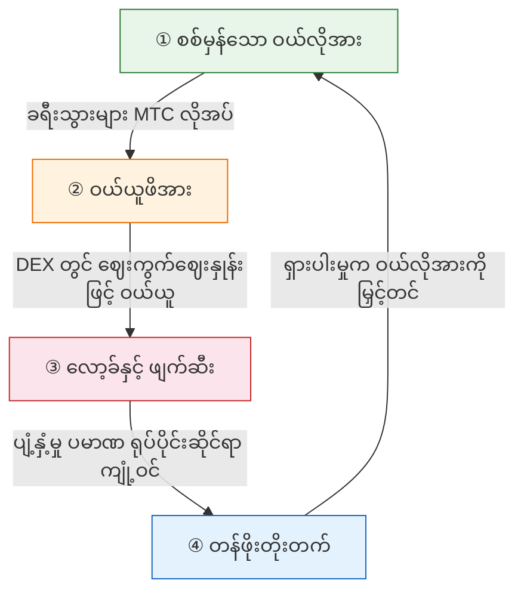
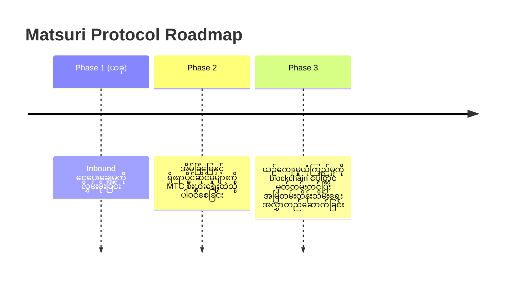

# 🎯 ရူပါ: "Inbound-First" မဟာဗျူဟာ

> **ထောက်ပံ့ငွေ မှီခိုမှုမှ အချုပ်အခြာအာဏာသို့။**
> ကျေးလက်စီးပွားရေးကို အခွန်ငွေဖြင့် ထိန်းသိမ်းသော ခေတ်သည် ပြီးဆုံးပြီ။ ကျွန်ုပ်တို့သည် နိုင်ငံခြားအရင်းအနှီးကို ယဉ်ကျေးမှုထဲသို့ တိုက်ရိုက် ပေးပို့သည်။

ဒေသဆိုင်ရာ ပြန်လည်အသက်သွင်းရေး ပရောဂျက်အများစု ကျရှုံးသည် — အဘယ်ကြောင့်ဆိုသော် ၎င်းတို့သည် ကျုံ့ဝင်နေသော ပြည်တွင်းဘတ်ဂျက်များကို ရွှေ့ပြောင်းခြင်းသာ ပြုလုပ်ကြသောကြောင့်ဖြစ်သည်။

**Matsuri Protocol သည် ဆန့်ကျင်ဘက် ချဉ်းကပ်နည်းကို ယူသည်။**

---

## 1. မဟာဗျူဟာ: ယဉ်ကျေးမှု ပို့ကုန်စက်

ကျွန်ုပ်တို့သည် ဂျပန်၏ ခရီးသွားပိုင်ဆိုင်မှုများကို "စားသုံးနိုင်သည့်အရာများ" အဖြစ်မဟုတ်ဘဲ **ပို့ကုန်နိုင်သော ငွေကြေးတူရိယာများ** အဖြစ် ပြန်လည်သတ်မှတ်သည်။

| ပြဿနာ | လက်တွေ့ | သက်ရောက်မှု |
| :--- | :--- | :--- |
| 💸 **ဝင်ငွေ ယိုစိမ့်မှု** | နိုင်ငံခြား OTA များ (Booking.com, Expedia) ကော်မရှင် | ဝင်ငွေ **15%–20%** ပြည်ပသို့ ယိုစိမ့်မှု |
| 🚧 **မမြင်ရသော အတားအဆီး** | ဘာသာစကားနှင့် ငွေပေးချေမှု အတားအဆီးများ | ချမ်းသာသော ခရီးသွားများ "Deep Japan" ကို ဝင်ရောက်နိုင်ခြင်းမရှိ |

:::tip MTC ၏ အခန်းကဏ္ဍ
MTC သည် ယိုစိမ့်မှုကို ရပ်တန့်စေပြီး အတားအဆီးကို ဖြိုဖျက်သော **တစ်ခုတည်းသော Master Key** ဖြစ်သည်။
:::

---

## 2. စီးပွားရေး Flywheel

Matsuri Protocol ၏ အဓိက လက္ခဏာ: **ခရီးသွား စိတ်အားထက်သန်မှုသည် MTC ဈေးနှုန်းတိုးတက်မှုကို သင်္ချာနည်းအရ တွန်းအားပေးသည်။**
မျှော်လင့်ချက်မဟုတ် — **ဝယ်လိုအား-ရောင်းလိုအား ယန္တရား**

### MTC ဘာကြောင့် တက်သနည်း?

ဈေးနှုန်းကို အခြေခံသော **၄-ဆင့် အလိုအလျောက် သံသရာ:**

| အဆင့် | အမည် | ယန္တရား |
| :---: | :--- | :--- |
| **①** | **စစ်မှန်သော ဝယ်လိုအား** | ခရီးသွားများသည် guide booking နှင့် Ticket-NFT ဝယ်ယူမှုအတွက် MTC လိုအပ် |
| **②** | **ဝယ်ယူဖိအား** | MTC ကို DEX တွင် ဈေးကွက်ဈေးနှုန်းဖြင့် ဝယ်ယူ — စပ်ယူလေးရှင်းမဟုတ်ဘဲ စားသုံးမှုအခြေပြု |
| **③** | **လော့ခ်နှင့် ဖျက်ဆီး** | ငွေပေးချေမှုတွင် အသုံးပြုသော MTC ၏ အစိတ်အပိုင်းကို smart contract များက ချက်ချင်း လော့ခ် သို့ ဖျက်ဆီး — ပျံ့နှံ့မှု ကျုံ့ဝင် |
| **④** | **တန်ဖိုး မြင့်တက်** | ဝယ်လိုအား တိုးလာ၊ ရောင်းလိုအား ကျဆင်း — ရှားပါးတန်ဖိုး သင်္ချာနည်းအရ တိုးတက် |

:::info အဓိက အမှန်တရား
**"ခရီးသွားများ ဂျပန်ကို ပိုခံစားရလေလေ MTC ကိုင်ဆောင်သူများ၏ ပိုင်ဆိုင်မှု ပိုတိုးလာလေလေ"**
ဤရိုးရှင်းသော ညီမျှခြင်းသည် ပရောဂျက်၏ နှလုံးခုန်ဖြစ်သည်။
:::

---

## 3. နောက်ဆုံးရလဒ်: Culture OS

ကျွန်ုပ်တို့၏ နောက်ဆုံးပန်းတိုင်သည် ငွေပေးချေမှုအက်ပ်တစ်ခုမဟုတ်ပါ။
**ယဉ်ကျေးမှုကိုယ်တိုင်ကို လည်ပတ်ရေးစနစ်အဖြစ် ပြောင်းလဲခြင်း** ဖြစ်သည်။

> ကျွန်ုပ်တို့သည် **နှစ်ပေါင်း ၁,၀၀၀ ရပ်တည်ခဲ့သော ယဉ်ကျေးမှု** ကို **ခေတ်မီ blockchain နည်းပညာ** ဖြင့် ကာကွယ်သည်။

---

**[▶ နောက်ထပ်: မည်သို့ ဝင်ငွေရသနည်း? (စီးပွားရေး)](/docs/economy)**
