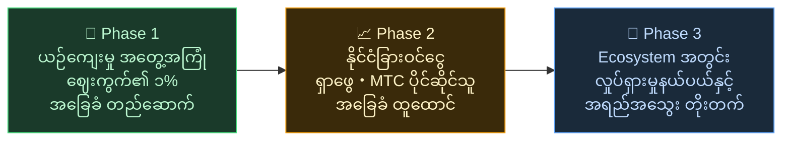

# 🌏 စိန်ခေါ်မှုနှင့် ဖြေရှင်းမှု——မသက်မသာ အမှန်တရားနှင့် မျှော်လင့်ချက်

> **ရည်မှန်းချက်သည် လှပသည်။ သို့သော် လက်တွေ့က ထိုရည်မှန်းချက်ကို တားဆီးနေသည်။**

---

## သို့သော် ဤရည်မှန်းချက်ကို တားဆီးသော မသက်မသာ အမှန်တရားများ ရှိသည်

:::info ယန်း ၁၀ ထရီလီယံ ဈေးကွက်စွမ်းအင်သည် ယဉ်ကျေးမှု ထိန်းသိမ်းသူများထံ မရောက်ရှိ
ဂျပန်၏ inbound ဈေးကွက်သည် နှစ်စဉ် **ယန်း ၁၀ ထရီလီယံ** အထိ ကြီးထွားနေသည်။
သို့သော် ထိုအကျိုးခံစားမှု အများစုသည် လက်တွေ့မြေပြင်သို့ မရောက်ရှိပါ။
:::

### MTC ရည်မှန်းသော ဈေးကွက်

ယန်း ၁၀ ထရီလီယံ အားလုံးကို ရယူရန် မဟုတ်ပါ။

ကျွန်ုပ်တို့ ဦးစွာ ဦးတည်သည်မှာ ထိုအထဲမှ **ယဉ်ကျေးမှုအတွေ့အကြုံ・guide・ဒေသတွင်း tour ဈေးကွက်** ဖြစ်သည်။ ဤနယ်ပယ်၏ **၁% (ယန်း ၁၀၀ ဘီလီယံခန့်)** ကို ပထမဦးစွာ ပန်းတိုင်အဖြစ် သတ်မှတ်၍ သေးငယ်စွာ စတင်ကာ တောင့်တင်းအောင် တည်ဆောက်ပါသည်။

| Phase | မဟာဗျူဟာ | ပန်းတိုင် |
| :--- | :--- | :--- |
| **သေးငယ်စွာ စတင်** | ယဉ်ကျေးမှု အတွေ့အကြုံ・guide tour ကို အာရုံစိုက်။ အတွေ့အကြုံ စုဆောင်း၊ နှုတ်ကတိဖြင့် ချဲ့ထွင် | ဝင်ငွေ အခြေခံ ထူထောင်ခြင်း |
| **တောင့်တင်းအောင်** | နိုင်ငံခြား ဝင်ငွေ (inbound) ရယူ၊ MTC ပိုင်ဆိုင်သူများသို့ ဝင်ငွေ ခွဲဝေသော ယန္တရားကို သက်သေပြ | MTC စီးပွားရေးဇုန် ယုံကြည်မှု တည်ဆောက်ခြင်း |
| **အရည်အသွေး မြှင့်** | အရွယ်အစား တစ်စုံတစ်ရာ ရောက်ပြီးနောက် ချဲ့ထွင်ခြင်းထက် ecosystem အတွင်း အတွေ့အကြုံ အရည်အသွေး・လှုပ်ရှားမှု နယ်ပယ်・အသိုက်အဝန်း နက်ရှိုင်းမှု တိုးတက်အောင် | ရေရှည်တည်တံ့သော ယဉ်ကျေးမှု စီးပွားရေးဇုန် |

> **ပမာဏကို မလိုက်စားဘဲ ပါဝင်သူ၏ အရည်အသွေးနှင့် အတွေ့အကြုံ နက်ရှိုင်းမှုဖြင့် ကြီးထွားမည်။** ၎င်းသည် MTC ၏ ချဲ့ထွင်မှု မဟာဗျူဟာ ဖြစ်သည်။

Web2 platform များသည် ကမ္ဘာတစ်ဝှမ်းမှ လူများထံ ခရီးသွား၏ အံ့ဖွယ်အလှတရားကို ပို့ဆောင်ပေးခဲ့သည်။ ထိုအောင်မြင်ချက်ကို ကျွန်ုပ်တို့ ကျေးဇူးတင်ပါသည်။
သို့သော် ဗဟိုစီမံခန့်ခွဲမှုပုံစံတွင် ရှောင်လွှဲ၍မရသော ဘေးထွက်ဆိုးကျိုးများ ရှိခဲ့ပါသည်။

Algorithm များက "ဘာကို ပြမည်" ဆုံးဖြတ်ပြီး လုပ်ငန်းရှင်များကို ပြသသည့် အဆင့်အတွက် ယှဉ်ပြိုင်ခိုင်းသည်။ review အဆင့်သတ်မှတ်ချက်တစ်ခုက ရောင်းအားကို အပြောင်းအလဲ ဖြစ်စေနိုင်ပြီး ကော်မရှင်နှုန်းကို platform က တစ်ဖက်သတ် ပြောင်းနိုင်သည်—လက်တွေ့မြေပြင်က "ရွေးခြင်းခံရမည် သို့မဟုတ် ပျောက်ကွယ်သွားမည်" ဟူသော စိုးရိမ်မှုထဲတွင် အမြဲရှိနေသည်။

ဤဖွဲ့စည်းပုံက လုပ်ငန်းရှင်များအကြား ကွဲပြားမှုနှင့် မမြင်ရသော စည်းမျဉ်းများကို ကြောက်ရွံ့မှုကို ဖန်တီးသည်။ ဘေးနားဆိုင်က ပြိုင်ဘက်ဖြစ်လာပြီး ပူးပေါင်းမှုထက် ဆုပ်ကိုင်ခြင်းက ပိုမိုကျိုးကြောင်းဆီလျော်သည်။ ခရီးသွားများလည်း "ကြယ်အရေအတွက်" နှင့် "rank" ဖြင့် တစ်ပုံစံတည်း ရွေးချယ်စရာများသာ ရရှိပြီး အမှန်တကယ် တန်ဖိုးရှိသော အတွေ့အကြုံများ နစ်မြုပ်သွားသည်။

:::danger လက်တွေ့မြေပြင်က ရင်ဆိုင်နေရသော စိန်ခေါ်မှု ၃ ခု
💸 **ဝင်ငွေ ယိုစိမ့်မှု** — ဝင်ငွေ အများစုသည် နိုင်ငံခြား OTA များနှင့် ကြားခံများထံ ကော်မရှင်အဖြစ် နိုင်ငံပြင်သို့ ယိုစိမ့်နေသည်

😤 **ဒေသ ပင်ပန်းနွမ်းနယ်မှု** — overtourism ဝန်ထုပ်ဝန်ပိုးသာ ကျန်ရှိပြီး အရေးကြီးသော ဝင်ငွေသည် ဒေသသို့ ပြန်လည်မစီးဆင်း

🚧 **အတွေ့အကြုံ အတားအဆီး** — algorithm များက ရွေးသော ပုံစံတူ tour များသာ ပြသပြီး "စစ်မှန်သော ဂျပန်" နှင့် မဆုံမိ
:::

> **ဂျပန်သားများ ဒုက္ခခံနေရသည်၊ ခရီးသွားများက စစ်မှန်သောပုံရိပ်ကို မမြင်ရ၊ ချမ်းသာမှုက platform များထံ ပျောက်ကွယ်သွားသည်။**

---

## ဒါဆိုရင် မည်သို့ ပြောင်းလဲနိုင်မည်နည်း?

သို့သော် ယခု ဤဖွဲ့စည်းပုံကို အခြေခံမှ ပြောင်းလဲနိုင်သော နည်းပညာများ စုံစုံလင်လင် ရောက်ရှိလာပြီ ဖြစ်သည်။

:::tip Smart Contract——ပြန်ပြောင်းမရနိုင်သော ဘုံစည်းမျဉ်းများ
ကော်မရှင်နှင့် သတ်မှတ်ချက်များကို ကုဒ်ထဲတွင် ထွင်းထုထားပြီး မည်သူမျှ တစ်ဖက်သတ် ပြောင်းလဲ၍မရ။ အားလုံးအတွက် တရားမျှတသော စည်းမျဉ်းများ အလိုအလျောက် အကောင်အထည်ဖော်သည်။
:::

:::tip Blockchain——အားလုံးမြင်နိုင်သော ပွင့်လင်းမြင်သာမှု
ငွေကြေးလုပ်ငန်းစဉ်များ အားလုံး အများပြည်သူ စာရင်းတွင် မှတ်တမ်းတင်ထားပြီး မည်သူမဆို စစ်ဆေးနိုင်သည်။ ဒေတာကို ကုမ္ပဏီအတွင်း ပိတ်ထားသော ခေတ် ကုန်ဆုံးပြီ။
:::

:::tip Solana——၀.၄ စက္ကန့်အတွင်း ငွေရှင်း၊ ကြေး ၀.၀၄ ယန်း
ကြားခံ ကော်မရှင်များ ထပ်ထပ်ပေးရန် သို့မဟုတ် ရက်အချို့ စောင့်ရန် မလို။ လူနှင့်လူ တိုက်ရိုက် ချိတ်ဆက်နိုင်သည်။
:::

:::tip AI——စီမံခန့်ခွဲမှု ကုန်ကျစရိတ်ကိုယ်တိုင် ဖျက်သိမ်းသည်
ပေါက်ကွဲသော ကုန်ထုတ်စွမ်းအား တိုးတက်မှုသည် ကြီးမားသော platform များ ထိန်းသိမ်းရန် လိုအပ်သော ကုန်ကျစရိတ် ဖွဲ့စည်းပုံကို အတိတ်ကာလသို့ ပို့လွှတ်သည်။
:::

ကြားခံ စီမံသူများကို အားကိုးရန် မလိုတော့ဘဲ လူသားများ တိုက်ရိုက် ချိတ်ဆက်နိုင်သော ခေတ်ဖြစ်ပြီ။

ကျွန်ုပ်တို့သည် ဤနည်းပညာဖြင့် inbound စီးပွားရေးကို လက်ဝါးကြီးအုပ်ခြင်းမှ လွတ်မြောက်စေပြီး ဝင်ငွေကို ဂျပန်နှင့် နိုင်ငံများ၏ လက်တွေ့မြေပြင်သို့ ပြန်ပို့မည်။
ထို့ပြင် ဂျပန်တစ်နိုင်ငံတည်း မဟုတ်ဘဲ **ကမ္ဘာ့ ယဉ်ကျေးမှုများကို ကာကွယ်ပြီး ချိတ်ဆက်သော စနစ်**ကို တည်ဆောက်မည်။

---

**[◀ နောက်သို့: Vision・ရည်မှန်းချက်](/docs/vision)**｜**[▶ ရှေ့သို့: MTC ပုံဖော်သော အနာဂတ်](/docs/future)**
