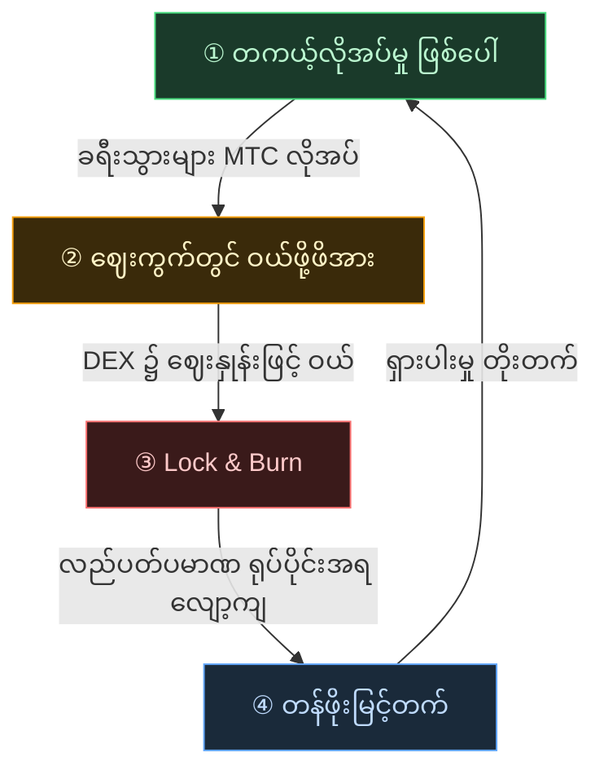

# 🔄 စီးပွားရေး Flywheel——ကြီးထွားမှု၏ လည်ပတ်ခြင်းနှင့် ယဉ်ကျေးမှု OS

> **ခရီးသွားများက ဂျပန်ကို ပျော်ရွှင်လေ၊ ecosystem ၏ လိုအပ်ချက် ပိုမိုမြင့်တက်လေ။**
> ဤ ပေးသွင်း-လိုအပ်ချက် ယန္တရားသည် ပရောဂျက်၏ နှလုံးသားပင် ဖြစ်သည်။

---

## MTC ၏ ပေးသွင်း-လိုအပ်ချက် ယန္တရား

Matsuri Protocol ၏ ဒီဇိုင်းအရ **တကယ့်လိုအပ်မှု တိုးများခြင်းသည် ဝယ်ယူဖို့ဖိအားကို မွေးဖွားစေပြီး ထောက်ပံ့မှု လျော့နည်းခြင်းနှင့် ပေါင်းစပ်ခြင်းဖြင့် တန်ဖိုးမြင့်တက်ရန် အခြေအနေများ ပြည့်စုံလာသော** ယန္တရား ဖြစ်သည်။
ဤသည်မှာ စိတ်ခံစားချက် အခြေခံ မဟုတ်ဘဲ **လိုအပ်ချက်နှင့် ထောက်ပံ့မှု၏ ယန္တရား** ဖြစ်သည်။

အောက်ပါ **အဆင့် ၄ ဆင့် လည်ပတ်ခြင်း**သည် ဤယန္တရားကို ထောက်ပံ့ပေးသည်။

| အဆင့် | အမည် | ယန္တရား |
| :---: | :--- | :--- |
| **①** | **တကယ့်လိုအပ်မှု ဖြစ်ပေါ်** | ခရီးသွားများသည် guide ဘုကင်၊ ticket NFT ဝယ်ရန် MTC လိုအပ်သည် |
| **②** | **ဈေးကွက်တွင် ဝယ်ဖို့ဖိအား** | DEX (ဗဟိုမဲ့ လဲလှယ်မှုစင်တာ) တွင် MTC ကို ဈေးနှုန်းဖြင့် ဝယ်ယူသည်။ ကြံစည်မှု မဟုတ်ဘဲ သုံးစွဲမှု အခြေခံ ခိုင်မာသော ဝယ်လိုအား |
| **③** | **Lock & Burn** | ငွေပေးချေမှုတွင် သုံးသော MTC ၏ အချို့ကို smart contract ဖြင့် ချက်ချင်း lock သို့မဟုတ် burn။ လည်ပတ်ပမာဏသည် ရုပ်ပိုင်းအရ လျော့ကျ |
| **④** | **ရှားပါးမှု တိုးတက်** | ဝယ်လိုအား တိုးများ၊ ရောင်းအား လျော့နည်း။ ပေးသွင်း-လိုအပ်ချက် ပြောင်းလဲမှုဖြင့် တစ်ဒင်္ဂါးစီ၏ ရှားပါးမှု မြင့်တက်သော ဖွဲ့စည်းပုံ |

---

---

:::note ဤညီမျှခြင်းက ထောက်ပံ့သော ရူပါ
Flywheel နောက်ကွယ်ရှိ "ယဉ်ကျေးမှု OS" ၏ အပြည့်အစုံကို နောက်စာမျက်နှာ [MTC ပုံဖော်သော အနာဂတ်](/docs/future) တွင် အသေးစိတ် ပြောပြပါမည်။
:::

---

**[◀ နောက်သို့: စိန်ခေါ်မှုနှင့် ဖြေရှင်းမှု](/docs/challenges)**｜**[▶ ရှေ့သို့: MTC ပုံဖော်သော အနာဂတ်](/docs/future)**
