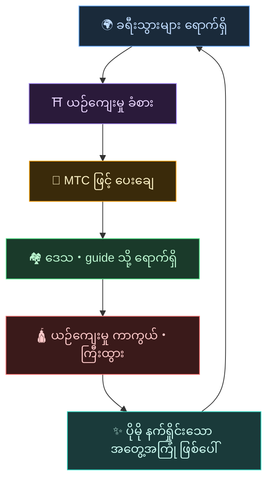
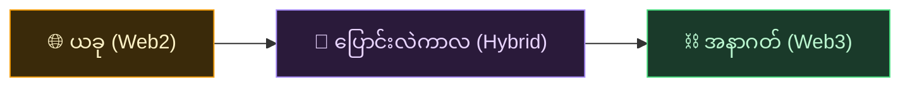
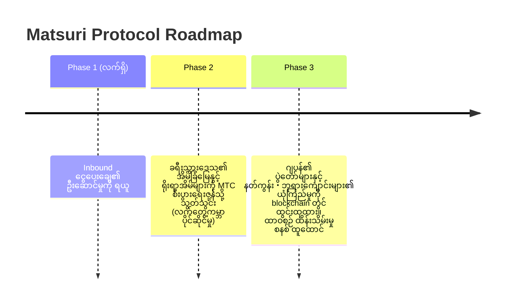

# 🌀 MTC ပုံဖော်သော အနာဂတ်——"ပါဝင်မှု" တိုင်း လည်ပတ်သော စီးပွားရေး

> **ခံစားသူ၊ ပို့ဆောင်သူ၊ ကာကွယ်သူ။ စိတ်အားလုံး စီးပွားရေးအဖြစ် လည်ပတ်ပြီး ယဉ်ကျေးမှုကို နောက်မျိုးဆက်သို့ ပို့ဆောင်သည်။**

---

## ကျွန်ုပ်တို့ အကောင်အထည်ဖော်လိုသော လည်ပတ်မှု

MTC သည် ကြံစည်မှုအတွက် token မဟုတ်ပါ။

ခရီးသွားများ ဂျပန်ယဉ်ကျေးမှုနှင့် ထိတွေ့၊ ကြည်နူး။
Guide များက ထိုကြည်နူးမှုကို ပို့ဆောင်၊ ဆုလာဘ်ရရှိ။
ဒေသသည် စည်ပင်ကာ ယဉ်ကျေးမှုကို ဆက်လက် ကာကွယ်နိုင်။
ထိုယဉ်ကျေးမှုသည် ခရီးသွားအသစ်များကို ပြန်လည် ဆွဲဆောင်ပြန်။

ဤလည်ပတ်မှုသည်ပင် MTC ၏ ရှိနေခြင်း အကြောင်းရင်း ဖြစ်သည်။

---

## သုံးဘက်လုံး အကျိုးခံစားသော စီးပွားရေး

အရင်ခေတ် ခရီးသွားလုပ်ငန်းတွင် ခရီးသွားများက ငွေပေးချေ၊ platform က အမြတ်ယူ၊ လက်တွေ့မြေပြင်တွင် မကျန်ခဲ့။
MTC ၏ စီးပွားရေးဇုန်တွင် ပါဝင်သူ အားလုံး အကျိုးခံစားရသည်။

| ပါဝင်သူ | ဘာဖြစ်သနည်း | မည်သို့ ဆုလာဘ် ရရှိသနည်း |
| :--- | :--- | :--- |
| **🌍 ခံစားသူ** | ဂျပန်ယဉ်ကျေးမှုနှင့် ထိတွေ့၊ MTC ဖြင့် ပေးချေ | ယန်းထက် စျေးသက်သာ၍ အစစ်အမှန် အတွေ့အကြုံသို့ ဝင်ရောက်နိုင်။ ပြန်သွားပြီးနောက်လည်း MTC မှတဆင့် ဆက်သွယ်ထားနိုင် |
| **⛩️ ပို့ဆောင်သူ** | Guide အဖြစ် ပွဲကျင်းပ၊ J-Times တွင် content ထုတ်လုပ် | အကြား အမြတ်ယူမှု မရှိသော တိုက်ရိုက် ဆုလာဘ်။ လှုပ်ရှားလေ MTC ဖြင့် ဆုလာဘ်ပိုရလေ |
| **🏘️ ကာကွယ်သူ** | ဒေသအသိုက်အဝန်းအဖြစ် ယဉ်ကျေးမှုကို ထိန်းသိမ်း・မျိုးဆက်ပေးခဲ့ | ဝင်ငွေသည် တိုက်ရိုက်ရောက်ရှိ။ overtourism မဟုတ်ဘဲ ရေရှည်တည်တံ့သော ပုံစံဖြင့် စည်ပင် |

---

## စီးပွားရေးဇုန် ကျယ်ပြန့်လေ ယဉ်ကျေးမှု ပိုခိုင်မာလေ

MTC စီးပွားရေးဇုန်သည် အတွေ့အကြုံ ဘုကင်မှ စတင်၍ နောက်ပိုင်း နေ့စဉ်ဘဝ အစွန်းအစွန်သို့ ချဲ့ထွင်သွားသည်။

- **အတွေ့အကြုံ** — အစစ်အမှန် ယဉ်ကျေးမှု အတွေ့အကြုံ၊ ဘုရားဖူး mining
- **အဝတ်အစား・အစားအသောက်・နေရာ** — guesthouse၊ ဆိုင်၊ အစားအသောက်၊ fashion
- **အတူတကွ ဖန်တီးသည့် ပရောဂျက်** — crowdfunding ဖြင့် ယဉ်ကျေးမှုကို ကာကွယ်သည့် ရင်းနှီးမှု
- **ကွဲပြားသော ယဉ်ကျေးမှု၏ နိုင်ငံတကာ နားလည်မှု** — နယ်စပ်ကျော်လွန်သော ဖလှယ်မှုနှင့် အပြန်အလှန် နားလည်မှု နေရာ

စီးပွားရေးဇုန် ကျယ်ပြန့်လေ MTC မှတဆင့် လည်ပတ်မှုသည် ပိုမိုထူထဲလာပြီး ယဉ်ကျေးမှုကို ထောက်ပံ့သော စွမ်းအားသည် ပိုခိုင်မာလာသည်။
ဤသည်မှာ လုပ်ငန်းပုံစံမျှသာ မဟုတ်ဘဲ **ယဉ်ကျေးမှု၏ အသက်ထိန်းသိမ်းသည့် ကိရိယာ** ဖြစ်သည်။

---

## Web2 မှ Web3 သို့——မတိုက်ရိုက်ဘဲ အဆင့်ဆင့်

ကျွန်ုပ်တို့သည် ချက်ချင်း "အားလုံးကို blockchain ပေါ်သို့" ဟု မပြောပါ။

ယခု Web3 နှင့် အကျွမ်းမဝင်သေးသူများ အများစုဖြစ်သည်။ ထို့ကြောင့်ပင် **အသုံးပြုရ အကျွမ်းဝင်သော ပုံစံမှ စတင်၍ တစ်ဖြည်းဖြည်း Web3 ၏ အကျိုးခံစားမှုကို ခံစားစေသော** ဒီဇိုင်းကို လုပ်ထားသည်။

| Phase | အသုံးပြုသူ အတွေ့အကြုံ | နောက်ကွယ် ယန္တရား |
| :--- | :--- | :--- |
| **ယခု** | ပုံမှန် web app အဖြစ် အတွေ့အကြုံ ဘုကင်・ငွေပေးချေ။ credit card ဖြင့် ရ | Django + Stripe။ wallet မလိုဘဲ စတင်နိုင် |
| **ပြောင်းလဲကာလ** | app တွင် MTC ရယူ・အသုံးပြု။ wallet ချိတ်ဆက်မှုသည် one-tap | Off-chain score သည် တစ်ဆင့်ချင်း on-chain သို့ ပြောင်းရွှေ့ |
| **အနာဂတ်** | လုပ်ငန်းစဉ်・အခွင့်အရေး အားလုံး blockchain ပေါ်တွင် ပွင့်လင်းစွာ မှတ်တမ်းတင်။ သင်၏ ပါဝင်ဆောင်ရွက်မှု အမြဲ သက်သေပြ | Smart contract ဖြင့် အပြည့်အလိုအလျောက် ပြုပြင်၍မရသော စီးပွားရေး |

:::tip Web3 မခက်ခဲပါ
Wallet ပြုပြင်မှု၊ seed phrase စီမံခြင်းကို အစပိုင်းတွင် မလိုအပ်ပါ။ အသုံးပြုရင်း သဘာဝအတိုင်း Web3 ကမ္ဘာနှင့် ထိတွေ့သွားသည်—**သတိမထားမိခင် Web3 ၏ နေထိုင်သူ ဖြစ်နေပြီ။** ထိုအတွေ့အကြုံကို ဒီဇိုင်းလုပ်ထားသည်။
:::

---

## စွမ်းအား မဟုတ်ဘဲ စာနာမှုဖြင့် လှုပ်ရှားသော စီးပွားရေး

ထို့ပြင် ဤစီးပွားရေးဇုန်သည် smart contract ဖြင့် လှုပ်ရှားသည်။
တစ်ဦးတစ်ယောက်၏ အာဏာ သို့မဟုတ် အဆင်ပြေမှုအရ စည်းမျဉ်းကို တစ်ဖက်သတ် မပြောင်းနိုင်—**စွမ်းအားဖြင့် လက်ရှိအခြေအနေ ပြောင်းလဲမှု မပြုနိုင်သော စီးပွားရေး ယန္တရား** ဖြစ်သည်။

ထိုအပေါ်တွင် ရှေးဟောင်း ဉာဏ်ပညာကို သင်ယူရင်း တန်ဖိုးသစ်များကို ဆက်လက် ဖန်တီးမည်။ 温故知新 (အွန်ကို ချိရှင်) ၊ ပြီးနောက် ဖန်တီးမှုသစ်သို့။

> **Yen မရှိဘဲ၊ Dollar မရှိဘဲ၊ ယဉ်ကျေးမှုကို အခြေခံ၍ ဘဝ တည်ဆောက်နိုင်သော ကမ္ဘာ။**
>
> ငွေကြေးတန်ဖိုးကို တစ်ဦးတစ်ယောက်ထံ အပ်မထားဘဲ မိမိ၏ "ပါဝင်မှု" ဖြင့် တန်ဖိုးကို ဖန်တီးပြီး အသုံးပြု။
> ထိုသည်မှာ MTC ပို့ဆောင်လိုသော လွတ်လပ်မှုဖြစ်သည်။

---

## 🏁 နောက်ဆုံး ပန်းတိုင်: "ယဉ်ကျေးမှု OS"

ကျွန်ုပ်တို့၏ နောက်ဆုံး ပန်းတိုင်မှာ ငွေပေးချေ app မျှသာ မဟုတ်ပါ။
**ယဉ်ကျေးမှုကိုယ်တိုင်ကို OS (အခြေခံ) အဖြစ် ပြောင်းခြင်း** ဖြစ်သည်။

> ကျွန်ုပ်တို့သည် ရှေးဟောင်း ဉာဏ်ပညာကို နောက်ဆုံးပေါ် blockchain ဖြင့် ကာကွယ်မည်။
> ၎င်းသည် Matsuri Protocol ၏ ပုံဖော်သော အနာဂတ်ဒြပ် ဖြစ်သည်။

---

:::note ပုံပြင်ပိုင်းသည် ဤနေရာတွင် ပြီးဆုံးပါသည်
ဤနေရာအထိ ဖတ်ခဲ့သူများသည် MTC ဘာကြောင့် ရှိနေသည်ကို နားလည်ပြီ ဖြစ်သင့်ပါသည်။
နောက်သည် **【လက်တွေ့ပိုင်း】**——အမှန်တကယ် MTC ဖြင့် ဘာလုပ်နိုင်သည်ကို ကြည့်ကြပါစို့။
:::

**[◀ နောက်သို့: စီးပွားရေး Flywheel](/docs/flywheel)**｜**[▶ ရှေ့သို့: Ecosystem](/docs/ecosystem)**
