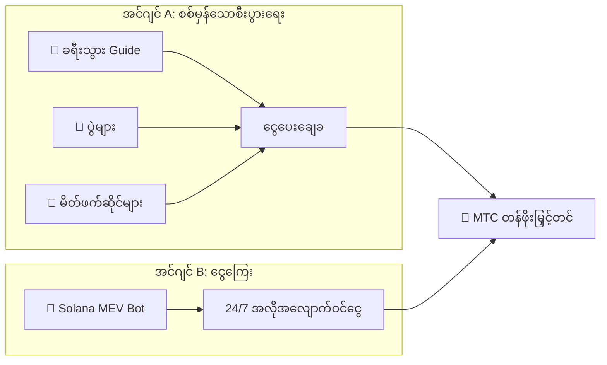

# 💰 စီးပွားရေး

> Matsuri Coin (MTC) စီးပွားရေးသည် ရိုးရှင်းသော်လည်း အတွေ့အကြုံရှိပြီးဖြစ်သည်။
> **ဝင်ငွေအင်ဂျင် နှစ်ခု — စစ်မှန်သော စီးပွားရေးနှင့် ငွေကြေးဆိုင်ရာ algorithms — သည် အမြတ်ထုတ်ပြီး ကိုင်ဆောင်သူများထံ ပရိုဂရမ်အတိုင်း ပြန်လည်ဖြန့်ဝေသည်။**


---

## 1. ဝင်ငွေအင်ဂျင် နှစ်ခု



| အင်ဂျင် | ဝင်ငွေရင်းမြစ် | လုပ်ဆောင်ပုံ |
| :--- | :--- | :--- |
| **🏯 အင်ဂျင် A** | ခရီးသွား guide, ပွဲများနှင့် မိတ်ဖက်ဆိုင်များမှ ကြေး | Inbound ခရီးသွား ပိုများလေ → နိုင်ငံခြားအရင်းအနှီး ပိုစီးဝင်လေ |
| **🤖 အင်ဂျင် B** | Solana MEV Bot အလိုအလျောက်ကုန်သွယ်မှု | CEO ဦးဆောင်သော high-frequency ပရိုဂရမ်သည် on-chain ထိရောက်မှုကွာဟချက်များမှ 24/7 အမြတ်ထုတ်ယူ |

---

## 2. Buyback Protocol (တန်ဖိုးမြှင့်တင်ရေး ယန္တရား)

ကျွန်ုပ်တို့သည် အမြတ်ကို ထုတ်ယူခြင်းမရှိ။ Smart contract စည်းမျဉ်းများသည် ဝင်ငွေကို **MTC တန်ဖိုးမြှင့်တင်မှု** သို့ တိုက်ရိုက်ပေးပို့သည်။

| ဝင်ငွေရင်းမြစ် | ခွဲဝေမှု | လုပ်ဆောင်ချက် |
| :--- | :---: | :--- |
| **Matsuri HQ အရောင်း** | **20%** | ဈေးကွက် **buyback** + liquidity-pool ထိုးသွင်း |
| **GCF Membership** ကြေး | **25%** | ဈေးကွက် **buyback** |

:::info အဓိက ယုတ္တိ
**"စီးပွားရေး ကြီးထွားမှု = MTC ကို ပွင့်လင်းဈေးကွက်တွင် အမြဲဝယ်နေသည်"**
:::

---

## 3. ဈေးနှုန်းဆုံးဖြတ်ရေး ယုတ္တိ

**AMM (Automated Market Maker) ဖော်မြူလာ** ပေါ်တွင် အခြေခံသည်။

```
Price = Liquidity (SOL) ÷ Supply (MTC)
```

| အဆင့် | ဖြစ်ပျက်သည်မှာ | ရလဒ် |
| :---: | :--- | :--- |
| **①** | စီးပွားရေးဝင်ငွေ (SOL) ကို pool ထဲထိုးသွင်း | **ပိုင်းခြေ ↑** |
| **②** | MTC ကို ဈေးကွက်မှ ပြန်ဝယ်ပြီး ဖျက်ဆီး | **ပိုင်းရှ ↓** |
| **③** | ပိုင်းခြေ ↑ × ပိုင်းရှ ↓ | **ဈေးနှုန်း သင်္ချာနည်းအရ တက်** |

---

## 4. GCF (Global Community Friends)

GCF သည် Matsuri ဂေဟစနစ်ကို ချဲ့ထွင်သော **ဖိတ်ကြားချက်ဖြင့်သာ** ဝင်ခွင့်ရသော မိတ်ဖက်အဖွဲ့အစည်း (DAO) ဖြစ်သည်။


### အဖွဲ့ဝင် အဆင့်များ

| အဆင့် | အခန်းကဏ္ဍ | အခွင့်ထူးများ |
| :---: | :--- | :--- |
| **👑 Platinum** | Owner / VIP | ထိပ်တန်းအခွင့်ထူးများ။ ပထမ **နေရာ ၅₀** ခုသာ |
| **🥇 Gold** | Ambassador | ပြုလုပ်သူများ။ လုပ်ဆောင်မှုမှတဆင့် **အကန့်အသတ်မရှိ** ရရှိခွင့် |

### အကျိုးခံစားခွင့် ①: Real-Work Mining

**MTC ၅၅၀ သန်း (~စုစုပေါင်းပမာဏ၏ ၆၁%)** သည် 2027 ဇွန် ၁ တွင် **Contributor Reward Pool** အဖြစ် လော့ခ်ဖွင့်မည်။

:::tip စွမ်းဆောင်ရည်အပေါ် အပြည့်အဝ အခြေခံ
MTC ကို သင်၏ ထုတ်လုပ်မှု (အရောင်း, ဧည့်သည်အရေအတွက်, guide sessions) အပေါ် အခြေခံ၍ pool မှ အလိုအလျောက်ဖြန့်ဝေသည်။
:::

**Halving အချိန်ဇယား (၂ နှစ် သံသရာ):**

| ကာလ | ထုတ်လွှတ်မှု | ပမာဏ |
| :--- | :---: | :--- |
| **Epoch 1** 2027–2029 | **50%** | ~275M tokens |
| **Epoch 2** 2029–2031 | **25%** | ~137M tokens |
| **Epoch 3** 2031–2033 | **12.5%** | ~68M tokens |

:::caution First-Mover Window
Bitcoin ၏ ၄ နှစ် halving ထက် မြန်ပါသည် — ကျွန်ုပ်တို့သည် **၂ နှစ် သံသရာ** ကို အသုံးပြုသည်။
:::

### အကျိုးခံစားခွင့် ②: Premium Referral ကော်မရှင်

ပရီမီယံ ကုန်ပစ္စည်းများ (membership, VIP tour) ကို ညွှန်းဆိုပြီး **ပရီမီယံ ကော်မရှင် (USDC + MTC)** ရယူပါ — smart contract မှ **ချက်ချင်း** ပေးချေ။

---

## 5. Token Specifications

Mint နှင့် Freeze authorities ကို Solana ပေါ်တွင် အပြီးတိုင် **ပယ်ဖျက်ပြီးဖြစ်သည်**။

| ကိစ္စ | အသေးစိတ် |
| :--- | :--- |
| **Token Name** | Matsuri Coin |
| **Ticker** | MTC |
| **Chain** | Solana |
| **Total Supply** | **900,000,000 MTC** (ပုံသေ) |
| **Mint Authority** | 🚫 ပယ်ဖျက်ပြီး |
| **Freeze Authority** | 🚫 ပယ်ဖျက်ပြီး |
| **Lock Contract** | Streamflow Finance (Verified) |

:::warning ဖိတ်ကြားချက်ဖြင့်သာ — နေရာ ကန့်သတ်ထားသည်
GCF သည် ကန့်သတ်ထားသော နေရာများ ပြည့်သွားသည်နှင့် လက်ခံခြင်းကို ပိတ်လိုက်မည်။
:::

---

**[▶ နောက်ထပ်: Ecosystem & Mining](/docs/ecosystem)** ｜ **[Discord သို့ ဝင်ပါ](#)**
