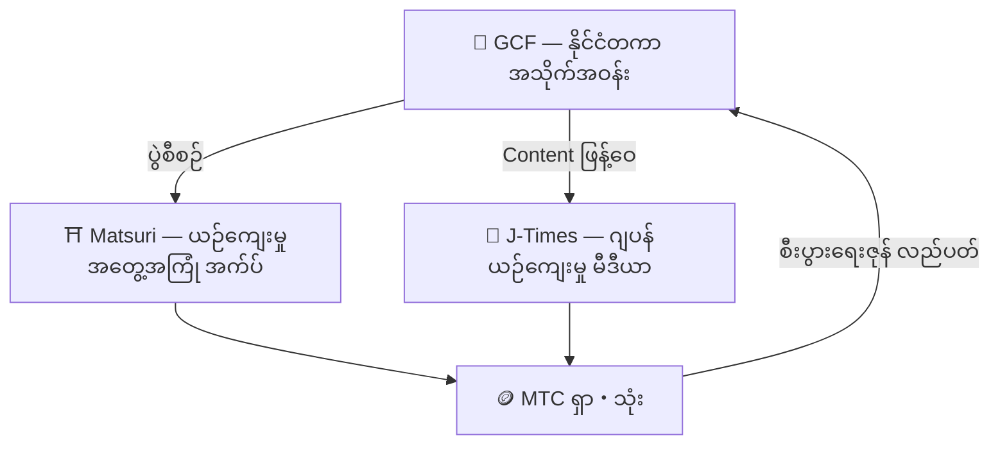

# 🏗️ MTC Ecosystem——အတွေ့အကြုံ・မီဒီယာ・အသိုက်အဝန်း လည်ပတ်သော စီးပွားရေးဇုန်

> **ရည်မှန်းချက်ကို အကောင်အထည်ဖော်ရန် "နေရာ" ၃ ခု။**
> ခံစားသော နေရာ၊ သိရှိသော နေရာ၊ ချိတ်ဆက်သော နေရာ——တစ်ခုစီ လွတ်လပ်စွာရှိရင်း MTC မှတဆင့် စီးပွားရေးဇုန် တစ်ခုအဖြစ် လည်ပတ်ပါသည်။

MTC သည် ရိုးရိုး token မျှသာ မဟုတ်ပါ။ ထုတ်ကုန် ၃ မျိုးနှင့် နိုင်ငံတကာ အသိုက်အဝန်း ပူးပေါင်းကာ ယဉ်ကျေးမှုကို ကာကွယ်ရန် စီးပွားရေးကို အကောင်အထည်ဖော်သည်။

:::tip 🤝 GCF — Ecosystem ကို လှုပ်ရှားစေသော နိုင်ငံတကာ အသိုက်အဝန်း
ဂျပန်ယဉ်ကျေးမှုကို နှစ်သက်သူများသည် နယ်စပ်ကျော်လွန်၍ ဆက်သွယ်သော နေရာ။ GCF က guide များကို စုစည်း၊ ထို GCF guide သည် Matsuri ပေါ်တွင် အတွေ့အကြုံ လုပ်ငန်းများကို တာဝန်ယူသည်။ ထို့ပြင် J-Times တွင် ဆွဲဆောင်သော content ကို ထုတ်လုပ်——အသိုက်အဝန်း၏ လှုပ်ရှားမှုသည် ecosystem တစ်ခုလုံး၏ အင်ဂျင် ဖြစ်သည်။
:::

:::tip ⛩️ Matsuri — ယဉ်ကျေးမှုအတွေ့အကြုံ အက်ပ်
ယဉ်ကျေးမှု အတွေ့အကြုံ ဘုကင်မှ စတင်၍ **guesthouse**၊ **ဆိုင်**၊ **crowdfunding** သို့ အဆင့်ဆင့် ချဲ့ထွင်။ အတွေ့အကြုံမှ အဝတ်・အစား・နေရာ・အတူတကွ ဖန်တီးသော ရင်းနှီးမှုသို့ စီးပွားရေးဇုန် ကျယ်ပြန့်သည်။

**ဘုရားဖူး Mining (သန့်ရှင်းသော ခရီး)** — နတ်ကွန်းများ၊ ဘုရားကျောင်းများ၊ ယဉ်ကျေးမှု landmark များကို အမှန်တကယ် သွားခြင်းဖြင့် MTC ရယူ။ နာမည်ကြီး spot များမှ ဒေသတွင်း အလွန်ထင်ရှားမှုမရှိသော နေရာများသို့ လူလှုပ်ရှားမှုကို သဘာဝအတိုင်း ခွဲဝေ၍ overtourism ပြေပြစ်မှုနှင့် ဒေသ တိုးတက်မှုကို တစ်ပြိုင်နက် အကောင်အထည်ဖော်။
:::

:::tip 📰 J-Times — ဂျပန်ယဉ်ကျေးမှု မီဒီယာ
ဂျပန်ယဉ်ကျေးမှု၏ ဆွဲဆောင်မှုကို ကမ္ဘာသို့ ပို့ဆောင်သော မီဒီယာ platform။ ဆောင်းပါးဖတ်・share စသည့် engagement မှတဆင့် MTC ရယူနိုင်။
:::

---

## 🤝 Social Mining (ချိတ်ဆက်၍ ရှာ)

**GCF Admin Dashboard ချိတ်ဆက် ── Web ဗားရှင်း အသုံးပြုနိုင်ပြီ (iOS အက်ပ်ကို 2026 ဧပြီတွင် ထုတ်မည်)**

GCF အဖွဲ့ဝင်များအတွက် သီးသန့် **GCF Admin Web** သို့ အသုံးပြုခွင့် ပေးအပ်ပါသည်။

| လုပ်ဆောင်ချက် | လုပ်နိုင်သည် |
| :--- | :--- |
| **🎪 ပွဲ ဖန်တီး** | မိမိ၏ ပွဲ・tour ကို စီစဉ်・တင်ဆက် |
| **📢 Content ဖြန့်ဝေ** | J-Times ဆောင်းပါး・content ကို ဖြန့်ဝေ・ပျံ့နှံ့ |
| **📊 Referral ခြေရာခံ** | မိတ်ဆက်ပေးထားသော အသုံးပြုသူ၏ လုပ်ဆောင်မှုနှင့် ဝင်ငွေကို real-time တွင် ခြေရာခံ |

:::info အလိုအလျောက် ဆုလာဘ်
မိတ်ဆက်ပေးသော သူငယ်ချင်းက ငွေပေးချေတိုင်း စနစ်က **အလိုအလျောက်** သင့် wallet သို့ ဆုလာဘ် (ဝင်ငွေခွဲဝေ) ကို လွှဲပေးပါသည်။
:::

---

## 🎓 Creator Economy (ဖန်တီး၍ ရှာ)

Content ကို အသုံးပြုရုံ မဟုတ်ဘဲ Matsuri platform တွင် **မည်သူမဆို** content ဖန်တီး၍ ဝင်ငွေရှာနိုင်သည်။

| Platform | Creator လုပ်နိုင်သည် | ဝင်ငွေပုံစံ |
| :--- | :--- | :--- |
| **📚 Course Marketplace** | ဂျပန်ယဉ်ကျေးမှု・ဘာသာစကား・လက်မှုပညာ ဗီဒီယို/စာသား course တင်ပြ | Course တစ်ခုချင်း ကော်မရှင် (creator ဝင်ငွေခွဲဝေ) |
| **🎙️ Podcast Studio** | Spotify၊ Apple Podcasts၊ RSS ဖြန့်ဝေသည့် audio series ထုတ်လုပ် | Subscription သီးသန့် အပိုင်းများ |
| **🤝 Crowdfunding** | ယဉ်ကျေးမှုပရောဂျက်အတွက် Solana အခြေခံ ရန်ပုံငွေရှာ campaign စတင် | On-chain တွင် ပါဝင်မှုကို ခြေရာခံ |
| **🛍️ User Shop** | Platform အတွင်း တစ်ဦးချင်း ဆိုင်ဖွင့် (လက်မှုပစ္စည်း၊ ပစ္စည်း) | ထုတ်ကုန်/review စနစ်ပါ တိုက်ရိုက်ရောင်း |

:::tip AI တပ်ဆင်ထားသော ထုတ်လုပ်မှု အကူအညီ
Event host များသည် **built-in AI Assistant (GPT-4 Turbo)** ဖြင့် ပွဲဖော်ပြချက် ရေးသား၊ ဘာသာစကား ၅ မျိုးသို့ အလိုအလျောက် ဘာသာပြန်၊ SEO optimize လုပ်ထားသော metadata ထုတ်လုပ်ခြင်းကို admin dashboard အတွင်းမှ လုပ်ဆောင်နိုင်သည်။
:::

---

  

*Golden Gai တွင် အသိုက်အဝန်း meetup ── ချိတ်ဆက်မှုက mining power အဖြစ်။*

---

:::note နောက်စာမျက်နှာသို့
တိကျသော mining ယန္တရားနှင့် ရှာနည်းများ သိလိုသူများ၊ **[Mining နှင့် ရှာပုံ →](/docs/mining)** သို့ ဆက်လက်သွားပါ။
:::
