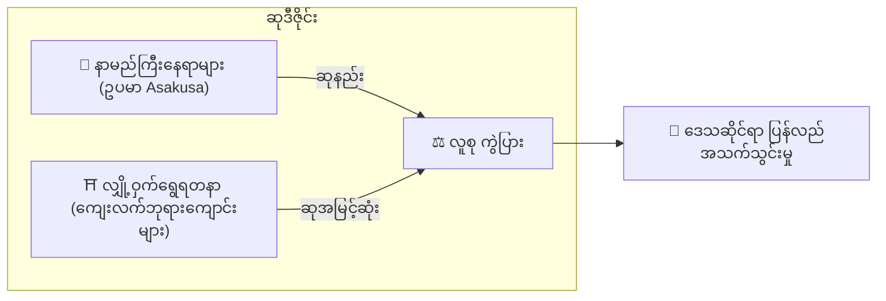

# ⛏️ Mining ၏ မဏ္ဍိုင် သုံးခု

> **Proof of Action (PoA)**
> Matsuri Coin ကို GPU များဖြင့်မဟုတ်ဘဲ **လူ့လုပ်ဆောင်ချက်** ဖြင့် တူးဖော်သည်။

Web app နှင့် admin dashboard သည် **ယခုအခါ အသုံးပြုနိုင်ပြီ** — အောက်ပါ လုပ်ဆောင်မှုများဖြင့် **ယခုပင်** စတင်ရရှိပါ။

---

## 1. 📖 Media Mining (ဖတ်, နားထောင်, Quiz ဖြေ ရရှိပါ)

**"J-Times" တရားဝင်မီဒီယာ ပံ့ပိုးထားသည်**

ဗဟုသုတသည် ခရီးသွားအရည်အသွေးကို ပြောင်းလဲစေသည်။ ကျွန်ုပ်တို့သည် သင်ယူမှုကို ဆုချ — ဖတ်ခြင်း၊ နားထောင်ခြင်း၊ **နှင့်** quiz ဖြေဆိုမှုဖြင့် နားလည်မှုကို သက်သေပြခြင်း။

| လုပ်ဆောင်ချက် | ဘာလုပ်ရမလဲ | ဆု |
| :--- | :--- | :--- |
| **📰 ဖတ်ပြီး ရယူ** | J-Times ဆောင်းပါးများ — သမိုင်း, Shinto, Zen | MTC ချီးမြှင့် |
| **🎧 နားထောင်ပြီး ရယူ** | သီးသန့် podcast များ | MTC ချီးမြှင့် |
| **✅ Quiz ဖြေပြီး ရယူ** | Quiz များကို မှန်ကန်စွာ ဖြေဆို | MTC ချီးမြှင့် (ချက်ချင်း) |

:::tip အချိန်ကုန်ချိန် → Mining ချိန်
သင့် ခရီးသွားချိန်, နေ့လည်စာချိန်, လေယာဉ်ပျံချိန် — အားလပ်ချိန်တိုင်းသည် ဆုရရှိနိုင်သော အခွင့်အလမ်းဖြစ်သည်။
:::

---

## 2. 🤝 Social Mining (ချိတ်ဆက်ပြီး ရယူ)

**GCF Admin Dashboard ပံ့ပိုး — ယခု အသုံးပြုနိုင်ပြီ**

GCF အဖွဲ့ဝင်များသည် သီးသန့် **"GCF Admin Web"** ကို အသုံးပြုခွင့်ရသည်။

| လုပ်ဆောင်ချက် | ဘာလုပ်နိုင်သလဲ |
| :--- | :--- |
| **🎪 ပွဲဖန်တီးမှု** | သင့်ကိုယ်ပိုင် ပွဲများနှင့် ခရီးစဉ်များ စီစဉ်ပြီး ထုတ်ဝေပါ |
| **📢 Content ဖြန့်ဝေမှု** | J-Times ဆောင်းပါးများကို သင့်ကွန်ရက်တစ်ခုလုံးတွင် ချဲ့ထွင်ပါ |
| **📊 Referral ခြေရာခံ** | ညွှန်းဆိုထားသော အသုံးပြုသူများ၏ လုပ်ဆောင်မှုကို real-time ခြေရာခံပါ |

:::info အလိုအလျောက် ပေးချေမှု
ညွှန်းဆိုထားသော မိတ်ဆွေက ငွေလွှဲတိုင်း စနစ်က သင့်ဝင်ငွေ အစိတ်အပိုင်းကို **အလိုအလျောက်** သင့် wallet ထဲသို့ ထိုးသွင်းပေးသည်။
:::

---

## 3. 🗺️ Adventure Mining (ရွေ့လျားပြီး ရယူ)

**Project "PILGRIMAGE" — နောက်အဆင့် (ဖွံ့ဖြိုးဆဲ)**

GPS နှင့် token incentive များကို အသုံးပြု၍ ခရီးသွားလာမှု စီးကြောင်းကို ရုပ်ပိုင်းဆိုင်ရာ ပြန်လည်လမ်းကြောင်းပေးသော နောက်မျိုးဆက် feature

> **"လူတွေ ကျေးလက်ကို သွားကြသည် — ပိုအကျိုးရှိသောကြောင့်"**

### 🎲 "Omikuji" Protocol

Check-in ပြုလုပ်ချိန်တွင် **အခမဲ့ (gas သာ)** trigger ဖြစ်သော ကံစမ်းမဲ smart contract

| ရလဒ် | ရရှိသည်မှာ |
| :--- | :--- |
| **🎊 ကောင်းကံကြီး** | Bonus MTC airdrop |
| **📜 NFT Drop** | တည်နေရာ သီးသန့် **"Goshuin NFT"** |
| **🏆 Collection ပြည့်စုံ** | Set ပြည့်ပါက သီးသန့်ပွဲဝင်ခွင့် |

:::note လောင်းကစားမဟုတ်
ငွေကြေးထိုးနွှံစရာ မလို။ **လာရောက်** ခြင်းအတွက် ကျပန်း bonus သာ။
:::

---

## 4. 🏦 Liquidity Mining (ပံ့ပိုးပြီး ရယူ)

> **ဘဏ်ဖြစ်ပါ**

Raydium ပေါ်တွင် MTC/SOL liquidity ပေးသော အသုံးပြုသူများအတွက် သီးသန့်ဆုပရိုဂရမ်

| ကိစ္စ | အသေးစိတ် |
| :--- | :--- |
| **ဘယ်သူ** | စောစီးသော liquidity providers ("founding partners") |
| **Target APY** | **50%** (risk premium) |
| **ဘာကြောင့်** | တည်ငြိမ်သော ကုန်သွယ်မှုပတ်ဝန်းကျင်အတွက် ကနဦး liquidity |

---

**[▶ နောက်ထပ်: Roadmap & Team](/docs/roadmap)** ｜ **[◀ ယခင်: စီးပွားရေး](/docs/economy)**
