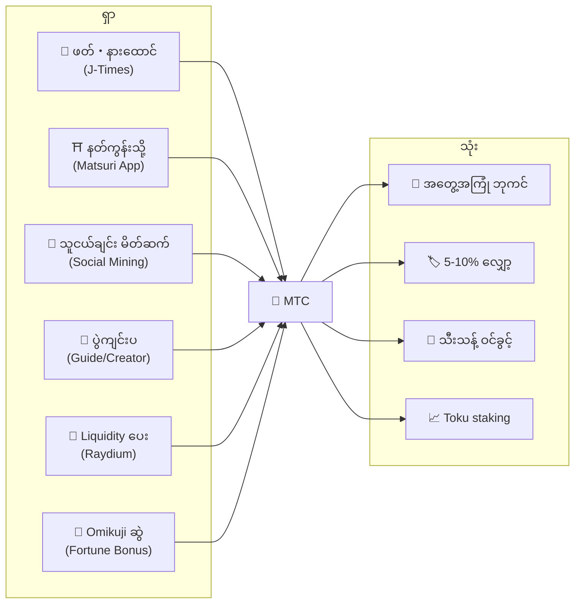
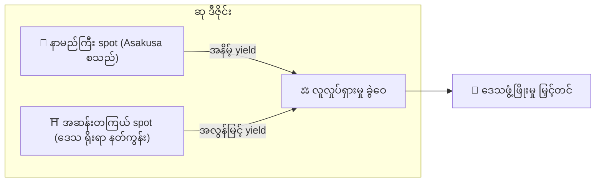
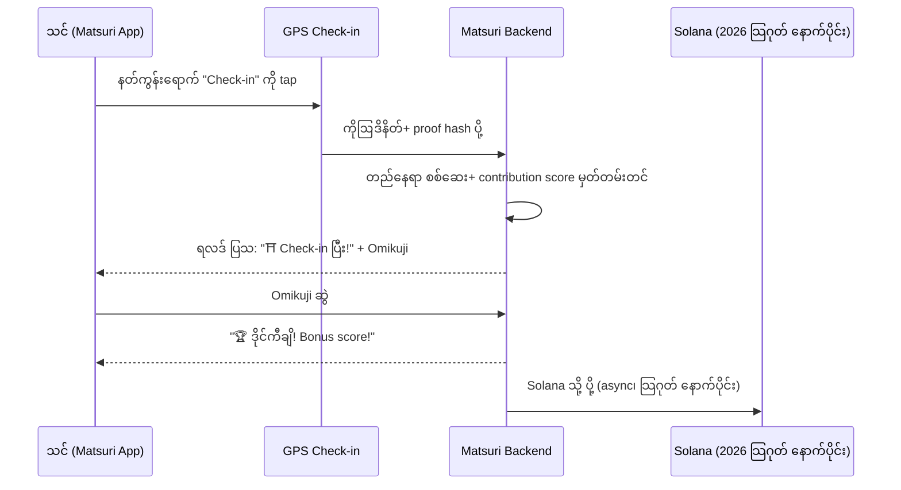
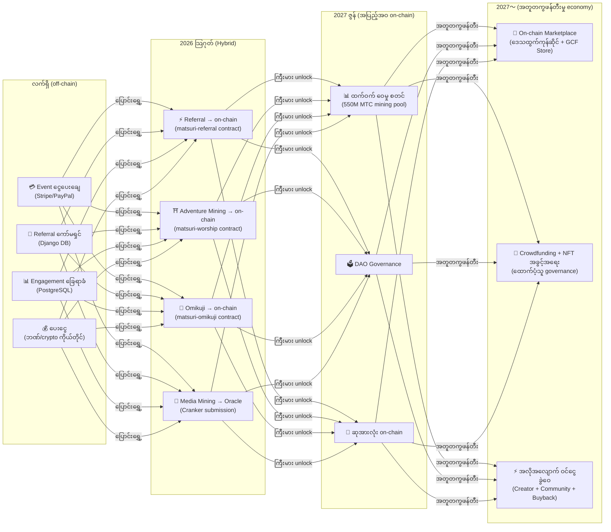

import useBaseUrl from '@docusaurus/useBaseUrl';

# ⛏️ Mining မဏ္ဍိုင် ၅ ခုနှင့် ရှာပုံ

> **ယဉ်ကျေးမှုနှင့် "ပါဝင်မှု" သည် တန်ဖိုးဖြစ်သွားသည်။**
> ဖတ်၊ လမ်းလျှောက်၊ ချိတ်ဆက်၊ ဖန်တီး၊ ထောက်ပံ့——သင့်လုပ်ဆောင်မှု တစ်ခုစီသည် MTC ကို မွေးဖွားသည်။

<small>*※ "Mining" ဆိုသည်မှာ?——Bitcoin စသည်တို့တွင် computer က ထိန်းချုပ်သော တွက်ချက်မှုများ လုပ်ပြီး ထိုအတွက် ဆုအဖြစ် coin အသစ် ရယူခြင်းကို "mining (ထုတ်ယူခြင်း)" ဟု ခေါ်ပါသည်။ MTC တွင် computer ၏ တွက်ချက်စွမ်းအား မဟုတ်ဘဲ **သင်၏ လုပ်ဆောင်မှုကိုယ်တိုင်**——ဆောင်းပါးဖတ်၊ နတ်ကွန်းသွား၊ ပွဲကျင်းပ——က "ထုတ်ယူခြင်း" ဖြစ်သည်။ ရွှေတွင်းတူးမည့်အစား ယဉ်ကျေးမှုနှင့် ပါဝင်မှုသည် MTC ကို မွေးဖွားသည်။ ၎င်းသည် ကျွန်ုပ်တို့၏ "mining" ဖြစ်သည်။*</small>

> လုပ်ဆောင်မှုဖြင့် ရှာ။ အတွေ့အကြုံတွင် သုံး။ ပိုင်ဆိုင်၍ ကြီးထွား။

MTC သည် ကြံစည်မှု token မဟုတ်ပါ။ လုပ်ဆောင်မှုတိုင်းသည် တန်ဖိုးကို ဖန်တီးပြီး တန်ဖိုးကို ရယူသော real economy ကို လည်ပတ်ပါသည်။ Web application နှင့် admin dashboard များသည် **ယခုပင် အသုံးပြုနိုင်**ပြီ။ လက်ရှိ off-chain (Django) ဖြင့် contribution score များ မှတ်တမ်းတင်နေပြီး 2026 သြဂုတ် နောက်ပိုင်း တစ်ဆင့်ချင်း on-chain သို့ ပြောင်းရွှေ့ပါမည်။

:::tip အခြေအနေအားလုံး
MTC တွင် **အပြည့်အဝ လည်ပတ်သော စီးပွားရေး** ရှိသည်: တကယ့်လှုပ်ရှားမှုများမှ တစ်ဆင့် ရှာ၊ တကယ့်အတွေ့အကြုံတွင် သုံး၊ ecosystem ချဲ့ထွင်မှုနှင့်အတူ တန်ဖိုး ကြီးထွား။ ဤစာမျက်နှာတွင် ထိုယန္တရားကို အသေးစိတ် ရှင်းပြပါမည်။
:::

---

## MTC Lifecycle

---

## Mining မဏ္ဍိုင် ၅ ခု

### 1. 📖 Media Mining (ဖတ်・နားထောင်・ဖြေ၍ ရှာ)

**တရားဝင် မီဒီယာ "J-Times" ချိတ်ဆက်**

ဗဟုသုတသည် ခရီး၏ အရည်အသွေးကို အလွန်တိုးမြှင့်ပေးသည်။ **J-Times အက်ပ်**ကို ဖွင့်၍ ဂျပန်ယဉ်ကျေးမှု content ကို ခံစားပါ။ စာသား၊ အသံဖြင့် သင်ယူခြင်းအပြင် **နားလည်မှု စစ်ဆေးခြင်း (Quiz)** ကိုပါ ဆုပေးပါသည်။ ပြီးမြောက်သော လုပ်ဆောင်မှုတိုင်းအတွက် MTC ကို အလိုအလျောက် ပေးအပ်သည်။

| လုပ်ဆောင်ချက် | ပြီးမြောက်ခြင်း အခြေအနေ | ဆုခန့်မှန်း |
| :--- | :--- | :---: |
| **📰 ဆောင်းပါးဖတ်** | 75% အထိ scroll | 2〜30 MTC |
| **🎧 Podcast နားထောင်** | အဆုံးထိ play | 2〜30 MTC |
| **🎬 ဗီဒီယို ကြည့်** | ကြည့်ပြီးနောက် အသေးစိတ်မျက်နှာပြင် ပိတ် | 2〜30 MTC |
| **📤 Content share** | Share sheet ပြသ | 2〜30 MTC |
| **✅ Quiz ဖြေ** | နားလည်မှု test အောင် | 2〜30 MTC |

<small>*※ ဆုပမာဏသည် content အမျိုးအစား・ကြာချိန်・ecosystem တစ်ခုလုံး၏ ထောက်ပံ့မှု ချိန်ခွင်လျှာအလိုက် ပြောင်းလဲသည်*</small>

:::tip လပ်ခွင့်အချိန်သည် mining ဖြစ်သွား
ခရီးသွား・အနားယူအချိန်သည် တိုက်ရိုက် ဆုမွေးဖွားသော အချိန်အဖြစ် ပြောင်းလဲသွားသည်။
:::

:::info Offline အသုံးပြုနိုင်
ဒေသတွင်းနတ်ကွန်းတွင် internet မရှိ? ပြဿနာ မရှိ။ J-Times သည် လုပ်ဆောင်မှုကို local တွင် မှတ်တမ်းတင်ပြီး **Online ပြန်ဖြစ်ပါက အလိုအလျောက် sync** လုပ်ပါသည် (7 ရက် သိမ်းထားသော offline queue)။ ရယူထားသော MTC ကို ဆုံးရှုံးမည် မဟုတ်ပါ။
:::

**နောက်ကွယ် အစီအစဉ်:**
1. J-Times အက်ပ်က သင်၏ လုပ်ဆောင်မှု (ဖတ်ပြီး・ကြည့်ပြီး・share စသည်) ကို တွေ့ရှိ
2. Offline ဖြစ်စေကာမူ local တွင် မှတ်တမ်းတင် (7 ရက် သိမ်း)
3. Network ပြန်ဖြစ်သောအခါ server သို့ ပို့ / စစ်ဆေး
4. Contribution score အဖြစ် လက်ကျန်တွင် ပြသ
5. 2026 သြဂုတ် နောက်ပိုင်း: စစ်ဆေးပြီး score ကို oracle မှတဆင့် on-chain မှတ်တမ်းတင်၊ blockchain တွင် အတည်ပြုနိုင်

---

### 2. ⛩️ Adventure Mining (လမ်းလျှောက်၍ ရှာ)

**Project "Pilgrimage" ── Smart contract ပြီးဆုံး၊ 2026 သြဂုတ် mainnet deploy**

GPS နှင့် token incentive ကို အသုံးပြု၍ ရုပ်ပိုင်းဆိုင်ရာ "လူလှုပ်ရှားမှု" ကို ထိန်းချုပ်သော နောက်မျိုးဆက် လုပ်ဆောင်ချက်။ သန့်ရှင်းသောနေရာ map ကို Matsuri Web app တွင် **ယခုပင် အသုံးပြုနိုင်**ပြီ။ လက်ရှိ off-chain တွင် contribution score မှတ်တမ်းတင်ပြီး 2026 သြဂုတ် smart contract deploy ပြီးလျှင် on-chain ဆုဝေမည်။

>**ရှာနိုင်သောကြောင့် ဒေသသို့ သွား**
> ဤ စီးပွားရေး ကျိုးကြောင်းဆီလျော်မှုသည် overtourism ကို ဖြေရှင်းပြီး ဒေသဖွံ့ဖြိုးမှုကို မြှင့်တင်သည်။

**Check-in ယန္တရား:**

  
  

    
<strong>Worship Mining</strong> — ဘုရားကျောင်းအနီးတွင် Check-in လုပ်ပါ၊ AR ကင်မရာဖြင့် စွမ်းအင်ကို ရှာဖွေပါ၊ Omikuji ဖြင့် MTC ဆုကြေး ရယူပါ။ အဆင့် ၁.၀× မှ ၁၀.၀× အထိ။

  

**အခြေခံမူ — လာရောက်သူ နည်းသော site က ပိုရှာ:**

| Site အမျိုးအစား | ဥပမာ | ဆုခန့်မှန်း (check-in ၁ ခု) |
| :--- | :--- | :---: |
| 🏙️ **အဓိက** | Sensō-ji၊ Kiyomizu-dera၊ Fushimi Inari | 30〜50 MTC |
| 🌆 **ဒေသ ဗဟို** | ခရိုင်တစ်ခုစီ၏ ichinomiya၊ ဒေသ taisha | 50〜100 MTC |
| 🏞️ **ဒေသ** | သမိုင်းကြောင်းရှိသော ဒေသ နတ်ကွန်း | 100〜150 MTC |
| ⛰️ **Frontier** | တောင်ဘက် ဘုရားကျောင်း၊ ကျွန်းသီးသန့် သန့်ရှင်းရာ | 150〜200 MTC |

<small>*※ အပေါ်က base ဆု ခန့်မှန်း။ Omikuji multiplier ဖြင့် အများဆုံး အဆပေါင်းများစွာ တိုးနိုင်သည်*</small>

**Score အထောက်အကူ အချက်များ:**
- **Omikuji multiplier** — Check-in တစ်ခုစီအတွက် random bonus။ Daikichi ဆိုပါက ဆု အဆများစွာ
- **လာရောက်မှု ကြိမ်ရေ** — ပုံမှန်လာသူများ အချိန်ကြာလာတာနှင့်အမျှ ပိုရယူ
- **Sponsored Site** — မြို့တော်စည်ပင်များ သီးသန့် site များကို boost နိုင်

:::info Contribution Score → MTC
သင်၏ လှုပ်ရှားမှုသည် **contribution score** အဖြစ် စုဆောင်းသည်။ ထက်ဝက် epoch တစ်ခုစီတိုင်း (2027 ဇွန် စတင်) score ကို 550M mining pool မှ MTC အဖြစ် ပြောင်းပေးသည်။ အသိုက်အဝန်းအတွက် ပါဝင်မှု မြင့်လေ MTC ပို ရရှိသည်။ တိကျသော boost coefficient များကို တစ်ဆင့်ချင်း အတည်ပြု၍ smart contract တွင် အကောင်အထည်ဖော်မည် — တကယ့် pool အရွယ်အစားနှင့် ကိုက်ညီသော တရားမျှတသော ခွဲဝေမှုကို အာမခံ။
:::

---

### 3. 🤝 Social Mining (ချိတ်ဆက်၍ ရှာ)

သူငယ်ချင်းကို မိတ်ဆက်ရုံဖြင့် MTC ရယူနိုင်သည်။

#### သာမန် အသုံးပြုသူ၏ မိတ်ဆက် ဆု

ရိုးရှင်းသော ယန္တရား ဖြစ်သည်။ သင်၏ referral link မှ သူငယ်ချင်း register လုပ်ပါက **တိုက်ရိုက်မိတ်ဆက် ၁ ခုလျှင် 300 MTC** ပေးအပ်ပါသည်။

| အခြေအနေ | ဆု |
| :--- | :--- |
| သင် မိတ်ဆက်ပေးသော သူငယ်ချင်း register လုပ် | **300 MTC** |

ဒီလောက်ပါပဲ။ အဆင့်ဆင့် ဆု မဖြစ်ပေါ်။

#### GCF Agent ၏ မိတ်ဆက် ဆု

[GCF အဖွဲ့ဝင်](/docs/gcf) များသည် ecosystem ချဲ့ထွင်မှုကို တာဝန်ယူသော **တရားဝင် agent** အဖြစ် ပိုမိုနက်ရှိုင်းသော ဆုဖွဲ့စည်းပုံ ရှိသည်။

| Layer | ဆက်ဆံရေး | ကော်မရှင် |
| :---: | :--- | :---: |
| **L1** | တိုက်ရိုက် မိတ်ဆက် | **20%** |
| **L2** | မိတ်ဆက်ပေးခြင်း၏ မိတ်ဆက် | **5%** |
| **L3** | 3 ဆင့် | **5%** |
| **L4** | 4 ဆင့် | **5%** |

:::note GCF Agent စနစ်အကြောင်း
ဤ အဆင့်ဆင့်ဆု စနစ်သည် GCF Membership (ဖိတ်ခေါ်မှု အခြေခံ) ရှိသည့် တရားဝင် agent များအတွက်သာ အသုံးပြုနိုင်။ သာမန် အသုံးပြုသူများသည် တိုက်ရိုက် မိတ်ဆက် (300 MTC) သာ ရရှိ။
GCF agent ၏ ကော်မရှင်ကို မိတ်ဆက်ပေးသူ၏ **တကယ့် စီးပွားရေး လှုပ်ရှားမှု (အတွေ့အကြုံ ဝယ်ယူ・ပွဲပါဝင် စသည်)** အပေါ် အခြေခံ၍ တွက်သည်။ လူစုပေးရုံဖြင့် ဆု မဖြစ်ပေါ်ပါ။
:::

**En-Mining Score ယန္တရား (GCF Agent များအတွက်):**

Contribution score သည် အစိတ်အပိုင်း ၂ ခုအပေါ် အခြေခံ၍ တွက်ချက်သည်:
- **Network ကျယ်ပြန့်မှု** (30%) — လူ မည်မျှ ခေါ်လာခဲ့သနည်း
- **စီးပွားရေး လှုပ်ရှားမှု** (70%) — မိတ်ဆက် network မှ တကယ့်ဝယ်ယူမှု

Score သည် အချိန်ကြာလာတာနှင့်အမျှ စုဆောင်းပြီး ထက်ဝက် epoch တစ်ခုစီတိုင်း MTC အဖြစ် ပြောင်းလဲ။

#### GCF Admin Dashboard ── Web ဗားရှင်း အသုံးပြုနိုင်ပြီ

GCF အဖွဲ့ဝင်များအတွက် သီးသန့် admin dashboard သို့ အသုံးပြုခွင့် ပေးအပ်ပါသည်။

| လုပ်ဆောင်ချက် | လုပ်နိုင်သည် |
| :--- | :--- |
| **🎪 ပွဲ ဖန်တီး** | မိမိ၏ ပွဲ・tour ကို စီစဉ်・တင်ဆက် |
| **📢 Content ဖြန့်ဝေ** | J-Times ဆောင်းပါး・content ကို ဖြန့်ဝေ・ပျံ့နှံ့ |
| **📊 Referral ခြေရာခံ** | မိတ်ဆက်ပေးထားသော အသုံးပြုသူ၏ လုပ်ဆောင်မှုနှင့် ဝင်ငွေကို real-time တွင် ခြေရာခံ |

:::warning လက်ရှိ off-chain → 2026 သြဂုတ်တွင် on-chain သို့ ပြောင်းရွှေ့
မိတ်ဆက် ကော်မရှင်ကို လက်ရှိ Django (PostgreSQL) တွင် ခြေရာခံပြီး ဘဏ်လွှဲ သို့မဟုတ် crypto ဖြင့် ပေးနေပါသည်။ **2026 သြဂုတ်** နောက်ပိုင်း Solana ပေါ်ရှိ **Matsuri Referral smart contract** သို့ ပြောင်းရွှေ့ကာ on-chain audit-able ပေးငွေ အကောင်အထည်ဖော်မည်။
:::

  

*Golden Gai တွင် အသိုက်အဝန်း meetup ── ချိတ်ဆက်မှုက mining power အဖြစ်။*

---

### 4. 🎓 Creator & Guide Mining (ဖန်တီး၍ ရှာ)

Content ကို အသုံးပြုရုံ မဟုတ်ဘဲ Matsuri platform တွင် **မည်သူမဆို** content ဖန်တီး၍ ဝင်ငွေရှာနိုင်သည်။ GCF အဖွဲ့ဝင်၊ guide သို့မဟုတ် content creator များ အောက်ပါနည်းများဖြင့် ရှာနိုင်ပါသည်။

| လှုပ်ရှားမှု | ဝင်ငွေနည်း |
| :--- | :--- |
| **🗺️ Tour ကျင်းပ** | Guide ကော်မရှင် (ပွဲတစ်ခုစီ သတ်မှတ်) + tip |
| **🎫 Event ticket ရောင်း** | EventPurchase မှတဆင့် ဝင်ငွေခွဲဝေ |
| **📚 Course တင်ပြ** | Course တစ်ခုချင်း ကော်မရှင် (creator ဝင်ငွေခွဲဝေ) |
| **🎙️ Podcast episode ထုတ်** | Subscription ဝင်ငွေ |
| **🤝 Crowdfunding campaign စတင်** | Solana အခြေခံ on-chain ပါဝင်မှု ခြေရာခံ |
| **🛍️ User shop ဖွင့်** | လက်မှုပစ္စည်း・ပစ္စည်း တိုက်ရိုက်ရောင်း |

**Tip စနစ်:** Event ပြီးနောက် ဧည့်သည်များသည် guide ကို tip ပို့နိုင်သည် (Uber ပုံစံ)။ Tip ကို Stripe ဖြင့် စီမံ၍ အများပြည်သူ leaderboard တွင် ခြေရာခံ။

:::tip AI တပ်ဆင်ထားသော ထုတ်လုပ်မှု အကူအညီ
Event host များသည် **built-in AI Assistant (GPT-4 Turbo)** ဖြင့် ပွဲဖော်ပြချက် ရေးသား၊ ဘာသာစကား ၅ မျိုးသို့ အလိုအလျောက် ဘာသာပြန်၊ SEO optimize လုပ်ထားသော metadata ထုတ်လုပ်ခြင်းကို admin dashboard အတွင်းမှ လုပ်ဆောင်နိုင်သည်။
:::

---

### 5. 🏦 Liquidity Mining (ထည့်၍ ရှာ)

>**ဘဏ် ဖြစ်ကြစို့။**

Raydium DEX ပေါ်တွင် MTC/SOL liquidity ကို ထောက်ပံ့၍ ecosystem အစပိုင်း ကုန်သွယ်ရေး အခြေခံကို အားပေးပါ။ အစောပိုင်း liquidity provider များအတွက် "တည်ထောင်သူ partner" အဖြစ် သီးသန့် ဆုပေးအစီအစဉ် စီစဉ်ထားသည်။

| ခေါင်းစဉ် | အသေးစိတ် |
| :--- | :--- |
| **ရည်ရွယ်သူ** | MTC နှင့် SOL ပိုင်ဆိုင်သော အသုံးပြုသူ အားလုံး |
| **ပန်းတိုင် APY** | **20%** (အစပိုင်း liquidity incentive၊ risk premium အဖြစ် သတ်မှတ်) |
| **DEX** | Raydium (Solana) |
| **အရေးပါမှု** | Ecosystem အစပိုင်း liquidity ကို အာမခံ၍ တည်ငြိမ်သော ကုန်သွယ်ရေး ပတ်ဝန်းကျင် တည်ဆောက် |

---

## 🎲 Omikuji Bonus

Adventure mining check-in တိုင်းတွင် အခမဲ့ Omikuji ပါဝင်ပါသည်။ Check-in ပြီးစီးစဉ် **အခမဲ့ (gas fee သာ)** ဖြင့် execute လုပ်သော omikuji ပုံစံ smart contract ဖြစ်သည်။

| ကံကြမ္မာ | ဆု multiplier | အပို bonus |
| :--- | :---: | :--- |
| 🏆 **Daikichi (ကြီးမား ကောင်းကျိုး)** | Base ဆု × အများဆုံး multiplier | Goshuin NFT |
| ✨ **Kichi (ကောင်းကျိုး)** | Base ဆု × မြင့်သော multiplier | — |
| 🌸 **Shōkichi (အနည်းငယ် ကောင်းကျိုး)** | Base ဆု × သေးငယ် multiplier | — |
| 🍃 **Suekichi (နောက်ဆုံးကောင်းကျိုး)** | Base ဆု × 1.0 | — |
| 💀 **Kyō (ဆိုးကျိုး)** | Base ဆု × 1.0 | — |

ဖြစ်နိုင်ခြေနှင့် multiplier ကို GCF admin dashboard မှ ချိန်ညှိနိုင်၍ ecosystem တစ်ခုလုံး၏ MTC ထောက်ပံ့မှု ချိန်ခွင်လျှာအလိုက် စီမံသည်။ ရလဒ်ကို Solana ပေါ်ရှိ **ပြုပြင်၍မရသော commit-reveal protocol** ဖြင့် ဆုံးဖြတ်ပြီး commit phase ပြီးပါက မည်သူမျှ ရလဒ်ကို မပြောင်းလဲနိုင်။

<small>*※ Kyō ရလျှင်လည်း base ဆုကို ရရှိ။ Check-in လှုပ်ရှားမှုကိုယ်တိုင်ကို ဆုပေးသော ဒီဇိုင်း*</small>

:::note လောင်းကစား မဟုတ်ပါ
ငွေကြေး လောင်းကြေး မလိုအပ်။ **"လာခဲ့သည်" ဟူသော လှုပ်ရှားမှု**အပေါ် random bonus။ သီးသန့် NFT များ စုဆောင်းပါက အထူးပွဲများ ပါဝင်ခွင့် unlock လုပ်နိုင်။
:::

---

## MTC အသုံးပြုမှု

| အသုံးပြုမှု | အကျိုး | ရနိုင်ခြင်း |
| :--- | :--- | :---: |
| **🎫 အတွေ့အကြုံ ဘုကင်** | Tour၊ event၊ ယဉ်ကျေးမှုလှုပ်ရှားမှု များကို MTC ဖြင့် ပေးချေ | ✅ ရနိုင်ပြီ |
| **🏷️ လျှော့** | MTC ပေးချေမှုတွင် ¥ ဈေးနှုန်း၏ 5-10% လျှော့ | ✅ ရနိုင်ပြီ |
| **🔑 သီးသန့် ဝင်ခွင့်** | NFT gate ပါဝင်သော ပွဲ၊ VIP ထူးခြားသော ဝတ်ပြုပွဲ၊ ကိုယ်ရေးကိုယ်တာ tour | ✅ ရနိုင်ပြီ |
| **📈 Toku Staking** | MTC ကို lock ၍ contribution score boost (အများဆုံး 50% ခန့်) | 🔜 2026 သြဂုတ် |
| **🗳️ DAO Governance** | Treasury၊ protocol upgrade၊ site certification တို့ကို မဲပေး | 🔜 2027 |
| **🛍️ Partner ဆိုင်** | ပူးတွဲ ဆိုင်・စားသောက်ဆိုင်များတွင် ပေးချေ | 🔜 ချဲ့ထွင်နေ |

:::info ငွေပေးချေနည်းအဖြစ် MTC
Matsuri App တွင် MTC သည် credit card၊ Solana Pay နှင့် တန်းတူ တန်းတူ ငွေပေးချေနည်း ဖြစ်သည်။ ပြောင်းလဲရန် မလို——checkout တွင် "MTC ဖြင့် ပေးချေ" ရွေးရုံဖြင့် ချက်ချင်း လက်ကျန်မှ နုတ်ယူသည်။
:::

### MTC ငွေပြန်လဲခြင်း

:::warning အရေးကြီး: ကျွန်ုပ်တို့ MTC ငွေပြန်လဲ・လဲလှယ် ဝန်ဆောင်မှု မပေးပါ
Matsuri operations သည် crypto asset exchange စာရင်းသွင်းထားခြင်း မရှိသောကြောင့် **MTC နှင့် တရားဝင်ငွေ (¥・$ စသည်) တိုက်ရိုက်လဲလှယ်မှု မည်သည့်အခါမျှ မလုပ်ပါ။**

MTC ကို အခြား crypto asset သို့မဟုတ် တရားဝင်ငွေအဖြစ် လဲလှယ်လိုပါက အောက်ပါ အသုံးပြုသူ၏ ကိုယ်ပိုင် လုပ်ဆောင်ချက်ဖြင့် လုပ်နိုင်ပါသည်:
1. **Phantom Wallet** စသည့် Solana ထောက်ပံ့သော wallet တွင် MTC ကို စီမံ
2. **Raydium (DEX)** တွင် MTC → SOL သို့ လဲ
3. SOL ကို crypto exchange (CEX) တွင် တရားဝင်ငွေအဖြစ် လဲ

အနာဂတ်တွင် CEX (ဗဟို ပုံစံ exchange) သို့ list တင်ခြင်းကိုပါ စဉ်းစားထားပြီး ထိုအခါတွင် ပိုမို လွယ်ကူသော ငွေလဲနည်းများ ရနိုင်ပါမည်။
:::

---

## ဥပမာ: MTC economy ၏ တစ်နေ့

> **မနက်:** ရထားပေါ်တွင် J-Times ဆောင်းပါး ၃ ပုဒ် ဖတ် → MTC ရယူ။
> **မွန်းလွဲ:** Matsuri App ဖြင့် ဒေသ နတ်ကွန်းသို့ သွား → check-in၊ Kichi (×1.5) ဆွဲ → MTC ထပ်ရယူ။
> **ညဘက်:** ရယူထားသော MTC ဖြင့် ¥9,000 တန် Shinjuku Golden Gai ယဉ်ကျေးမှု tour ကို 10% လျှော့ဖြင့် ဘုကင် (¥8,100 ပေးချေ)။
> **ရလဒ်:** သင်၏ ယဉ်ကျေးမှု စိတ်ဝင်စားမှုသည် တကယ့်အတွေ့အကြုံအဖြစ် ပြောင်းလဲ၊ guide၊ နတ်ကွန်း၊ အသိုက်အဝန်းသည် တိုက်ရိုက် ငွေကို ရရှိ။ OTA က 20% ကော်မရှင် မယူ။

---

## စီးပွားရေး ရေရှည်တည်တံ့မှု

:::warning Mining pool ကုန်သွားလျှင် ဘာဖြစ်မည်နည်း?
550M MTC ၏ ထက်ဝက် pool ကို **ဆယ်စုနှစ်များ** တည်တံ့အောင် ဒီဇိုင်းလုပ်ထားသည်။ 2 နှစ်တစ်ကြိမ် ထုတ်လွှတ်ပမာဏ ထက်ဝက်ဖြစ်သွားသောကြောင့် သင်္ချာအရ 100% သို့ မရောက်ဘဲ ဆု ရေရှည် ဆက်လက် ရှိမည် ([Tokenomics](/docs/tokenomics) တွင် အသေးစိတ်)။ သို့သော် ထုတ်လွှတ်ပမာဏ အလွန် နည်းလာပြီးနောက်လည်း:

- **Transaction fee** သည် on-chain လှုပ်ရှားမှုမှ network ပါဝင်သူများကို ဆု ဆက်ပေးမည်
- **Buyback protocol** (လုပ်ငန်းဝင်ငွေ၏ 20-25%) သည် အမြဲတမ်း ဝယ်ဖို့ဖိအားကို မွေးဖွား
- **Toku staking** သည် လည်ပတ်ပမာဏကို lock လုပ်ပြီး ရောင်းဖို့ဖိအားကို လျော့စေ
- **တကယ့်လုပ်ငန်း ဝင်ငွေ** (ပွဲ၊ membership၊ course) သည် token ဖြန့်ဝေခြင်းနှင့် သီးခြား ecosystem ကို ထောက်ပံ့

MTC သည် **real economy** က ကျောထောက်နောက်ခံ ပြုထား——ရိုးရိုး token emission မျှသာ မဟုတ်ပါ။
:::

---

## On-Chain ပြောင်းရွှေ့မှု Roadmap

Matsuri economy သည် off-chain (Django/PostgreSQL) မှ on-chain (Solana smart contract) သို့ အဆင့်ဆင့် ပြောင်းရွှေ့နေသည်။ ဤပြောင်းရွှေ့မှုဖြင့် လုပ်ငန်းအားလုံး **trustless・audit-able・permissionless** ဖြစ်လာမည်။

| Phase | Timeline | On-chain ဖြစ်မည့် အရာ |
| :--- | :--- | :--- |
| **Phase 1 (လက်ရှိ)** | အသုံးပြုနေ | MTC token (SPL)၊ Raydium LP၊ Solana Pay စစ်ဆေးမှု |
| **Phase 2 (2026 သြဂုတ်)** | Smart contract mainnet deploy | Referral ကော်မရှင်၊ adventure mining ဆု၊ Omikuji မဲနှိုက်၊ oracle မှတဆင့် media mining |
| **Phase 3 (2027 ဇွန်)** | ကြီးမား unlock | 550M MTC ထက်ဝက် ဝေမှု၊ DAO governance၊ အပြည့်အဝ ဗဟိုမဲ့ |
| **Phase 4 (2027〜)** | အတူတကွဖန်တီးမှု economy | On-chain marketplace (ဒေသထွက်ကုန်ဆိုင် + GCF store)၊ NFT အခွင့်အရေးပါ crowdfunding၊ creator + community + buyback သို့ အလိုအလျောက် ဝင်ငွေခွဲဝေ |

:::warning ဘာကြောင့် အခုပဲ အားလုံး on-chain မလုပ်တာလဲ?
**Security audit ပြီးဆုံးသည်အထိ အသုံးပြုသူငွေ လှုပ်သော on-chain လုပ်ဆောင်ချက်ကို မဖွင့်ပါ။** ၎င်းသည် ကျွန်ုပ်တို့၏ မူ။

လက်ရှိ အခြေအနေ:
- **အသုံးပြုသူငွေ အန္တရာယ်: မရှိ** — လောလောဆယ် ဆု・score အားလုံးကို off-chain (Django) တွင် စီမံပြီး smart contract မှတဆင့် အသုံးပြုသူငွေ လှုပ်သော လုပ်ဆောင်ချက်များ မလည်ပတ်
- **Audit schedule: 2026 Q2〜Q3** — Professional security audit ကို အောင်မြင်ပြီး လုံခြုံမှု အတည်ပြုပြီးသော contract မှ တစ်ဆင့်ချင်း mainnet သို့ deploy
- **Audit ပြီးစီးခြင်းသည် deploy အတွက် ကြိုတင်အခြေအနေ** — Audit မပြီးဆုံးသေးသော smart contract ကို mainnet တွင် မည်သည့်အခါမျှ မဖွင့်

Off-chain ကာလအတွင်း ဆုများကိုပါ စစ်ဆေးနိုင်——လုပ်ငန်းစဉ်တိုင်းတွင် ငွေပေးချေ သက်သေအဖြစ် `solana_signature` ပါဝင်သည်။
:::

---

**[▶ ရှေ့သို့: Tokenomics](/docs/tokenomics)** ｜ **[◀ နောက်သို့: Ecosystem](/docs/ecosystem)**
