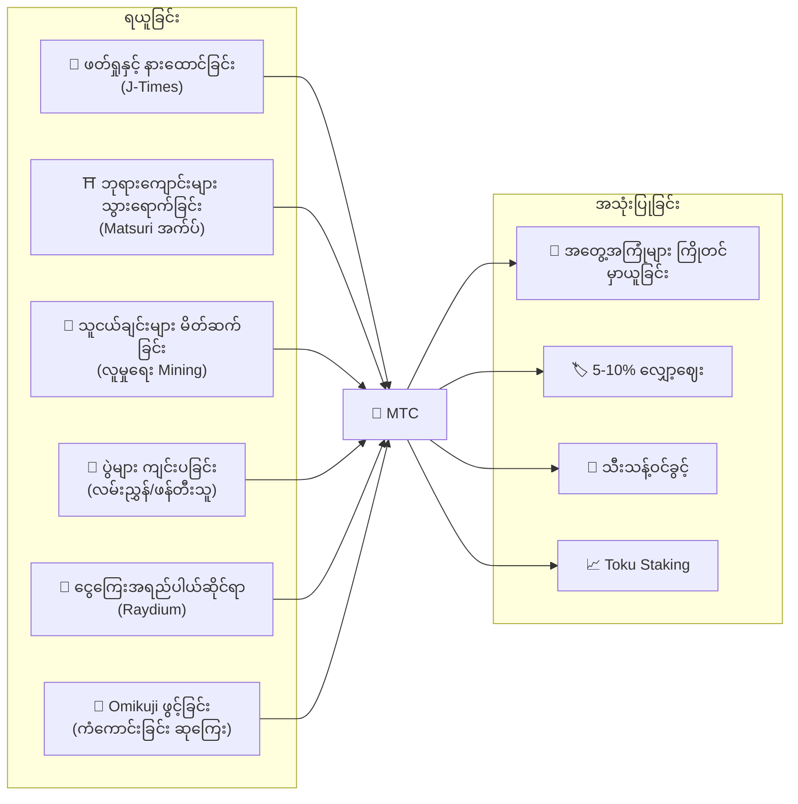
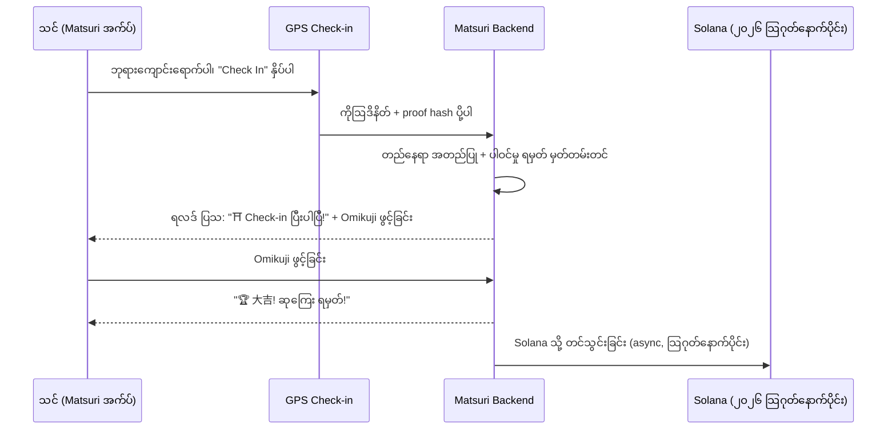
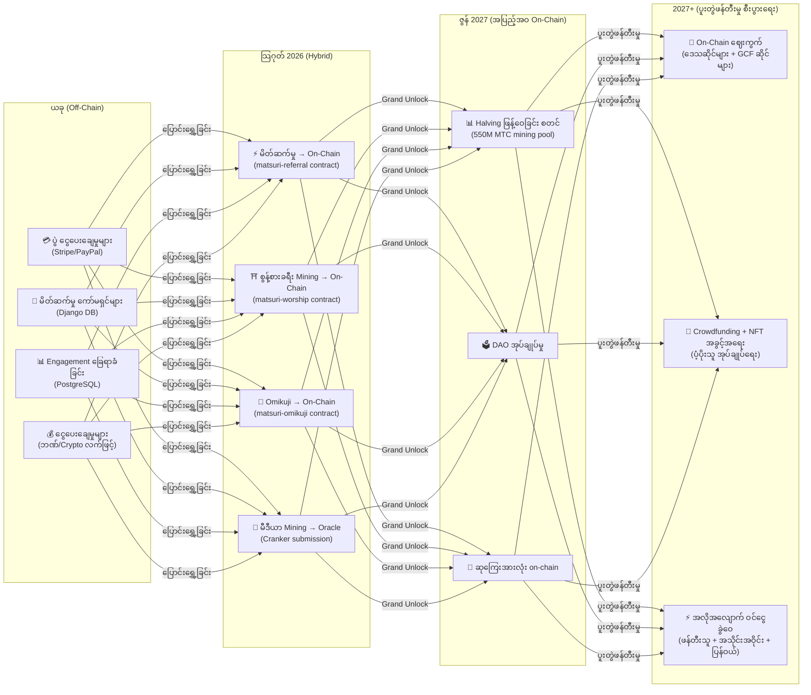

# 💎 MTC ရယူနည်းနှင့် အသုံးပြုနည်း

> **လုပ်ဆောင်ခြင်းဖြင့် ရယူပါ။ အတွေ့အကြုံအတွက် သုံးစွဲပါ။ တိုးတက်မှုအတွက် ကိုင်ဆောင်ထားပါ။**
> MTC သည် ရင်းနှီးမှုအလို့ငှာ ကုန်သွယ်သည့် token တစ်ခုမဟုတ် — လုပ်ဆောင်ချက်တိုင်းက တန်ဖိုးဖန်တီးပြီး ဖမ်းယူနိုင်သည့် အမှန်တကယ် စီးပွားရေးစနစ်တစ်ခုတွင် စီးဆင်းနေသည်။

:::tip ပုံရိပ်ကြီး
MTC တွင် **ပြည့်စုံသော စက်ဝိုင်းပုံ စီးပွားရေး** ရှိသည်: အမှန်တကယ် လုပ်ဆောင်ချက်များမှတစ်ဆင့် ရယူပြီး၊ အမှန်တကယ် အတွေ့အကြုံများတွင် သုံးစွဲကာ၊ ဂေဟစနစ် ကျယ်ပြန့်လာသည်နှင့်အမျှ တန်ဖိုးတိုးတက်လာသည်။ ဤစာမျက်နှာတွင် နည်းလမ်းများကို အတိအကျ ပြသထားသည်။
:::

---

## MTC ၏ ဘဝသံသရာ

---

## MTC ရယူနည်း

### 1. 📖 မီဒီယာ Mining — J-Times တွင် ဖတ်ရှု နားထောင်နှင့် ကြည့်ရှုပါ

**J-Times အက်ပ်** ကို ဖွင့်ပြီး ဂျပန်ယဉ်ကျေးမှုအကြောင်း အကြောင်းအရာများ ဖတ်ရှုပါ။ ပြီးမြောက်သော လုပ်ဆောင်ချက်တိုင်းအတွက် MTC ကို အလိုအလျောက် ရရှိမည်။

| လုပ်ဆောင်ချက် | ပြီးမြောက်မှု စံသတ်မှတ်ချက် | ဆုကြေး |
| :--- | :--- | :---: |
| **ဆောင်းပါးတစ်ခု ဖတ်ရှုခြင်း** | 75% အထိ scroll ဆွဲချခြင်း | MTC |
| **Podcast နားထောင်ခြင်း** | အဆုံးအထိ ဖွင့်ခြင်း | MTC |
| **ဗီဒီယို ကြည့်ရှုခြင်း** | ကြည့်ပြီးနောက် အသေးစိတ်မျက်နှာပြင်မှ ထွက်ခြင်း | MTC |
| **အကြောင်းအရာ မျှဝေခြင်း** | မျှဝေမှု sheet ပြသခြင်း | MTC |
| **Quiz ဖြေဆိုခြင်း** | နားလည်မှုစစ်ဆေးမှု အောင်မြင်ခြင်း | MTC (ချက်ချင်း) |

:::info Offline ပံ့ပိုးမှု
ကျေးလက် ဘုရားကျောင်းတွင် အင်တာနက် မရှိဘူးလား? ပြဿနာ မရှိပါ။ J-Times သည် သင့်လုပ်ဆောင်ချက်များကို စက်တွင်း မှတ်တမ်းတင်ပြီး **အွန်လိုင်းပြန်ရောက်သည့်အခါ အလိုအလျောက် sync လုပ်သည်** (ရက် ၇ ရက် ထိန်းသိမ်းမှုပါ offline queue)။ ရယူထားသော MTC ကို ဘယ်တော့မှ မဆုံးရှုံးပါ။
:::

**နောက်ကွယ်မှ အလုပ်လုပ်ပုံ:**
1. အက်ပ်ရှိ `EngagementTracker` က ပြီးမြောက်မှု event များကို ရှာဖွေသည်
2. လုပ်ဆောင်ချက်များကို စက်တွင်း queue တွင် ထည့်သည် (offline ဖြစ်နေသည့်တိုင်)
3. ကွန်ရက် ပြန်ရရှိသောအခါ လုပ်ဆောင်ချက်များကို စုစည်းပြီး Django API သို့ ပို့သည်
4. API က အတည်ပြုပြီး သင့် balance သို့ MTC ထည့်ပေးသည်
5. ၂၀၂၆ ခုနှစ် သြဂုတ်လနောက်ပိုင်း: လုပ်ဆောင်ချက်များကို Cranker oracle မှတစ်ဆင့် on-chain တင်သွင်းမည်

---

### 2. ⛩️ စွန့်စားခရီး Mining — Matsuri အက်ပ်ဖြင့် အထွဋ်အမြတ် နေရာများ သွားရောက်ပါ

**Matsuri အက်ပ်** ကို ဖွင့်ပြီး အထွဋ်အမြတ် နေရာများ မြေပုံပေါ်တွင် ဘုရားကျောင်း သို့မဟုတ် ဘုန်းကြီးကျောင်းတစ်ခု ရှာဖွေပြီး သွားရောက်ကာ check-in လုပ်ပါ။ သင့်လုပ်ဆောင်ချက်ကို **ပါဝင်မှု ရမှတ်** အဖြစ် မှတ်တမ်းတင်သည်။

**အလုပ်လုပ်ပုံ:**

**အခြေခံ မူ — လူနည်းသော နေရာက ပိုရသည်:**

| နေရာ အမျိုးအစား | ဥပမာများ | ရမှတ် |
| :--- | :--- | :---: |
| 🏙️ **အဓိက** | Sensoji, Kiyomizu-dera, Fushimi Inari | စံ |
| 🌆 **ဒေသဆိုင်ရာ** | ခရိုင် ichinomiya၊ ဒေသဆိုင်ရာ ဘုရားကျောင်းကြီးများ | ပိုမြင့် |
| 🏞️ **ကျေးလက်** | သမိုင်းဝင် ကျေးလက် ဘုရားကျောင်းများ | များစွာ ပိုမြင့် |
| ⛰️ **နယ်စပ်** | တောင်ပေါ် ဘုန်းကြီးကျောင်းများ၊ ဝေးလံသော ကျွန်း အထွဋ်အမြတ် နေရာများ | အမြင့်ဆုံး |

**ထပ်ဆောင်း ရမှတ် အချက်များ:**
- **လာရောက်မှု အကြိမ်အရေအတွက်** — ပုံမှန်လာရောက်သူများ အချိန်ကြာလာသည်နှင့်အမျှ ပိုရရှိသည်
- **Omikuji** — ကျပန်း ကံစမ်းမှုသည် ဆုကြေး ရမှတ် ထပ်ပေါင်းသည် (大吉 အကောင်းဆုံး!)
- **ကိုယ်စားပြု နေရာများ** — မြို့နယ်အစိုးရများက သတ်မှတ်နေရာများ မြှင့်တင်နိုင်သည်

:::info ပါဝင်မှု ရမှတ် → MTC
သင့်လုပ်ဆောင်ချက်သည် **ပါဝင်မှု ရမှတ်** အဖြစ် စုဆောင်းသည်။ halving epoch တစ်ခုစီတွင် (၂၀၂၇ ဇွန်မှ စတင်) ရမှတ်များကို 550M mining pool မှ MTC သို့ ပြောင်းလဲသည်။ အသိုင်းအဝိုင်းနှင့် နှိုင်းယှဉ်၍ သင် ပိုမို ပါဝင်လေ MTC ပိုမို ရရှိလေ ဖြစ်သည်။ တိကျသော boost coefficient များကို တဖြည်းဖြည်း အတည်ပြုပြီး smart contract များတွင် အကောင်အထည်ဖော်မည် — pool အရွယ်အစားနှင့် ကိုက်ညီသော မျှတသော ဖြန့်ဝေမှု ရရှိစေရန်။
:::

---

### 3. 🤝 လူမှုရေး Mining — သူငယ်ချင်းများ မိတ်ဆက်ပြီး ကွန်ရက် တည်ဆောက်ပါ

သင့်မိတ်ဆက်ကုဒ်ကို မျှဝေပါ။ သင့်ကွန်ရက်က ငွေကြေးလွှဲပြောင်းသည့်အခါ သင် အလိုအလျောက် ရရှိမည်။

| အလွှာ | ဆက်ဆံရေး | ကော်မရှင် |
| :---: | :--- | :---: |
| **L1** | သင် → သူငယ်ချင်း (တိုက်ရိုက်) | **20%** |
| **L2** | သူငယ်ချင်း → သူတို့၏ သူငယ်ချင်း | **5%** |
| **L3** | တတိယ ဆင့် | **5%** |
| **L4** | စတုတ္ထ ဆင့် | **5%** |

**En-Mining ရမှတ် အလုပ်လုပ်ပုံ:**

သင့် ပါဝင်မှု ရမှတ်ကို အချက် နှစ်ခုပေါ် အခြေခံ၍ တွက်ချက်သည်:
- **ကွန်ရက် ရောက်ရှိမှု** (30%) — သင် လူ ဘယ်နှစ်ယောက် ခေါ်လာသလဲ
- **စီးပွားရေး လုပ်ဆောင်ချက်** (70%) — သင့် referral ကွန်ရက်မှ အမှန်တကယ် ဝယ်ယူမှုများ

> **အဓိက အချက်:** သင့်ရမှတ်၏ အများစုသည် သင့်ကွန်ရက်ရှိ **အမှန်တကယ် စီးပွားရေး လုပ်ဆောင်ချက်** မှ လာသည်၊ စာရင်းသွင်းခြင်းများမှ မဟုတ်။ ဘယ်တော့မှ မသုံးစွဲသော လူ ၁,၀၀၀ ကို ဖိတ်ခေါ်ခြင်းသည် တက်ကြွစွာ သုံးစွဲသူ ၁၀ ဦးကို ဖိတ်ခေါ်ခြင်းထက် နည်းရသည်။

ရမှတ်များ အချိန်နှင့်အမျှ စုဆောင်းပြီး halving epoch တစ်ခုစီတွင် MTC သို့ ပြောင်းလဲသည်။ Boost multiplier များ (ဥပမာ MTC staking, ရာသီ ranking) ကို smart contract များမှတစ်ဆင့် တဖြည်းဖြည်း မိတ်ဆက်သွားမည်။

:::warning လက်ရှိ Off-Chain → ၂၀၂၆ သြဂုတ်တွင် On-Chain သို့ ပြောင်းမည်
မိတ်ဆက်မှု ကော်မရှင်များကို လက်ရှိတွင် Django (PostgreSQL) တွင် ခြေရာခံပြီး ဘဏ်လွှဲပြောင်းမှု သို့မဟုတ် crypto ဖြင့် ပေးချေသည်။ **၂၀၂၆ သြဂုတ်** မှစ၍ မိတ်ဆက်မှု ကော်မရှင် စနစ်တစ်ခုလုံး Solana ရှိ **Matsuri Referral smart contract** သို့ ပြောင်းရွှေ့မည် — ငွေပေးချေမှုများကို trustless၊ ချက်ချင်း နှင့် on-chain စစ်ဆေးနိုင်အောင် ပြုလုပ်မည်။
:::

---

### 4. 🎪 ဖန်တီးသူနှင့် လမ်းညွှန် Mining — ပွဲများ ကျင်းပပါ၊ အကြောင်းအရာ ဖန်တီးပါ

သင်သည် GCF အဖွဲ့ဝင်၊ လမ်းညွှန် သို့မဟုတ် အကြောင်းအရာ ဖန်တီးသူ ဖြစ်ပါက:

| လုပ်ဆောင်ချက် | ရယူနည်း |
| :--- | :--- |
| **ခရီးစဉ် ကျင်းပခြင်း** | လမ်းညွှန် ကော်မရှင် (ပွဲတစ်ခုချင်းအလိုက် သတ်မှတ်) + tip |
| **ပွဲလက်မှတ်များ ရောင်းခြင်း** | EventPurchase မှတစ်ဆင့် ဝင်ငွေ ခွဲဝေခြင်း |
| **သင်တန်း ထုတ်ဝေခြင်း** | စာရင်းသွင်းမှုတစ်ခုစီအတွက် အခကြေးငွေ |
| **Podcast အပိုင်းများ ဖန်တီးခြင်း** | subscription ဝင်ငွေ |
| **Crowdfunding ကမ်ပိန်း စတင်ခြင်း** | Solana-based ပါဝင်မှုများ |

**Tip စနစ်:** ပွဲတိုင်းပြီးနောက် ဧည့်သည်များက လမ်းညွှန်များကို tip ပေးနိုင်သည် (Uber ပုံစံ)။ Tip များကို Stripe မှတစ်ဆင့် ပြုလုပ်ပြီး အများပြည်သူ leaderboard တွင် ခြေရာခံသည်။

---

### 5. 🏦 ငွေကြေးအရည်ပါယ် Mining — Raydium တွင် ငွေကြေးအရည်ပါယ် ပံ့ပိုးပါ

Raydium DEX တွင် MTC/SOL ငွေကြေးအရည်ပါယ် ပံ့ပိုးပြီး ဆုကြေး ရယူပါ။

| အချက် | အသေးစိတ် |
| :--- | :--- |
| **ပစ်မှတ် APY** | 20% (အစောပိုင်း ငွေကြေးအရည်ပါယ် မက်လုံး) |
| **DEX** | Raydium (Solana) |
| **ဘယ်သူ** | MTC နှင့် SOL ကိုင်ဆောင်ထားသူ မည်သူမဆို |

---

### 6. 🎲 Omikuji ဆုကြေး — ကံကောင်းခြင်း ဖွင့်ခြင်း

စွန့်စားခရီး Mining check-in တိုင်းတွင် အခမဲ့ Omikuji (ကံစမ်း) ဖွင့်ခြင်း ပါဝင်သည် — သင့် ပုံမှန် ရမှတ်အပေါ် ထပ်ဆောင်း ဆုကြေး။

| ကံကြမ္မာ | ရှားပါးမှု | ဆုကြေး |
| :--- | :---: | :--- |
| 🏆 **大吉** (မဟာ ကောင်းချီး) | ရှားပါး | အမြင့်ဆုံး ဆုကြေး ရမှတ် + NFT |
| ✨ **吉** (ကောင်းချီး) | မကြာခဏ မတွေ့ | ကောင်းသော ဆုကြေး ရမှတ် |
| 🌸 **小吉** (ကောင်းချီးငယ်) | သာမန် | ဆုကြေးငယ် |
| 🍃 **末吉** (အနာဂတ် ကောင်းချီး) | သာမန် | ပါဝင်မှု မှတ်တမ်းတင် |
| 💀 **凶** (ကံဆိုး) | မကြာခဏ မတွေ့ | ပါဝင်မှု မှတ်တမ်းတင် |

ရလဒ်ကို Solana ရှိ **ပြုပြင်မရနိုင်သော commit-reveal protocol** ဖြင့် ဆုံးဖြတ်သည်။ commit အဆင့်ပြီးနောက် server ကိုယ်တိုင်ပင် သင့်ရလဒ်ကို ပြောင်းလဲ၍ မရပါ။ တိကျသော ဖြစ်နိုင်ခြေနှင့် ဆုကြေးပမာဏများကို smart contract အကောင်အထည်ဖော်မှုတွင် အတည်ပြုမည်။

---

## MTC ဘယ်မှာ သုံးစွဲမလဲ

| အသုံးပြုမှု | အကျိုးကျေးဇူး | ရရှိနိုင်မှု |
| :--- | :--- | :---: |
| **🎫 အတွေ့အကြုံများ ကြိုတင်မှာယူခြင်း** | ခရီးစဉ်များ၊ ပွဲများနှင့် ယဉ်ကျေးမှု လုပ်ဆောင်ချက်များကို MTC ဖြင့် ပေးချေပါ | ✅ ယခု |
| **🏷️ လျှော့ဈေး** | MTC ဖြင့် ပေးချေသောအခါ yen ဈေးနှုန်းနှင့် နှိုင်းယှဉ်ပါက 5–10% လျှော့ | ✅ ယခု |
| **🔑 သီးသန့် ဝင်ခွင့်** | NFT-gated ပွဲများ၊ VIP သီးသန့် အခမ်းအနားများ၊ သီးသန့် ခရီးစဉ်များ | ✅ ယခု |
| **📈 Toku Staking** | MTC ကို lock ချပြီး ပါဝင်မှု ရမှတ်ကို မြှင့်တင်ပါ (~50% boost အထိ) | 🔜 သြဂုတ် 2026 |
| **🗳️ DAO အုပ်ချုပ်မှု** | ဘဏ္ဍာတိုက်၊ protocol အဆင့်မြှင့်တင်မှုနှင့် နေရာ အသိအမှတ်ပြုခြင်းအတွက် မဲပေးပါ | 🔜 2027 |
| **🛍️ မိတ်ဖက် စတိုးဆိုင်များ** | ပါဝင်သော ဆိုင်များနှင့် စားသောက်ဆိုင်များတွင် ပေးချေပါ | 🔜 ချဲ့ထွင်နေဆဲ |

:::info MTC ငွေပေးချေမှုအနေဖြင့်
Matsuri အက်ပ်တွင် MTC သည် credit card နှင့် Solana Pay နှင့်အတူ ပထမတန်းစား ငွေပေးချေမှု နည်းလမ်းဖြစ်သည်။ ပြောင်းလဲမှု မလိုအပ် — checkout တွင် "MTC ဖြင့် ပေးချေပါ" ကို ရွေးချယ်ပြီး balance ကို ချက်ချင်း နုတ်ယူသည်။
:::

### ဥပမာ: MTC စီးပွားရေးတွင် တစ်နေ့တာ

> **နံနက်:** ရထားပေါ်တွင် J-Times ဆောင်းပါး ၃ ပုဒ် ဖတ်ပါ → MTC ရယူပါ။
> **နေ့လည်:** Matsuri အက်ပ်ဖြင့် ကျေးလက် ဘုရားကျောင်းတစ်ခုသို့ သွားရောက်ပါ → check-in လုပ်ပြီး 吉 (×1.5) ဖွင့်ရယူ → MTC ပိုမိုရရှိပါ။
> **ညနေ:** ရယူထားသော MTC ဖြင့် ¥9,000 Golden Gai ယဉ်ကျေးမှု ခရီးစဉ်ကို 10% လျှော့ဈေးဖြင့် ကြိုတင်မှာယူပါ (¥8,100 နှင့်ညီမျှသော ပမာဏ ပေးချေ)။
> **ရလဒ်:** သင့်ယဉ်ကျေးမှု စူးစမ်းလိုစိတ်က အမှန်တကယ် အတွေ့အကြုံကို ရန်ပုံငွေ ထောက်ပံ့ခဲ့သည် — လမ်းညွှန်၊ ဘုရားကျောင်းနှင့် လူ့အဖွဲ့အစည်း အားလုံး တိုက်ရိုက် ပေးချေမှု ရရှိခဲ့သည်။ OTA က 20% ဖြတ်ယူခြင်း မရှိပါ။

### စီးပွားရေး ရေရှည်တည်တံ့မှု

:::warning Mining Pool ကုန်ဆုံးသွားရင် ဘာဖြစ်မလဲ?
550M MTC halving pool သည် **ဆယ်စုနှစ်များ** ကြာရှည်အောင် ဒီဇိုင်းထုတ်ထားသည် (epoch ၂၀ × ၂ နှစ် = သီအိုရီအရ ၄၀ နှစ်)။ သို့သော် pool ကုန်ဆုံးသွားပြီးနောက်ပင်:

- on-chain လုပ်ဆောင်ချက်များမှ **ငွေကြေးလွှဲပြောင်းမှု အခကြေးငွေ** များသည် ကွန်ရက် ပါဝင်သူများကို ဆက်လက် ဆုကြေးပေးသည်
- **Buyback protocol** (စီးပွားရေး ဝင်ငွေ၏ 20-25%) သည် အဆက်မပြတ် ဝယ်လိုအား ဖန်တီးသည်
- **Toku staking** သည် ပြန်လည်ပတ်ဝန်းကျင်ရှိ supply ကို lock ချပြီး ရောင်းအား လျှော့ချသည်
- **အမှန်တကယ် စီးပွားရေး ဝင်ငွေ** (ပွဲများ၊ အသင်းဝင်မှုများ၊ သင်တန်းများ) သည် token ဖြန့်ဝေခြင်းနှင့် မသက်ဆိုင်ဘဲ ဂေဟစနစ်ကို ထိန်းသိမ်းသည်

MTC ကို **အမှန်တကယ် စီးပွားရေး** က ကျောထောက်နောက်ခံ ပြုထားသည် — token emissions သက်သက် မဟုတ်။
:::

---

## On-Chain ပြောင်းရွှေ့ခြင်း လမ်းပြမြေပုံ

Matsuri စီးပွားရေးသည် off-chain (Django/PostgreSQL) မှ on-chain (Solana smart contracts) သို့ တဖြည်းဖြည်း ပြောင်းရွှေ့နေသည်။ ဤပြောင်းလဲမှုသည် လုပ်ဆောင်ချက်အားလုံးကို **trustless၊ စစ်ဆေးနိုင်ပြီး ခွင့်ပြုချက် မလိုအပ်သော** ပုံစံဖြစ်စေသည်။

| အဆင့် | အချိန်ဇယား | On-Chain သို့ ပြောင်းရွှေ့မည့်အရာ |
| :--- | :--- | :--- |
| **အဆင့် 1 (ယခု)** | အသက်ဝင်ပြီး | MTC token (SPL)၊ Raydium LP၊ Solana Pay verification |
| **အဆင့် 2 (သြဂုတ် 2026)** | Smart contract mainnet deploy | မိတ်ဆက်မှု ကော်မရှင်၊ စွန့်စားခရီး Mining ဆုကြေး၊ Omikuji ဖွင့်ခြင်း၊ Oracle မှတစ်ဆင့် မီဒီယာ Mining |
| **အဆင့် 3 (ဇွန် 2027)** | Grand Unlock | 550M MTC halving ဖြန့်ဝေခြင်း၊ DAO အုပ်ချုပ်မှု၊ အပြည့်အဝ ဗဟိုချုပ်ကိုင်မှု ဖယ်ရှားခြင်း |
| **အဆင့် 4 (2027+)** | ပူးတွဲဖန်တီးမှု စီးပွားရေး | On-chain ဈေးကွက် (ဒေသဆိုင်များ + GCF ဆိုင်များ)၊ NFT အခွင့်အရေးဖြင့် crowdfunding၊ ဖန်တီးသူ + အသိုင်းအဝိုင်း + ပြန်ဝယ်ခြင်းသို့ အလိုအလျောက် ဝင်ငွေခွဲဝေ |

:::warning ဘာကြောင့် ယခု အားလုံး On-Chain မလုပ်သလဲ?
**ပရော်ဖက်ရှင်နယ် လုံခြုံရေး audit** (၂၀၂၆ Q2 တွင် စီစဉ်ထား) မပြုလုပ်မီ အရာအားလုံးကို on-chain သို့ ပြောင်းရွှေ့ခြင်းသည် တာဝန်ယူမှု ကင်းမဲ့ပါမည်။ လက်ရှိ hybrid ချဉ်းကပ်မှုသည် trustless on-chain လုပ်ဆောင်ချက်များအတွက် ပြင်ဆင်နေစဉ် လုံခြုံစွာ ပြန်လည်ပြင်ဆင်နိုင်စေသည်။ Off-chain ဆုကြေးများသည် ဆက်လက် စစ်ဆေးနိုင်သည် — ငွေကြေးလွှဲပြောင်းမှုတိုင်းတွင် settlement proof အတွက် `solana_signature` ပါရှိသည်။
:::

---

**[▶ ရှေ့ဆက်: မိုဘိုင်းအက်ပ်များ](/docs/mobile-apps)** ｜ **[◀ နောက်ပြန်: ဂေဟစနစ်နှင့် Mining](/docs/ecosystem)**
