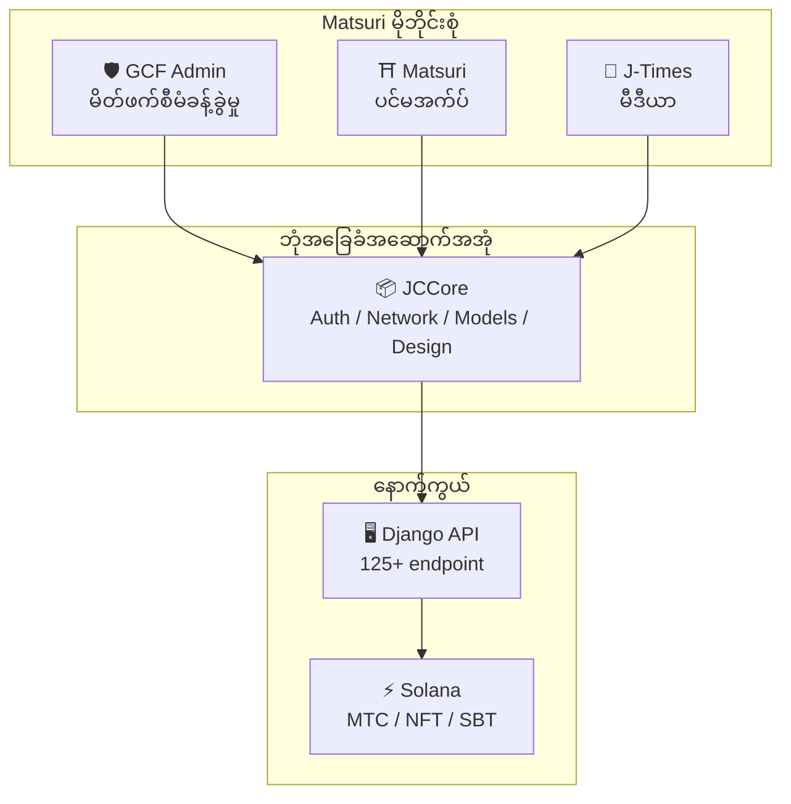
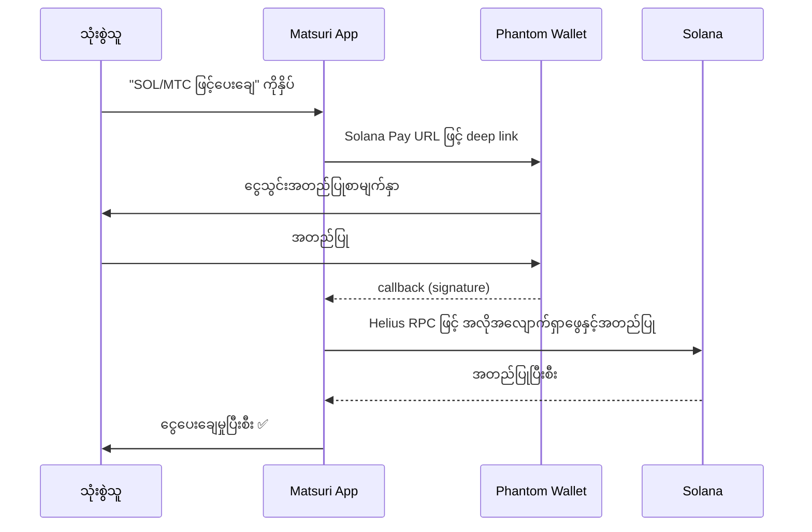
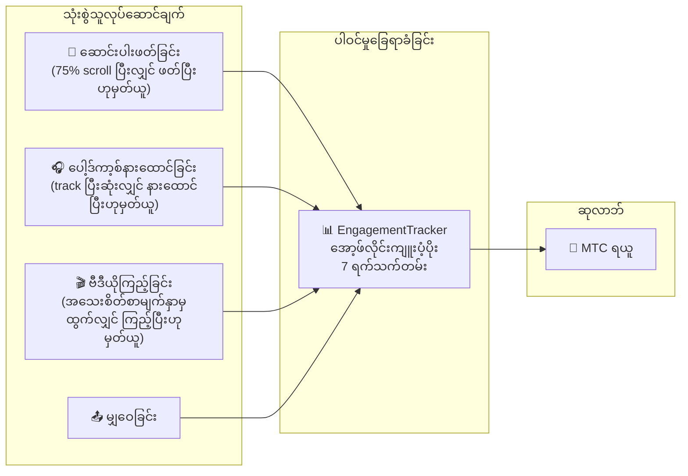
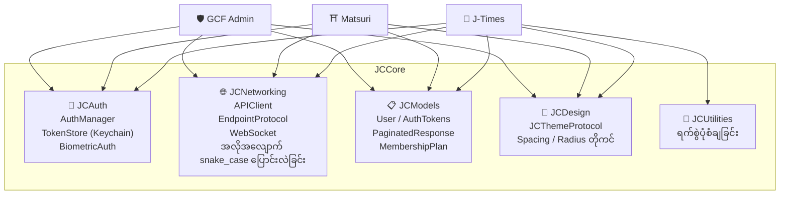

# 📱 မိုဘိုင်းအက်ပ်စုံ

> **Matsuri ဂေဟစနစ်၏ အလွှာတိုင်းကို ခြုံငုံမိသော iOS မူရင်းအက်ပ် သုံးခု။**
> Swift 6 / iOS 17+ ဖြင့် အပြည့်အဝ တည်ဆောက်ထားပါသည်။ မျှဝေ **JCCore** လိုက်ဘရီမှတဆင့် အထောက်အထား စိစစ်ခြင်း၊ ကွန်ယက်နှင့် ဒီဇိုင်းကို ပေါင်းစည်းထားပါသည်။

:::tip ရင်းနှီးမြှုပ်နှံသူများအတွက် အဘယ်ကြောင့် အရေးကြီးသနည်း
Web3 ပရောဂျက်အများစုတွင် ဝက်ဘ်ဆိုဒ်နှင့် ဖြူစာတမ်းသာ ရှိပါသည်။ Matsuri တွင် **အလိုအလျောက်စမ်းသပ်မှု 827+ ခု ပါရှိသော ထုတ်လုပ်မှုအဆင့် iOS အက်ပ် 3 ခု**၊ မျှဝေ အခြေခံအဆောက်အအုံနှင့် Solana မူရင်းပေါင်းစည်းမှု ပါဝင်ပါသည်။ ဤသည်မှာ တိုကင်နယ်ပယ်တွင် ရှားပါးသော အကောင်အထည်ဖော်မှုအတိမ်အနက် ဖြစ်ပါသည်။
:::

---

## အက်ပ် ခြုံငုံသုံးသပ်ချက်

| အက်ပ် | ရည်ရွယ်ချက် | အခြေအနေ | ဘာသာစကား |
| :--- | :--- | :---: | :--- |
| **GCF Admin** | မိတ်ဖက်စီမံခန့်ခွဲမှု နှင့် လုပ်ငန်းဆောင်ရွက်မှု | ✅ ထုတ်ဝေပြီး | 🇯🇵🇬🇧🇨🇳🇹🇭🇳🇴 |
| **Matsuri** | သုံးစွဲသူရှေ့မျက်နှာ ပင်မအက်ပ် | 🔜 ၂၀၂၆ ဧပြီလနှောင်းပိုင်း | 🇯🇵🇬🇧🇨🇳🇹🇭🇳🇴 |
| **J-Times** | ယဉ်ကျေးမှုမီဒီယာ နှင့် သင်ယူခြင်း | 🔜 ၂၀၂၆ ဧပြီလနှောင်းပိုင်း | 🇯🇵🇬🇧 |

---

## 1. 🛡️ GCF Admin — မိတ်ဖက်စီမံခန့်ခွဲမှု အက်ပ်

:::info အခြေအနေ- App Store တွင် ထုတ်ဝေပြီး (v1.0)
GCF (Global Community Friends) အဖွဲ့ဝင်များအတွက် လုပ်ငန်းစီမံခန့်ခွဲမှုအက်ပ်။ ဝက်ဘ်စီမံခန့်ခွဲမှုပြင်ညီ၏ လုပ်ဆောင်ချက်အားလုံးကို မိုဘိုင်းတွင် စုစည်းထားပါသည်။
:::

  
  
  

### ဤအက်ပ်ဖြင့် သင်လုပ်ဆောင်နိုင်သည်များ

| အမျိုးအစား | လုပ်ဆောင်ချက် |
| :--- | :--- |
| **📊 ဒက်ရှ်ဘုတ်** | KPI ကတ်များ၊ ရောင်းအားဇယား၊ အမြန်လုပ်ဆောင်ချက်များ |
| **👥 အဖွဲ့ဝင်စီမံခန့်ခွဲမှု** | စာရင်း၊ အသေးစိတ်၊ တည်းဖြတ်ခြင်း၊ အဆင့်စီမံခန့်ခွဲမှု |
| **💰 ဝင်ငွေစီမံခန့်ခွဲမှု** | ကော်မရှင်ခြေရာခံခြင်း၊ MTC ထုတ်ယူမှုစီမံခန့်ခွဲခြင်း၊ ငွေပေးချေမှုစီမံခန့်ခွဲခြင်း |
| **📝 အကြောင်းအရာစီမံခန့်ခွဲမှု** | ပွဲ၊ ဆောင်းပါး၊ ပေါ့ဒ်ကာ့စ်၊ ဗီဒီယို ဖန်တီးခြင်း၊ တည်းဖြတ်ခြင်း၊ ထုတ်ဝေခြင်း |
| **🎫 လမ်းညွှန်စလော့** | လမ်းညွှန်နေရာစီမံခန့်ခွဲခြင်း၊ ဝင်ငွေခြေရာခံခြင်း |
| **🖼️ NFT ဒက်ရှ်ဘုတ်** | Founder's Collection၊ အွန်ချိန်းအတည်ပြုခြင်း၊ NFT လွှဲပြောင်းခြင်း |
| **⛩️ မြင့်မြတ်သောနေရာစီမံခန့်ခွဲမှု** | ဆိုဒ် CRUD၊ ဘီကွန်ဆက်တင်များ |
| **🎲 AR Mining ဆက်တင်** | အိုမိကုဂျိ ဖြစ်နိုင်ခြေဇယား၊ ဆုလာဘ်ကန့်သတ်ချက်စီမံခန့်ခွဲခြင်း |
| **📊 ခွဲခြမ်းစိတ်ဖြာမှု** | အမှားအစီရင်ခံစာ၊ အသုံးပြုမှုခွဲခြမ်းစိတ်ဖြာခြင်း |
| **🔗 ရည်ညွှန်းမှု** | စိတ်ကြိုက် QR ကုဒ်ထုတ်လုပ်ခြင်း၊ ရည်ညွှန်းပရိုဂရမ်စီမံခန့်ခွဲခြင်း |

### နည်းပညာသတ်မှတ်ချက်များ

| အကြောင်းအရာ | အသေးစိတ် |
| :--- | :--- |
| **ဗိသုကာ** | Clean Architecture + MVVM + `@Observable` (iOS 17) |
| **ဘာသာစကား / SDK** | Swift 6.0 / Xcode 16+ / iOS 17.0+ |
| **API ချိတ်ဆက်မှု** | endpoint 125 ခုနှင့်အထက် |
| **စမ်းသပ်မှု** | စမ်းသပ်မှု 226 ခု / စမ်းသပ်မှုအတန်း 45 ခု |
| **ဘာသာပြန်** | ဘာသာစကား 5 ခု (ဂျပန်၊ အင်္ဂလိပ်၊ တရုတ်၊ ထိုင်း၊ နော်ဝေ) / ဘာသာပြန်ကီး 957+ ခု |
| **Swift Concurrency** | Strict Concurrency လိုက်နာခြင်း / တည်ဆောက်မှုသတိပေးချက် သုည |

### QR Code ပေါင်းစည်းမှု

GCF Admin တွင် Matsuri လိုဂိုပါ စိတ်ကြိုက် QR ကုဒ်များ ထုတ်လုပ်နိုင်ပါသည်။ ပွဲဖိတ်ကြား၊ ရည်ညွှန်းလင့်ခ်၊ ငွေပေးချေမှုတောင်းဆိုချက် စသည်ဖြင့် ဘက်စုံသုံးနိုင်ပါသည်။

---

## 2. ⛩️ Matsuri — ပင်မအက်ပ်

:::info အခြေအနေ- ၂၀၂၆ ဧပြီလနှောင်းပိုင်းတွင် ထုတ်ဝေရန်စီစဉ်ထားသည် (v3.0)
အများသုံးစွဲသူများအတွက် ပင်မအက်ပ်။ ပွဲကြိုတင်မှာယူခြင်း၊ ငွေပေးချေခြင်း၊ Web3 ပိုက်ဆံအိတ်၊ AR Mining အထိ — အရာအားလုံးကို အက်ပ်တစ်ခုတည်းဖြင့် ပြီးမြောက်ပါသည်။
:::

  
  
  

### ဤအက်ပ်ဖြင့် သင်လုပ်ဆောင်နိုင်သည်များ

| အမျိုးအစား | လုပ်ဆောင်ချက် |
| :--- | :--- |
| **🎪 ပွဲကြိုတင်မှာယူခြင်း** | ရှာဖွေ၊ ကြိုတင်မှာယူ၊ Stripe ငွေပေးချေ၊ လက်မှတ် QR စီမံခန့်ခွဲ |
| **💳 ငွေပေးချေနည်း 4 မျိုး** | ခရက်ဒစ်ကတ် / သိမ်းဆည်းထားသောကတ် / MTC ယူနစ် / ခရစ်ပ်တို (SOL/MTC) |
| **👛 Web3 ပိုက်ဆံအိတ်** | MTC ယူနစ်ပြသခြင်း၊ ပို့ခြင်းနှင့်လက်ခံခြင်း၊ ငွေသွင်းငွေထုတ်မှတ်တမ်း |
| **🖼️ NFT ပြခန်း** | ပိုင်ဆိုင်သော NFT/SBT စာရင်း၊ အွန်ချိန်းအတည်ပြုခြင်း |
| **🗺️ မြင့်မြတ်သောနေရာမြေပုံ** | ဘုရားကျောင်းနှင့်နတ်ကွန်းမြေပုံပြသခြင်း၊ ချက်အင် |
| **🎲 AR Mining** | WebAR အိုမိကုဂျိအတွေ့အကြုံ၊ MTC ရယူခြင်း |
| **💬 ချတ်** | ဆက်စပ်မီနူးပါ မက်ဆေ့ချ်ပို့ခြင်း |
| **⭐ ဆန္ဒစာရင်း** | ကြိုက်နှစ်သက်သောပွဲနှင့်အတွေ့အကြုံများ သိမ်းဆည်းခြင်း |
| **🔍 အဆင့်မြင့်ရှာဖွေမှု** | အသံဖြင့်ရှာဖွေခြင်း ပံ့ပိုး |
| **🤝 ရည်ညွှန်းမှု** | ရည်ညွှန်းပရိုဂရမ်ပါဝင်ခြင်း၊ ဆုလာဘ်ခြေရာခံခြင်း |
| **📊 GCF ဒက်ရှ်ဘုတ်** | GCF အဖွဲ့ဝင်များအတွက် ရိုးရှင်းသောစီမံခန့်ခွဲမှုပြင်ညီ |

### Phantom Wallet ပေါင်းစည်းမှု — ရိုက်ထည့်စရာမလိုသော ခရစ်ပ်တိုငွေပေးချေမှု

> **လိပ်စာကူးယူစရာမလို။** Phantom Wallet အလိုအလျောက်ဖွင့်ပြီး သုံးစွဲသူကအတည်ပြုကာ ငွေပေးချေမှုပြီးစီးပါသည်။ ငွေသွင်းငွေထုတ်လက်မှတ်များကို Helius RPC မှတဆင့် အလိုအလျောက်ရှာဖွေပါသည် — ဈေးကွက်တွင် အချောမွေ့ဆုံး ခရစ်ပ်တိုငွေပေးချေမှု အတွေ့အကြုံ။

:::tip အဘယ်ကြောင့် အရေးကြီးသနည်း
Web3 အက်ပ်အများစုသည် သုံးစွဲသူများကို ပိုက်ဆံအိတ်လိပ်စာကူးယူခြင်း၊ ပမာဏကိုယ်တိုင်ထည့်သွင်းခြင်းနှင့် အတည်ပြုချက်စောင့်ဆိုင်းခြင်းတို့ ပြုလုပ်ခိုင်းပါသည်။ Matsuri ၏ Solana Pay ပေါင်းစည်းမှုက ဤအရာများကို **နှိပ်ခြင်းတစ်ခုတည်း** ဖြင့် လျှော့ချပေးပါသည် — Apple Pay ၏ အတွေ့အကြုံနှင့်ညီတူပြီး အွန်ချိန်းတွင် ရှင်းတမ်းချပါသည်။
:::

### နည်းပညာသတ်မှတ်ချက်များ

| အကြောင်းအရာ | အသေးစိတ် |
| :--- | :--- |
| **ဗိသုကာ** | Clean Architecture + MVVM + Swift Concurrency |
| **ဘာသာစကား / SDK** | Swift 6.0 / Xcode 16+ / iOS 17.0+ |
| **ငွေပေးချေမှု** | Stripe PaymentSheet + MTC Balance + Phantom (Solana Pay) |
| **API ချိတ်ဆက်မှု** | endpoint 72 ခု / အမျိုးအစား 16 ခု |
| **စမ်းသပ်မှု** | 230+ (Model, ViewModel, Network, Security, DeepLink, E2E) |
| **ဘာသာပြန်** | ဘာသာစကား 5 ခု (ဂျပန်၊ အင်္ဂလိပ်၊ တရုတ်၊ ထိုင်း၊ နော်ဝေ) / ဘာသာပြန်ကီး 406 ခု |
| **ViewModel အရေအတွက်** | 25 (အပြည့်အဝ MVVM — View မှ တိုက်ရိုက် API ခေါ်ယူမှု သုည) |
| **အထောက်အထားစိစစ်ခြင်း** | Apple Sign In / Google Sign In (PKCE) |

---

## 3. 📰 J-Times — ယဉ်ကျေးမှုမီဒီယာ အက်ပ်

:::info အခြေအနေ- ၂၀၂၆ ဧပြီလနှောင်းပိုင်းတွင် ထုတ်ဝေရန်စီစဉ်ထားသည်
ဂျပန်ယဉ်ကျေးမှု၏ နက်ရှိုင်းသောအကြောင်းအရာများကို တင်ပြသော မီဒီယာပလက်ဖောင်း။ ဆောင်းပါးဖတ်ခြင်း၊ ပေါ့ဒ်ကာ့စ်နားထောင်ခြင်း၊ ဗီဒီယိုကြည့်ခြင်း — လုပ်ဆောင်ချက်တိုင်းဖြင့် MTC ရယူပါ။
:::

  

### ဤအက်ပ်ဖြင့် သင်လုပ်ဆောင်နိုင်သည်များ

| အမျိုးအစား | လုပ်ဆောင်ချက် |
| :--- | :--- |
| **📖 ဆောင်းပါး** | Parallax hero၊ drop cap၊ ဖတ်ခြင်းတိုးတက်မှုဘား၊ ကြွယ်ဝသောအကြောင်းအရာ (Markdown, ဇယား, ကိုးကား) |
| **🎧 ပေါ့ဒ်ကာ့စ်** | စီးရီးကြည့်ရှုခြင်း၊ လှိုင်းပုံသဏ္ဌာန်ပလေယာ၊ အိပ်စက်အချိန်သတ်မှတ်၊ AirPlay၊ လော့ခ်စခရင်ထိန်းချုပ်မှု |
| **🎬 ဗီဒီယို** | လိုက်လျောညီထွေ grid/list ပြသခြင်း၊ ဗီဒီယိုတို (TikTok စတိုင်၊ နှစ်ချက်နှိပ်) |
| **🔍 ရှာဖွေမှု** | စစ်ထုတ်မှုများစွာ၊ ခေတ်စားနေသော tag များ၊ အသံဖြင့်ရှာဖွေခြင်း |
| **🧭 ရှာဖွေတွေ့ရှိမှု** | အထူးပြု carousel၊ ဝန်ထမ်းရွေးချယ်မှု၊ ဤအပတ်လူကြိုက်များ |
| **📚 စာကြည့်တိုက်** | အကြိုက်ဆုံး၊ မှတ်တမ်း (ရက်စွဲအလိုက်)၊ ဒေါင်းလုပ်၊ ပလေးလစ် |
| **🎵 အသံပလေယာ** | မီနီပလေယာ (ပွတ်ဆွဲထိန်းချုပ်)၊ ပလေယာအပြည့် (လှိုင်းပုံသဏ္ဌာန်၊ သီချင်းစာသား၊ ပြန်ဖွင့်) |
| **👤 အသင်းဝင်** | အဆင့် 3 ခု (Free / Premium / Pro) လုပ်ဆောင်ချက်နှိုင်းယှဉ်ခြင်း၊ ဝယ်ယူမှုပြန်လည်ရယူခြင်း |

### Media Mining — ဖတ်ခြင်း၊ နားထောင်ခြင်း၊ ကြည့်ခြင်းသည် မိုင်နင်းဖြစ်လာသည်

> **အော့ဖ်လိုင်းဖြစ်လျှင်လည်း မှတ်တမ်းတင်ပါသည်။** ဆက်သွယ်ရေးမရှိသော တောင်ပေါ်နတ်ကွန်းတွင် ဆောင်းပါးဖတ်သော်လည်း အင်တာနက်ပြန်ရလျှင် ပါဝင်မှုကို အလိုအလျောက်ပို့ပြီး MTC ချီးမြှင့်ပါသည်။

### ဒီဇိုင်းစနစ် — ဂျပန်အလှအပစံနှုန်း "တိုင်လေးခု"

J-Times သည် ဂျပန်ရိုးရာအလှအပစံနှုန်းကို ခေတ်မီ UI တွင် အသုံးချသော ထူးခြားသောဒီဇိုင်းစနစ်ကို အသုံးပြုပါသည်။

| တိုင် | သဘောတရား | UI တွင်အသုံးချမှု |
| :--- | :--- | :--- |
| **墨 (Sumi)** | နွေးထွေးသော neutral gray | နောက်ခံအရောင်၊ စာသားအဆင့်အတန်း |
| **朱 (Shu)** | ဂျပန်အနီ (#C53030) | အဓိကအရောင်၊ အရေးကြီးလုပ်ဆောင်ချက် |
| **間 (Ma)** | 4pt grid အကွာအဝေး | အကွာအဝေး၊ အသက်ရှူခြင်းခံစားမှု |
| **紙 (Kami)** | ချောမွေ့သောအသွင်အပြင်၊ glassmorphism | ကတ်မျက်နှာပြင်၊ အတိမ်အနက်ဖော်ပြမှု |

### နည်းပညာသတ်မှတ်ချက်များ

| အကြောင်းအရာ | အသေးစိတ် |
| :--- | :--- |
| **ဗိသုကာ** | Clean Architecture + MVVM + Swift Concurrency |
| **ဘာသာစကား / SDK** | Swift 6.0 / Xcode 16+ / iOS 17.0+ |
| **ပြင်ပမှီခိုမှု** | **သုည** — Apple ၏ မူရင်း framework များသာ အသုံးပြုသည် |
| **API ချိတ်ဆက်မှု** | endpoint 40 ခုနှင့်အထက် |
| **စမ်းသပ်မှု** | စမ်းသပ်မှု 371 ခု / ဖိုင် 20 ခု |
| **ဘာသာပြန်** | ဘာသာစကား 2 ခု (ဂျပန်၊ အင်္ဂလိပ်) / ဘာသာပြန်ကီး 310+ ခု |
| **အော့ဖ်လိုင်းပံ့ပိုး** | ContentCache (50MB) + ImageDiskCache (200MB) + ဒေါင်းလုပ်မန်နေဂျာ |
| **အထောက်အထားစိစစ်ခြင်း** | Apple Sign In / Google Sign In (PKCE) |

---

## ဘုံအခြေခံအဆောက်အအုံ: JCCore လိုက်ဘရီ

အက်ပ်သုံးခုလုံး မျှဝေအသုံးပြုသော Swift Package လိုက်ဘရီ။

| module | အခန်းကဏ္ဍ |
| :--- | :--- |
| **JCAuth** | Keychain အခြေခံတိုကင်စီမံခန့်ခွဲမှု၊ ဇီဝမက်ထရစ်အထောက်အထားစိစစ်ခြင်း (Face ID / Touch ID) |
| **JCNetworking** | Type-safe API client၊ WebSocket၊ အလိုအလျောက် JSON snake_case ပြောင်းလဲခြင်း |
| **JCModels** | အက်ပ်များကြား ဘုံဒေတာမော်ဒယ် (User, AuthTokens စသည်) |
| **JCDesign** | အပြင်အဆင်ပရိုတိုကော၊ ဒီဇိုင်းတိုကင် (အကွာအဝေး၊ ထောင့်ကွေး) |
| **JCUtilities** | ရက်စွဲနှင့်စာသား utility များ |

---

## လုံခြုံရေးနှင့် ကိုယ်ရေးကိုယ်တာ

| အကြောင်းအရာ | အကောင်အထည်ဖော်မှု |
| :--- | :--- |
| **အထောက်အထားစိစစ်တိုကင်** | iOS Keychain တွင် ကုဒ်ဝှက်ပြီး သိမ်းဆည်း (TokenStore) |
| **ဇီဝမက်ထရစ်အထောက်အထားစိစစ်ခြင်း** | Face ID / Touch ID ဖြင့် အဆင့်နှစ်ဆင့်အထောက်အထားစိစစ်ခြင်း |
| **API ဆက်သွယ်ရေး** | HTTPS + Certificate Pinning |
| **ပိုက်ဆံအိတ် ကိုယ်ပိုင်သော့** | အက်ပ်အတွင်း ကိုယ်ပိုင်သော့ မသိမ်းဆည်း — Phantom Wallet သို့ လွှဲအပ် |
| **AR Mining** | ကင်မရာပုံများကို ဆာဗာသို့ မပို့ (VisionProof) |
| **အော့ဖ်လိုင်းဒေတာ** | SwiftData ကုဒ်ဝှက်ခြင်း + အလိုအလျောက်သက်တမ်းကုန်ဆုံးခြင်း |
| **Swift Concurrency** | Actor isolation ဖြင့် ယှဉ်ပြိုင်မှုအခြေအနေကာကွယ်ခြင်း |

---

## ဖွံ့ဖြိုးရေးအရည်အသွေး

အက်ပ် 3 ခုပေါင်း **အလိုအလျောက်စမ်းသပ်မှု 827+ ခု** အကောင်အထည်ဖော်ထားပါသည်။

| အက်ပ် | စမ်းသပ်မှုအရေအတွက် | ခြုံငုံမှုနယ်ပယ် |
| :--- | :---: | :--- |
| **GCF Admin** | 226 | Model, ViewModel, Repository, API, Localization, Navigation |
| **Matsuri** | 230+ | Model, ViewModel, Network, Security, DeepLink, Regression, Performance, E2E |
| **J-Times** | 371 | Model, ViewModel, API, Repository, Navigation, Localization, Security, Performance |

---

**[▶ ရှေ့ဆက်: အစီအစဉ်နှင့်အဖွဲ့](/docs/roadmap)** ｜ **[◀ နောက်ပြန်: ဂေဟစနစ်နှင့်မိုင်နင်း](/docs/ecosystem)**
