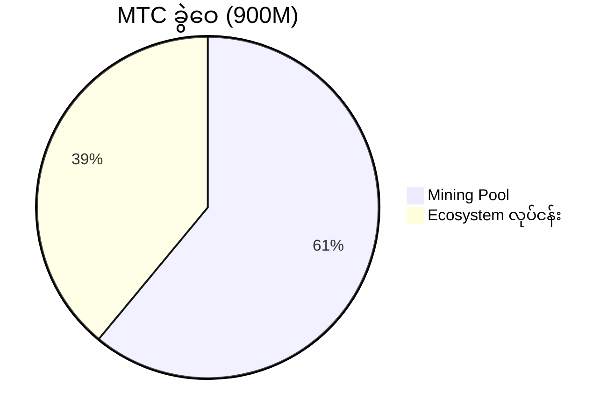
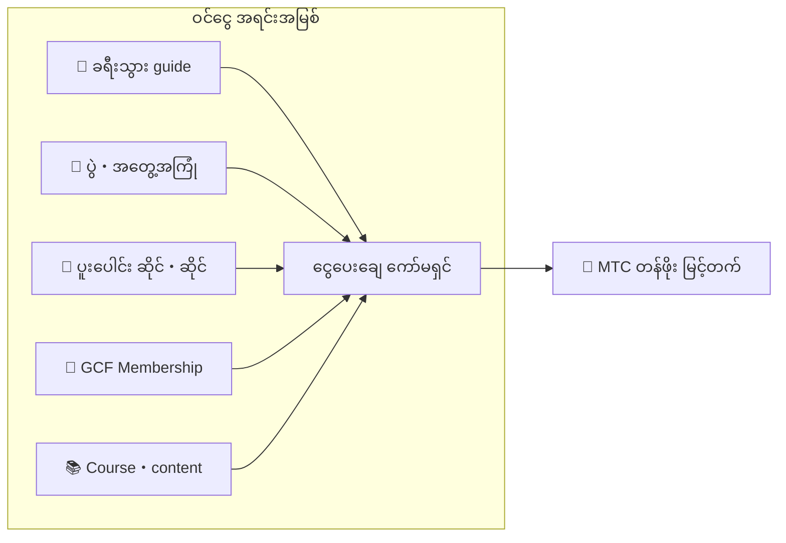

# 💰 Tokenomics——MTC ၏ စီးပွားရေး ဒီဇိုင်း

> **ယုံကြည်မှုကို ကုဒ်ထဲ ထွင်းထုထား။**
> MTC ၏ စီးပွားရေး ဒီဇိုင်းသည် တစ်ဦးတစ်ယောက်၏ ကတိ မဟုတ်ဘဲ သင်္ချာနှင့် blockchain ဖြင့် အာမခံ။


> **"စွမ်းအားဖြင့် လက်ရှိအခြေအနေ ပြောင်းလဲမှု မပြုနိုင်သော စီးပွားရေး ယန္တရား"——၎င်းသည် MTC ၏ tokenomics ဖြစ်သည်။**

Matsuri Coin (MTC) ၏ စီးပွားရေးဒီဇိုင်းသည် ယုံကြည်ချက်တစ်ခုပေါ်တွင် အခြေခံထားသည်။
**Operator ကိုယ်တိုင်က မပြုပြင်နိုင်သော စည်းမျဉ်းသာလျှင် ရင်းနှီးသူအတွက် အကြီးမား စိတ်ချမှုဖြစ်သည်** ဟူသော ယုံကြည်ချက်။

ထောက်ပံ့ပမာဏ အမြဲ fixed။ ထပ်ထုတ်ခြင်း・ရန်ပုံငွေ ပိတ်ထားခြင်း မဖြစ်နိုင်။ လုပ်ငန်း ကြီးထွားမှုသည် သင်္ချာ level တွင် ဈေးနှုန်းသို့ ရောင်ပြန်ဟပ်သည်——
၎င်းသည် "ကတိ" မဟုတ်ဘဲ blockchain ပေါ်တွင် ထွင်းထုထားသော **အမှန်တရား** ဖြစ်သည်။

ဤစာမျက်နှာတွင် MTC ၏ စီးပွားရေး ယန္တရားကို ပွင့်လင်းစွာ အားလုံးကို ဖော်ပြပါမည်။

---

## Token အသေးစိတ်

ရင်းနှီးသူ၏ လုံခြုံမှုကို အာမခံရန် Solana ပေါ်ရှိ "Mint Authority" နှင့် "Freeze Authority" ကို အမြဲတမ်း **စွန့်လွှတ်ထား**ပါသည်။
ထပ်ထုတ်ခြင်းသည် အမြဲ မဖြစ်နိုင်၊ ရန်ပုံငွေကိုလည်း ပိတ်၍ မရ။ **အပြည့်အဝ trustless ဒီဇိုင်း** ဖြစ်သည်။

| ခေါင်းစဉ် | အသေးစိတ် |
| :--- | :--- |
| **Token အမည်** | Matsuri Coin |
| **Ticker** | MTC |
| **Chain** | Solana |
| **Mint Address** | `DRENpzmRWM4TwECrCPCfS1k5VBPmanhQg9bcCWP8EZXF` [Solscan →](https://solscan.io/token/DRENpzmRWM4TwECrCPCfS1k5VBPmanhQg9bcCWP8EZXF) |
| **စုစုပေါင်း ထောက်ပံ့ပမာဏ** | **9 သန်း (900,000,000 MTC) fixed** |
| **Mint Authority** | 🚫 စွန့်လွှတ်ပြီး ([on-chain တွင် စစ်ဆေးနိုင်](https://solscan.io/token/DRENpzmRWM4TwECrCPCfS1k5VBPmanhQg9bcCWP8EZXF)) |
| **Freeze Authority** | 🚫 စွန့်လွှတ်ပြီး ([on-chain တွင် စစ်ဆေးနိုင်](https://solscan.io/token/DRENpzmRWM4TwECrCPCfS1k5VBPmanhQg9bcCWP8EZXF)) |
| **Lock စီမံ** | Streamflow Finance (စစ်ဆေးပြီး) |

:::info ဘာကြောင့် အရေးကြီးသနည်း
Mint Authority စွန့်လွှတ်ခြင်းသည် "Operator က မိမိဘာသာ token ထပ်ထုတ်၍ သင်၏ ပိုင်ဆိုင်မှုကို မြှုပ်နှံ၍မရ" ဟု အဓိပ္ပာယ်ရသည်။ Freeze Authority စွန့်လွှတ်ခြင်းသည် "သင်၏ wallet ကို မည်သူမျှ မပိတ်နိုင်" ဟု အဓိပ္ပာယ်ရသည်။ ၎င်းသည် trustless (ယုံကြည်မလို) ၏ အခြေခံ ဖြစ်သည်။
:::

---

## Token ခွဲဝေမှု

900M MTC ၏ ခွဲဝေမှု အောက်ပါ အတိုင်း ဖြစ်သည်။



| အမျိုးအစား | အချိုး | အရေအတွက် | အသုံးပြုမှု |
| :--- | :---: | :--- | :--- |
| **⛏️ Mining Pool** | **61%** | 550 သန်း | ပါဝင်သူများသို့ ဆု pool။ 2027 ဇွန် unlock၊ 2 နှစ်တစ်ကြိမ် ထက်ဝက်ခေတ်ဖြင့် ထုတ်လွှတ်။ Contribution score အလိုက် ခွဲဝေ |
| **🌐 Ecosystem လုပ်ငန်း** | **39%** | 350 သန်း | Marketing၊ GCF ခွဲဝေ၊ လုပ်ငန်းစရိတ်၊ liquidity pool (LP) ရယူ၊ development စရိတ်၊ ကြော်ငြာစရိတ်၊ ပွဲကျင်းပစရိတ် စသည်တို့ |

:::note Mining Pool ၏ ထုတ်လွှတ်မှု စနစ်
550M MTC ကို တစ်ကြိမ်တည်း မထုတ်လွှတ်ပါ။ 2 နှစ်တစ်ကြိမ်၏ ထက်ဝက်ခေတ် schedule အရ **contribution score အလိုက် အဆင့်ဆင့် ခွဲဝေ**ပါသည်။ ထုတ်လွှတ်・ခွဲဝေမှု စည်းမျဉ်းများကို 2026 နှစ်နှောင်းပိုင်းတွင် တစ်ဆင့်ချင်း smart contract အဖြစ် အကောင်အထည်ဖော်၍ on-chain တွင် စစ်ဆေးနိုင်မည်။
:::

:::note Ecosystem လုပ်ငန်းရန်ပုံငွေအကြောင်း
39% ၏ လုပ်ငန်း ရန်ပုံငွေသည် ecosystem ကြီးထွားမှုအတွက် လိုအပ်သော ရည်ရွယ်ချက်များစွာ ရန်ပုံငွေ ဖြစ်သည်။ တိကျသော အသုံးပြုမှုများတွင် marketing လှုပ်ရှားမှု၊ GCF အဖွဲ့ဝင်များသို့ အစောပိုင်း ခွဲဝေ၊ Raydium liquidity pool သို့ ထောက်ပံ့၊ development အဖွဲ့သို့ ဆု၊ ကြော်ငြာ၊ ယဉ်ကျေးမှုအတွေ့အကြုံပွဲ ကျင်းပစရိတ် စသည်တို့ ပါဝင်သည်။ အသုံးပြုမှုဆိုင်ရာ ပွင့်လင်းမြင်သာမှုကို DAO သို့ ပြောင်းရွှေ့ပြီးနောက် အသိုက်အဝန်း governance ၏ အကြောင်းအရာအဖြစ် ဖြစ်လာမည်။
:::

---

## ဝင်ငွေ ဖွဲ့စည်းပုံ

MTC ၏ တန်ဖိုးကို ထောက်ပံ့သူသည် **တကယ့်လုပ်ငန်းမှ ဝင်ငွေ** ဖြစ်သည်။ ကြံစည်မှု မဟုတ်ဘဲ တကယ့်စီးပွားရေး လှုပ်ရှားမှုသည် token ၏ တန်ဖိုးကို ထောက်ပံ့ပေးသည်။



| ဝင်ငွေ အရင်းအမြစ် | အကြောင်းအရာ |
| :--- | :--- |
| **🏯 အတွေ့အကြုံ・Guide** | ခရီးသွား guide၊ ယဉ်ကျေးမှု အတွေ့အကြုံပွဲမှ ငွေပေးချေ ကော်မရှင် |
| **🤝 GCF Membership** | Membership အခကြေးငွေ |
| **📚 Content** | Course အခကြေးငွေ၊ media subscription |
| **🏪 Marketplace** | ပူးပေါင်းဆိုင်・ဆိုင်မှ လုပ်ငန်း ကော်မရှင် (တစ်ဆင့်ချင်း ချဲ့ထွင်) |

:::tip တကယ့်လိုအပ်မှုက ထောက်ပံ့သော ကြီးထွားမှု
Inbound ခရီးသွား တိုးလေ နိုင်ငံခြားငွေ စီးဝင်လေ၊ ecosystem ချဲ့ထွင်။ MTC ၏ တန်ဖိုးကို ကြံစည်မှု မဟုတ်ဘဲ **ယဉ်ကျေးမှု ခံစားသူ အရေအတွက်**ဖြင့် ဆုံးဖြတ်ပါသည်။
:::

---

## လက်ရှိ လုပ်ငန်း စွမ်းဆောင်ရည်

MTC စီးပွားရေးဇုန်သည် အစပိုင်းတွင် ရှိသေးသော်လည်း တကယ့်လှုပ်ရှားမှုများ စတင်နေပြီ။

| Metric | စွမ်းဆောင်ရည် |
| :--- | :--- |
| **ပွဲကျင်းပ အရေအတွက်** | 50 ကြိမ်ကျော် (test လည်ပတ်) |
| **GCF Platinum Member** | 20 ဦး ပါဝင်ပြီး (50 ဦးတွင်) |
| **GCF Gold Member** | ယခုမှ စုစည်းမည် |
| **Web Platform** | အသုံးပြုနေ။ test အဖြစ် အသုံးပြုသူ စုဆောင်းလျက် လည်ပတ်နေ |
| **iOS အက်ပ်** | Development ပြီးစီး၊ 2026 ဧပြီ ထုတ်မည် |

:::note ရိုးသားစွာ ပြောပါရစေ
ကျွန်ုပ်တို့သည် "အောင်မြင်မှု ကြီးမား စွမ်းဆောင်ရည်" ကို မပိုင်ဆိုင်သေးပါ။ ပွဲ 50 ကြိမ်နှင့် test လည်ပတ်——ထိုသည်မှာ လက်ရှိ၏ အမှန်တရား။ သို့သော် product လည်ပတ်နေ၊ အသိုက်အဝန်း တည်ရှိနေပြီး ဤနေရာမှ အစစ်အမှန် ချဲ့ထွင်မည့် phase တွင် ရှိပါသည်။
:::

---

## Buyback Protocol

ကျွန်ုပ်တို့သည် "အမြတ်ရပါက operator ၏ အိတ်ထဲသို့" မယူပါ။
လုပ်ငန်းဝင်ငွေ၏ တစ်ချို့အချိုးကို MTC ဈေးကွက်မှ ပြန်ဝယ်ယူရန် သုံးမည့် မူဝါဒ ဖြစ်သည်။

| ဝင်ငွေ အရင်းအမြစ် | ပြန်အမ်းနှုန်း | လုပ်ဆောင်ချက် |
| :--- | :---: | :--- |
| **Matsuri ဌာနခွဲမှ ရောင်းအား** (Guide・Event) | **20%** | ဈေးကွက်မှ **ပြန်ဝယ်**ပြီး liquidity pool သို့ ထည့် |
| **GCF Membership** (Membership အခကြေးငွေ) | **25%** | ဈေးကွက်မှ **ပြန်ဝယ်** |

:::info Buyback ၏ လက်ရှိ အခြေအနေ
Buyback protocol ကို လုပ်ငန်းဝင်ငွေ အပြည့်အဝ အောင်မြင်သောအခါ **ယခုမှ စတင်လည်ပတ်**ပါမည်။ အစပိုင်းတွင် off-chain (manual) ဖြင့် လည်ပတ်ပြီး 2026 နှစ်နှောင်းပိုင်း နောက်ပိုင်း smart contract ဖြင့် အလိုအလျောက် လည်ပတ်ရန် အဆင့်ဆင့် ပြောင်းရွှေ့မည်။ On-chain ပြောင်းရွှေ့ပြီးနောက် buyback လုပ်ဆောင်သော မှတ်တမ်းသည် blockchain ပေါ်တွင် မည်သူမဆို စစ်ဆေးနိုင်မည်။
:::

Buyback သည် "တစ်နေ့ လုပ်မည်" ဟူသော ကတိ မဟုတ်ပါ။ Protocol အဖြစ် program လုပ်ထားသော စည်းမျဉ်း ဖြစ်သည်။ လုပ်ငန်းရောင်းအား မြင့်တက်တိုင်း အလိုအလျောက် MTC ကို ဈေးကွက်မှ စုပ်ယူသည်——၎င်းသည် ရင်းနှီးသူအတွက် **ဖွဲ့စည်းပုံအရ စိတ်ချမှု** ဖြစ်သည်။

---

## ဈေးနှုန်း ဆုံးဖြတ်ရေး Logic

MTC ၏ ဈေးနှုန်းမြင့်တက်မှု ယန္တရားသည် မျှော်လင့်ချက် မဟုတ်ဘဲ **AMM (automated market maker) သင်္ချာ**အပေါ် အခြေခံသည်။

```
ဈေးနှုန်း = Liquidity (SOL) ÷ ထောက်ပံ့ပမာဏ (MTC)
```

| အဆင့် | ဘာဖြစ်မလဲ | ရလဒ် |
| :---: | :--- | :--- |
| **①** | လုပ်ငန်းဝင်ငွေ (SOL) ကို pool သို့ ထည့် | **ပိုင်းဝေး တိုးများ** |
| **②** | ထိုငွေကြေးဖြင့် MTC ကို ဈေးကွက်မှ ပြန်ဝယ်၍ မီးရှို့ | **ပိုင်းခြေ လျော့ကျ** |
| **③** | ပိုင်းဝေး↑ × ပိုင်းခြေ↓ | **ရှားပါးမှု မြင့်တက်ရန် အခြေအနေ ပြည့်စုံ** |

:::info ယန္တရား ရှင်းပြခြင်း ဖြစ်၍ ဈေးနှုန်း အာမခံ မဟုတ်ပါ
ဤ ညီမျှခြင်းသည် "လုပ်ငန်းဝင်ငွေ ဆက်လက်ရှိ၍ buyback လည်ပတ်ပါက ပေးသွင်း-လိုအပ်ချက် ချိန်ခွင်လျှာသည် ရှားပါးမှု ဘက်သို့ လှုပ်ရှားသည်" ဟူသော ဖွဲ့စည်းပုံ ဒီဇိုင်းကို ပြသပါသည်။ တကယ့် ဈေးနှုန်းကို ဈေးကွက် ပေးသွင်း-လိုအပ်ချက်၊ ပြင်ပ ပတ်ဝန်းကျင်၊ liquidity စသည့် အချက်များစွာက သက်ရောက်သည်။
:::

---

## ထက်ဝက်ခေတ် Schedule

2027 ဇွန် ၁ ရက်တွင် lockup unlock ဖြစ်မည့် **5 သန်း 5 သောင်း 5 ထောင် (စုစုပေါင်း၏ 61% ခန့်)** MTC သည် ဈေးကွက်သို့ မရောင်းဘဲ **ပါဝင်သူများ ဆု pool** အဖြစ် သိမ်းထားသည်။

Bitcoin ၏ 4 နှစ်ပတ်ထက် မြန်သော **2 နှစ် ထက်ဝက်ခေတ်**ကို အသုံးပြုသည်။
2 နှစ်တစ်ကြိမ် ထုတ်လွှတ်ပမာဏ ထက်ဝက်ဖြစ်သွား၊ သီအိုရီအရ ဆယ်စုနှစ်များစွာ ဆုပေးသည်။

| ကာလ | ထုတ်လွှတ်နှုန်း | ထုတ်လွှတ်အရေအတွက် | စုစုပေါင်း ထုတ်လွှတ်နှုန်း |
| :--- | :---: | :--- | :---: |
| **ပထမကာလ** 2027 – 2029 | **50%** | 2.75 သန်းခန့် | 50% |
| **ဒုတိယကာလ** 2029 – 2031 | **25%** | 1.37 သန်းခန့် | 75% |
| **တတိယကာလ** 2031 – 2033 | **12.5%** | 68 သောင်းခန့် | 87.5% |
| **စတုတ္ထကာလ** 2033 – 2035 | **6.25%** | 34 သောင်းခန့် | 93.75% |
| **ပဉ္စမကာလ နောက်ပိုင်း** | ထက်ဝက် ဆက်လက် | တဖြည်းဖြည်း လျော့ | → 100% သို့ တိမ်းညွတ် |

<small>*※ သင်္ချာအရ 100% သို့ မရောက်ဘဲ ထုတ်လွှတ်ပမာဏသည် အနီးစပ်ဆုံး သုညသို့ တိမ်းညွတ်သည်။ Bitcoin နှင့် တူညီ သဘောတရား ဖြစ်သည်။*</small>

:::tip စောစော စတင် ပါဝင်လေ MTC ပိုမိုရရှိလေ
ထက်ဝက်ခေတ် ယန္တရားဖြင့် ပထမကာလ (2027〜2029) ၏ ထုတ်လွှတ်ပမာဏ အများဆုံးဖြစ်ပြီး epoch မြင့်တိုင်း တစ်ကြိမ် ထုတ်လွှတ်ပမာဏ လျော့ကျသည်။ ဆိုလိုသည်မှာ **အစပိုင်း phase မှ contribution score စုဆောင်းသူသည် MTC ပိုမိုရရှိ**သော ဒီဇိုင်း ဖြစ်သည်။

Contribution score ၌ ပါဝင်သော လှုပ်ရှားမှု ဥပမာ:
- ပွဲ ဖန်တီး・လူစု စွမ်းဆောင်ရည်
- နာမည်ကြီး guide course လည်ပတ်
- ကောင်းမွန်သော guide မိတ်ဆက်・မွေးမြူ
- J-Times content ကြည့်ခြင်း・share အရေအတွက်
- သန့်ရှင်းသော ခရီး check-in အရေအတွက်

ဆုကို "ပါဝင်မှု အစောကြော" မဟုတ်ဘဲ **"မည်မျှ ပါဝင်ခဲ့သနည်း"** ဖြင့် ဆုံးဖြတ်သည်။
:::

---

:::note နောက်စာမျက်နှာသို့
MTC ၏ စီးပွားရေး ဒီဇိုင်းကို နားလည်ပြီးပါက နောက်သည် **Partner အဖြစ် ပါဝင်ရန် နည်းလမ်းများ** ကို စစ်ဆေးပါ။
**[GCF Membership →](/docs/gcf)**
:::
